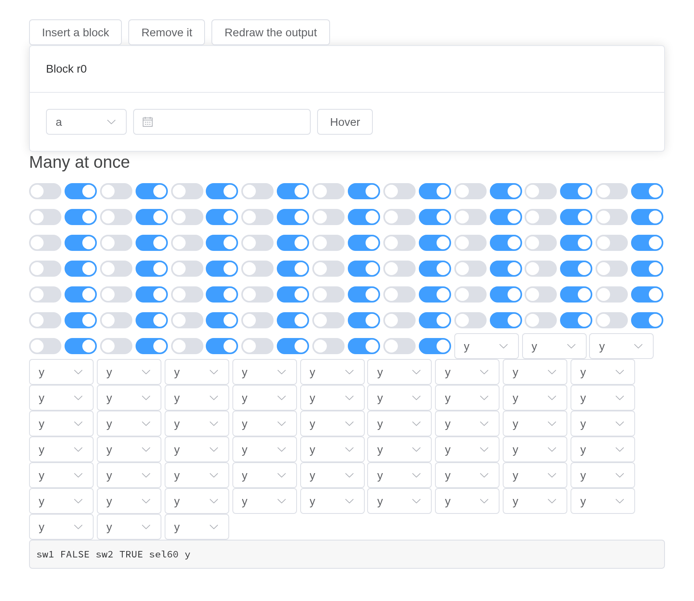

# Putting Components Together

Each component page shows one component at a time. An app puts them
together: controls inside a space inside a tab, a form inside a dialog,
a table inside a drawer, all of it inside a config provider, some of it
drawn later by the server. Most of what can go wrong only goes wrong
then, so these apps put the components together on purpose.

Each is a file under `examples/combinations/` in the installed package,
run as it stands –
`shiny::runApp(system.file("examples/combinations/drawn-later", package = "shiny.element"))`.
In the package’s sources, `tools/combinations.R` drives each one in a
browser, step by step, and checks what every step should do.

## Folded in, and nested

A component given to another – a button to a tooltip, controls to a
space, a select to an input’s slot – becomes part of its Vue instance.
It keeps its id all the same: it reports `input$<id>`, `update_el_*()`
and
[`call_el()`](https://kaipingyang.github.io/shiny.element/reference/call_el.md)
reach it by that id, and in the page the id is where Element puts it – a
button’s `<button>`, a select’s or an input’s `<input>`, as Shiny’s own
inputs have it – for CSS or `shinyjs`. Here controls sit in a space in a
collapse in a tab, inside a config provider, beside a module whose
button is wrapped in a tooltip; a dialog holds a form, and a popover
filters a table output.

A select in a space, or anywhere else that is only as wide as its
content, wants a width – `el_select(width = "160px")`, as Element’s
demos give theirs. It has none of its own there, and shrinks to its
arrow, the chosen label hidden; Element’s own `<el-select>` does the
same.

A select inside a popover wants `teleported = FALSE`. Otherwise its
options are drawn outside the popover, and choosing one closes the
popover – as in Element itself.

``` r

# Controls folded into a space, a collapse and a tooltip, inside tabs
# inside a config provider; a module; a form in a dialog that is destroyed
# on close; a popover filtering a table output.
#
#   shiny::runApp(system.file("examples/combinations/wrapped-and-nested", package = "shiny.element"))
#
# tools/combinations.R drives it in a browser and checks each step
# (tools/combinations/wrapped-and-nested.R).

library(shiny)
library(shiny.element)

# what the server holds, one input per line
inputs_text <- function(x) {
  paste(
    sprintf(
      "%s: %s",
      names(x),
      vapply(
        x,
        function(v) {
          if (is.null(v)) "NULL" else paste(format(unclass(v)), collapse = ", ")
        },
        character(1)
      )
    ),
    collapse = "\n"
  )
}

people <- data.frame(
  name = c("Ada", "Grace", "Linus", "Margaret"),
  team = c("core", "ui", "core", "docs"),
  age = c(36, 45, 28, 51)
)

# a module, wrapped twice over, updated through its own session
mod_ui <- function(id) {
  ns <- NS(id)
  el_card(
    header = "module",
    el_space(
      el_tooltip(
        ns("tip"),
        el_button(ns("btn"), "Module button", type = "primary"),
        content = "inside a tooltip, inside a space"
      ),
      el_select(
        ns("pick"),
        choices = c("x", "y", "z"),
        selected = "x",
        width = "120px"
      )
    ),
    textOutput(ns("said"))
  )
}
mod_server <- function(id) {
  moduleServer(id, function(input, output, session) {
    output$said <- renderText(paste(
      "btn",
      input$btn %||% 0,
      "pick",
      input$pick %||% ""
    ))
    observeEvent(input$btn, {
      update_el_button(session, "btn", label = paste("Clicked", input$btn))
      update_el_select(session, "pick", selected = "z")
    })
  })
}

ui <- el_page(
  el_config_provider(
    id = "cfg",
    size = "small",
    el_tabs(
      "tabs",
      tabs = list(
        list(
          name = "one",
          label = "Nested",
          content = tagList(
            el_collapse(
              "coll",
              value = "a",
              items = list(
                list(
                  name = "a",
                  title = "Wrapped controls",
                  content = el_space(
                    id = "space1",
                    el_button("b1", "First"),
                    el_button("b2", "Second", type = "success"),
                    el_input("in1", value = "hello", width = "160px"),
                    el_switch("sw1", value = TRUE)
                  )
                ),
                list(
                  name = "b",
                  title = "Slider in a closed panel",
                  content = el_slider("sl_hidden", value = 30)
                )
              )
            ),
            el_button("upd_wrapped", "Update the wrapped ones"),
            mod_ui("m1"),
            verbatimTextOutput("dump1")
          )
        ),
        list(
          name = "two",
          label = "Dialog + form",
          content = tagList(
            el_button("open_dlg", "Open dialog", type = "primary"),
            el_dialog(
              "dlg",
              title = "Edit",
              destroy_on_close = TRUE,
              content = el_form(
                id = "frm",
                label_width = "100px",
                el_form_field(
                  "who",
                  "select",
                  label = "Who",
                  choices = people$name,
                  rules = el_rule(
                    required = TRUE,
                    message = "Pick someone",
                    trigger = "change"
                  )
                ),
                el_form_item(
                  "When",
                  el_form_field("d", "date-picker", style = "width: 100%"),
                  "-",
                  el_form_field("t", "time-picker", style = "width: 100%")
                ),
                el_form_field("note", "textarea", label = "Note")
              )
            ),
            verbatimTextOutput("dump2")
          )
        ),
        list(
          name = "three",
          label = "Table + popover",
          content = tagList(
            el_popover(
              "pop",
              reference = el_button("pop_btn", "Filter"),
              trigger = "click",
              popover_width = 260,
              body = tagList(
                el_select(
                  "team",
                  choices = c("all", unique(people$team)),
                  selected = "all",
                  teleported = FALSE
                ),
                el_slider("min_age", value = 0, max = 60)
              )
            ),
            el_table_output("tbl"),
            el_pagination(
              "pg",
              total = 4,
              page_size = 2,
              layout = "prev, pager, next"
            ),
            verbatimTextOutput("dump3")
          )
        )
      )
    )
  )
)

server <- function(input, output, session) {
  mod_server("m1")
  output$dump1 <- renderText(inputs_text(list(
    b1 = input$b1,
    b2 = input$b2,
    in1 = input$in1,
    sw1 = input$sw1,
    sl = input$sl_hidden,
    coll = input$coll
  )))
  observeEvent(input$upd_wrapped, {
    update_el_button(session, "b2", label = "Second (updated)", type = "danger")
    update_el_input(session, "in1", value = "changed")
    update_el_switch(session, "sw1", value = FALSE)
    update_el_slider(session, "sl_hidden", value = 77)
  })
  observeEvent(input$open_dlg, update_el_dialog(session, "dlg", visible = TRUE))
  output$dump2 <- renderText(inputs_text(list(
    frm = input$frm,
    valid = input$frm_valid,
    submit = input$frm_submit,
    dlg = input$dlg
  )))
  shown <- reactive({
    d <- people
    if (!is.null(input$team) && input$team != "all") {
      d <- d[d$team == input$team, ]
    }
    d <- d[d$age >= (input$min_age %||% 0), ]
    d
  })
  output$tbl <- render_el_table({
    d <- shown()
    page <- input$pg %||% 1
    rows <- d[seq_len(nrow(d)) %in% ((page - 1) * 2 + 1:2), , drop = FALSE]
    el_table(data = rows, selection = TRUE)
  })
  observe(update_el_pagination(session, "pg", total = nrow(shown())))
  output$dump3 <- renderText(inputs_text(list(
    team = input$team,
    min_age = input$min_age,
    pg = input$pg,
    rows = input$tbl_selection_rows,
    pop = input$pop
  )))
}

shinyApp(ui, server)
```


## Drawn later

[`renderUI()`](https://rdrr.io/pkg/shiny/man/renderUI.html) inside a
config provider draws components after it: they take its settings all
the same, and follow them when
[`update_el_config_provider()`](https://kaipingyang.github.io/shiny.element/reference/el_config_provider.md)
changes them. Two trees in one space each keep their own methods, a
drawer holds tabs with a table and a calendar output drawn while it was
closed, and steps follow a button group.

``` r

# Components drawn by renderUI() inside a config provider; two trees in
# one space, each reached by its own call_el(); a drawer holding tabs with a
# table and a calendar output; components in a carousel; steps driven by a
# button group.
#
#   shiny::runApp(system.file("examples/combinations/drawn-later", package = "shiny.element"))
#
# tools/combinations.R drives it in a browser and checks each step
# (tools/combinations/drawn-later.R).

library(shiny)
library(shiny.element)

# what the server holds, one input per line
inputs_text <- function(x) {
  paste(
    sprintf(
      "%s: %s",
      names(x),
      vapply(
        x,
        function(v) {
          if (is.null(v)) "NULL" else paste(format(unclass(v)), collapse = ", ")
        },
        character(1)
      )
    ),
    collapse = "\n"
  )
}

tree_data <- list(
  list(
    id = 1,
    label = "Fruit",
    children = list(
      list(id = 11, label = "Apple"),
      list(id = 12, label = "Pear")
    )
  ),
  list(id = 2, label = "Veg", children = list(list(id = 21, label = "Leek")))
)

ui <- el_page(
  el_config_provider(
    id = "cfg",
    size = "small",
    tags$h4("renderUI inside a config provider"),
    el_button("regen", "Draw again"),
    uiOutput("dyn"),
    verbatimTextOutput("dump_dyn"),
    tags$h4("two trees in one space"),
    el_space(
      id = "trees",
      el_tree(
        "tree_a",
        data = tree_data,
        node_key = "id",
        show_checkbox = TRUE,
        default_expand_all = TRUE
      ),
      el_tree(
        "tree_b",
        data = tree_data,
        node_key = "id",
        show_checkbox = TRUE,
        default_expand_all = TRUE
      )
    ),
    el_button("check_b", "Check Leek in tree B"),
    el_tree_select(
      "tsel",
      data = list(),
      props = list(value = "id", label = "label", children = "children"),
      width = "200px"
    ),
    verbatimTextOutput("dump_tree")
  ),
  tags$h4("a drawer with tabs and a table"),
  el_button("open_drawer", "Open drawer"),
  el_drawer(
    "drw",
    title = "Details",
    size = "60%",
    content = el_tabs(
      "dtabs",
      tabs = list(
        list(name = "t", label = "Table", content = el_table_output("dtbl")),
        list(
          name = "c",
          label = "Calendar",
          content = el_calendar_output("dcal")
        )
      )
    )
  ),
  tags$h4("carousel with components"),
  el_carousel(
    "car",
    height = "160px",
    autoplay = FALSE,
    items = list(
      el_carousel_item(
        name = "s1",
        el_card(header = "Slide 1", el_button("car_btn", "Inside slide"))
      ),
      el_carousel_item(
        name = "s2",
        el_card(header = "Slide 2", el_rate("car_rate", value = 2))
      )
    )
  ),
  tags$h4("steps driven by a button group"),
  el_steps(
    "stp",
    active = 0,
    steps = list(el_step("One"), el_step("Two"), el_step("Three"))
  ),
  el_button_group(el_button("prev", "Prev"), el_button("nxt", "Next")),
  verbatimTextOutput("dump_misc")
)

server <- function(input, output, session) {
  n <- reactiveVal(1)
  observeEvent(input$regen, n(n() + 1))
  output$dyn <- renderUI({
    el_space(
      id = "dyn_space",
      el_button("dyn_btn", paste("Dynamic", n())),
      el_select(
        "dyn_sel",
        choices = c("a", "b", "c"),
        selected = "a",
        width = "100px"
      ),
      el_switch("dyn_sw", value = n() %% 2 == 0)
    )
  })
  output$dump_dyn <- renderText(inputs_text(list(
    btn = input$dyn_btn,
    sel = input$dyn_sel,
    sw = input$dyn_sw
  )))
  observeEvent(
    input$dyn_btn,
    update_el_select(session, "dyn_sel", selected = "c")
  )

  observeEvent(
    input$check_b,
    call_el(session, "tree_b", "setChecked", list(21, TRUE, FALSE))
  )
  observe({
    ticked <- input$tree_a_checked
    keys <- unlist(input$tree_a_checked)
    update_el_tree_select(session, "tsel", data = tree_data)
  }) |>
    bindEvent(input$tree_a_checked, ignoreInit = TRUE)
  output$dump_tree <- renderText(inputs_text(list(
    a = input$tree_a,
    a_check = input$tree_a_checked,
    b_check = input$tree_b_checked
  )))

  observeEvent(
    input$open_drawer,
    update_el_drawer(session, "drw", visible = TRUE)
  )
  output$dtbl <- render_el_table(el_table(
    data = mtcars[1:5, 1:6],
    selection = TRUE
  ))
  output$dcal <- render_el_calendar(el_calendar(
    events = data.frame(date = Sys.Date(), title = "Today's event")
  ))

  active <- reactiveVal(0)
  observeEvent(input$nxt, {
    active(min(3, active() + 1))
    update_el_steps(session, "stp", active = active())
  })
  observeEvent(input$prev, {
    active(max(0, active() - 1))
    update_el_steps(session, "stp", active = active())
  })
  output$dump_misc <- renderText(inputs_text(list(
    car_btn = input$car_btn,
    car_rate = input$car_rate,
    car = input$car,
    nxt = input$nxt,
    prev = input$prev
  )))
}

shinyApp(ui, server)
```


## Overlays, and buttons in table cells

A dialog holds tabs and opens a second dialog over it; a message box
opens over both. Tabs drawn in a closed dialog measure themselves once
shown. A table’s cells hold a popconfirm and a button, whose
`rowAction()` reports the row;
[`insertUI()`](https://rdrr.io/pkg/shiny/man/insertUI.html) adds a
component and
[`removeUI()`](https://rdrr.io/pkg/shiny/man/insertUI.html) takes it
away.

``` r

# A config provider resized from the server; a select in an input's
# slot; tabs, a nested dialog and a message box over a dialog; a popconfirm
# in a table cell; components added and removed with insertUI().
#
#   shiny::runApp(system.file("examples/combinations/overlays-and-cells", package = "shiny.element"))
#
# tools/combinations.R drives it in a browser and checks each step
# (tools/combinations/overlays-and-cells.R).

library(shiny)
library(shiny.element)

# what the server holds, one input per line
inputs_text <- function(x) {
  paste(
    sprintf(
      "%s: %s",
      names(x),
      vapply(
        x,
        function(v) {
          if (is.null(v)) "NULL" else paste(format(unclass(v)), collapse = ", ")
        },
        character(1)
      )
    ),
    collapse = "\n"
  )
}

tree_data <- list(
  list(
    id = 1,
    label = "Fruit",
    children = list(
      list(id = 11, label = "Apple"),
      list(id = 12, label = "Pear")
    )
  ),
  list(id = 2, label = "Veg", children = list(list(id = 21, label = "Leek")))
)
rows <- data.frame(id = 1:3, name = c("Ada", "Grace", "Linus"))

ui <- el_page(
  el_config_provider(
    id = "cfg",
    size = "small",
    el_radio_group(
      "size_pick",
      choices = c("small", "default", "large"),
      selected = "small",
      button = TRUE
    ),
    el_button("static_btn", "Static"),
    uiOutput("dyn"),
    el_space(
      id = "trees",
      el_tree(
        "tree_a",
        data = tree_data,
        node_key = "id",
        show_checkbox = TRUE,
        default_expand_all = TRUE
      ),
      el_tree(
        "tree_b",
        data = tree_data,
        node_key = "id",
        show_checkbox = TRUE,
        default_expand_all = TRUE
      )
    ),
    el_button("check_a", "Check Pear in tree A"),
    el_input(
      "q",
      placeholder = "search",
      slots = list(
        prepend = el_select(
          "kind",
          choices = c(Name = "n", Id = "i"),
          selected = "n",
          width = "90px"
        )
      )
    ),
    el_button("set_kind", "Set kind to Id")
  ),
  el_button("open_dlg", "Open dialog"),
  el_dialog(
    "dlg",
    title = "Outer",
    width = "600px",
    content = tagList(
      el_tabs(
        "dlg_tabs",
        tabs = list(
          list(name = "a", label = "First tab", content = "first"),
          list(
            name = "b",
            label = "A much longer second tab",
            content = el_table(data = rows)
          )
        )
      ),
      el_button("open_inner", "Open inner dialog"),
      el_button("ask", "Ask a question")
    )
  ),
  el_dialog(
    "inner",
    title = "Inner",
    width = "300px",
    content = "inner content"
  ),
  el_table_output("acts"),
  el_button("add", "insertUI a switch"),
  el_button("remove", "removeUI it"),
  tags$div(id = "slot"),
  verbatimTextOutput("dump")
)

server <- function(input, output, session) {
  output$dyn <- renderUI(el_button("dyn_btn", "Dynamic"))
  observeEvent(
    input$size_pick,
    ignoreInit = TRUE,
    update_el_config_provider(session, "cfg", size = input$size_pick)
  )
  observeEvent(
    input$check_a,
    call_el(session, "tree_a", "setChecked", list(12, TRUE, FALSE))
  )
  observeEvent(
    input$set_kind,
    update_el_select(session, "kind", selected = "i")
  )
  observeEvent(input$open_dlg, update_el_dialog(session, "dlg", visible = TRUE))
  observeEvent(
    input$open_inner,
    update_el_dialog(session, "inner", visible = TRUE)
  )
  observeEvent(
    input$ask,
    el_message_box(session, "q1", "Sure?", title = "Question")
  )
  output$acts <- render_el_table(el_table(
    data = rows,
    columns = list(
      el_table_column("name", "Name"),
      el_table_column(
        label = "Ops",
        cell = tagList(
          htmltools::HTML(paste0(
            "<el-popconfirm title=\"Delete?\" @confirm=\"rowAction('del', scope)\">",
            "<template #reference><el-button type=\"danger\" link>Delete</el-button></template>",
            "</el-popconfirm>"
          )),
          el$button(
            link = NA,
            type = "primary",
            `@click` = "rowAction('edit', scope)",
            "Edit"
          )
        )
      )
    )
  ))
  n <- 0
  observeEvent(input$add, {
    n <<- n + 1
    insertUI(
      "#slot",
      ui = tags$div(
        id = paste0("w", n),
        el_switch(paste0("ins_sw", n), value = TRUE)
      )
    )
  })
  observeEvent(input$remove, removeUI(paste0("#w", n)))
  output$dump <- renderText(inputs_text(list(
    kind = input$kind,
    q1 = input$q1,
    edit = input$acts_edit,
    del = input$acts_del,
    a = input$tree_a_checked,
    b = input$tree_b_checked,
    sw1 = input$ins_sw1
  )))
}

shinyApp(ui, server)
```


## Modules and forms

A module inside a module, its controls wrapped in a space and a tooltip,
each updated through its own session. A form sits in a collapsed panel
inside a watermark: one of its fields reports as it changes
(`el_form_field(report = TRUE)`), and the server resizes the form with
it. An editable table in a dialog, a calendar whose events open their
editor, and a transfer in a drawer complete it.

``` r

# Modules inside modules, wrapped; a form in a closed collapse, inside a
# watermark, one of its fields reporting as it changes; an editable table in
# a dialog; a calendar's events; a transfer in a drawer.
#
#   shiny::runApp(system.file("examples/combinations/modules-and-forms", package = "shiny.element"))
#
# tools/combinations.R drives it in a browser and checks each step
# (tools/combinations/modules-and-forms.R).

library(shiny)
library(shiny.element)

# what the server holds, one input per line
inputs_text <- function(x) {
  paste(
    sprintf(
      "%s: %s",
      names(x),
      vapply(
        x,
        function(v) {
          if (is.null(v)) "NULL" else paste(format(unclass(v)), collapse = ", ")
        },
        character(1)
      )
    ),
    collapse = "\n"
  )
}

inner_ui <- function(id) {
  ns <- NS(id)
  el_space(
    el_button(ns("go"), "Inner go"),
    el_input_number(ns("n"), value = 1),
    el_tag(id = ns("tag"), label = "inner tag", closable = TRUE)
  )
}
inner_server <- function(id) {
  moduleServer(id, function(input, output, session) {
    observeEvent(input$go, update_el_input_number(session, "n", value = 5))
    reactive(input$n)
  })
}
outer_ui <- function(id) {
  ns <- NS(id)
  el_card(
    header = "outer",
    el_tooltip(ns("tip"), el_button(ns("hello"), "Outer"), content = "hi"),
    inner_ui(ns("in"))
  )
}
outer_server <- function(id) {
  moduleServer(id, function(input, output, session) {
    n <- inner_server("in")
    observeEvent(
      input$hello,
      update_el_button(session, "hello", label = paste("n is", n()))
    )
  })
}

ui <- el_page(
  outer_ui("o"),
  el_collapse(
    "coll",
    value = character(),
    items = list(list(
      name = "f",
      title = "A form in a closed panel",
      content = el_watermark(
        content = "DRAFT",
        el_form(
          id = "frm",
          el_form_field(
            "size",
            "segmented",
            label = "Size",
            choices = c("small", "default", "large"),
            value = "default",
            report = TRUE
          ),
          el_form_field(
            "name",
            "input",
            label = "Name",
            rules = el_rule(required = TRUE, message = "Name, please")
          ),
          el_form_field("tags", "input-tag", label = "Tags")
        )
      )
    ))
  ),
  el_button("open_edit", "Edit table"),
  el_dialog(
    "edit_dlg",
    title = "Edit",
    content = el_table_output("etbl")
  ),
  el_calendar_output("cal"),
  el_button("open_drw", "Transfer"),
  el_drawer(
    "drw",
    title = "Pick",
    content = el_transfer(
      "tr",
      data = data.frame(key = 1:5, label = paste("Item", 1:5)),
      filterable = TRUE
    )
  ),
  # an edit arrives in its column's type
  textOutput("edit_type"),
  verbatimTextOutput("dump")
)

server <- function(input, output, session) {
  outer_server("o")
  observeEvent(
    input$frm_size,
    update_el_form(session, "frm", size = input$frm_size),
    ignoreInit = TRUE
  )
  observeEvent(
    input$open_edit,
    update_el_dialog(session, "edit_dlg", visible = TRUE)
  )
  output$etbl <- render_el_table(el_table(
    data = data.frame(item = c("a", "b"), qty = c(1, 2)),
    columns = list(
      el_table_column("item", "Item"),
      el_table_column("qty", "Qty", editable = TRUE)
    )
  ))
  output$cal <- render_el_calendar(el_calendar(
    value = as.Date("2026-10-15"),
    events = data.frame(id = 1, date = as.Date("2026-10-15"), title = "Review"),
    editable = TRUE
  ))
  observeEvent(input$open_drw, update_el_drawer(session, "drw", visible = TRUE))
  output$edit_type <- renderText({
    req(input$etbl_cell_edit)
    paste("The edit is", class(input$etbl_cell_edit$value))
  })
  output$dump <- renderText(inputs_text(list(
    n = input[["o-in-n"]],
    tag_close = input[["o-in-tag_close"]],
    frm_size = input$frm_size,
    frm = input$frm,
    valid = input$frm_valid,
    edit = input$etbl_cell_edit,
    tr = input$tr,
    cal_add = input$cal_add,
    cal_update = input$cal_update
  )))
}

shinyApp(ui, server)
```


## Components that ask the server

A select searching remotely, a tree and a cascader loading their
children lazily – all three folded into a space inside a config
provider, the server’s answers finding them by their ids. A form in a
dialog gains fields from the server, which are validated with their own
rules.

``` r

# Components that ask the server, folded into a space inside a config
# provider: a select searching remotely, a lazy tree, a lazy cascader; and
# form fields added from the server while their dialog is open.
#
#   shiny::runApp(system.file("examples/combinations/server-answers", package = "shiny.element"))
#
# tools/combinations.R drives it in a browser and checks each step
# (tools/combinations/server-answers.R).

library(shiny)
library(shiny.element)

# what the server holds, one input per line
inputs_text <- function(x) {
  paste(
    sprintf(
      "%s: %s",
      names(x),
      vapply(
        x,
        function(v) {
          if (is.null(v)) "NULL" else paste(format(unclass(v)), collapse = ", ")
        },
        character(1)
      )
    ),
    collapse = "\n"
  )
}

cities <- c("Beijing", "Berlin", "Bern", "Boston", "Shanghai", "Sydney")

ui <- el_page(
  el_config_provider(
    id = "cfg",
    el_space(
      id = "sp",
      direction = "vertical",
      alignment = "start",
      # remote search, folded into a space inside a provider
      el_select(
        "city",
        choices = character(),
        remote = TRUE,
        filterable = TRUE,
        placeholder = "type b",
        width = "200px"
      ),
      # lazy tree, folded in
      el_tree("lazy", lazy = TRUE, props = list(isLeaf = "leaf")),
      # cascader with lazy loading
      el_cascader("casc", props = list(lazy = TRUE), width = "200px")
    )
  ),
  el_button("open_dlg", "Open"),
  el_dialog(
    "dlg",
    title = "Fields added from the server",
    content = tagList(
      el_form(
        id = "dom",
        submit_label = "Submit",
        el_form_field(
          "email",
          "input",
          label = "Email",
          rules = el_rule(type = "email", message = "Not an email")
        )
      ),
      el_button("more", "New domain")
    )
  ),
  verbatimTextOutput("dump")
)

server <- function(input, output, session) {
  observeEvent(input$city_query, {
    q <- tolower(input$city_query)
    update_el_select(
      session,
      "city",
      choices = cities[startsWith(tolower(cities), q)]
    )
  })
  observeEvent(input$lazy_load, {
    q <- input$lazy_load
    kids <- if (q$level == 0) {
      list(list(label = "Region A"), list(label = "Region B"))
    } else if (q$level < 2) {
      list(list(label = paste(q$data$label, "child"), leaf = TRUE))
    } else {
      list()
    }
    el_load_children(id = "lazy", request = q, children = kids)
  })
  observeEvent(input$casc_lazy_load, {
    q <- input$casc_lazy_load
    lvl <- q$level %||% 0
    kids <- lapply(1:2, function(i) {
      list(
        value = paste0("l", lvl, "-", i),
        label = paste("Level", lvl, i),
        leaf = lvl >= 1
      )
    })
    el_load_children(id = "casc", request = q, children = kids)
  })
  observeEvent(input$open_dlg, update_el_dialog(session, "dlg", visible = TRUE))
  n <- reactiveVal(0)
  observeEvent(input$more, {
    n(n() + 1)
    update_el_form(
      session,
      "dom",
      fields = c(
        list(el_form_field(
          "email",
          "input",
          label = "Email",
          rules = el_rule(type = "email", message = "Not an email")
        )),
        lapply(seq_len(n()), function(i) {
          el_form_field(
            paste0("domain", i),
            "input",
            label = paste("Domain", i),
            rules = el_rule(required = TRUE, message = "Domain can not be null")
          )
        })
      )
    )
  })
  output$dump <- renderText(inputs_text(list(
    city = input$city,
    casc = input$casc,
    lazy = input$lazy,
    dom = input$dom,
    valid = input$dom_valid
  )))
}

shinyApp(ui, server)
```


## Awkward ids and values

Ids with dots and hyphens, as Shiny allows them – in a module, in tabs a
tab is inserted into – report and update as plain ones do. Labels
holding markup, quotes, template braces or non-ASCII text are shown as
text, never run or evaluated. Numeric choices report numbers, an empty
checkbox group and an empty date report nothing, and a select of 3000
options is updated like one of three.

``` r

# Ids and values an app does not choose with a component in mind: ids with
# dots and hyphens, as Shiny allows them, inside a module and in tabs a tab
# is inserted into; labels holding markup, quotes, template braces and
# non-ASCII text, shown as text; numeric choices, an empty checkbox group,
# an empty date, a negative fraction, a range, a select of 3000 options --
# reported, and updated. A select in a space is given a width, as in
# Element's demos: it has none of its own there, and would shrink to its
# arrow.
#
#   shiny::runApp(system.file("examples/combinations/awkward-values", package = "shiny.element"))
#
# tools/combinations.R drives it in a browser and checks each step
# (tools/combinations/awkward-values.R).

library(shiny)
library(shiny.element)

mod_ui <- function(id) {
  ns <- NS(id)
  tagList(
    el_select(
      ns("pick.one"),
      choices = c("α" = "a", "β & γ" = "b"),
      selected = "a",
      width = "120px"
    ),
    el_button(ns("go"), "Go <b>bold?</b>")
  )
}
mod_server <- function(id) {
  moduleServer(id, function(input, output, session) {
    observeEvent(
      input$go,
      update_el_select(session, "pick.one", selected = "b")
    )
  })
}

ui <- el_page(
  h4("Ids with dots and hyphens"),
  el_space(
    el_input("in.dot", value = "dotted"),
    el_switch("sw-dash", value = TRUE),
    mod_ui("m.1")
  ),
  el_tabs(
    "tabs.dot",
    tabs = list(list(name = "a", label = "A", content = "a"))
  ),
  el_button("add_tab", "Add a tab"),
  h4("Text that looks like markup"),
  el_space(
    el_button("lbl", "<script>alert(1)</script> & \"quotes\" 'single'"),
    el_select(
      "weird",
      choices = c("<b>x</b>" = "x", "naïve café" = "c", "{{ 1 + 1 }}" = "t"),
      selected = "x",
      width = "160px"
    ),
    el_tag(id = "tag1", label = "{{ 7 * 6 }}")
  ),
  h4("Awkward values"),
  el_space(
    wrap = TRUE,
    el_select(
      "nums",
      choices = c(One = 1, Two = 2, Ten = 10),
      selected = 10,
      width = "120px"
    ),
    el_checkbox_group("empty_cg", choices = c("a", "b")),
    el_date_picker("date_na", value = NULL),
    el_input_number("num_neg", value = -0.5, step = 0.25),
    el_select(
      "many",
      choices = paste("Option", 1:3000),
      filterable = TRUE,
      width = "200px"
    )
  ),
  el_slider("sl_range", value = c(10, 40), range = TRUE),
  el_button("set_values", "Set awkward values", type = "primary"),
  verbatimTextOutput("dump")
)

server <- function(input, output, session) {
  mod_server("m.1")
  observeEvent(input$add_tab, {
    insert_el_tab(session, "tabs.dot", "b", label = "B", content = "b")
  })
  observeEvent(input$set_values, {
    update_el_input(session, "in.dot", value = "a \"quoted\" <tag> & é")
    update_el_select(session, "nums", selected = 2)
    update_el_checkbox_group(session, "empty_cg", selected = character())
    update_el_slider(session, "sl_range", value = c(0, 100))
    update_el_select(session, "many", selected = "Option 2999")
  })
  output$dump <- renderPrint(str(list(
    in.dot = input$in.dot,
    `sw-dash` = input$`sw-dash`,
    tabs.dot = input$tabs.dot,
    `m.1-pick.one` = input$`m.1-pick.one`,
    weird = input$weird,
    nums = input$nums,
    empty_cg = input$empty_cg,
    date_na = input$date_na,
    num_neg = input$num_neg,
    sl_range = input$sl_range,
    many = input$many
  )))
}

shinyApp(ui, server)
```


## A long-running app

180 components on one page each report. A block of a card, a select, a
date picker and a tooltip, inserted and removed twenty times, and an
output redrawn twenty times, leave nothing behind: the dropdowns and
tooltips Element draws in `<body>` leave with their component. When the
connection drops and Shiny reconnects, the components report and update
as before. (Shiny reconnects on a server configured for it;
`session$allowReconnect("force")` lets it locally too.)

``` r

# What a long-running app does to its components: 180 of them on one page;
# a block of a card, a select, a date picker and a tooltip inserted with
# insertUI() and removed with removeUI() again and again; an output redrawn
# again and again -- each leaving no dropdown or tooltip behind in <body>;
# and the connection lost and found again.
#
#   shiny::runApp(system.file("examples/combinations/lifecycle", package = "shiny.element"))
#
# tools/combinations.R drives it in a browser and checks each step
# (tools/combinations/lifecycle.R).

library(shiny)
library(shiny.element)

block <- function(i) {
  el_card(
    header = paste("Block", i),
    el_space(
      el_select(
        paste0("s", i),
        choices = c("a", "b"),
        selected = "a",
        width = "100px"
      ),
      el_date_picker(paste0("d", i)),
      el_tooltip(
        paste0("tt", i),
        el_button(paste0("b", i), "Hover"),
        content = "tip"
      )
    )
  )
}

ui <- el_page(
  el_space(
    el_button("add", "Insert a block"),
    el_button("remove", "Remove it"),
    el_button("redraw", "Redraw the output")
  ),
  tags$div(id = "slot"),
  uiOutput("out"),
  h4("Many at once"),
  tags$div(
    id = "many",
    lapply(1:120, function(i) {
      el_switch(paste0("many_sw", i), value = i %% 2 == 0)
    }),
    lapply(1:60, function(i) {
      el_select(
        paste0("many_sel", i),
        choices = c("x", "y"),
        selected = "y",
        width = "80px"
      )
    })
  ),
  verbatimTextOutput("dump")
)

server <- function(input, output, session) {
  # reconnect after the connection drops, even when run locally (Shiny
  # reconnects only on a server configured for it otherwise)
  session$allowReconnect("force")
  n <- 0
  observeEvent(input$add, {
    n <<- n + 1
    insertUI("#slot", ui = tags$div(id = paste0("blk", n), block(n)))
  })
  observeEvent(input$remove, removeUI(paste0("#blk", n)))
  k <- reactiveVal(0)
  observeEvent(input$redraw, k(k() + 1))
  output$out <- renderUI(block(paste0("r", k())))
  output$dump <- renderText(paste(
    "sw1",
    input$many_sw1,
    "sw2",
    input$many_sw2,
    "sel60",
    input$many_sel60
  ))
}

shinyApp(ui, server)
```


