# Component gallery

Every picture below was taken from the code above it, run as it stands
in a live Shiny app in headless Chromium. Regenerate them with
`Rscript tools/article-shots.R components` after changing how something
looks.

Each component reports to the server as `input$<id>`, on load as well as
on change, and is updated from the server with the matching
`update_el_*()`.

The sections follow Element UI’s own documentation, so a page there has
a counterpart here.

## Form

### `el_input()`

Text, textarea and password, with the usual Element trimmings.

``` r

el_input("name", value = "Ada Lovelace", placeholder = "your name")
el_input("notes", type = "textarea", rows = 2)
el_input("pw", type = "password", show_password = TRUE)
```

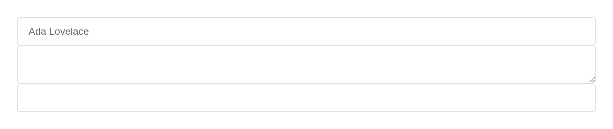

### `el_input_number()`

``` r

el_input_number("age", value = 18, min = 0, max = 150)
```

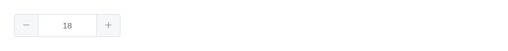

### `el_select()`

Single or multiple. `choices` takes a named vector or a list of
`list(value=, label=)`.

``` r

el_select("city", choices = c(Beijing = "bj", Shanghai = "sh"))
el_select("tags", choices = c(A = "a", B = "b", C = "c"), multiple = TRUE)
```

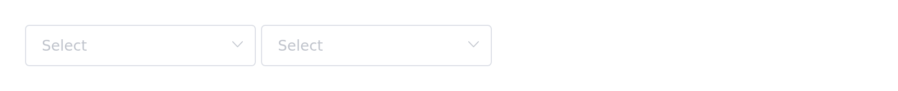

A named list groups the choices under headings, as in
[`selectInput()`](https://rdrr.io/pkg/shiny/man/selectInput.html);
`list(label =, disabled =, options =)` names a group that cannot be
picked from:

``` r

el_select("food", choices = list(
  Fruit = c(Apple = "apple", Pear = "pear"),
  Veg   = list(label = "Vegetables (sold out)", disabled = TRUE,
               options = c(Kale = "kale", Leek = "leek"))
))
```

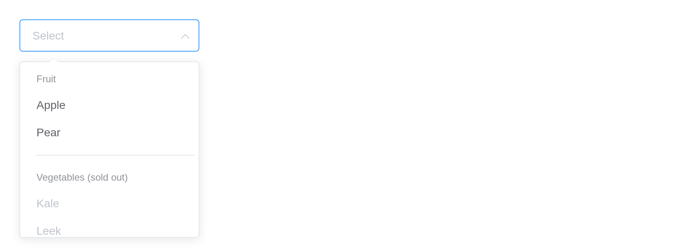

### `el_radio_group()`

``` r

el_radio_group("plan", choices = c(Basic = "x", Pro = "y"))
el_radio_group("range", choices = c(Day = "d", Week = "w"), button = TRUE)
```

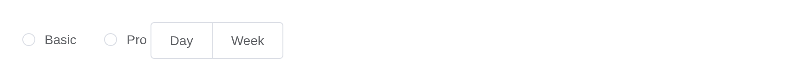

### `el_checkbox_group()`

``` r

el_checkbox_group("langs", choices = c(R = "r", Python = "p", SQL = "s"),
                  selected = c("r", "s"))
```

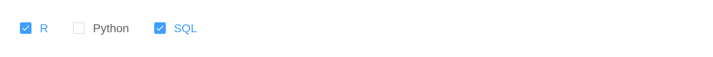

### `el_switch()`

``` r

el_switch("live", value = TRUE, active_text = "on", inactive_text = "off")
```

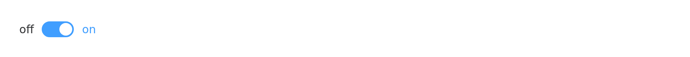

### `el_slider()`

``` r

el_slider("score", value = 40)
el_slider("band", value = c(20, 70), range = TRUE)
```

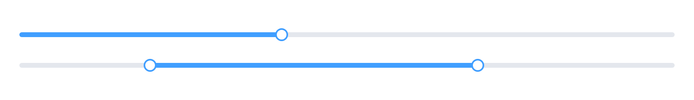

### `el_rate()`

``` r

el_rate("stars", value = 3, show_text = TRUE)
```


### `el_date_picker()`

``` r

el_date_picker("when", value = "2026-03-01")
el_date_picker("span", type = "daterange")
```

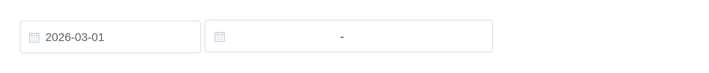

### `el_time_picker()` and `el_time_select()`

Any time of day, or a range of them;
[`el_time_select()`](https://kaipingyang.github.io/shiny.element/reference/el_time_picker.md)
offers fixed times at an interval instead.

``` r

el_time_picker("start", value = "09:30:00",
               picker_options = list(selectableRange = "08:00:00 - 18:00:00"))
el_time_picker("shift", is_range = TRUE, value = c("09:00:00", "17:30:00"))
el_time_select("slot", value = "10:30",
               picker_options = list(start = "09:00", step = "00:30", end = "18:00"))
```

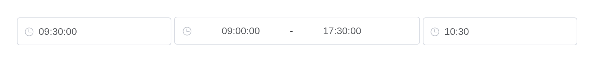

### `el_color_picker()`

``` r

el_color_picker("shade", value = "#409EFF")
```

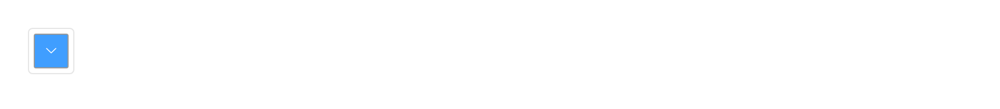

### `el_cascader()`

Nested options;
[`df_to_cascader_options()`](https://kaipingyang.github.io/shiny.element/reference/df_to_cascader_options.md)
builds them from a data frame.

``` r

el_cascader("region", options = list(
  list(value = "zj", label = "Zhejiang", children = list(
    list(value = "hz", label = "Hangzhou")))))
```

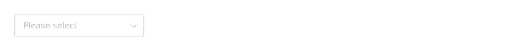

### `el_cascader_panel()`

The cascader’s columns on their own, always open.

``` r

el_cascader_panel("where", value = c("asia", "jp"), width = "fit-content", options = list(
  list(value = "asia", label = "Asia", children = list(
    list(value = "cn", label = "China"), list(value = "jp", label = "Japan"))),
  list(value = "europe", label = "Europe", children = list(
    list(value = "fr", label = "France")))))
```

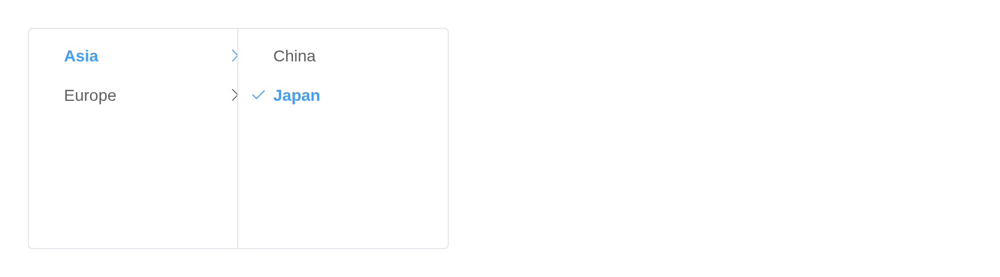

### `el_autocomplete()`

A text input that suggests as you type. Filtering happens in the
browser; for suggestions that come from the server pass
`fetch_suggestions`.

``` r

el_autocomplete("city", width = 240, placeholder = "Where to?",
                suggestions = c("Beijing", "Shanghai", "Shenzhen"))
```

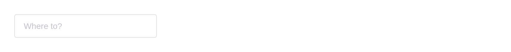

### `el_transfer()`

Two lists, for moving items between them. `input$<id>` holds the keys on
the right.

``` r

el_transfer("cols", width = 560,
            data = data.frame(key = names(iris), label = names(iris)),
            value = c("Species"), titles = c("Available", "Chosen"))
```

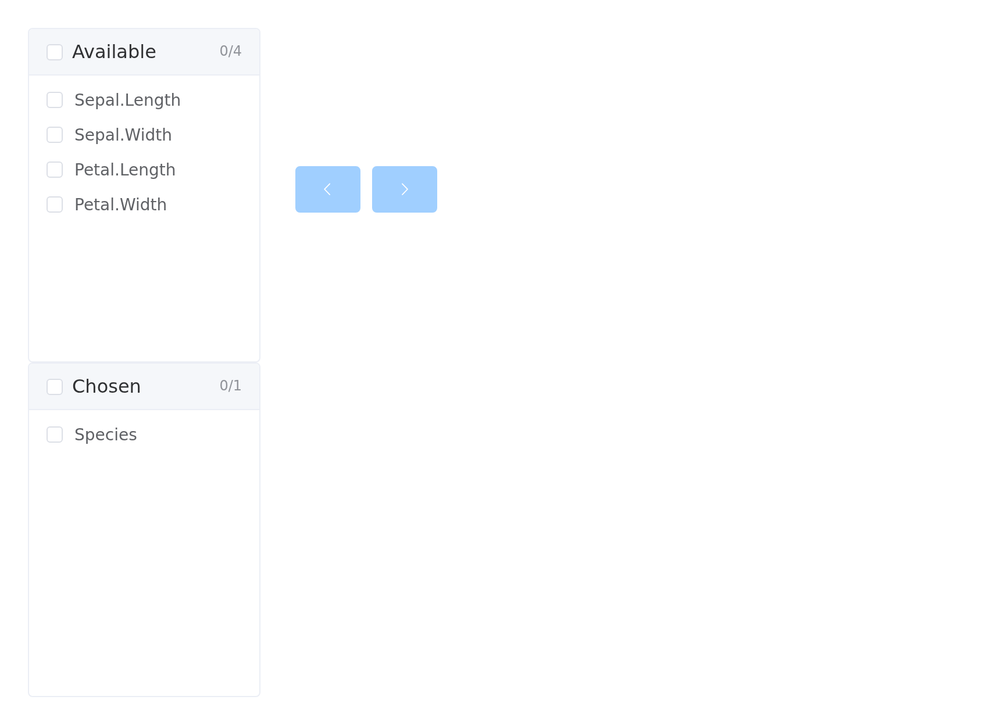

### `el_upload()`

Element’s upload over Shiny’s own transport, so `input$files` is the
data frame [`fileInput()`](https://rdrr.io/pkg/shiny/man/fileInput.html)
produces, `datapath` and all. Pass `action` instead to post straight to
a URL.

``` r

el_upload("files", drag = TRUE, multiple = TRUE, tip = "CSV only", accept = ".csv")
```

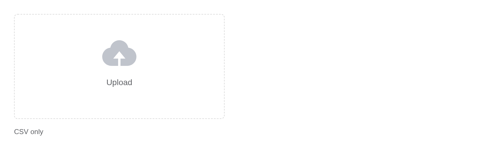

### `el_form()`

The form owns its model, so validation runs in the browser and the whole
form reports once on submit rather than field by field. `input$signup`
carries the model, `input$signup_valid` the verdict,
`input$signup_submit` a counter.

``` r

el_form(
  id = "signup", label_width = "110px",
  el_form_field("name", "input", label = "Name",
                rules = el_rule(required = TRUE, message = "Name is required")),
  el_form_field("email", "input", label = "Email",
                rules = el_rule(type = "email", message = "Not a valid email")),
  el_form_field("city", "select", label = "City",
                choices = c(Beijing = "bj", Shanghai = "sh"))
)
```

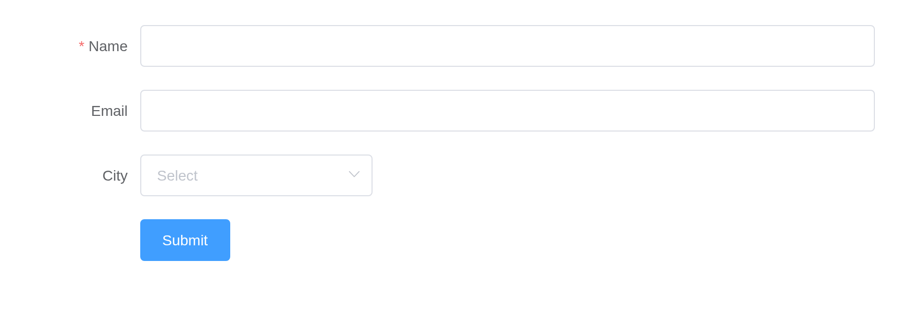

## Data

### `el_button()`

``` r

el_button("save", "Primary", type = "primary")
el_button("go", "Round", type = "primary", round = TRUE)
el_button("wait", "Loading", type = "primary", loading = TRUE)
```

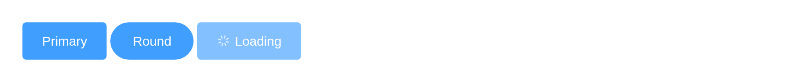

### `el_tag()`

``` r

el_tag("t", label = "closable", type = "warning", closable = TRUE)
```

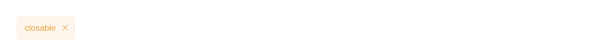

### `el_alert()`

``` r

el_alert("hint", title = "info", type = "info", show_icon = TRUE,
         description = "with a description")
```

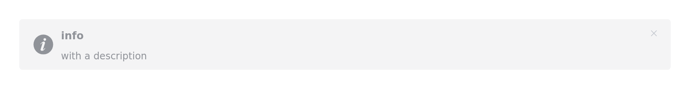

### `el_progress()`

Line, circle and dashboard.

``` r

el_progress("pct", percentage = 70)
el_progress("ring", percentage = 70, type = "circle")
```

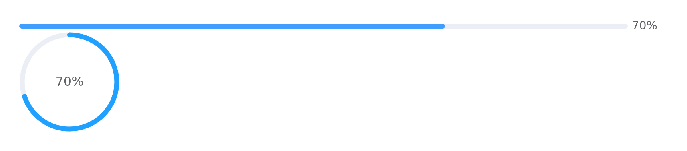

### `el_badge()`

``` r

el_badge(el_button("msg", "messages"), value = 12)
el_badge(el_button("hi", "capped"), value = 200, max = 99)
```

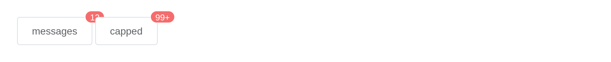

### `el_card()`

``` r

el_card(header = "Card header", "Cards nest any content.")
```

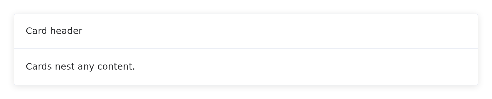

### `el_table()`

Takes a data frame directly and infers its columns. With
`selection = TRUE`, `input$tbl_selected_rows` gives 1-based row numbers
with their R types intact.

``` r

el_table(id = "tbl", data = head(iris, 4), selection = TRUE)
```

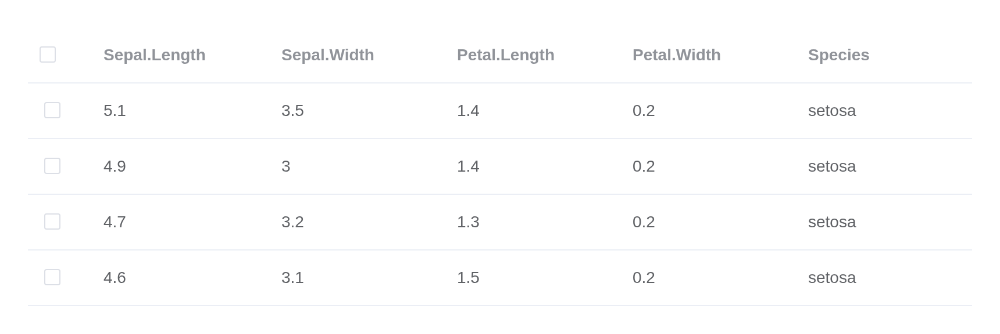

### `el_avatar()`

From an image, an icon, or text.

``` r

el_avatar("anon", icon = "el-icon-user-solid")
el_avatar("initials", content = "KY", shape = "square")
el_avatar("big", content = "40", size = 40)
```


### `el_image()`

An image with a fit mode, optional lazy loading, and an optional
full-screen preview.

``` r

# Serve a folder of images; here, R's own logo
addResourcePath("rdoc", R.home("doc/html"))

el_image("logo", src = "rdoc/logo.jpg", width = 160, fit = "contain")

# Click to open a full-screen preview
el_image("gallery", src = "rdoc/logo.jpg", width = 80, fit = "cover",
         preview_src_list = c("rdoc/logo.jpg", "rdoc/logo.jpg"))
```


### `el_descriptions()`

A read-only grid of labelled values – the detail view of a record.
Content may be any UI, components included.

``` r

el_descriptions("account", title = "Account", border = TRUE, column = 2,
  items = list(
    list(label = "Name", content = "Ada Lovelace"),
    list(label = "Plan", content = el_tag("plan", "Pro", type = "success")),
    list(label = "Joined", content = "2026-01-12"),
    list(label = "Seats", content = "12"),
    list(label = "Address", content = "12 St James's Square, London", span = 2)
  ))
```

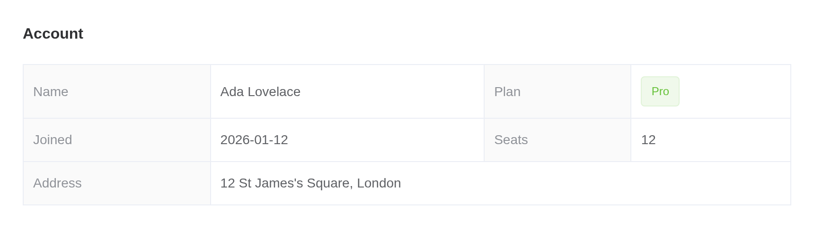

### `el_statistic()`

A headline number with a title.

``` r

el_row(gutter = 20,
  el_col(span = 8, el_statistic("users", value = 26048, title = "Active users",
                                group_separator = ",")),
  el_col(span = 8, el_statistic("revenue", value = 1318.5, title = "Revenue",
                                prefix = "$", precision = 2)),
  el_col(span = 8, el_statistic("growth", value = 4.2, title = "Growth",
                                suffix = "%", precision = 1))
)
```


With `time_indices = TRUE` it counts down to a date-time, and reports
`input$<id>_finish` when it gets there:

``` r

el_statistic("sale", value = Sys.time() + 5 * 3600, time_indices = TRUE,
             title = "Sale ends in", format = "HH:mm:ss")
```


### `el_empty()` and `el_result()`

What a view shows when there is nothing in it yet, and what it shows
once something has finished.

``` r

el_empty("none", description = "No reports yet", image_size = 100,
         el_button("create", "Create one", type = "primary"))
```


``` r

el_result("done", icon = "success", title = "Report submitted",
          sub_title = "It will be reviewed within a day",
          el_button("back", "Back to the list", type = "primary"))
```

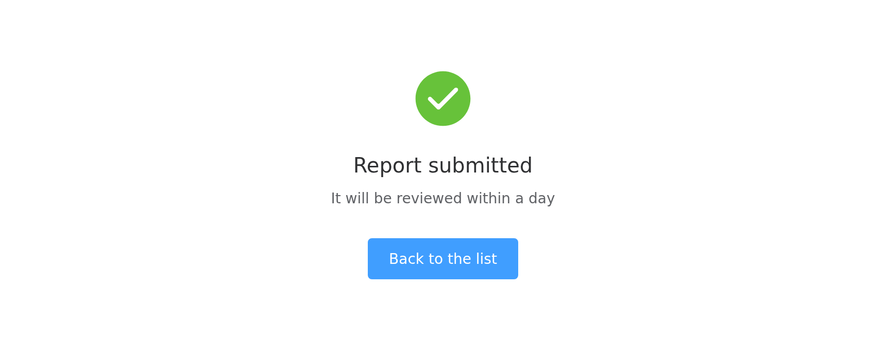

### `el_skeleton()`

Grey shapes in place of content that is still on its way. Switch
`loading` off from the server when the content is ready.

``` r

el_skeleton("report", rows = 3, animated = TRUE, tableOutput("summary"))
```

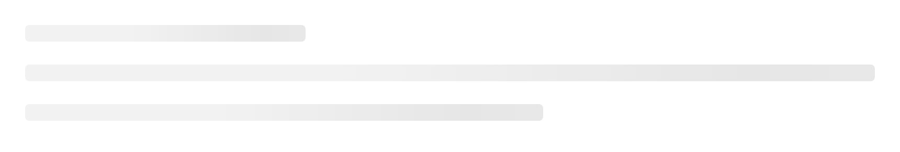

### `el_pagination()`

``` r

el_pagination("pager", total = 200, page_size = 20, current_page = 3)
```

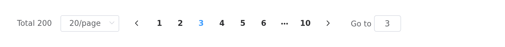

### `el_timeline()`

Entries can be replaced wholesale with
[`update_el_timeline()`](https://kaipingyang.github.io/shiny.element/reference/update_el_timeline.md),
which suits a log that grows.

``` r

el_timeline("log", items = list(
  list(content = "Order placed", timestamp = "2026-03-01", type = "primary"),
  list(content = "Shipped", timestamp = "2026-03-02", type = "success",
       icon = "el-icon-check", size = "large")))
```

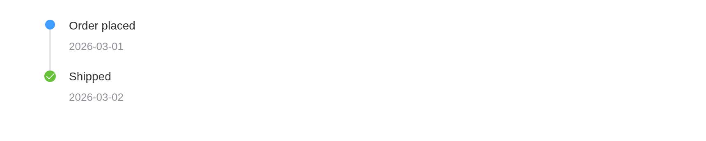

### `el_carousel()`

``` r

el_carousel("banner", height = "160px", items = list(
  list(name = "one", content = tags$h3("First")),
  list(name = "two", content = tags$h3("Second"))))
```

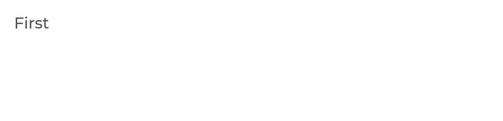

### `el_divider()` and `el_link()`

``` r

el_divider()
el_link("primary", type = "primary")
```

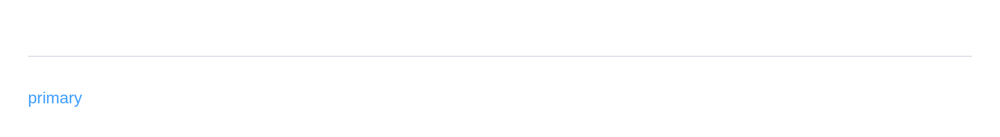

### Icons

Element’s icon font ships with the package; any `el-icon-*` class works.

``` r

tags$i(class = "el-icon-edit")
el_icon("star-on")
```

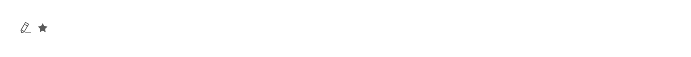

## Others

These render as plain markup rather than Vue instances, which is what
lets them hold other components from this package. A component placed
inside one stays connected to the server.

### `el_tabs()`

``` r

el_tabs("section", tabs = list(
  list(name = "x", label = "Inputs",
       content = tagList(el_input("q"), el_rate("stars"))),
  list(name = "y", label = "Second", content = "Panes hold components.")))
```

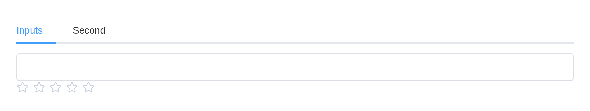

`editable = TRUE` adds Element’s close buttons and new-tab button. The
tabs close themselves; a new one is the server’s to make, with
[`insert_el_tab()`](https://kaipingyang.github.io/shiny.element/reference/insert_el_tab.md),
and it can hold components like any other:

``` r

ui <- el_page(
  el_tabs("docs", editable = TRUE, tabs = list(
    list(name = "readme", label = "README", content = tags$p("The first page."))
  )),
  verbatimTextOutput("edit")
)

server <- function(input, output, session) {
  n <- 0
  observeEvent(input$docs_tab_add, {
    n <<- n + 1
    insert_el_tab(session, "docs", paste0("doc", n), paste("Untitled", n),
                  content = el_input(paste0("note", n), placeholder = "Notes"))
  })
  output$edit <- renderPrint(input$docs_edit)
}

shinyApp(ui, server)
```

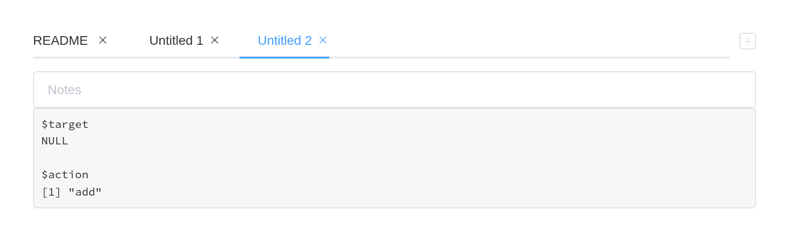

### `el_collapse()`

``` r

el_collapse("panels", value = "p1", items = list(
  list(name = "p1", title = "Filters",
       content = tagList(el_input("q"), el_switch("live")))))
```

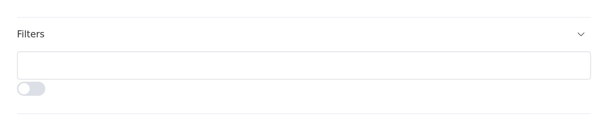

### `el_steps()`

``` r

el_steps("wizard", active = 1, finish_status = "success", steps = list(
  list(title = "Pick", description = "choose a plan"),
  list(title = "Pay",  description = "enter card"),
  list(title = "Done", description = "all set")))
```

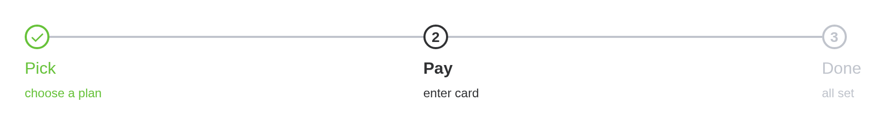

### `el_dialog()` and `el_drawer()`

Open and close them from the server; `input$<id>` is `TRUE` while open.
Both hold live components.

``` r

ui <- el_page(
  el_button("open", "Open dialog", type = "primary"),
  el_dialog("confirm", title = "Why?", width = "420px",
            content = el_input("reason", placeholder = "Tell us why"),
            footer = el_button("ok", "OK", type = "primary"))
)

server <- function(input, output, session) {
  observeEvent(input$open, update_el_dialog(session, "confirm", visible = TRUE))
  observeEvent(input$ok, update_el_dialog(session, "confirm", visible = FALSE))
}

shinyApp(ui, server)
```

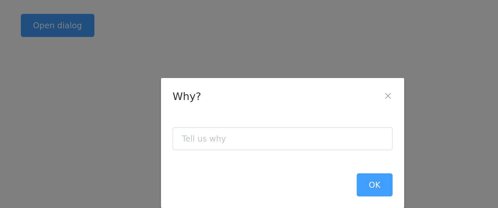

``` r

ui <- el_page(
  el_button("open", "Open drawer"),
  el_drawer("settings", title = "Settings", direction = "rtl", size = "320px",
            content = tagList(el_switch("dark", value = TRUE, active_text = "Dark"),
                              tags$p("Drawers hold live components too.")))
)

server <- function(input, output, session) {
  observeEvent(input$open, update_el_drawer(session, "settings", visible = TRUE))
}

shinyApp(ui, server)
```

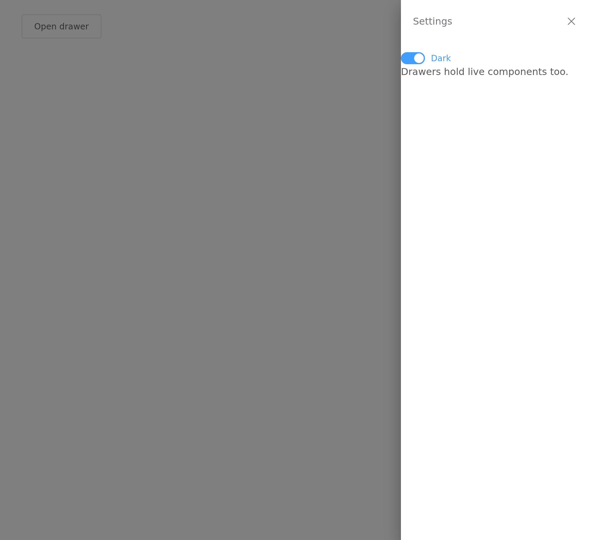

### `el_tooltip()`

A hint shown on hover. The trigger can be plain markup or a whole
component – a component is folded into the tooltip’s own Vue instance,
so it keeps reporting its inputs.

``` r

el_tooltip("hint", el$button(type = "primary", "Hover me"),
           content = "A hint about this button")

# A component works too
el_tooltip("save_hint", el_button("save", "Save"), content = "Writes to disk")
```

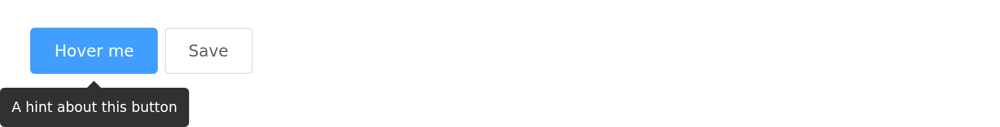

### `el_popover()`

A card on click or hover, with a title and body.

``` r

el_popover("info",
  reference = el$button(type = "primary", "Details"),
  title = "March", content = "Revenue up 4% on February.")
```

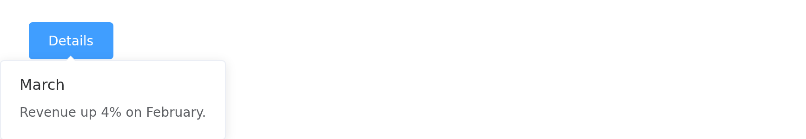

### `el_popconfirm()`

A confirmation anchored to what triggers it, for actions that warrant a
check but not a dialog. `input$<id>_confirm` and `input$<id>_cancel`
report the answer.

``` r

el_popconfirm("del",
  reference = el$button(type = "danger", "Delete"),
  title = "Delete this row?")
```


### `el_backtop()`

A button that appears once the page is scrolled.

``` r

tags$div(id = "report", style = "height: 180px; overflow: auto",
         lapply(1:40, function(i) tags$p(paste("Line", i))))

# Scrolls the panel above rather than the page
el_backtop("to_top", target = "#report", visibility_height = 100)
```

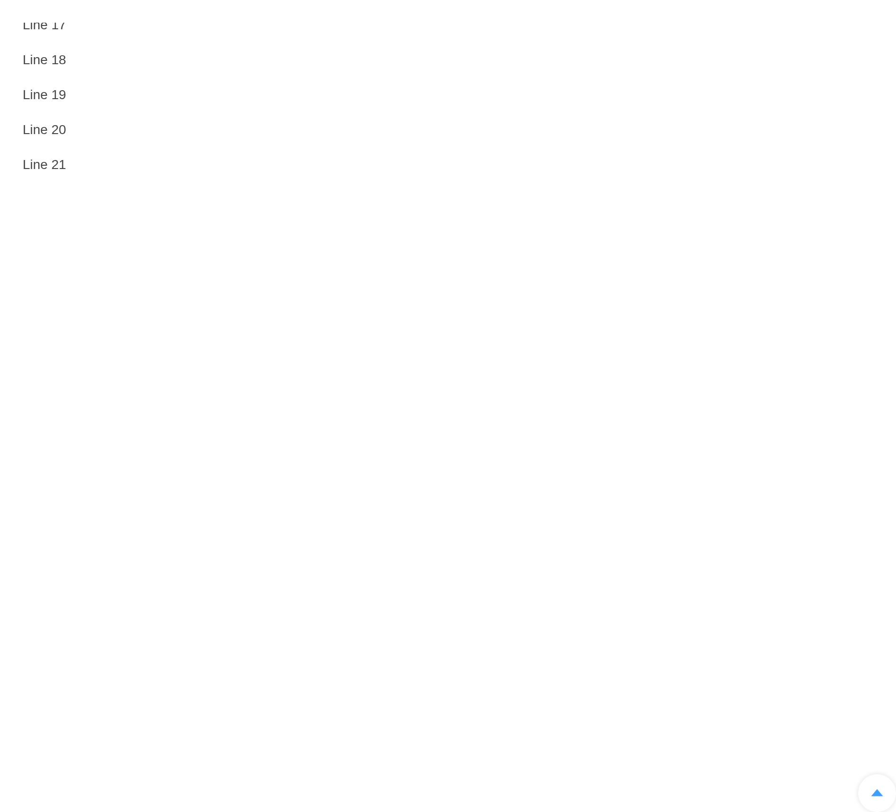

### `el_infinite_scroll()`

A scrolling area that asks for more as the user nears the bottom.
`input$<id>_load` rises by one each time.

``` r

el_infinite_scroll("feed", height = "300px", uiOutput("rows"))
```


### `el_row()` / `el_col()`

A 24-column grid.

``` r

el_row(gutter = 20,
  el_col(span = 12, "span = 12"),
  el_col(span = 12, "span = 12"))
```

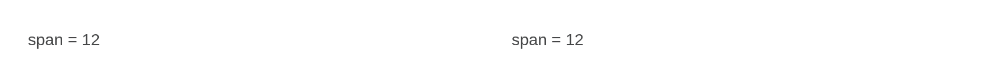

### `el_container()`

``` r

el_container(
  el_header("Header"),
  el_container(el_aside(width = "160px", "Aside"), el_main("Main")))
```

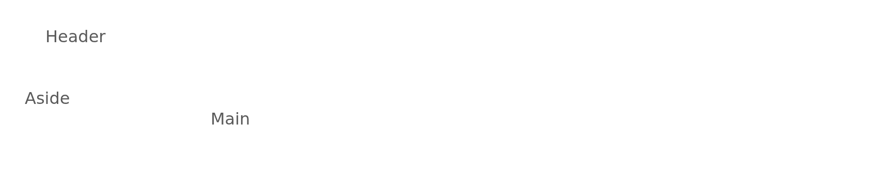

## Navigation

### `el_menu()`

Nests to any depth. `input$nav` gives the selected index,
`input$nav_path` the full path down to it.

``` r

el_menu("nav", active = "home", items = list(
  list(index = "home", label = "Home", icon = "el-icon-house"),
  list(index = "data", label = "Data", children = list(
    list(index = "all", label = "All records")))))
```

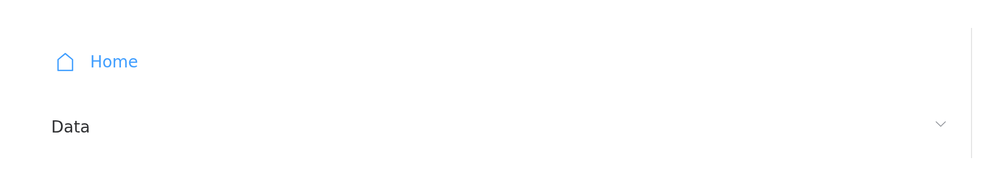

### `el_tree()`

[`df_to_tree_data()`](https://kaipingyang.github.io/shiny.element/reference/df_to_tree_data.md)
builds the node list from a data frame.

``` r

el_tree("picker", show_checkbox = TRUE, checked = "apple", data = list(
  list(id = "fruit", label = "Fruit", children = list(
    list(id = "apple", label = "Apple")))))
```


### `el_breadcrumb()`

A trail of links. `input$<id>` is the label of the step last clicked, so
it can drive navigation inside a Shiny app without any routing.

``` r

el_breadcrumb("trail", items = list(
  list(label = "Home"), list(label = "Reports"), list(label = "March")))
```

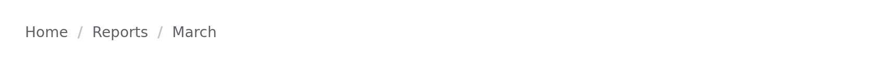

### `el_page_header()`

A page title with a back link. `input$<id>_back` fires when it is
clicked; what going back means is up to your app.

``` r

el_page_header("hdr", title = "All reports", content = "Sales for March")
```

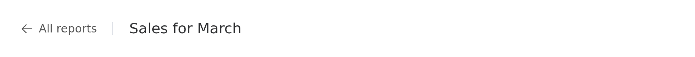

### `el_dropdown()`

``` r

el_dropdown("actions", trigger_label = "Actions", items = list(
  list(command = "edit", label = "Edit"),
  list(command = "del",  label = "Delete")))
```

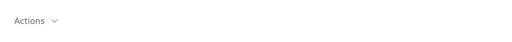

## Feedback

[`el_notification()`](https://kaipingyang.github.io/shiny.element/reference/el_notification.md)
and
[`el_message()`](https://kaipingyang.github.io/shiny.element/reference/el_message.md)
are called from the server and render themselves; there is nothing to
place in the UI.

``` r

ui <- el_page(
  el_button("notify", "Notify"),
  el_button("warn", "Warn")
)

server <- function(input, output, session) {
  observeEvent(input$notify, el_notification(session, message = "Saved",
                                             title = "Done", type = "success"))
  observeEvent(input$warn, el_message(session, message = "Check the form",
                                      type = "warning"))
}

shinyApp(ui, server)
```

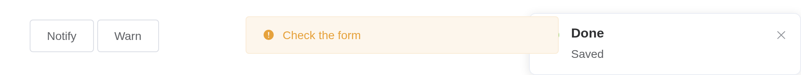
