# Component gallery

Every screenshot below is the real component, captured from a running
Shiny app in headless Chromium. Regenerate them with
`Rscript tools/screenshots.R` after changing how something looks.

Each component reports to the server as `input$<id>`, on load as well as
on change, and is updated from the server with the matching
`update_el_*()`.

The sections follow Element UI’s own documentation, so a page there has
a counterpart here.

## Form

### `el_input()`

Text, textarea and password, with the usual Element trimmings.

``` r

el_input("name", value = "Ada Lovelace", placeholder = "your name")
el_input("notes", type = "textarea", rows = 2)
el_input("pw", type = "password", show_password = TRUE)
```


### `el_input_number()`

``` r

el_input_number("age", value = 18, min = 0, max = 150)
```


### `el_select()`

Single or multiple. `choices` takes a named vector or a list of
`list(value=, label=)`.

``` r

el_select("city", choices = c(Beijing = "bj", Shanghai = "sh"))
el_select("tags", choices = c(A = "a", B = "b", C = "c"), multiple = TRUE)
```


### `el_radio_group()`

``` r

el_radio_group("plan", choices = c(Basic = "x", Pro = "y"))
el_radio_group("range", choices = c(Day = "d", Week = "w"), button = TRUE)
```

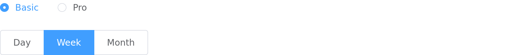

### `el_checkbox_group()`

``` r

el_checkbox_group("langs", choices = c(R = "r", Python = "p", SQL = "s"),
                  selected = c("r", "s"))
```


### `el_switch()`

``` r

el_switch("live", value = TRUE, active_text = "on", inactive_text = "off")
```


### `el_slider()`

``` r

el_slider("score", value = 40)
el_slider("band", value = c(20, 70), range = TRUE)
```


### `el_rate()`

``` r

el_rate("stars", value = 3, show_text = TRUE)
```


### `el_date_picker()`

``` r

el_date_picker("when", value = "2026-03-01")
el_date_picker("span", type = "daterange")
```


### `el_color_picker()`

``` r

el_color_picker("shade", value = "#409EFF")
```


### `el_cascader()`

Nested options;
[`df_to_cascader_options()`](https://kaipingyang.github.io/shiny.element/reference/df_to_cascader_options.md)
builds them from a data frame.

``` r

el_cascader("region", options = list(
  list(value = "zj", label = "Zhejiang", children = list(
    list(value = "hz", label = "Hangzhou")))))
```


### `el_autocomplete()`

A text input that suggests as you type. Filtering happens in the
browser; for suggestions that come from the server pass
`fetch_suggestions`.

``` r

el_autocomplete("city", width = 240, placeholder = "Where to?",
                suggestions = c("Beijing", "Shanghai", "Shenzhen"))
```


### `el_transfer()`

Two lists, for moving items between them. `input$<id>` holds the keys on
the right.

``` r

el_transfer("cols", width = 560,
            data = data.frame(key = names(iris), label = names(iris)),
            value = c("Species"), titles = c("Available", "Chosen"))
```

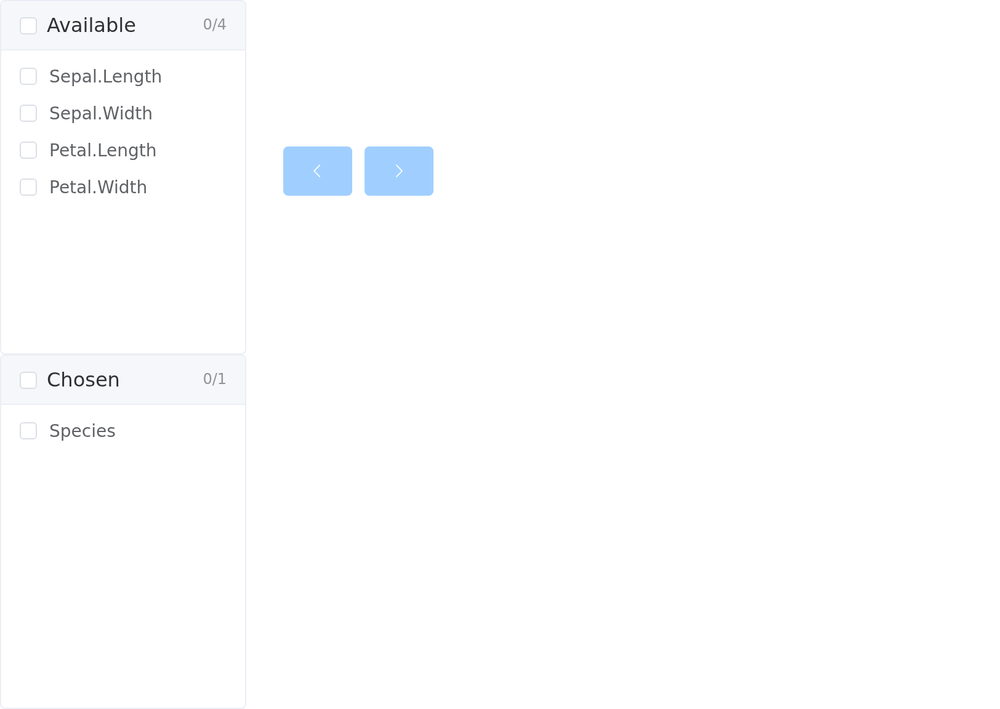

### `el_upload()`

Element’s upload over Shiny’s own transport, so `input$files` is the
data frame [`fileInput()`](https://rdrr.io/pkg/shiny/man/fileInput.html)
produces, `datapath` and all. Pass `action` instead to post straight to
a URL.

``` r

el_upload("files", drag = TRUE, multiple = TRUE, tip = "CSV only", accept = ".csv")
```


### `el_form()`

The form owns its model, so validation runs in the browser and the whole
form reports once on submit rather than field by field. `input$signup`
carries the model, `input$signup_valid` the verdict,
`input$signup_submit` a counter.

``` r

el_form(
  id = "signup", label_width = "110px",
  el_form_field("name", "input", label = "Name",
                rules = el_rule(required = TRUE, message = "Name is required")),
  el_form_field("email", "input", label = "Email",
                rules = el_rule(type = "email", message = "Not a valid email")),
  el_form_field("city", "select", label = "City",
                choices = c(Beijing = "bj", Shanghai = "sh"))
)
```


## Data

### `el_button()`

``` r

el_button("save", "Primary", type = "primary")
el_button("go", "Round", type = "primary", round = TRUE)
el_button("wait", "Loading", type = "primary", loading = TRUE)
```

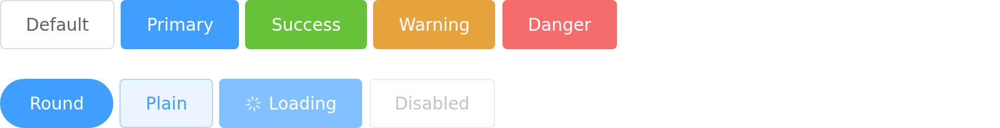

### `el_tag()`

``` r

el_tag("t", label = "closable", type = "warning", closable = TRUE)
```


### `el_alert()`

``` r

el_alert("hint", title = "info", type = "info", show_icon = TRUE,
         description = "with a description")
```

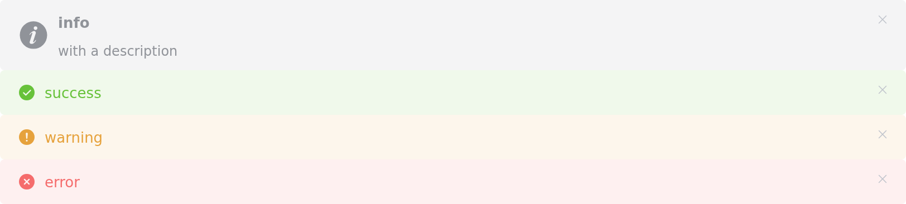

### `el_progress()`

Line, circle and dashboard.

``` r

el_progress("pct", percentage = 70)
el_progress("ring", percentage = 70, type = "circle")
```

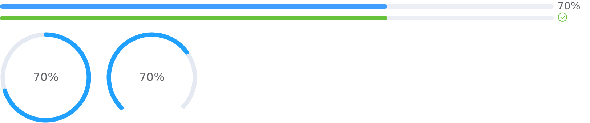

### `el_badge()`

``` r

el_badge(el_button("msg", "messages"), value = 12)
el_badge(el_button("hi", "capped"), value = 200, max = 99)
```


### `el_card()`

``` r

el_card(header = "Card header", "Cards nest any content.")
```


### `el_table()`

Takes a data frame directly and infers its columns. With
`selection = TRUE`, `input$tbl_selected_rows` gives 1-based row numbers
with their R types intact.

``` r

el_table(id = "tbl", data = head(iris, 4), selection = TRUE)
```


### `el_avatar()`

From an image, an icon, or text.

``` r

el_avatar("me", icon = "el-icon-user-solid")
el_avatar("me", content = "KY", shape = "square")
el_avatar("me", content = "40", size = 40)
```


### `el_image()`

An image with a fit mode, optional lazy loading, and an optional
full-screen preview.

``` r

el_image("photo", src = "hamburger.png", width = 160, fit = "cover")

# Click to open a gallery
el_image("photo", src = "a.png", preview_src_list = c("a.png", "b.png"))
```

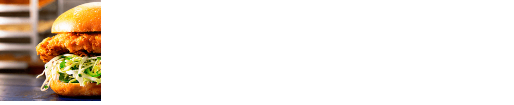

### `el_pagination()`

``` r

el_pagination("pager", total = 200, page_size = 20, current_page = 3)
```

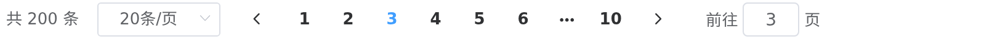

### `el_timeline()`

Entries can be replaced wholesale with
[`update_el_timeline()`](https://kaipingyang.github.io/shiny.element/reference/update_el_timeline.md),
which suits a log that grows.

``` r

el_timeline("log", items = list(
  list(content = "Order placed", timestamp = "2026-03-01", type = "primary"),
  list(content = "Shipped", timestamp = "2026-03-02", type = "success",
       icon = "el-icon-check", size = "large")))
```


### `el_carousel()`

``` r

el_carousel("banner", height = "160px", items = list(
  list(name = "one", content = tags$h3("First")),
  list(name = "two", content = tags$h3("Second"))))
```


### `el_divider()` and `el_link()`

``` r

el_divider()
el_link("primary", type = "primary")
```

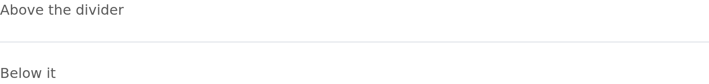


### Icons

Element’s icon font ships with the package; any `el-icon-*` class works.

``` r

tags$i(class = "el-icon-edit")
el_icon("star-on")
```


## Others

These render as plain markup rather than Vue instances, which is what
lets them hold other components from this package. A component placed
inside one stays connected to the server.

### `el_tabs()`

``` r

el_tabs("section", tabs = list(
  list(name = "x", label = "Inputs",
       content = tagList(el_input("q"), el_rate("stars"))),
  list(name = "y", label = "Second", content = "Panes hold components.")))
```


### `el_collapse()`

``` r

el_collapse("panels", value = "p1", items = list(
  list(name = "p1", title = "Filters",
       content = tagList(el_input("q"), el_switch("live")))))
```

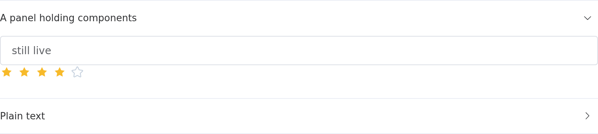

### `el_steps()`

``` r

el_steps("wizard", active = 1, finish_status = "success", steps = list(
  list(title = "Pick", description = "choose a plan"),
  list(title = "Pay",  description = "enter card"),
  list(title = "Done", description = "all set")))
```

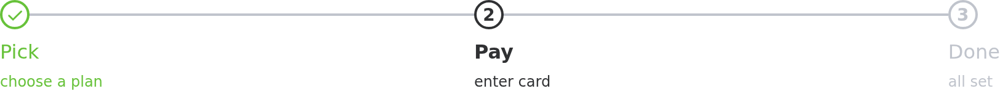

### `el_dialog()` and `el_drawer()`

Open and close them from the server; `input$<id>` is `TRUE` while open.

``` r

el_dialog("confirm", title = "Confirm", content = el_input("reason"))
update_el_dialog(session, "confirm", visible = TRUE)

el_drawer("settings", title = "Settings", direction = "rtl", size = "320px")
```

### `el_tooltip()`

A hint shown on hover. The trigger can be plain markup or a whole
component – a component is folded into the tooltip’s own Vue instance,
so it keeps reporting its inputs.

``` r

el_tooltip("hint", el$button(type = "primary", "Hover me"),
           content = "A hint about this button")

# A component works too
el_tooltip("hint", el_button("save", "Save"), content = "Writes to disk")
```

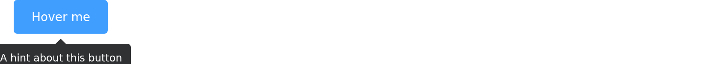

### `el_popover()`

A card on click or hover, with a title and body.

``` r

el_popover("info",
  reference = el$button(type = "primary", "Details"),
  title = "March", content = "Revenue up 4% on February.")
```

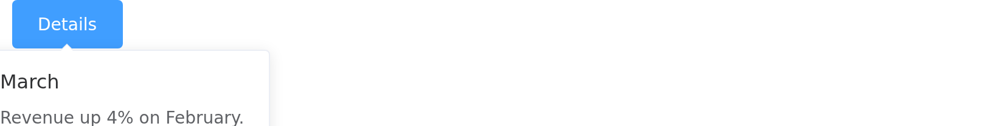

### `el_popconfirm()`

A confirmation anchored to what triggers it, for actions that warrant a
check but not a dialog. `input$<id>_confirm` and `input$<id>_cancel`
report the answer.

``` r

el_popconfirm("del",
  reference = el$button(type = "danger", "Delete"),
  title = "Delete this row?")
```


### `el_backtop()`

A button that appears once the page is scrolled.

``` r

el_backtop("top", visibility_height = 200)
el_backtop("panel_top", target = "#report")   # scroll a panel, not the page
```

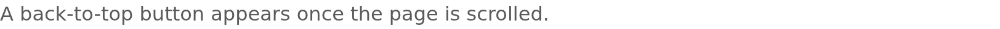

### `el_infinite_scroll()`

A scrolling area that asks for more as the user nears the bottom.
`input$<id>_load` rises by one each time.

``` r

el_infinite_scroll("feed", height = "300px", uiOutput("rows"))
```

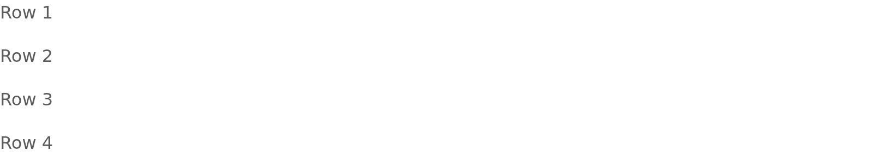

### `el_row()` / `el_col()`

A 24-column grid.

``` r

el_row(gutter = 20,
  el_col(span = 12, "span = 12"),
  el_col(span = 12, "span = 12"))
```

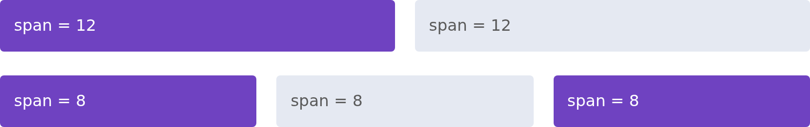

### `el_container()`

``` r

el_container(
  el_header("Header"),
  el_container(el_aside(width = "160px", "Aside"), el_main("Main")))
```

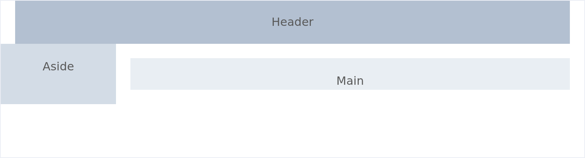

## Navigation

### `el_menu()`

Nests to any depth. `input$nav` gives the selected index,
`input$nav_path` the full path down to it.

``` r

el_menu("nav", active = "home", items = list(
  list(index = "home", label = "Home", icon = "el-icon-house"),
  list(index = "data", label = "Data", children = list(
    list(index = "all", label = "All records")))))
```

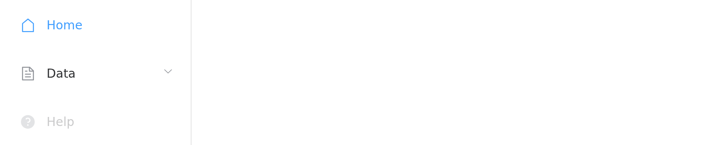

### `el_tree()`

[`df_to_tree_data()`](https://kaipingyang.github.io/shiny.element/reference/df_to_tree_data.md)
builds the node list from a data frame.

``` r

el_tree("picker", show_checkbox = TRUE, checked = "apple", data = list(
  list(id = "fruit", label = "Fruit", children = list(
    list(id = "apple", label = "Apple")))))
```


### `el_breadcrumb()`

A trail of links. `input$<id>` is the label of the step last clicked, so
it can drive navigation inside a Shiny app without any routing.

``` r

el_breadcrumb("trail", items = list(
  list(label = "Home"), list(label = "Reports"), list(label = "March")))
```


### `el_page_header()`

A page title with a back link. `input$<id>_back` fires when it is
clicked; what going back means is up to your app.

``` r

el_page_header("hdr", title = "All reports", content = "Sales for March")
```

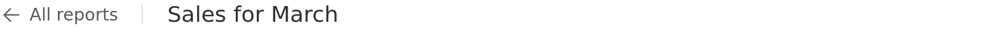

### `el_dropdown()`

``` r

el_dropdown("actions", trigger_label = "Actions", items = list(
  list(command = "edit", label = "Edit"),
  list(command = "del",  label = "Delete")))
```


## Feedback

[`el_notification()`](https://kaipingyang.github.io/shiny.element/reference/el_notification.md)
and
[`el_message()`](https://kaipingyang.github.io/shiny.element/reference/el_message.md)
are called from the server and render themselves; there is nothing to
place in the UI.

``` r

el_notification(session, message = "Saved", title = "Done", type = "success")
el_message(session, message = "Check the form", type = "warning")
```
