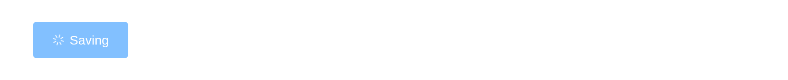

# Button

Commonly used button. `input$<id>` counts its clicks, as
[`actionButton()`](https://rdrr.io/pkg/shiny/man/actionButton.html) does
– 0 on load, which
[`observeEvent()`](https://rdrr.io/pkg/shiny/man/observeEvent.html)
ignores.

## Basic usage

`type`, `plain`, `round` and `circle` define the button’s style.

``` r

types <- c("default", "primary", "success", "info", "warning", "danger")
row <- function(...) tags$div(style = "margin-bottom: 12px", ...)
tagList(
  row(lapply(types, function(t) el_button(paste0("b_", t), tools::toTitleCase(t), type = t))),
  row(lapply(types, function(t) el_button(paste0("p_", t), "Plain", type = t, plain = TRUE))),
  row(lapply(types, function(t) el_button(paste0("r_", t), "Round", type = t, round = TRUE))),
  row(Map(function(t, i) el_button(paste0("c_", t), NULL, type = t, circle = TRUE,
                                   icon = paste0("el-icon-", i)),
          types, c("search", "edit", "check", "message", "star-off", "delete"))))
```

## Disabled button

``` r

types <- c("default", "primary", "success", "info", "warning", "danger")
tagList(
  tags$div(style = "margin-bottom: 12px", lapply(types, function(t)
    el_button(paste0("d_", t), tools::toTitleCase(t), type = t, disabled = TRUE))),
  lapply(types, function(t) el_button(paste0("dp_", t), "Plain", type = t, plain = TRUE, disabled = TRUE)))
```

## Text button

A button without border and background.

``` r

el_button("t1", "Text button", type = "text")
el_button("t2", "Text button", type = "text", disabled = TRUE)
```

## Icon button

`icon` takes an Element icon class; a tag –
[`el_icon()`](https://kaipingyang.github.io/shiny.element/reference/el_icon.md)
of another library – goes in as content.

``` r

el_button("i1", NULL, type = "primary", icon = "el-icon-edit")
el_button("i2", NULL, type = "primary", icon = "el-icon-share")
el_button("i3", NULL, type = "primary", icon = "el-icon-delete")
el_button("i4", "Search", type = "primary", icon = "el-icon-search")
el_button("i5", "Upload", type = "primary", icon = el_icon("upload", class = "el-icon--right"))
```

## Button group

[`el_button_group()`](https://kaipingyang.github.io/shiny.element/reference/el_button_group.md)
joins buttons into one bar; each still reports its own clicks.

``` r

el_button_group(
  el_button("prev", "Previous Page", type = "primary", icon = "el-icon-arrow-left"),
  el_button("next", "Next Page", type = "primary"))
el_button_group(
  el_button("g_edit", NULL, type = "primary", icon = "el-icon-edit"),
  el_button("g_share", NULL, type = "primary", icon = "el-icon-share"),
  el_button("g_delete", NULL, type = "primary", icon = "el-icon-delete"))
```

## Loading button

`loading` shows a spinner and holds clicks; set it from the server
around slow work.

``` r

ui <- el_page(el_button("save", "Save", type = "primary"))

server <- function(input, output, session) {
  observeEvent(input$save, {
    update_el_button(id = "save", loading = TRUE, label = "Saving")
    later::later(function() update_el_button(session, "save", loading = FALSE, label = "Save"), 3)
  })
}

shinyApp(ui, server)
```



## Sizes

`size` is `"medium"`, `"small"` or `"mini"` besides the default.

``` r

sizes <- c("default", "medium", "small", "mini")
tagList(
  tags$div(style = "margin-bottom: 12px", lapply(sizes, function(s)
    el_button(paste0("s_", s), tools::toTitleCase(s), size = if (s != "default") s))),
  lapply(sizes, function(s)
    el_button(paste0("sr_", s), tools::toTitleCase(s), size = if (s != "default") s, round = TRUE)))
```

## API

### Attributes

| Element | In R | Description | Type | Accepted | Default |
|----|----|----|----|----|----|
| `size` | `el_button(size =)` | button size | string | medium / small / mini | — |
| `type` | `el_button(type =)` | button type | string | primary / success / warning / danger / info / text | — |
| `plain` | `el_button(plain =)` | determine whether it’s a plain button | boolean | — | false |
| `round` | `el_button(round =)` | determine whether it’s a round button | boolean | — | false |
| `circle` | `el_button(circle =)` | determine whether it’s a circle button | boolean | — | false |
| `loading` | `el_button(loading =)` | determine whether it’s loading | boolean | — | false |
| `disabled` | `el_button(disabled =)` | disable the button | boolean | — | false |
| `icon` | `el_button(icon =)` | icon class name | string | — | — |
| `autofocus` | `el_button(autofocus =)` | same as native button’s `autofocus` | boolean | — | false |
| `native-type` | `el_button(native_type =)` | same as native button’s `type` | string | button / submit / reset | button |
