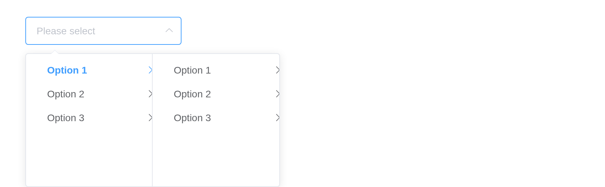

# Cascader

If the options have a clear hierarchical structure, Cascader can be used
to view and select them. `input$<id>` is the selected path.
[`df_to_cascader_options()`](https://kaipingyang.github.io/shiny.element/reference/df_to_cascader_options.md)
builds the options from a data frame.

## Basic usage

`props = list(expandTrigger = "hover")` opens a column on hover rather
than on click.

``` r

guide <- list(
  list(value = "guide", label = "Guide", children = list(
    list(value = "disciplines", label = "Disciplines", children = list(
      list(value = "consistency", label = "Consistency"),
      list(value = "feedback", label = "Feedback"))),
    list(value = "navigation", label = "Navigation", children = list(
      list(value = "side-nav", label = "Side Navigation"),
      list(value = "top-nav", label = "Top Navigation"))))),
  list(value = "component", label = "Component", children = list(
    list(value = "basic", label = "Basic", children = list(
      list(value = "layout", label = "Layout"), list(value = "color", label = "Color"))),
    list(value = "form", label = "Form", children = list(
      list(value = "radio", label = "Radio"), list(value = "checkbox", label = "Checkbox"))))))
el_cascader("click", options = guide)
el_cascader("hover", options = guide, props = list(expandTrigger = "hover"))
```

## Disabled option

An option with `disabled = TRUE`.

``` r

el_cascader("dis", options = list(
  list(value = "a", label = "Disabled", disabled = TRUE,
       children = list(list(value = "a1", label = "A1"))),
  list(value = "b", label = "Enabled", children = list(list(value = "b1", label = "B1")))))
```

## Clearable

``` r

el_cascader("clr", clearable = TRUE, value = c("zj", "hz"), options = list(
  list(value = "zj", label = "Zhejiang", children = list(list(value = "hz", label = "Hangzhou")))))
```

## Display only the last level

``` r

el_cascader("last", show_all_levels = FALSE, value = c("zj", "hz"), options = list(
  list(value = "zj", label = "Zhejiang", children = list(list(value = "hz", label = "Hangzhou")))))
```

## Multiple selection

``` r

opts <- list(
  list(value = 1, label = "Asia", children = list(
    list(value = 2, label = "China", children = list(
      list(value = 3, label = "Beijing"), list(value = 4, label = "Shanghai"))),
    list(value = 5, label = "Japan", children = list(list(value = 6, label = "Tokyo"))))))
el_cascader("multi", options = opts, props = list(multiple = TRUE),
            value = list(c(1, 2, 3), c(1, 2, 4)), clearable = TRUE)
el_cascader("multi_c", options = opts, props = list(multiple = TRUE), collapse_tags = TRUE,
            value = list(c(1, 2, 3), c(1, 2, 4)), clearable = TRUE)
```

## Select any level of options

``` r

el_cascader("any", props = list(checkStrictly = TRUE), clearable = TRUE, options = list(
  list(value = "zj", label = "Zhejiang", children = list(
    list(value = "hz", label = "Hangzhou"), list(value = "nb", label = "Ningbo")))))
```

## Dynamic loading

With `props = list(lazy = TRUE)` each column comes from the server,
asked for through `input$<id>_lazy_load` and answered with
[`el_load_children()`](https://kaipingyang.github.io/shiny.element/reference/el_load_children.md).

``` r

ui <- el_page(el_cascader("lazy", props = list(lazy = TRUE)))

server <- function(input, output, session) {
  observeEvent(input$lazy_lazy_load, {
    q <- input$lazy_lazy_load
    el_load_children(id = "lazy", request = q, children = lapply(1:3, function(i)
      list(value = paste0(q$level, "-", i), label = paste("Option", i), leaf = q$level >= 2)))
  })
}

shinyApp(ui, server)
```



## Filterable

``` r

el_cascader("flt", filterable = TRUE, placeholder = "Try searching: Hangzhou", options = list(
  list(value = "zj", label = "Zhejiang", children = list(
    list(value = "hz", label = "Hangzhou"), list(value = "nb", label = "Ningbo")))))
```

## Custom option content

The default slot, scoped with `node` and `data`, draws each option.

``` r

el_cascader("cus", options = list(
  list(value = "zj", label = "Zhejiang", children = list(
    list(value = "hz", label = "Hangzhou"), list(value = "nb", label = "Ningbo")))),
  slots = list(default = template(
    tags$span("{{ data.label }}"),
    tags$span(`v-if` = "!node.isLeaf", " ({{ data.children.length }})"),
    scope = "{ node, data }")))
```

## Cascader panel

The columns on their own, always open:
[`el_cascader_panel()`](https://kaipingyang.github.io/shiny.element/reference/el_cascader_panel.md).

``` r

el_cascader_panel("panel", value = c("asia", "jp"), width = "fit-content", options = list(
  list(value = "asia", label = "Asia", children = list(
    list(value = "cn", label = "China"), list(value = "jp", label = "Japan"))),
  list(value = "europe", label = "Europe", children = list(list(value = "fr", label = "France")))))
```

## API

### Cascader Attributes

| Element | In R | Description | Type | Accepted | Default |
|----|----|----|----|----|----|
| `value` | `el_cascader(value =)` | binding value | \- | — | — |
| `options` | `el_cascader(options =)` | data of the options，the key of `value` and `label` can be customize by `Props`. | array | — | — |
| `props` | `el_cascader(props =)` | configuration options, see the following table. | object | — | — |
| `size` | `el_cascader(size =)` | size of input | string | medium / small / mini | — |
| `placeholder` | `el_cascader(placeholder =)` | placeholder of input | string | — | Select |
| `disabled` | `el_cascader(disabled =)` | whether Cascader is disabled | boolean | — | false |
| `clearable` | `el_cascader(clearable =)` | whether selected value can be cleared | boolean | — | false |
| `show-all-levels` | `el_cascader(show_all_levels =)` | whether to display all levels of the selected value in the input | boolean | — | true |
| `collapse-tags` | `el_cascader(collapse_tags =)` | whether to collapse tags in multiple selection mode | boolean | \- | false |
| `separator` | `el_cascader(separator =)` | option label separator | string | — | ’ / ’ |
| `filterable` | `el_cascader(filterable =)` | whether the options can be searched | boolean | — | — |
| `filter-method` | `el_cascader(filter_method =)` | customize search logic, the first parameter is `node`, the second is `keyword`, and need return a boolean value indicating whether it hits. | function(node, keyword) | \- | \- |
| `debounce` | `el_cascader(debounce =)` | debounce delay when typing filter keyword, in milliseconds | number | — | 300 |
| `before-filter` | `el_cascader(before_filter =)` | hook function before filtering with the value to be filtered as its parameter. If `false` is returned or a `Promise` is returned and then is rejected, filtering will be aborted | function(value) | — | — |
| `popper-class` | `el_cascader(popper_class =)` | custom class name for Cascader’s dropdown | string | — | — |

### Cascader Events

| Element | In R | Description |
|----|----|----|
| `change` | `input$<id>`, the value | triggers when the binding value changes |
| `expand-change` | `input$<id>_expand_change` | triggers when expand option changes |
| `blur` | `input$<id>_blur` | triggers when Cascader blurs |
| `focus` | `input$<id>_focus` | triggers when Cascader focuses |
| `visible-change` | `input$<id>_visible_change` | triggers when the dropdown appears/disappears |
| `remove-tag` | `input$<id>_remove_tag` | triggers when remove tag in multiple selection mode |

### Cascader Methods

| Element | In R | Description |
|----|----|----|
| `getCheckedNodes` | `el_call(session, id, "getCheckedNodes")` | get an array of currently selected node |

### Cascader Slots

| Element | In R                     | Description                               |
|---------|--------------------------|-------------------------------------------|
| `empty` | `slots = list(empty = )` | content when there is no matched options. |

### CascaderPanel Attributes

| Element | In R | Description | Type | Accepted | Default |
|----|----|----|----|----|----|
| `value` | `el_cascader(value =)` | binding value | \- | — | — |
| `options` | `el_cascader(options =)` | data of the options，the key of `value` and `label` can be customize by `Props`. | array | — | — |
| `props` | `el_cascader(props =)` | configuration options, see the following table. | object | — | — |

### CascaderPanel Events

| Element | In R | Description |
|----|----|----|
| `change` | `input$<id>`, the value | triggers when the binding value changes |
| `expand-change` | `input$<id>_expand_change` | triggers when expand option changes |

### CascaderPanel Methods

| Element | In R | Description |
|----|----|----|
| `getCheckedNodes` | `el_call(session, id, "getCheckedNodes")` | get an array of currently selected node |
| `clearCheckedNodes` | `el_call(session, id, "clearCheckedNodes")` | clear checked nodes |
