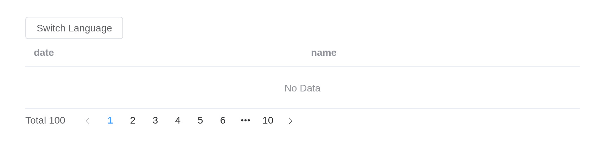
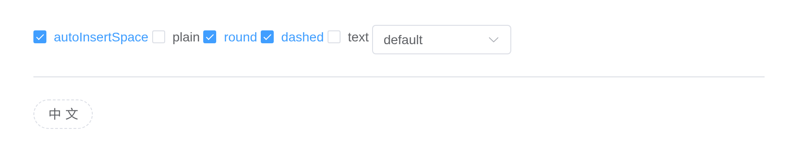
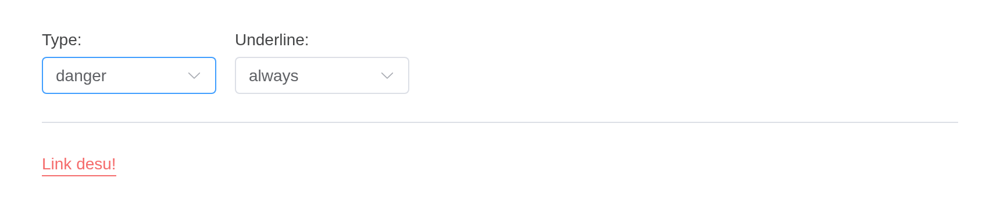
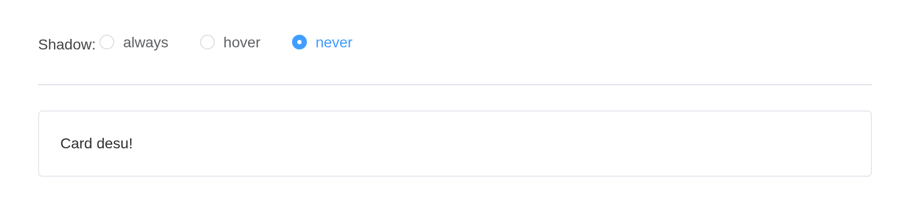
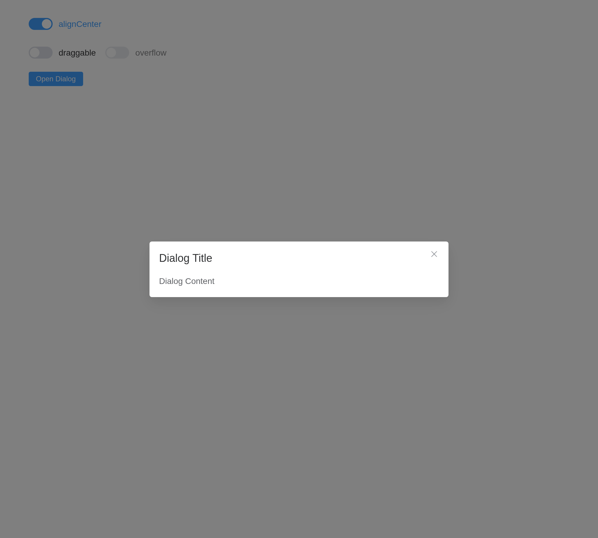
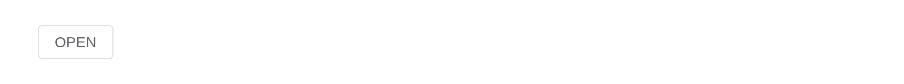
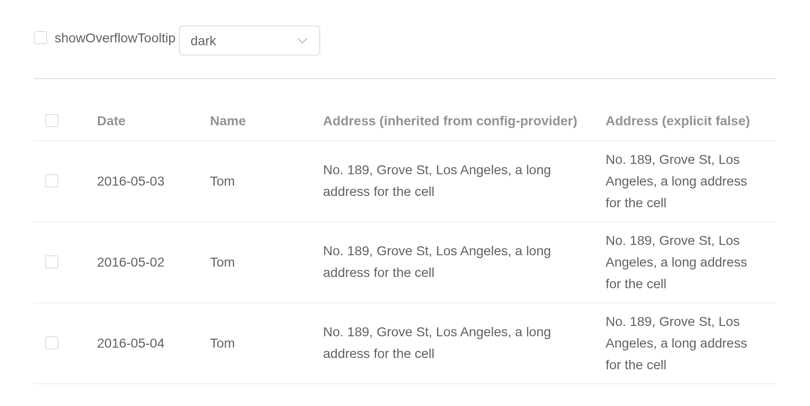

# Config Provider

Config Provider is used for providing global configurations, which
enables your entire application to access these configurations
everywhere.

## i18n Configurations

Configure i18n related properties via Config Provider, to get language
switching feature.

Use two attributes to provide i18n related config

The button switches the language of what is inside the provider, with
`update_el_config_provider(locale =)`: the table’s empty text, the
pagination’s words. The page’s own language is `el_page(locale =)`.

``` r

ui <- el_page(
  el_button("toggle", "Switch Language"),
  tags$br(),
  el_config_provider(
    id = "cfg",
    locale = "zh-cn",
    el_table(data = data.frame(date = character(), name = character())),
    el_pagination("cfg_pg", total = 100, layout = "total, prev, pager, next")
  )
)
server <- function(input, output, session) {
  language <- reactiveVal("zh-cn")
  observeEvent(input$toggle, {
    language(if (language() == "zh-cn") "en" else "zh-cn")
    update_el_config_provider(session, "cfg", locale = language())
  })
}
shinyApp(ui, server)
```



## Button Configurations

The checkboxes and the select change the provider’s `button` settings,
which the button inside takes as its defaults.

``` r

ui <- el_page(
  tags$div(
    el_checkbox("cfg_space", "autoInsertSpace", value = TRUE),
    el_checkbox("cfg_plain", "plain", value = TRUE),
    el_checkbox("cfg_round", "round", value = TRUE),
    el_checkbox("cfg_dashed", "dashed"),
    el_checkbox("cfg_text", "text"),
    el_select(
      "cfg_type",
      choices = c("primary", "success", "warning", "danger", "info", "default"),
      selected = "default",
      width = "150px"
    )
  ),
  el_divider(),
  el_config_provider(
    id = "cfg",
    button = list(
      autoInsertSpace = TRUE,
      type = "default",
      plain = TRUE,
      round = TRUE,
      text = FALSE,
      dashed = FALSE
    ),
    el_button("cfg_btn", "中文")
  )
)
server <- function(input, output, session) {
  observe({
    update_el_config_provider(
      session,
      "cfg",
      button = list(
        autoInsertSpace = isTRUE(input$cfg_space),
        type = input$cfg_type %||% "default",
        plain = isTRUE(input$cfg_plain),
        round = isTRUE(input$cfg_round),
        text = isTRUE(input$cfg_text),
        dashed = isTRUE(input$cfg_dashed)
      )
    )
  })
}
shinyApp(ui, server)
```



## Link Configurations

The selects change the provider’s `link` settings, which the link inside
takes as its defaults.

``` r

ui <- el_page(
  tags$div(
    style = "display: flex; gap: 16px",
    tags$div(
      style = "display: flex; flex-direction: column; gap: 4px; flex-basis: 150px",
      tags$span("Type:"),
      el_select(
        "cfg_type",
        choices = c(
          "primary",
          "success",
          "warning",
          "info",
          "danger",
          "default"
        ),
        selected = "success"
      )
    ),
    tags$div(
      style = "display: flex; flex-direction: column; gap: 4px; flex-basis: 150px",
      tags$span("Underline:"),
      el_select(
        "cfg_underline",
        choices = c("always", "never", "hover"),
        selected = "always"
      )
    )
  ),
  el_divider(),
  el_config_provider(
    id = "cfg",
    link = list(type = "success", underline = "always"),
    el_link("Link desu!", id = "cfg_link")
  )
)
server <- function(input, output, session) {
  observe({
    update_el_config_provider(
      session,
      "cfg",
      link = list(type = input$cfg_type, underline = input$cfg_underline)
    )
  })
}
shinyApp(ui, server)
```



## Card Configurations

The radios change the provider’s `card` settings, which a card inside
takes when it sets no `shadow` of its own.

``` r

ui <- el_page(
  "Shadow:",
  el_radio_group(
    "cfg_shadow",
    choices = c("always", "hover", "never"),
    value = "always"
  ),
  el_divider(),
  el_config_provider(
    id = "cfg",
    card = list(shadow = "always"),
    el_card("Card desu!")
  )
)
server <- function(input, output, session) {
  observeEvent(input$cfg_shadow, ignoreInit = TRUE, {
    update_el_config_provider(
      session,
      "cfg",
      card = list(shadow = input$cfg_shadow)
    )
  })
}
shinyApp(ui, server)
```



## Dialog Configurations

The switches change the provider’s `dialog` settings, which the dialog
inside takes as its defaults. Element’s `transition` setting is not
taken: the dialog is markup and plays Element’s own `dialog-fade`.

``` r

ui <- el_page(
  tags$div(
    style = "display: flex; flex-direction: column; gap: 16px",
    el_switch("cfg_align", active_text = "alignCenter"),
    tags$div(
      style = "display: flex; gap: 16px",
      el_switch("cfg_drag", active_text = "draggable"),
      el_switch("cfg_overflow", active_text = "overflow", disabled = TRUE)
    ),
    tags$div(
      el_button("cfg_open", "Open Dialog", type = "primary", size = "small")
    )
  ),
  el_config_provider(
    id = "cfg",
    dialog = list(alignCenter = FALSE, draggable = FALSE, overflow = FALSE),
    el_dialog(
      "cfg_dlg",
      title = "Dialog Title",
      destroy_on_close = TRUE,
      content = "Dialog Content"
    )
  )
)
server <- function(input, output, session) {
  observe({
    update_el_switch(
      session,
      "cfg_overflow",
      disabled = !isTRUE(input$cfg_drag)
    )
    update_el_config_provider(
      session,
      "cfg",
      dialog = list(
        alignCenter = isTRUE(input$cfg_align),
        draggable = isTRUE(input$cfg_drag),
        overflow = isTRUE(input$cfg_overflow)
      )
    )
  })
  observeEvent(
    input$cfg_open,
    update_el_dialog(session, "cfg_dlg", visible = TRUE)
  )
}
shinyApp(ui, server)
```



## Message Configurations

The provider’s `message` settings are Element Plus’s page-wide message
defaults, so they reach
[`el_message()`](https://kaipingyang.github.io/shiny.element/reference/el_message.md)
from the server: at most three at a time, plain, at the bottom.

``` r

ui <- el_page(
  el_config_provider(
    message = list(max = 3, plain = TRUE, placement = "bottom"),
    el_button("cfg_msg", "OPEN")
  )
)
server <- function(input, output, session) {
  observeEvent(input$cfg_msg, {
    el_message(session, "This is a message from bottom.")
  })
}
shinyApp(ui, server)
```



## Empty Values Configurations

Supported components list

- Cascader
- ColorPicker 2.10.3
- DatePicker
- Select
- SelectV2
- TimePicker
- TimeSelect
- TreeSelect

Set `empty-values` to support empty values of components. The fallback
value is `['', null, undefined]`. If you think the empty string is
meaningful, write `[undefined, null]`.

Set `value-on-clear` to set the return value when cleared. The fallback
value is `undefined`. In the date component is `null`. If you want to
set `undefined`, use `() => undefined`.

``` r

el_config_provider(
  value_on_clear = NULL,
  empty_values = list(NULL),
  el_select(
    "cfg_sel",
    choices = c("Option1", "Option2", "Option3"),
    clearable = TRUE,
    placeholder = "Select",
    width = "240px"
  )
)
```

## Table Configurations

The checkbox and the select change the provider’s `table` settings: a
column that sets no `show_overflow_tooltip` of its own takes them.

``` r

ui <- el_page(
  tags$div(
    el_checkbox("cfg_tip", "showOverflowTooltip", value = TRUE),
    el_select(
      "cfg_effect",
      choices = c(dark = "dark", light = "light"),
      selected = "dark",
      width = "150px"
    )
  ),
  el_divider(),
  el_config_provider(
    id = "cfg",
    table = list(showOverflowTooltip = TRUE, tooltipEffect = "dark"),
    el_table(
      data = data.frame(
        date = c("2016-05-03", "2016-05-02", "2016-05-04"),
        name = "Tom",
        address = "No. 189, Grove St, Los Angeles, a long address for the cell"
      ),
      selection = TRUE,
      columns = list(
        el_table_column("date", "Date", width = 120),
        el_table_column("name", "Name", width = 120),
        el_table_column(
          "address",
          "Address (inherited from config-provider)",
          width = 300
        ),
        el_table_column(
          "address",
          "Address (explicit false)",
          show_overflow_tooltip = FALSE
        )
      )
    )
  )
)
server <- function(input, output, session) {
  observe({
    update_el_config_provider(
      session,
      "cfg",
      table = list(
        showOverflowTooltip = isTRUE(input$cfg_tip),
        tooltipEffect = input$cfg_effect
      )
    )
  })
}
shinyApp(ui, server)
```



## Experimental features

In this section, you can learn how to use Config Provider to provide
experimental features. For now, we haven’t added any experimental
features, but in the feature roadmap, we will add some experimental
features. You can use this config to manage the features you want or
not.

## API

Element Plus’s tables, and beside each entry where it is in R.

### Config Provider Attributes

| Element | In R | Description | Type | Accepted | Default |
|----|----|----|----|----|----|
| `locale` | `el_page(locale =)` | Locale Object | [^1]`{name: string, el: TranslatePair}`[](https://github.com/element-plus/element-plus/blob/a98ff9b40c0c3d2b9959f99919bd8363e3e3c25a/packages/locale/index.ts#L5) [languages](https://github.com/element-plus/element-plus/tree/dev/packages/locale/lang) |  | [en](https://github.com/element-plus/element-plus/blob/dev/packages/locale/lang/en.ts) |
| `size` | `size` | global component size | [^2]`'large' \\| 'default' \\| 'small'` |  | default |
| `zIndex` | `el_page(z_index =)` | global Initial zIndex | [^3] |  | — |
| `namespace` | `(fixed:`el`)` | global component className prefix (cooperated with [\$namespace](https://github.com/element-plus/element-plus/blob/dev/packages/theme-chalk/src/mixins/config.scss#L1)) | [^4] |  | el |
| `button` | `button` | button related configuration, [see the following table](#button-attribute) | [^5]`{autoInsertSpace?: boolean, type?: string, plain?: boolean, text?: boolean, round?: boolean, dashed?: boolean}` |  | see the following table |
| `link` | `link` | link related configuration, [see the following table](#link-attribute) | [^6]`{type?: string, underline?: boolean \\| string}` |  | see the following table |
| `dialog` | `dialog` | dialog related configuration, [see the following table](#dialog-attribute) | [^7]`{alignCenter?: boolean, draggable?: boolean, overflow?: boolean, transition?: DialogTransition}` |  | see the following table |
| `message` | `message` | message related configuration, [see the following table](#message-attribute) | [^8]`{max?: number}` |  | see the following table |
| `experimental-features` | `experimental_features` | features at experimental stage to be added, all features are default to be set to false | [^9] |  | — |
| `empty-values` | `empty_values` | global empty values of components | [^10] |  | — |
| `value-on-clear` | `value_on_clear` | global clear return value | [^11] / [^12] / [^13] / [^14] |  | — |
| `table` | `table` | table related configuration, [see the following table](#table-attribute) | [^15]`{showOverflowTooltip?: boolean \\| object, tooltipEffect?: string, tooltipOptions?: object, tooltipFormatter?: Function}` |  | see the following table |

### Config Provider Slots

| Element   | In R            | Description               |
|-----------|-----------------|---------------------------|
| `default` | default content | customize default content |

[^1]: object

[^2]: enum

[^3]: number

[^4]: string

[^5]: object

[^6]: object

[^7]: object

[^8]: object

[^9]: object

[^10]: array

[^11]: string

[^12]: number

[^13]: boolean

[^14]: Function

[^15]: object
