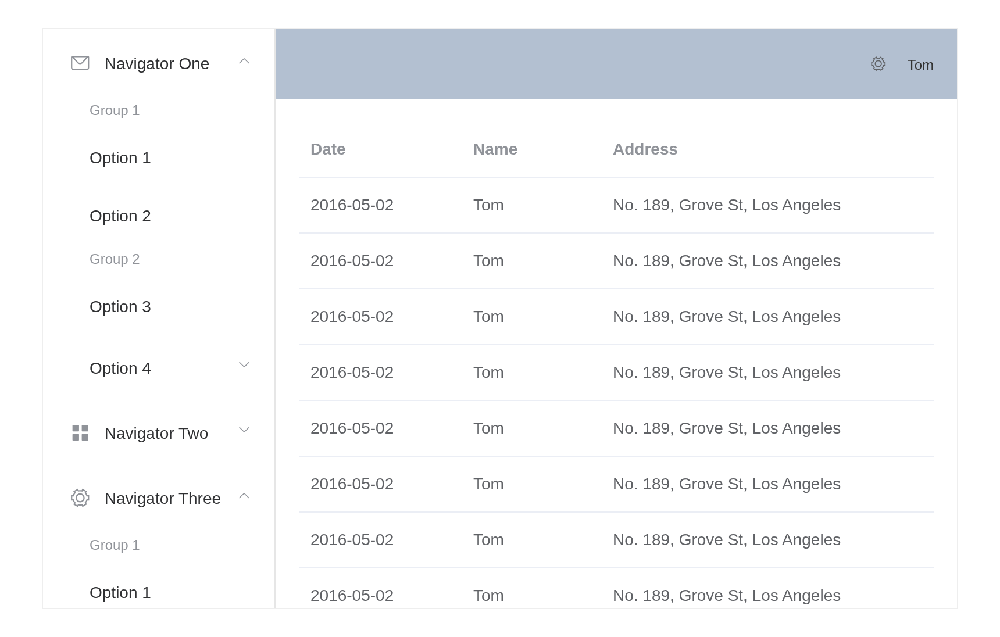

# Container

Container components for scaffolding the basic structure of the page:
[`el_container()`](https://kaipingyang.github.io/shiny.element/reference/el_container.md)
holds
[`el_header()`](https://kaipingyang.github.io/shiny.element/reference/el_header.md),
[`el_aside()`](https://kaipingyang.github.io/shiny.element/reference/el_aside.md),
[`el_main()`](https://kaipingyang.github.io/shiny.element/reference/el_main.md)
and
[`el_footer()`](https://kaipingyang.github.io/shiny.element/reference/el_footer.md).
A container holding a header or a footer lays its children out
vertically, otherwise horizontally.

## Common layouts

``` r

box <- function(f, ...) f(..., style = "background: #e9eef3; text-align: center; line-height: 60px")
hdr <- function(...) el_header(..., style = "background: #b3c0d1; text-align: center; line-height: 60px")
side <- function(...) el_aside(width = "200px", ..., style = "background: #d3dce6; text-align: center; line-height: 160px")
tagList(
  el_container(hdr("Header"), box(el_main, "Main")),
  tags$br(),
  el_container(hdr("Header"), box(el_main, "Main"),
               el_footer("Footer", style = "background: #b3c0d1; text-align: center; line-height: 60px")),
  tags$br(),
  el_container(side("Aside"), box(el_main, "Main")),
  tags$br(),
  el_container(hdr("Header"), el_container(side("Aside"), box(el_main, "Main")))
)
```

Header

Main

  

Header

Main

Footer

  

Aside

Main

  

Header

Aside

Main

## Example

A page frame with a menu down the side, a toolbar on top and a table in
the middle – the dashboard of the same name runs it whole.

``` r

# Element UI's own "Container" example, rebuilt in R: a side menu, a header
# with a dropdown, and a table in the main area.
#
#   shiny::runApp(system.file("examples/dashboards/admin-layout", package = "shiny.element"))

library(shiny)
library(shiny.element)

rows <- data.frame(
  date    = rep("2016-05-02", 20),
  name    = rep("Tom", 20),
  address = rep("No. 189, Grove St, Los Angeles", 20)
)

# One navigator: two titled groups and a nested submenu, as upstream has it
navigator <- function(i, icon, label) {
  sub <- function(n) paste0(i, "-", n)
  list(index = as.character(i), label = label, icon = icon, children = list(
    list(group = TRUE, title = "Group 1", children = list(
      list(index = sub(1), label = "Option 1"),
      list(index = sub(2), label = "Option 2"))),
    list(group = TRUE, title = "Group 2", children = list(
      list(index = sub(3), label = "Option 3"))),
    list(index = sub(4), label = "Option 4", children = list(
      list(index = sub("4-1"), label = "Option 4-1")))
  ))
}

ui <- el_page(
  el_container(
    style = "height: 500px; border: 1px solid #eee",
    el_aside(
      width = "200px", style = "background-color: rgb(238, 241, 246)",
      el_menu("nav", default_openeds = c("1", "3"), items = list(
        navigator(1, "el-icon-message", "Navigator One"),
        navigator(2, "el-icon-menu", "Navigator Two"),
        navigator(3, "el-icon-setting", "Navigator Three")
      ))
    ),
    el_container(
      el_header(
        style = "text-align: right; font-size: 12px; background-color: #B3C0D1;
                 color: #333; line-height: 60px",
        el_dropdown("account",
          trigger_label = tags$i(class = "el-icon-setting",
                                 style = "margin-right: 15px"),
          items = list(list(command = "view", label = "View"),
                       list(command = "add", label = "Add"),
                       list(command = "delete", label = "Delete"))),
        tags$span("Tom")
      ),
      el_main(
        el_table("people", data = rows, columns = list(
          list(prop = "date", label = "Date", width = "140"),
          list(prop = "name", label = "Name", width = "120"),
          list(prop = "address", label = "Address")
        ))
      )
    )
  )
)

server <- function(input, output, session) {
  observeEvent(input$nav, {
    el_message(session, paste("Navigated to", input$nav))
  })
  observeEvent(input$account, {
    el_message(session, paste("Account:", input$account), type = "info")
  })
}

shinyApp(ui, server)
```



## API

### Container Attributes

| Element | In R | Description | Type | Accepted | Default |
|----|----|----|----|----|----|
| `direction` | `el_container(direction =)` | layout direction for child elements | string | horizontal / vertical | vertical when nested with `el-header` or `el-footer`; horizontal otherwise |

### Header Attributes

| Element  | In R                  | Description          | Type   | Accepted | Default |
|----------|-----------------------|----------------------|--------|----------|---------|
| `height` | `el_header(height =)` | height of the header | string | —        | 60px    |

### Aside Attributes

| Element | In R                | Description               | Type   | Accepted | Default |
|---------|---------------------|---------------------------|--------|----------|---------|
| `width` | `el_aside(width =)` | width of the side section | string | —        | 300px   |

### Footer Attributes

| Element  | In R                  | Description          | Type   | Accepted | Default |
|----------|-----------------------|----------------------|--------|----------|---------|
| `height` | `el_header(height =)` | height of the footer | string | —        | 60px    |
