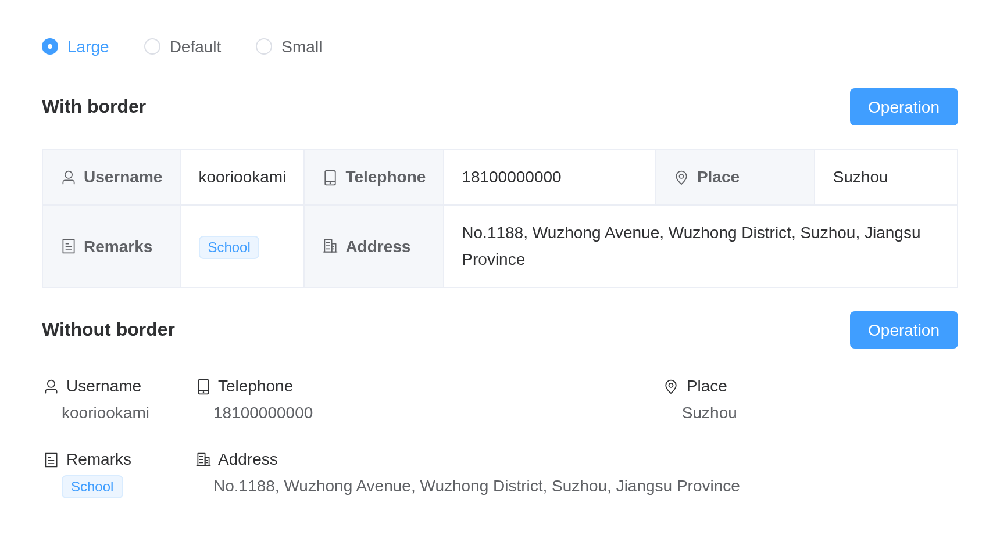

# Descriptions

Display multiple fields in list form.

## Basic usage

``` r

el_descriptions(
  "desc",
  title = "User Info",
  items = list(
    el_descriptions_item("Username", "kooriookami"),
    el_descriptions_item("Telephone", "18100000000"),
    el_descriptions_item("Place", "Suzhou"),
    el_descriptions_item(
      "Remarks",
      el_tag(label = "School", size = "small")
    ),
    el_descriptions_item(
      "Address",
      "No.1188, Wuzhong Avenue, Wuzhong District, Suzhou, Jiangsu Province"
    )
  )
)
```

## Sizes

The radios resize both lists with `update_el_descriptions(size =)`.

``` r

label <- function(icon, text) {
  tags$div(
    class = "cell-item",
    el_icon(icon, style = "margin-right: 6px"),
    text
  )
}
items <- function() {
  list(
    list(label = label("User", "Username"), content = "kooriookami"),
    list(label = label("Iphone", "Telephone"), content = "18100000000"),
    list(label = label("Location", "Place"), content = "Suzhou"),
    list(
      label = label("Tickets", "Remarks"),
      content = el_tag(label = "School", size = "small")
    ),
    list(
      label = label("OfficeBuilding", "Address"),
      content = "No.1188, Wuzhong Avenue, Wuzhong District, Suzhou, Jiangsu Province"
    )
  )
}
ui <- el_page(
  tags$style(
    ".el-descriptions { margin-top: 20px; }
     .cell-item { display: flex; align-items: center; }"
  ),
  el_radio_group(
    "desc_size",
    choices = c(Large = "large", Default = "default", Small = "small"),
    selected = "default"
  ),
  el_descriptions(
    "desc_border",
    title = "With border",
    column = 3,
    size = "default",
    border = TRUE,
    items = items(),
    slots = list(extra = el_button("desc_op1", "Operation", type = "primary"))
  ),
  el_descriptions(
    "desc_plain",
    title = "Without border",
    column = 3,
    size = "default",
    items = items(),
    slots = list(extra = el_button("desc_op2", "Operation", type = "primary"))
  )
)
server <- function(input, output, session) {
  observeEvent(input$desc_size, ignoreInit = TRUE, {
    for (id in c("desc_border", "desc_plain")) {
      update_el_descriptions(session, id, size = input$desc_size)
    }
  })
}
shinyApp(ui, server)
```



## Vertical List

The radios resize both lists with `update_el_descriptions(size =)`.

``` r

items <- function() {
  list(
    el_descriptions_item("Username", "kooriookami"),
    el_descriptions_item("Telephone", "18100000000"),
    el_descriptions_item("Place", "Suzhou", span = 2),
    el_descriptions_item("Remarks", el_tag(label = "School", size = "small")),
    el_descriptions_item(
      "Address",
      "No.1188, Wuzhong Avenue, Wuzhong District, Suzhou, Jiangsu Province"
    )
  )
}
ui <- el_page(
  el_radio_group(
    "desc_v_size",
    choices = c(Large = "large", Default = "default", Small = "small"),
    selected = "default"
  ),
  el_descriptions(
    "desc_v",
    title = "Vertical list with border",
    direction = "vertical",
    column = 4,
    size = "default",
    border = TRUE,
    items = items()
  ),
  tags$div(
    style = "margin-top: 28px",
    el_descriptions(
      "desc_v_plain",
      title = "Vertical list without border",
      direction = "vertical",
      column = 4,
      size = "default",
      items = items()
    )
  )
)
server <- function(input, output, session) {
  observeEvent(input$desc_v_size, ignoreInit = TRUE, {
    for (id in c("desc_v", "desc_v_plain")) {
      update_el_descriptions(session, id, size = input$desc_v_size)
    }
  })
}
shinyApp(ui, server)
```


## Rowspan

``` r

items <- function() {
  list(
    el_descriptions_item(
      "Photo",
      el_image(
        src = "https://cube.elemecdn.com/0/88/03b0d39583f48206768a7534e55bcpng.png",
        style = "width: 100px; height: 100px"
      ),
      rowspan = 2,
      width = 140,
      align = "center"
    ),
    el_descriptions_item("Username", "kooriookami"),
    el_descriptions_item("Telephone", "18100000000"),
    el_descriptions_item("Place", "Suzhou"),
    el_descriptions_item("Remarks", el_tag(label = "School", size = "small")),
    el_descriptions_item(
      "Address",
      "No.1188, Wuzhong Avenue, Wuzhong District, Suzhou, Jiangsu Province"
    )
  )
}
tagList(
  el_descriptions(
    "desc_rs",
    title = "Width horizontal list",
    border = TRUE,
    items = items()
  ),
  tags$div(
    style = "margin-top: 20px",
    el_descriptions(
      "desc_rs_v",
      title = "Width vertical list",
      direction = "vertical",
      border = TRUE,
      items = items()
    )
  )
)
```

## Customized Style

``` r

item <- function(label, content, ...) {
  el_descriptions_item(
    label,
    content,
    label_align = "right",
    align = "center",
    ...
  )
}
tagList(
  tags$style(
    ".my-label { background: var(--el-color-success-light-9) !important; }
     .my-content { background: var(--el-color-danger-light-9); }"
  ),
  el_descriptions(
    "desc_style",
    title = "Customized style list",
    column = 3,
    border = TRUE,
    items = list(
      item(
        "Username",
        "kooriookami",
        label_class_name = "my-label",
        class_name = "my-content",
        width = "150px"
      ),
      item("Telephone", "18100000000"),
      item("Place", "Suzhou"),
      item("Remarks", el_tag(label = "School", size = "small")),
      item(
        "Address",
        "No.1188, Wuzhong Avenue, Wuzhong District, Suzhou, Jiangsu Province"
      )
    )
  )
)
```

## API

Element Plus’s tables, and beside each entry where it is in R.

### Descriptions Attributes

| Element | In R | Description | Type | Accepted | Default |
|----|----|----|----|----|----|
| `border` | `border` | with or without border | [^1] |  | false |
| `column` | `column` | numbers of `Descriptions Item` in one line | [^2] |  | 3 |
| `direction` | `direction` | direction of list | [^3]`'vertical' \\| 'horizontal'` |  | horizontal |
| `size` | `size` | size of list | [^4]`'' \\| 'large' \\| 'default' \\| 'small'` |  | — |
| `title` | `title` | title text, display on the top left | [^5] |  | ’’ |
| `extra` | `extra` | extra text, display on the top right | [^6] |  | ’’ |
| `label-width` | `label_width` | label width of every column | [^7] / [^8] |  | — |

### Descriptions Slots

| Element | In R | Description |
|----|----|----|
| `default` | default content | customize default content |
| `title` | `slots = list(title = )` | custom title, display on the top left |
| `extra` | `slots = list(extra = )` | custom extra area, display on the top right |

### DescriptionsItem Attributes

| Element | In R | Description | Type | Accepted | Default |
|----|----|----|----|----|----|
| `label` | `el_descriptions_item(label =)` | label text | [^9] |  | ’’ |
| `span` | `el_descriptions_item(span =)` | colspan of column | [^10] |  | 1 |
| `rowspan` | `el_descriptions_item(rowspan =)` | the number of rows a cell should span | [^11] |  | 1 |
| `width` | `el_descriptions_item(width =)` | column width, the width of the same column in different rows is set by the max value (If no `border`, width contains label and content) | [^12] / [^13] |  | ’’ |
| `min-width` | `el_descriptions_item(min_width =)` | column minimum width, columns with `width` has a fixed width, while columns with `min-width` has a width that is distributed in proportion (If no`border`, width contains label and content) | [^14] / [^15] |  | ’’ |
| `label-width` | `el_descriptions_item(label_width =)` | column label width, if not set, it will be the same as the width of the column. Higher priority than the `label-width` of `Descriptions` | [^16] / [^17] |  | — |
| `align` | `el_descriptions_item(align =)` | column content alignment (If no `border`, effective for both label and content) | [^18]`'left' \\| 'center' \\| 'right'` |  | left |
| `label-align` | `el_descriptions_item(label_align =)` | column label alignment, if omitted, the value of the above `align` attribute will be applied (If no `border`, please use `align` attribute) | [^19]`'left' \\| 'center' \\| 'right'` |  | — |
| `class-name` | `el_descriptions_item(class_name =)` | column content custom class name | [^20] |  | ’’ |
| `label-class-name` | `el_descriptions_item(label_class_name =)` | column label custom class name | [^21] |  | ’’ |

### DescriptionsItem Slots

| Element   | In R                     | Description               |
|-----------|--------------------------|---------------------------|
| `default` | default content          | customize default content |
| `label`   | `slots = list(label = )` | custom label              |

[^1]: boolean

[^2]: number

[^3]: enum

[^4]: enum

[^5]: string

[^6]: string

[^7]: string

[^8]: number

[^9]: string

[^10]: number

[^11]: number

[^12]: string

[^13]: number

[^14]: string

[^15]: number

[^16]: string

[^17]: number

[^18]: enum

[^19]: enum

[^20]: string

[^21]: string
