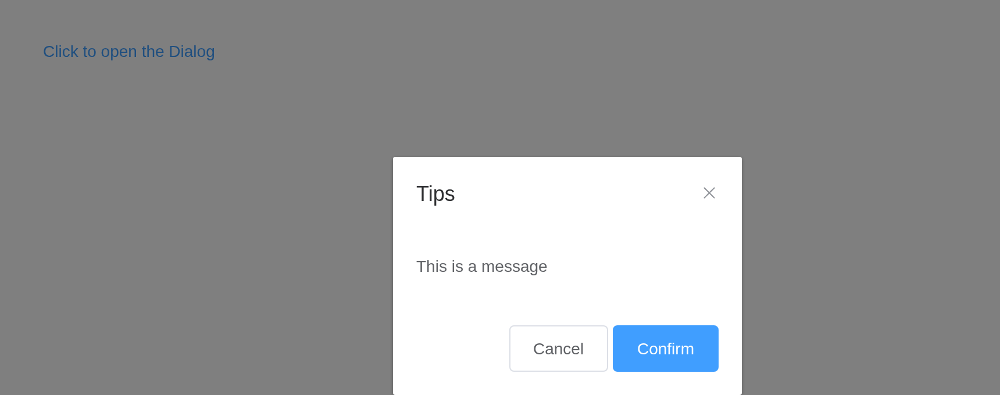
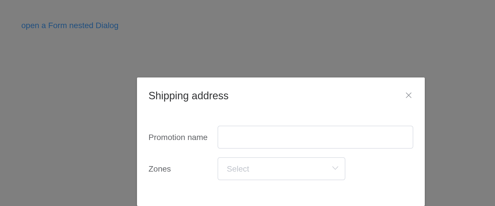
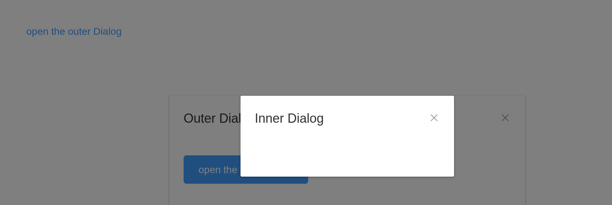
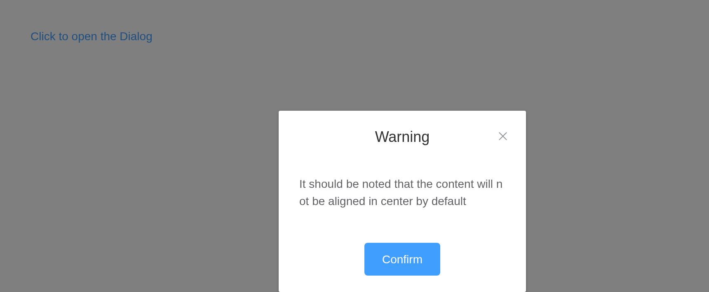

# Dialog

Informs users while preserving the current page state. `input$<id>` is
whether it is open, closing by the cross or the backdrop included;
`update_el_dialog(visible =)` opens and closes it. The content holds any
Shiny UI, components included.

## Basic usage

`before_close`, a
[`JS()`](https://kaipingyang.github.io/shiny.element/reference/JS.md)
function, may hold the close back.

``` r

ui <- el_page(
  el_button("open", "Click to open the Dialog", type = "text"),
  el_dialog("tips", title = "Tips", width = "30%", content = tags$span("This is a message"),
    footer = tagList(el_button("cancel", "Cancel"), el_button("confirm", "Confirm", type = "primary"))))

server <- function(input, output, session) {
  observeEvent(input$open, update_el_dialog(id = "tips", visible = TRUE))
  observeEvent(c(input$cancel, input$confirm), update_el_dialog(id = "tips", visible = FALSE),
               ignoreInit = TRUE)
}

shinyApp(ui, server)
```



## Customizations

The content may be a table, a form – anything.

``` r

ui <- el_page(
  el_button("open", "open a Form nested Dialog", type = "text"),
  el_dialog("shipping", title = "Shipping address", content = tagList(
    el_input("name", label = "Promotion name", label_position = "left", label_width = "120px"),
    el_select("zone", choices = c("Zone No.1" = "shanghai", "Zone No.2" = "beijing"),
              label = "Zones", label_position = "left", label_width = "120px"))))

server <- function(input, output, session) {
  observeEvent(input$open, update_el_dialog(id = "shipping", visible = TRUE))
}

shinyApp(ui, server)
```



## Nested dialog

The inner one with `append_to_body = TRUE`; both stack through Element’s
popup manager.

``` r

ui <- el_page(
  el_button("open", "open the outer Dialog", type = "text"),
  el_dialog("outer", title = "Outer Dialog", content = tagList(
    el_dialog("inner", title = "Inner Dialog", width = "30%", append_to_body = TRUE),
    el_button("inner_open", "open the inner Dialog", type = "primary"))))

server <- function(input, output, session) {
  observeEvent(input$open, update_el_dialog(id = "outer", visible = TRUE))
  observeEvent(input$inner_open, update_el_dialog(id = "inner", visible = TRUE))
}

shinyApp(ui, server)
```



## Centered content

``` r

ui <- el_page(
  el_button("open", "Click to open the Dialog", type = "text"),
  el_dialog("warn", title = "Warning", width = "30%", center = TRUE,
    content = tags$span("It should be noted that the content will not be aligned in center by default"),
    footer = el_button("ok", "Confirm", type = "primary")))

server <- function(input, output, session) {
  observeEvent(input$open, update_el_dialog(id = "warn", visible = TRUE))
  observeEvent(input$ok, update_el_dialog(id = "warn", visible = FALSE))
}

shinyApp(ui, server)
```



## API

### Attributes

| Element | In R | Description | Type | Accepted | Default |
|----|----|----|----|----|----|
| `visible` | `visible` | visibility of Dialog, supports the .sync modifier | boolean | — | false |
| `title` | `title` | title of Dialog. Can also be passed with a named slot (see the following table) | string | — | — |
| `width` | `width` | width of Dialog | string | — | 50% |
| `fullscreen` | `fullscreen` | whether the Dialog takes up full screen | boolean | — | false |
| `top` | `top` | value for `margin-top` of Dialog CSS | string | — | 15vh |
| `modal` | `modal` | whether a mask is displayed | boolean | — | true |
| `modal-append-to-body` | `modal_append_to_body` | whether to append modal to body element. If false, the modal will be appended to Dialog’s parent element | boolean | — | true |
| `append-to-body` | `append_to_body` | whether to append Dialog itself to body. A nested Dialog should have this attribute set to `true` | boolean | — | false |
| `lock-scroll` | `lock_scroll` | whether scroll of body is disabled while Dialog is displayed | boolean | — | true |
| `custom-class` | `custom_class` | custom class names for Dialog | string | — | — |
| `close-on-click-modal` | `close_on_click_modal` | whether the Dialog can be closed by clicking the mask | boolean | — | true |
| `close-on-press-escape` | `close_on_press_escape` | whether the Dialog can be closed by pressing ESC | boolean | — | true |
| `show-close` | `show_close` | whether to show a close button | boolean | — | true |
| `before-close` | `before_close` | callback before Dialog closes, and it will prevent Dialog from closing | function(done)，done is used to close the Dialog | — | — |
| `center` | `center` | whether to align the header and footer in center | boolean | — | false |
| `destroy-on-close` | `destroy_on_close` | Destroy elements in Dialog when closed | boolean | — | false |

### Slot

| Element  | In R                      | Description                  |
|----------|---------------------------|------------------------------|
| `title`  | `slots = list(title = )`  | content of the Dialog title  |
| `footer` | `slots = list(footer = )` | content of the Dialog footer |

### Events

| Element | In R | Description |
|----|----|----|
| `open` | `input$<id>_open` | triggers when the Dialog opens |
| `opened` | `input$<id>_opened` | triggers when the Dialog opening animation ends |
| `close` | `input$<id>_close` | triggers when the Dialog closes |
| `closed` | `input$<id>_closed` | triggers when the Dialog closing animation ends |
