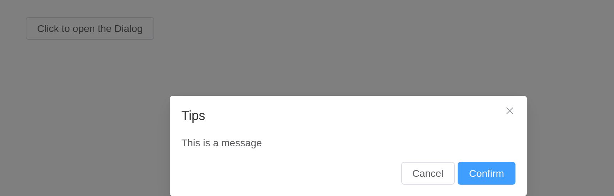
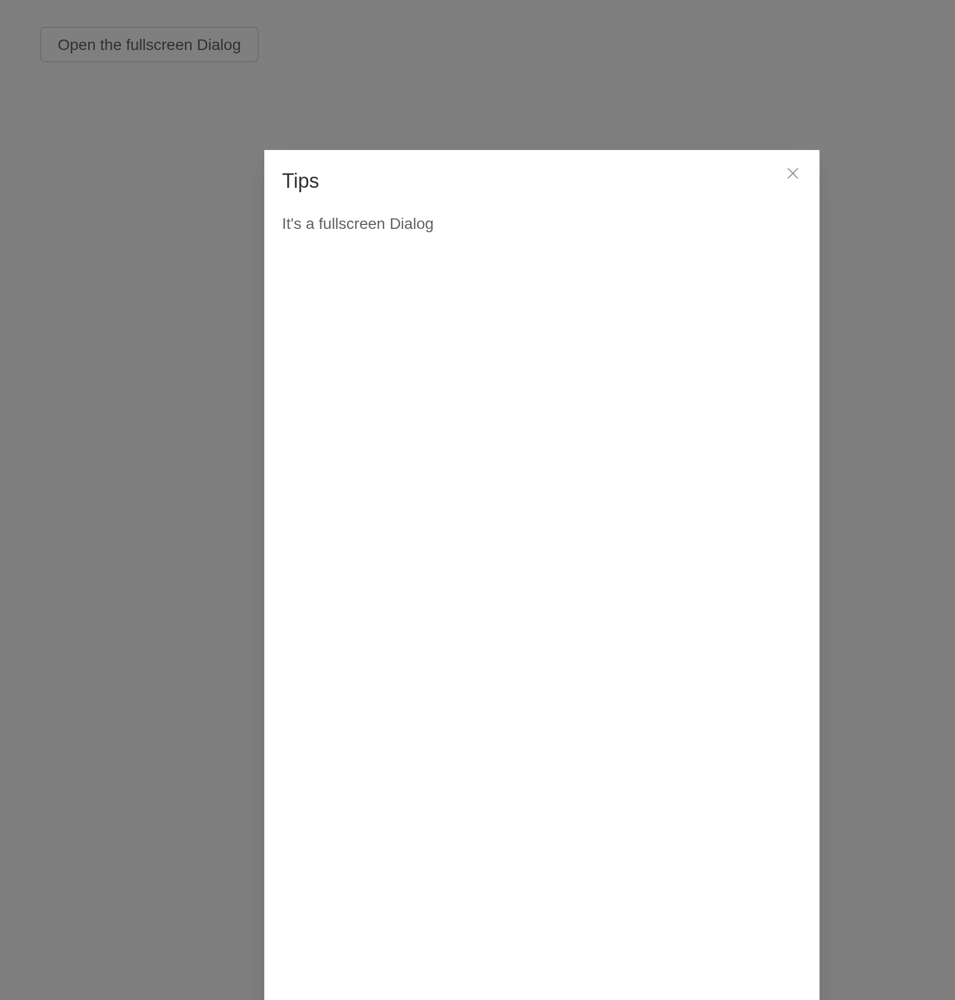
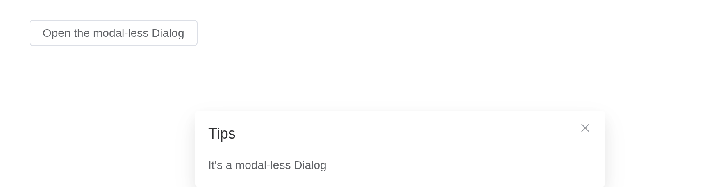
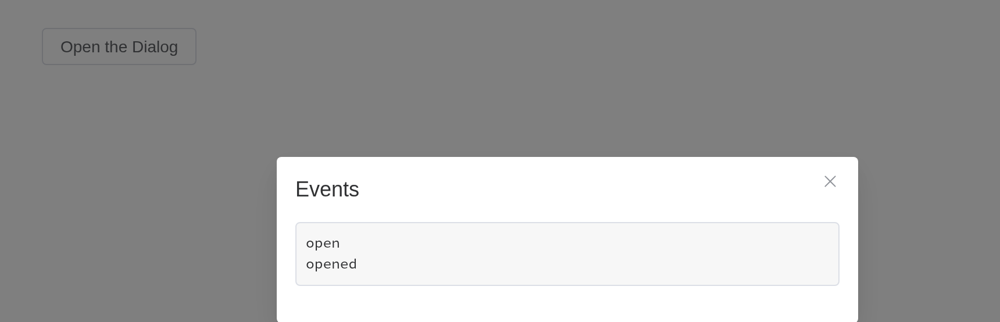

# Dialog

Informs users while preserving the current page state.

## Basic usage

Dialog pops up a dialog box, and it’s quite customizable.

Set `model-value / v-model` attribute with a `Boolean`, and Dialog shows
when it is `true`. The Dialog has two parts: `body` and `footer`, and
the latter requires a `slot` named `footer`. The optional `title`
attribute (empty by default) is for defining a title. Finally, this
example demonstrates how `before-close` is used.

A dialog opens from the server, `update_el_dialog(visible = TRUE)`;
`input$<id>` is whether it is open. `before_close`, a
[`JS()`](https://kaipingyang.github.io/shiny.element/reference/JS.md)
function, may hold the close back.

``` r

ui <- el_page(
  el_button("open", "Click to open the Dialog", plain = TRUE),
  el_dialog(
    "tips",
    title = "Tips",
    width = "500px",
    content = tags$span("This is a message"),
    before_close = JS(
      "function(done) { if (confirm('Are you sure to close this dialog?')) done(); }"
    ),
    footer = tagList(
      el_button("cancel", "Cancel"),
      el_button("confirm", "Confirm", type = "primary")
    )
  )
)
server <- function(input, output, session) {
  observeEvent(input$open, update_el_dialog(id = "tips", visible = TRUE))
  observeEvent(
    c(input$cancel, input$confirm),
    update_el_dialog(id = "tips", visible = FALSE),
    ignoreInit = TRUE
  )
}
shinyApp(ui, server)
```



> **Tip**
>
> `before-close` only works when user clicks the close icon or the
> backdrop. If you have buttons that close the Dialog in the `footer`
> named slot, you can add what you would do with `before-close` in the
> buttons’ click event handler.

## Customized Content

The content of Dialog can be anything, even a table or a form. This
example shows how to use Element Plus Table and Form with Dialog.

``` r

ui <- el_page(
  el_button("open", "Open a Form nested Dialog", plain = TRUE),
  el_dialog(
    "shipping",
    title = "Shipping address",
    width = "500px",
    content = tagList(
      el_input(
        "name",
        label = "Promotion name",
        label_position = "left",
        label_width = "140px"
      ),
      el_select(
        "zone",
        choices = c("Zone No.1" = "shanghai", "Zone No.2" = "beijing"),
        placeholder = "Please select a zone",
        label = "Zones",
        label_position = "left",
        label_width = "140px"
      )
    ),
    footer = tagList(
      el_button("cancel", "Cancel"),
      el_button("confirm", "Confirm", type = "primary")
    )
  )
)
server <- function(input, output, session) {
  observeEvent(input$open, update_el_dialog(id = "shipping", visible = TRUE))
}
shinyApp(ui, server)
```


## Customized Header

The `header` slot can be used to customize the area where the title is
displayed. In order to maintain accessibility, use the `title` attribute
in addition to using this slot, or use the `titleId` slot property to
specify which element should be read out as the dialog title.

The title takes markup: a header of your own.

``` r

ui <- el_page(
  el_button("open", "Open Dialog with customized header", plain = TRUE),
  el_dialog(
    "custom",
    show_close = FALSE,
    width = "500px",
    title = tags$div(
      style = "display: flex; justify-content: space-between; align-items: center",
      tags$h4("This is a custom header!"),
      el_button("close", "Close", type = "danger", icon = "CircleCloseFilled")
    ),
    content = "This is dialog content."
  )
)
server <- function(input, output, session) {
  observeEvent(input$open, update_el_dialog(id = "custom", visible = TRUE))
  observeEvent(input$close, update_el_dialog(id = "custom", visible = FALSE))
}
shinyApp(ui, server)
```


## Nested Dialog

If a Dialog is nested in another Dialog, `append-to-body` is required.

Normally we do not recommend using nested Dialog. If you need multiple
Dialogs rendered on the page, you can simply flat them so that they’re
siblings to each other. If you must nest a Dialog inside another Dialog,
set `append-to-body` of the nested Dialog to true, and it will append to
body instead of its parent node, so both Dialogs can be correctly
rendered.

``` r

ui <- el_page(
  el_button("open", "Open the outer Dialog", plain = TRUE),
  el_dialog(
    "outer",
    title = "Outer Dialog",
    width = "800px",
    content = tagList(
      tags$span("This is the outer Dialog"),
      el_dialog(
        "inner",
        title = "Inner Dialog",
        width = "500px",
        append_to_body = TRUE,
        content = "This is the inner Dialog"
      )
    ),
    footer = el_button("inner_open", "Open the inner Dialog", type = "primary")
  )
)
server <- function(input, output, session) {
  observeEvent(input$open, update_el_dialog(id = "outer", visible = TRUE))
  observeEvent(input$inner_open, update_el_dialog(id = "inner", visible = TRUE))
}
shinyApp(ui, server)
```


## Centered content

Dialog’s content can be centered.

Setting `center` to `true` will center dialog’s header and footer
horizontally. `center` only affects Dialog’s header and footer. The body
of Dialog can be anything, so sometimes it may not look good when
centered. You need to write some CSS if you wish to center the body as
well.

``` r

ui <- el_page(
  el_button("open", "Click to open the Dialog", plain = TRUE),
  el_dialog(
    "warn",
    title = "Warning",
    width = "500px",
    center = TRUE,
    content = "It should be noted that the content will not be aligned in center by default",
    footer = tagList(
      el_button("cancel", "Cancel"),
      el_button("confirm", "Confirm", type = "primary")
    )
  )
)
server <- function(input, output, session) {
  observeEvent(input$open, update_el_dialog(id = "warn", visible = TRUE))
}
shinyApp(ui, server)
```


> **Tip**
>
> The content of Dialog is lazily rendered, which means the default slot
> is not rendered onto the DOM until it is firstly opened. Therefore, if
> you need to perform a DOM manipulation or access a component using
> `ref`, do it in the `open` event callback.

## Align Center dialog

Open dialog from the center of the screen.

Setting `align-center` to `true` will center the dialog both
horizontally and vertically. The prop `top` will not work at the same
time because the dialog is vertically centered in a flexbox.

``` r

ui <- el_page(
  el_button("open", "Click to open the Dialog", plain = TRUE),
  el_dialog(
    "warn",
    title = "Warning",
    width = "500px",
    align_center = TRUE,
    content = "Open the dialog from the center from the screen",
    footer = tagList(
      el_button("cancel", "Cancel"),
      el_button("confirm", "Confirm", type = "primary")
    )
  )
)
server <- function(input, output, session) {
  observeEvent(input$open, update_el_dialog(id = "warn", visible = TRUE))
}
shinyApp(ui, server)
```


## Destroy on Close

When this is feature is enabled, the content under default slot will be
destroyed with a `v-if` directive. Enable this when you have perf
concerns.

Note that by enabling this feature, the content will not be rendered
before `transition.beforeEnter` dispatched, there will only be `overlay`
`header(if any)` `footer(if any)`.

Its content made again each time it opens: inputs inside start fresh.

``` r

ui <- el_page(
  el_button("open", "Click to open Dialog", plain = TRUE),
  el_dialog(
    "notice",
    title = "Notice",
    width = "500px",
    destroy_on_close = TRUE,
    center = TRUE,
    content = tagList(
      tags$p(
        "Notice: before dialog gets opened for the first time this node and the one below will not be rendered"
      ),
      el_input("note", placeholder = "starts empty each time")
    )
  )
)
server <- function(input, output, session) {
  observeEvent(input$open, update_el_dialog(id = "notice", visible = TRUE))
}
shinyApp(ui, server)
```


## Draggable Dialog

Try to drag the `header` part.

Set `draggable` to `true` to drag. Set `overflow` 2.5.4 to `true` can
drag overflow the viewport.

``` r

ui <- el_page(
  el_button("open", "Click to open Dialog", plain = TRUE),
  el_dialog(
    "drag",
    title = "Tips",
    width = "500px",
    draggable = TRUE,
    content = "It's a draggable Dialog"
  )
)
server <- function(input, output, session) {
  observeEvent(input$open, update_el_dialog(id = "drag", visible = TRUE))
}
shinyApp(ui, server)
```


> **Tip**
>
> When using `modal` = false, please make sure that `append-to-body` was
> set to **true**, because `Dialog` was positioned by
> `position: relative`, when `modal` gets removed, `Dialog` will
> position itself based on the current position in the DOM, instead of
> `Document.Body`, thus the style will be messed up.

## Fullscreen

Set the `fullscreen` attribute to open fullscreen dialog.

``` r

ui <- el_page(
  el_button("open", "Open the fullscreen Dialog", plain = TRUE),
  el_dialog(
    "full",
    title = "Tips",
    fullscreen = TRUE,
    content = "It's a fullscreen Dialog"
  )
)
server <- function(input, output, session) {
  observeEvent(input$open, update_el_dialog(id = "full", visible = TRUE))
}
shinyApp(ui, server)
```



> **Tip**
>
> If `fullscreen` is true, `width` `top` `draggable` attributes don’t
> work.

## Modal

Setting `modal` to `false` will hide modal (overlay) of dialog.

Starting from version 2.10.5, `modal-penetrable` attribute is added,
which can be penetrable.

Without a backdrop the page beneath stays in view, and with
`modal_penetrable` it can be used too.

``` r

ui <- el_page(
  el_button("open", "Open the modal-less Dialog", plain = TRUE),
  el_dialog(
    "nomodal",
    title = "Tips",
    width = "500px",
    modal = FALSE,
    modal_penetrable = TRUE,
    content = "It's a modal-less Dialog"
  )
)
server <- function(input, output, session) {
  observeEvent(input$open, update_el_dialog(id = "nomodal", visible = TRUE))
}
shinyApp(ui, server)
```



## Custom Animation

Customize dialog animation through the `transition` attribute, which
accepts either:

- ​Transition name​​ (string)

- ​​Vue transition configuration​​ (object)

Examples include scale, slide, fade, bounce animations and object-based
configurations with custom event handlers.

`transition` names a CSS animation of your own, as Element Plus’s does.

``` r

ui <- el_page(
  tags$style(".dialog-bounce-enter-active { animation: dialog-fade-in .5s; }"),
  el_button("open", "Open the Dialog", plain = TRUE),
  el_dialog(
    "anim",
    title = "Custom animation",
    width = "500px",
    transition = "dialog-bounce",
    content = "This dialog plays an animation of its own."
  )
)
server <- function(input, output, session) {
  observeEvent(input$open, update_el_dialog(id = "anim", visible = TRUE))
}
shinyApp(ui, server)
```


> **Tip**
>
> Animation classes are dynamically generated based on the transition
> name. For granular control over animation behavior, you may explicitly
> define these classes. Refer to
> [custom-transition-classes](https://vuejs.org/guide/built-ins/transition.html#custom-transition-classes)
> for details.

## Events

Open developer console (ctrl + shift + J), to see order of events.

Every event is an input: `input$<id>_open`, `_opened`, `_close`,
`_closed`, `_open_auto_focus` and `_close_auto_focus`.

``` r

ui <- el_page(
  el_button("open", "Open the Dialog", plain = TRUE),
  el_dialog(
    "ev",
    title = "Events",
    width = "500px",
    content = verbatimTextOutput("log")
  )
)
server <- function(input, output, session) {
  seen <- reactiveVal(character())
  for (e in c("open", "opened", "close", "closed")) {
    local({
      e <- e
      observeEvent(input[[paste0("ev_", e)]], seen(c(seen(), e)))
    })
  }
  output$log <- renderText(paste(seen(), collapse = "\n"))
  observeEvent(input$open, update_el_dialog(id = "ev", visible = TRUE))
}
shinyApp(ui, server)
```



## API

Element Plus’s tables, and beside each entry where it is in R.

### Attributes

| Element | In R | Description | Type | Accepted | Default |
|----|----|----|----|----|----|
| `model-value` | `visible`; `input$<id>` | visibility of Dialog | [^1] |  | false |
| `title` | `title` | title of Dialog. Can also be passed with a named slot (see the following table) | [^2] |  | ’’ |
| `width` | `width` | width of Dialog, default is 50% | [^3] / [^4] |  | ’’ |
| `fullscreen` | `fullscreen` | whether the Dialog takes up full screen | [^5] |  | false |
| `top` | `top` | value for `margin-top` of Dialog CSS, default is 15vh | [^6] |  | ’’ |
| `modal` | `modal` | whether a mask is displayed | [^7] |  | true |
| `modal-penetrable` | `modal_penetrable` | whether the mask is penetrable. The modal attribute must be `false`. | [^8] |  | false |
| `modal-class` | `modal_class` | custom class names for mask | [^9] |  | — |
| `header-class` | `header_class` | custom class names for header wrapper | [^10] |  | — |
| `body-class` | `body_class` | custom class names for body wrapper | [^11] |  | — |
| `footer-class` | `footer_class` | custom class names for footer wrapper | [^12] |  | — |
| `append-to-body` | `append_to_body` | whether to append Dialog itself to body. A nested Dialog should have this attribute set to `true` | [^13] |  | false |
| `append-to` | `append_to` | which element the Dialog appends to. Will override `append-to-body` | [^14] / [^15] |  | body |
| `lock-scroll` | `lock_scroll` | whether scroll of body is disabled while Dialog is displayed | [^16] |  | true |
| `open-delay` | `open_delay` | the Time(milliseconds) before open | [^17] |  | 0 |
| `close-delay` | `close_delay` | the Time(milliseconds) before close | [^18] |  | 0 |
| `close-on-click-modal` | `close_on_click_modal` | whether the Dialog can be closed by clicking the mask | [^19] |  | true |
| `close-on-press-escape` | `close_on_press_escape` | whether the Dialog can be closed by pressing ESC | [^20] |  | true |
| `show-close` | `show_close` | whether to show a close button | [^21] |  | true |
| `before-close` | `before_close` | callback before Dialog closes, and it will prevent Dialog from closing, use done to close the dialog | [^22]`(done: DoneFn) => void` |  | — |
| `draggable` | `draggable` | enable dragging feature for Dialog | [^23] |  | false |
| `overflow` | `overflow` | draggable Dialog can overflow the viewport | [^24] |  | false |
| `center` | `center` | whether to align the header and footer in center | [^25] |  | false |
| `align-center` | `align_center` | whether to align the dialog both horizontally and vertically | [^26] |  | false |
| `destroy-on-close` | `destroy_on_close` | destroy elements in Dialog when closed | [^27] |  | false |
| `close-icon` | `close_icon` | custom close icon, default is Close | [^28] / [^29] |  | — |
| `z-index` | `z_index` | same as z-index in native CSS, z-order of dialog | [^30] |  | — |
| `header-aria-level` | `header_aria_level` | header’s `aria-level` attribute | [^31] |  | 2 |
| `transition` | `transition` | custom transition configuration for dialog animation. Can be a string (transition name) or an object with Vue transition props | [^32] / [^33]`TransitionProps` |  | dialog-fade |
| `custom-class` | `custom_class` | custom class names for Dialog | [^34] |  | ’’ |

### Slots

| Element | In R | Description |
|----|----|----|
| `default` | default content | default content of Dialog |
| `header` | `slots = list(header = )` | content of the Dialog header; Replacing this removes the title, but does not remove the close button. |
| `footer` | `slots = list(footer = )` | content of the Dialog footer |
| `title` | `slots = list(title = )` | works the same as the header slot. Use that instead. |

### Events

| Element | In R | Description |
|----|----|----|
| `open` | `input$<id>_open` | triggers when the Dialog opens |
| `opened` | `input$<id>_opened` | triggers when the Dialog opening animation ends |
| `close` | `input$<id>_close` | triggers when the Dialog closes |
| `closed` | `input$<id>_closed` | triggers when the Dialog closing animation ends |
| `open-auto-focus` | `input$<id>_open_auto_focus` | triggers after Dialog opens and content focused |
| `close-auto-focus` | `input$<id>_close_auto_focus` | triggers after Dialog closed and content focused |

### Exposes

| Element         | In R                                    | Description    |
|-----------------|-----------------------------------------|----------------|
| `resetPosition` | `call_el(session, id, "resetPosition")` | reset position |
| `handleClose`   | `call_el(session, id, "handleClose")`   | close dialog   |

[^1]: boolean

[^2]: string

[^3]: string

[^4]: number

[^5]: boolean

[^6]: string

[^7]: boolean

[^8]: boolean

[^9]: string

[^10]: string

[^11]: string

[^12]: string

[^13]: boolean

[^14]: CSSSelector

[^15]: HTMLElement

[^16]: boolean

[^17]: number

[^18]: number

[^19]: boolean

[^20]: boolean

[^21]: boolean

[^22]: Function

[^23]: boolean

[^24]: boolean

[^25]: boolean

[^26]: boolean

[^27]: boolean

[^28]: string

[^29]: Component

[^30]: number

[^31]: string

[^32]: string

[^33]: object

[^34]: string
