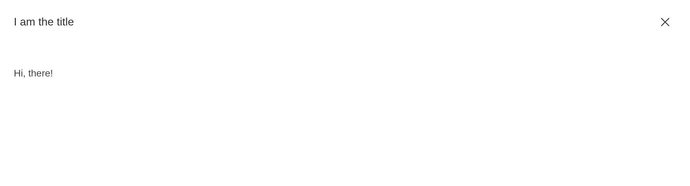
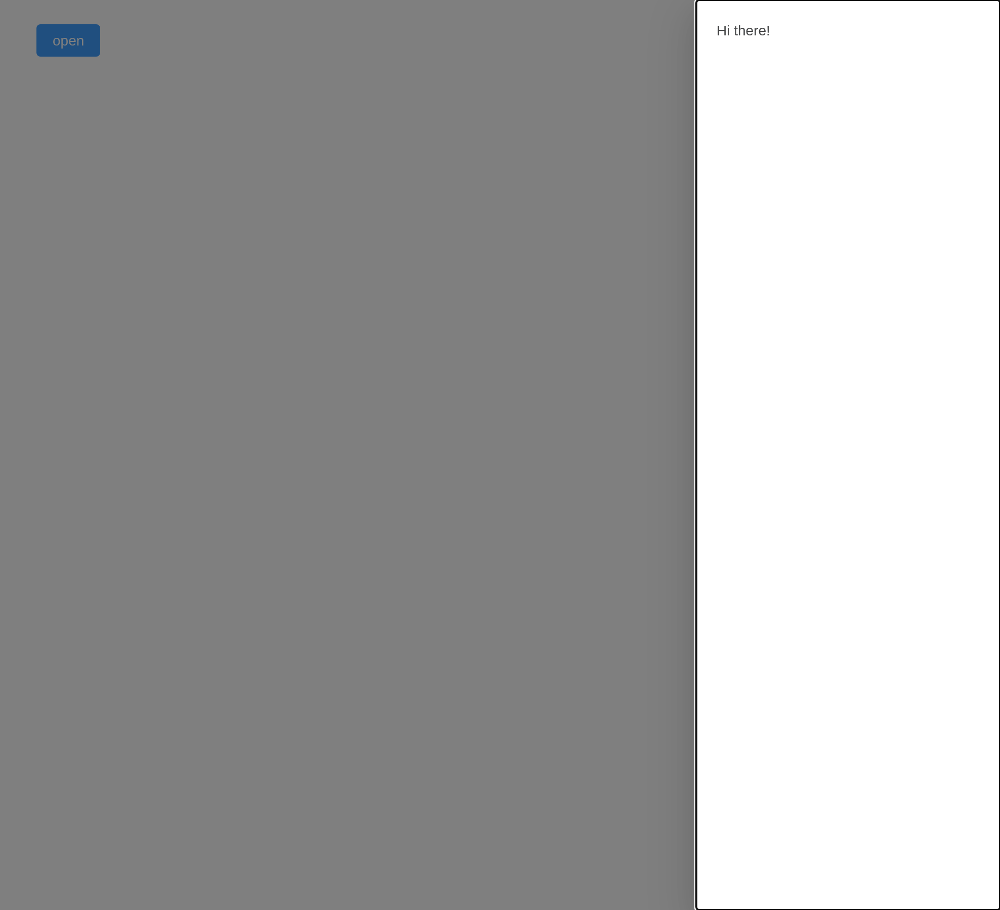
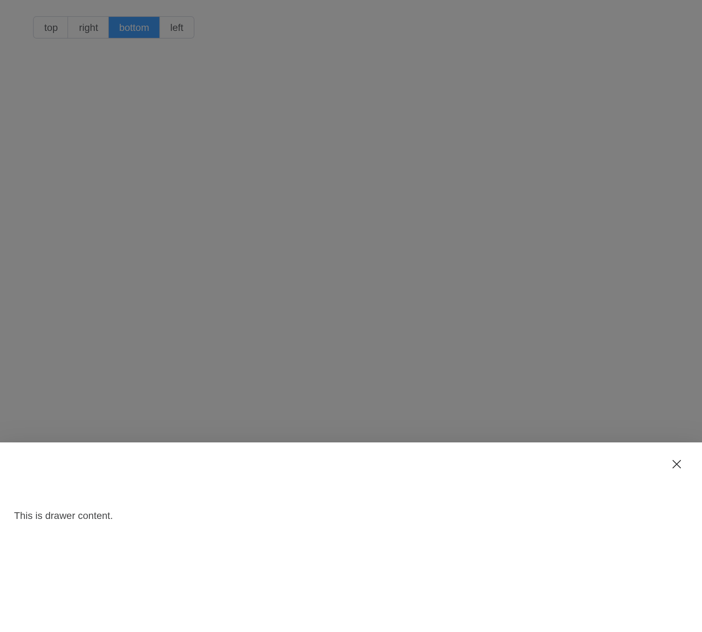
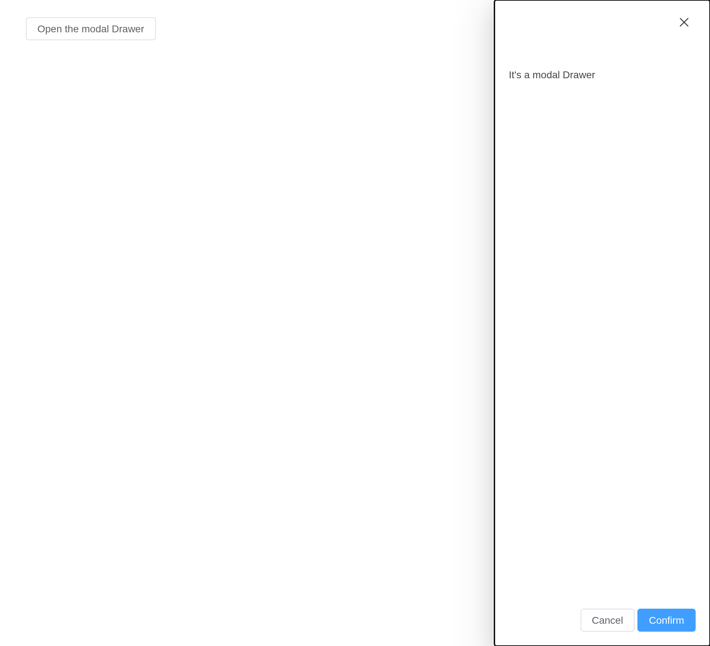

# Drawer

Sometimes, `Dialog` does not always satisfy our requirements, let’s say
you have a massive form, or you need space to display something like
`terms & conditions`, `Drawer` has almost identical API with `Dialog`,
but it introduces different user experience.

> **Tip**
>
> Since v-model is natively supported for all components, `visible.sync`
> has been deprecated, use `v-model="visibilityBinding"` to control the
> visibility of the current drawer.

## Basic Usage

Callout a temporary drawer, from multiple direction

You must set `model-value` for `Drawer` like `Dialog` does to control
the visibility of `Drawer` itself, it’s `boolean` type. `Drawer` has
three parts: `title` & `body` & `footer`, the `title` is a named slot,
you can also set the title through attribute named `title`, default to
an empty string, the `body` part is the main area of `Drawer`, which
contains user defined content. When opening, `Drawer` expand itself from
the **right corner to left** which size is **30%** of the browser window
by default. You can change that default behavior by setting `direction`
and `size` attribute. This show case also demonstrated how to use the
`before-close` API, check the Attribute section for more detail

The radios set the edge it slides from, with
`update_el_drawer(direction =)`; closing the first asks first, through
`before_close`.

``` r

ui <- el_page(
  el_radio_group(
    "direction",
    choices = c(
      "left to right" = "ltr",
      "right to left" = "rtl",
      "top to bottom" = "ttb",
      "bottom to top" = "btt"
    ),
    value = "rtl"
  ),
  el_button("open", "open", type = "primary"),
  el_button("open2", "with footer", type = "primary"),
  el_drawer(
    "drw",
    title = "I am the title",
    direction = "rtl",
    before_close = JS(
      "function(done) { if (confirm('Are you sure you want to close this?')) done(); }"
    ),
    content = tags$span("Hi, there!")
  ),
  el_drawer(
    "drw2",
    title = tags$h4("set title by slot"),
    direction = "rtl",
    content = el_radio_group(
      "radio1",
      choices = c("Option 1", "Option 2"),
      value = "Option 1",
      size = "large"
    ),
    footer = tags$div(
      style = "flex: auto",
      el_button("cancel", "cancel"),
      el_button("confirm", "confirm", type = "primary")
    )
  )
)
server <- function(input, output, session) {
  observeEvent(input$direction, ignoreInit = TRUE, {
    update_el_drawer(id = "drw", direction = input$direction)
    update_el_drawer(id = "drw2", direction = input$direction)
  })
  observeEvent(input$open, update_el_drawer(id = "drw", visible = TRUE))
  observeEvent(input$open2, update_el_drawer(id = "drw2", visible = TRUE))
  observeEvent(input$cancel, update_el_drawer(id = "drw2", visible = FALSE))
  observeEvent(input$confirm, {
    update_el_drawer(id = "drw2", visible = FALSE)
    el_message(paste("You chose", input$radio1))
  })
}
shinyApp(ui, server)
```



## No Title

When you no longer need a title, you can remove it from the drawer.

Set the `withHeader` attribute to **false**, you can remove the title
from drawer, thus your drawer can have more space on screen. If you want
to be accessible, make sure to set the `title` attribute.

``` r

ui <- el_page(
  el_button("open", "open", type = "primary"),
  el_drawer(
    "drw",
    title = "I am the title",
    with_header = FALSE,
    content = tags$span("Hi there!")
  )
)
server <- function(input, output, session) {
  observeEvent(input$open, update_el_drawer(id = "drw", visible = TRUE))
}
shinyApp(ui, server)
```



## Customized Content

Like `Dialog`, `Drawer` can be used to display a multitude of diverse
interactions.

``` r

ui <- el_page(
  el_button("open", "Open Drawer with nested form", text = TRUE),
  el_drawer(
    "drw",
    title = "I have a nested form inside!",
    direction = "ltr",
    size = "40%",
    content = tagList(
      el_input(
        "name",
        label = "Name",
        label_position = "left",
        label_width = "80px"
      ),
      el_select(
        "area",
        choices = c("Area1" = "shanghai", "Area2" = "beijing"),
        label = "Area",
        label_position = "left",
        label_width = "80px"
      )
    ),
    footer = tagList(
      el_button("cancel", "Cancel"),
      el_button("submit", "Submit", type = "primary")
    )
  )
)
server <- function(input, output, session) {
  observeEvent(input$open, update_el_drawer(id = "drw", visible = TRUE))
}
shinyApp(ui, server)
```


## Customized Header

The `header` slot can be used to customize the area where the title is
displayed. In order to maintain accessibility, use the `title` attribute
in addition to using this slot, or use the `titleId` slot property to
specify which element should be read out as the drawer title.

``` r

ui <- el_page(
  el_button("open", "Open Drawer with customized header"),
  el_drawer(
    "drw",
    show_close = FALSE,
    content = "This is drawer content.",
    title = tags$div(
      style = "display: flex; justify-content: space-between; align-items: center",
      tags$h4("This is a custom header!"),
      el_button("close", "Close", type = "danger", icon = "CircleCloseFilled")
    )
  )
)
server <- function(input, output, session) {
  observeEvent(input$open, update_el_drawer(id = "drw", visible = TRUE))
  observeEvent(input$close, update_el_drawer(id = "drw", visible = FALSE))
}
shinyApp(ui, server)
```


## Resizable Drawer

Try to drag the edge part.

Set `resizable` to `true` to resize.

Picking an edge opens it there; dragging its inner edge resizes it,
reported as `input$<id>_resize`.

``` r

ui <- el_page(
  el_radio_group(
    "direction",
    choices = c(top = "ttb", right = "rtl", bottom = "btt", left = "ltr"),
    value = "rtl",
    button = TRUE
  ),
  el_drawer(
    "drw",
    direction = "rtl",
    resizable = TRUE,
    content = "This is drawer content."
  )
)
server <- function(input, output, session) {
  observeEvent(input$direction, ignoreInit = TRUE, {
    update_el_drawer(id = "drw", direction = input$direction, visible = TRUE)
  })
}
shinyApp(ui, server)
```



## Nested Drawer

You can also have multiple layer of `Drawer` just like `Dialog`.

If you need multiple Drawer in different layer, you must set the
`append-to-body` attribute to **true**

``` r

ui <- el_page(
  el_button("open", "open", type = "primary"),
  el_drawer(
    "outer",
    title = "I'm outer Drawer",
    size = "50%",
    content = tagList(
      el_button("inner_open", "Click me!"),
      el_drawer(
        "inner",
        title = "I'm inner Drawer",
        append_to_body = TRUE,
        content = tags$p("_(:з)∠)_")
      )
    )
  )
)
server <- function(input, output, session) {
  observeEvent(input$open, update_el_drawer(id = "outer", visible = TRUE))
  observeEvent(input$inner_open, update_el_drawer(id = "inner", visible = TRUE))
}
shinyApp(ui, server)
```


## Modal

Setting `modal` to `false` will hide modal (overlay) of drawer.

Starting from version 2.11.7, `modal-penetrable` attribute is added,
which can be penetrable.

``` r

ui <- el_page(
  el_button("open", "Open the modal Drawer", plain = TRUE),
  el_drawer(
    "drw",
    modal = FALSE,
    modal_penetrable = TRUE,
    content = tags$span("It's a modal Drawer"),
    footer = tagList(
      el_button("cancel", "Cancel"),
      el_button("confirm", "Confirm", type = "primary")
    )
  )
)
server <- function(input, output, session) {
  observeEvent(input$open, update_el_drawer(id = "drw", visible = TRUE))
}
shinyApp(ui, server)
```



> **Tip**
>
> The content inside Drawer should be lazy rendered, which means that
> the content inside Drawer will not impact the initial render
> performance, therefore any DOM operation should be performed through
> `ref` or after `open` event emitted.

> **Tip**
>
> Drawer provides an API called `destroy-on-close`, which is a flag
> variable that indicates should destroy the children content inside
> Drawer after Drawer was closed. You can use this API when you need
> your `mounted` life cycle to be called every time the Drawer opens.

## API

Element Plus’s tables, and beside each entry where it is in R.

### Attributes

| Element | In R | Description | Type | Accepted | Default |
|----|----|----|----|----|----|
| `model-value` | `visible`; `input$<id>` | Should Drawer be displayed | [^1] |  | false |
| `append-to-body` | `append_to_body` | Controls should Drawer be inserted to DocumentBody Element, nested Drawer must assign this param to **true** | [^2] |  | false |
| `append-to` | `append_to` | which element the Drawer appends to. Will override `append-to-body` | [^3] / [^4] |  | body |
| `lock-scroll` | `lock_scroll` | whether scroll of body is disabled while Drawer is displayed | [^5] |  | true |
| `before-close` | `before_close` | If set, closing procedure will be halted | [^6]`(done: (cancel?: boolean) => void) => void(done is function type that accepts a boolean as parameter, calling done with true or without parameter will abort the close procedure)` |  | — |
| `close-on-click-modal` | `close_on_click_modal` | whether the Drawer can be closed by clicking the mask | [^7] |  | true |
| `close-on-press-escape` | `close_on_press_escape` | Indicates whether Drawer can be closed by pressing ESC | [^8] |  | true |
| `open-delay` | `open_delay` | Time(milliseconds) before open | [^9] |  | 0 |
| `close-delay` | `close_delay` | Time(milliseconds) before close | [^10] |  | 0 |
| `destroy-on-close` | `destroy_on_close` | Indicates whether children should be destroyed after Drawer closed | [^11] |  | false |
| `modal` | `modal` | Should show shadowing layer | [^12] |  | true |
| `modal-penetrable` | `modal_penetrable` | whether the mask is penetrable. The modal attribute must be `false`. | [^13] |  | false |
| `direction` | `direction` | Drawer’s opening direction | [^14]`'rtl' \\| 'ltr' \\| 'ttb' \\| 'btt'` |  | rtl |
| `resizable` | `resizable` | enable resizable feature for Drawer | [^15] |  | false |
| `show-close` | `show_close` | Should show close button at the top right of Drawer | [^16] |  | true |
| `size` | `size` | Drawer’s size, if Drawer is horizontal mode, it effects the width property, otherwise it effects the height property, when size is `number` type, it describes the size by unit of pixels; when size is `string` type, it should be used with `x%` notation, other wise it will be interpreted to pixel unit | [^17] / [^18] |  | 30% |
| `title` | `title` | Drawer’s title, can also be set by named slot, detailed descriptions can be found in the slot form | [^19] |  | — |
| `with-header` | `with_header` | Flag that controls the header section’s existence, default to true, when withHeader set to false, both `title attribute` and `title slot` won’t work | [^20] |  | true |
| `modal-class` | `modal_class` | Extra class names for shadowing layer | [^21] |  | — |
| `header-class` | `header_class` | custom class names for header wrapper | [^22] |  | — |
| `body-class` | `body_class` | custom class names for body wrapper | [^23] |  | — |
| `footer-class` | `footer_class` | custom class names for footer wrapper | [^24] |  | — |
| `z-index` | `z_index` | set z-index | [^25] |  | — |
| `header-aria-level` | `header_aria_level` | header’s `aria-level` attribute | [^26] |  | 2 |
| `custom-class` | `custom_class` | Extra class names for Drawer | [^27] |  | — |

### Events

| Element | In R | Description |
|----|----|----|
| `open` | `input$<id>_open` | Triggered before Drawer opening animation begins |
| `opened` | `input$<id>_opened` | Triggered after Drawer opening animation ended |
| `close` | `input$<id>_close` | Triggered before Drawer closing animation begins |
| `closed` | `input$<id>_closed` | Triggered after Drawer closing animation ended |
| `open-auto-focus` | `input$<id>_open_auto_focus` | triggers after Drawer opens and content focused |
| `close-auto-focus` | `input$<id>_close_auto_focus` | triggers after Drawer closed and content focused |
| `resize-start` | `input$<id>_resize_start` | Triggered when resizing starts (when `resizable` is enabled) |
| `resize` | `input$<id>_resize` | Triggered while resizing (when `resizable` is enabled) |
| `resize-end` | `input$<id>_resize_end` | Triggered when resizing ends (when `resizable` is enabled) |

### Slots

| Element | In R | Description |
|----|----|----|
| `default` | default content | Drawer’s Content |
| `header` | `slots = list(header = )` | Drawer header section; Replacing this removes the title, but does not remove the close button. |
| `footer` | `slots = list(footer = )` | Drawer footer Section |
| `title` | `slots = list(title = )` | Works the same as the header slot. Use that instead. |

[^1]: boolean

[^2]: boolean

[^3]: CSSSelector

[^4]: HTMLElement

[^5]: boolean

[^6]: Function

[^7]: boolean

[^8]: boolean

[^9]: number

[^10]: number

[^11]: boolean

[^12]: boolean

[^13]: boolean

[^14]: enum

[^15]: boolean

[^16]: boolean

[^17]: number

[^18]: string

[^19]: string

[^20]: boolean

[^21]: string

[^22]: string

[^23]: string

[^24]: string

[^25]: number

[^26]: string

[^27]: string
