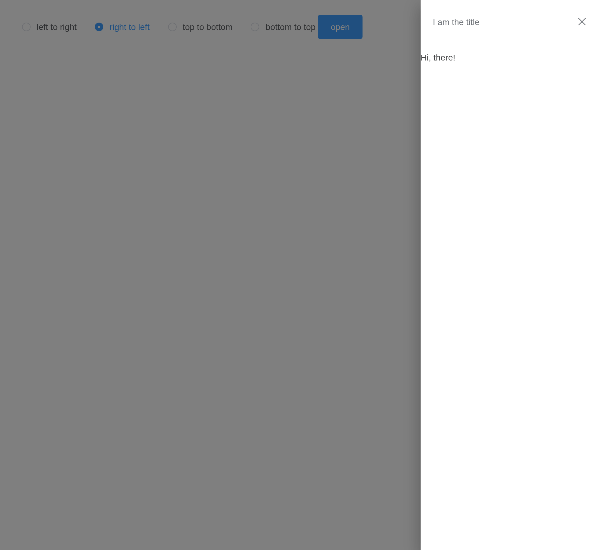
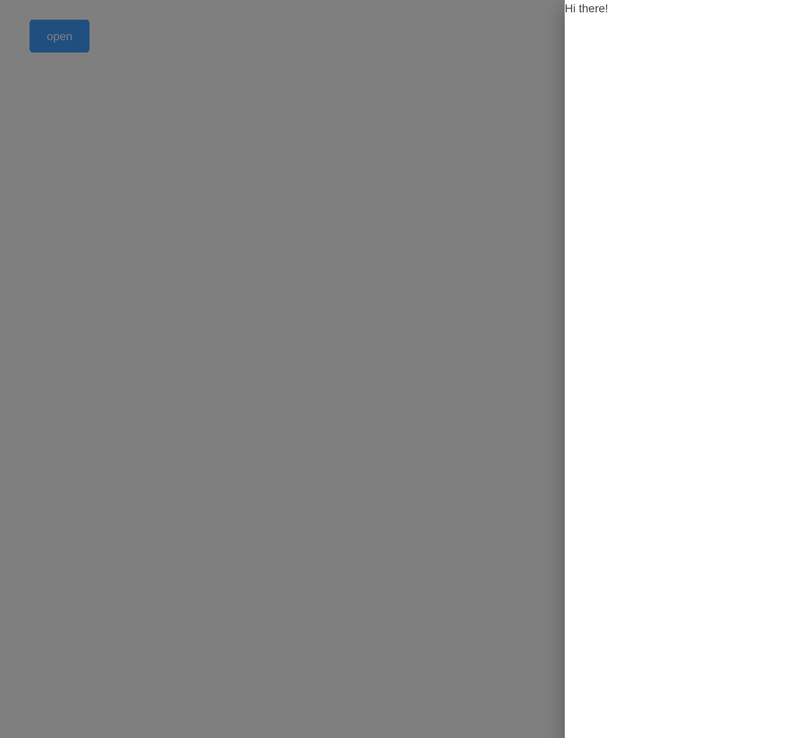
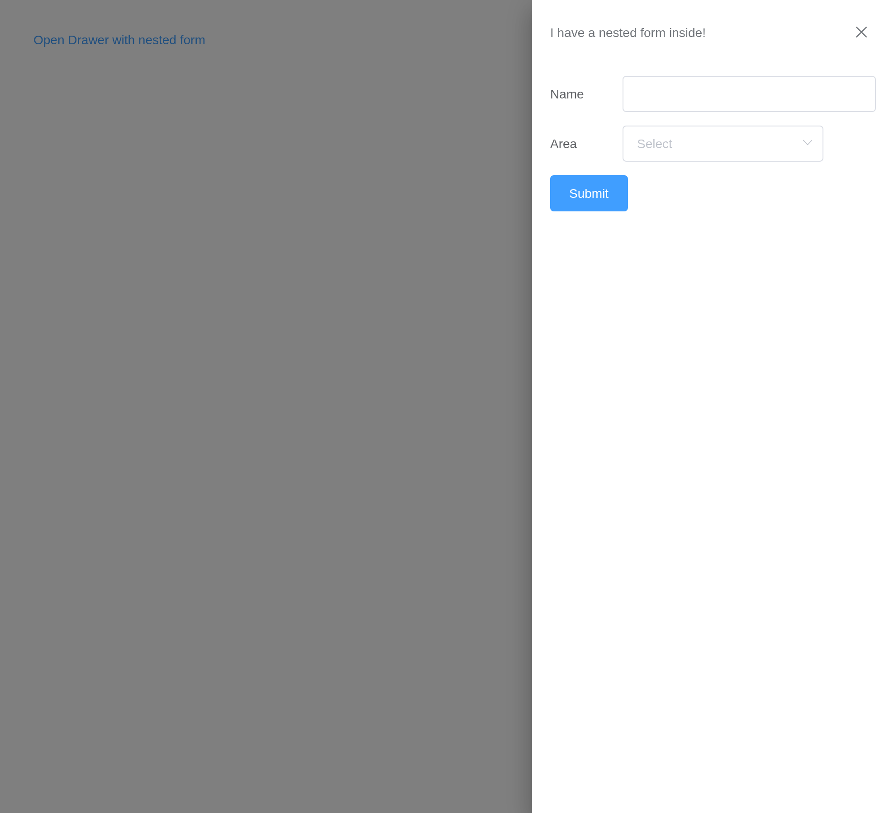
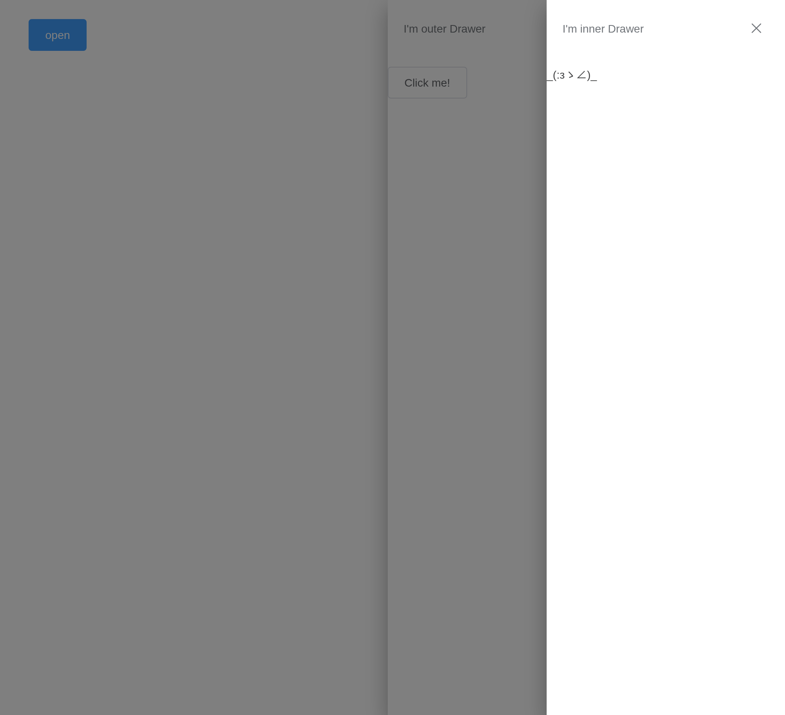

# Drawer

A panel sliding in from an edge. `input$<id>` is whether it is open;
`update_el_drawer(visible =)` opens and closes it, and focus goes back
to what had it when it closes.

## Basic usage

`direction` is `"rtl"`, `"ltr"`, `"ttb"` or `"btt"`.

``` r

ui <- el_page(
  el_radio_group("dir", choices = c("left to right" = "ltr", "right to left" = "rtl",
                                    "top to bottom" = "ttb", "bottom to top" = "btt"), selected = "rtl"),
  el_button("open", "open", type = "primary"),
  el_drawer("hi", title = "I am the title", content = tags$span("Hi, there!")))

server <- function(input, output, session) {
  observeEvent(input$open, update_el_drawer(id = "hi", visible = TRUE))
}

shinyApp(ui, server)
```



## No title

``` r

ui <- el_page(el_button("open", "open", type = "primary"),
              el_drawer("plain", with_header = FALSE, content = tags$span("Hi there!")))

server <- function(input, output, session) {
  observeEvent(input$open, update_el_drawer(id = "plain", visible = TRUE))
}

shinyApp(ui, server)
```



## Customization content

``` r

ui <- el_page(el_button("open", "Open Drawer with nested form", type = "text"),
  el_drawer("form", title = "I have a nested form inside!", size = "40%", content = tags$div(
    style = "padding: 0 20px",
    el_input("name", label = "Name", label_position = "left", label_width = "80px"),
    el_select("area", choices = c("Area 1" = "shanghai", "Area 2" = "beijing"),
              label = "Area", label_position = "left", label_width = "80px"),
    el_button("submit", "Submit", type = "primary"))))

server <- function(input, output, session) {
  observeEvent(input$open, update_el_drawer(id = "form", visible = TRUE))
}

shinyApp(ui, server)
```



## Nested drawer

``` r

ui <- el_page(el_button("open", "open", type = "primary"),
  el_drawer("outer", title = "I'm outer Drawer", size = "50%", content = tagList(
    el_button("inner_open", "Click me!"),
    el_drawer("inner", title = "I'm inner Drawer", append_to_body = TRUE,
              content = tags$p("_(:зゝ∠)_")))))

server <- function(input, output, session) {
  observeEvent(input$open, update_el_drawer(id = "outer", visible = TRUE))
  observeEvent(input$inner_open, update_el_drawer(id = "inner", visible = TRUE))
}

shinyApp(ui, server)
```



## API

### Drawer Attributes

| Element | In R | Description | Type | Accepted | Default |
|----|----|----|----|----|----|
| `append-to-body` | `append_to_body` | Controls should Drawer be inserted to DocumentBody Element, nested Drawer must assign this param to **true** | boolean | — | false |
| `before-close` | `before_close` | If set, closing procedure will be halted | function(done), done is function type that accepts a boolean as parameter, calling done with true or without parameter will abort the close procedure | — | — |
| `close-on-press-escape` | `close_on_press_escape` | Indicates whether Drawer can be closed by pressing ESC | boolean | — | true |
| `custom-class` | `custom_class` | Extra class names for Drawer | string | — | — |
| `destroy-on-close` | `destroy_on_close` | Indicates whether children should be destroyed after Drawer closed | boolean | \- | false |
| `modal` | `modal` | Should show shadowing layer | boolean | — | true |
| `modal-append-to-body` | `modal_append_to_body` | Indicates should shadowing layer be insert into DocumentBody element | boolean | — | true |
| `direction` | `direction` | Drawer’s opening direction | Direction | rtl / ltr / ttb / btt | rtl |
| `show-close` | `show_close` | Should show close button at the top right of Drawer | boolean | — | true |
| `size` | `size` | Drawer’s size, if Drawer is horizontal mode, it effects the width property, otherwise it effects the height property, when size is `number` type, it describes the size by unit of pixels; when size is `string` type, it should be used with `x%` notation, other wise it will be interpreted to pixel unit | number / string | \- | ‘30%’ |
| `title` | `title` | Drawer’s title, can also be set by named slot, detailed descriptions can be found in the slot form | string | — | — |
| `visible` | `visible` | Should Drawer be displayed, also support the `.sync` notation | boolean | — | false |
| `wrapperClosable` | `wrapper_closable` | Indicates whether user can close Drawer by clicking the shadowing layer. | boolean | \- | true |
| `withHeader` | `with_header` | Flag that controls the header section’s existance, default to true, when withHeader set to false, both `title attribute` and `title slot` won’t work | boolean | \- | true |

### Drawer Slot

| Element | In R                     | Description          |
|---------|--------------------------|----------------------|
| `title` | `slots = list(title = )` | Drawer Title Section |

### Drawer Methods

| Element | In R | Description |
|----|----|----|
| `closeDrawer` | `el_call(session, id, "closeDrawer")` | In order to close Drawer, this method will call `before-close`. |

### Drawer Events

| Element | In R | Description |
|----|----|----|
| `open` | `input$<id>_open` | Triggered before Drawer opening animation begins |
| `opened` | `input$<id>_opened` | Triggered after Drawer opening animation ended |
| `close` | `input$<id>_close` | Triggered before Drawer closing animation begins |
| `closed` | `input$<id>_closed` | Triggered after Drawer closing animation ended |
