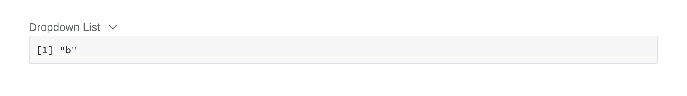

# Dropdown

Toggleable menu for displaying lists of links and actions. `input$<id>`
is the `command` of the item chosen, as an event.

## Basic usage

``` r

el_dropdown("basic", trigger_label = "Dropdown List", items = list(
  list(command = "a", label = "Action 1"), list(command = "b", label = "Action 2"),
  list(command = "c", label = "Action 3"), list(command = "d", label = "Action 4", disabled = TRUE),
  list(command = "e", label = "Action 5", divided = TRUE)))
```

## Triggering element

`split_button` splits the trigger into a button and an arrow.

``` r

el_dropdown("btn", trigger_label = "Dropdown List", type = "primary", items = list(
  list(command = "a", label = "Action 1"), list(command = "b", label = "Action 2")))
el_dropdown("splt", trigger_label = "Dropdown List", type = "primary", split_button = TRUE,
            items = list(list(command = "a", label = "Action 1"), list(command = "b", label = "Action 2")))
```

## How to trigger

``` r

el_dropdown("hover", trigger_label = "hover to trigger", items = list(
  list(command = "a", label = "Action 1", icon = "el-icon-plus"),
  list(command = "b", label = "Action 2", icon = "el-icon-circle-plus")))
el_dropdown("click", trigger_label = "click to trigger", trigger = "click", items = list(
  list(command = "a", label = "Action 1", icon = "el-icon-plus"),
  list(command = "b", label = "Action 2", icon = "el-icon-circle-plus")))
```

## Menu hiding behavior

``` r

el_dropdown("stay", trigger_label = "Dropdown List", hide_on_click = FALSE, items = list(
  list(command = "a", label = "Action 1"), list(command = "b", label = "Action 2")))
```

## Command event

``` r

ui <- el_page(el_dropdown("cmd", trigger_label = "Dropdown List", items = list(
  list(command = "a", label = "Action 1"), list(command = "b", label = "Action 2"))),
  verbatimTextOutput("chosen"))

server <- function(input, output, session) {
  output$chosen <- renderPrint(input$cmd)
}

shinyApp(ui, server)
```



## Sizes

``` r

items <- list(list(command = "a", label = "Action 1"), list(command = "b", label = "Action 2"))
el_dropdown("s1", trigger_label = "Default", split_button = TRUE, type = "primary", items = items)
el_dropdown("s2", trigger_label = "Medium", split_button = TRUE, size = "medium", type = "primary", items = items)
el_dropdown("s3", trigger_label = "Small", split_button = TRUE, size = "small", type = "primary", items = items)
el_dropdown("s4", trigger_label = "Mini", split_button = TRUE, size = "mini", type = "primary", items = items)
```

## API

### Dropdown Attributes

| Element | In R | Description | Type | Accepted | Default |
|----|----|----|----|----|----|
| `type` | `type` | menu button type, refer to `Button` Component, only works when `split-button` is true | string | — | — |
| `size` | `size` | menu size, also works on the split button | string | medium / small / mini | — |
| `split-button` | `split_button` | whether a button group is displayed | boolean | — | false |
| `placement` | `placement` | placement of pop menu | string | top/top-start/top-end/bottom/bottom-start/bottom-end | bottom-end |
| `trigger` | `trigger` | how to trigger | string | hover/click | hover |
| `hide-on-click` | `hide_on_click` | whether to hide menu after clicking menu-item | boolean | — | true |
| `show-timeout` | `show_timeout` | Delay time before show a dropdown (only works when trigger is `hover`) | number | — | 250 |
| `hide-timeout` | `hide_timeout` | Delay time before hide a dropdown (only works when trigger is `hover`) | number | — | 150 |
| `tabindex` | `tabindex` | [tabindex](https://developer.mozilla.org/en-US/docs/Web/HTML/Global_attributes/tabindex) of Dropdown | number | — | 0 |
| `disabled` | `disabled` | whether the Dropdown is disabled | boolean | — | false |

### Dropdown Slots

| Element | In R | Description |
|----|----|----|
| `dropdown` | `slots = list(dropdown = )` | content of the Dropdown Menu, usually a `<el-dropdown-menu>` element |

### Dropdown Events

| Element | In R | Description |
|----|----|----|
| `click` | `input$<id>_click` | if `split-button` is `true`, triggers when left button is clicked |
| `command` | one of the component’s inputs – see its reference page | triggers when a dropdown item is clicked |
| `visible-change` | `input$<id>_visible_change` | triggers when the dropdown appears/disappears |

### Dropdown Menu Item Attributes

| Element | In R | Description | Type | Accepted | Default |
|----|----|----|----|----|----|
| `command` | item field `command` | a command to be dispatched to Dropdown’s `command` callback | string/number/object | — | — |
| `disabled` | `disabled` | whether the item is disabled | boolean | — | false |
| `divided` | item field `divided` | whether a divider is displayed | boolean | — | false |
| `icon` | item field `icon` | icon class name | string | — | — |
