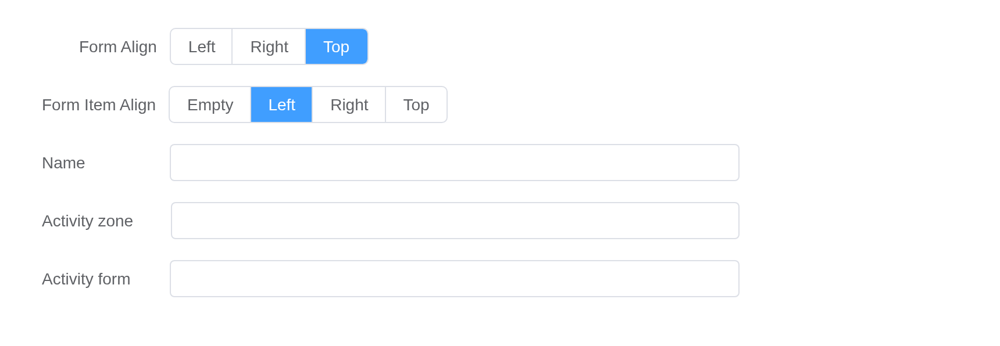
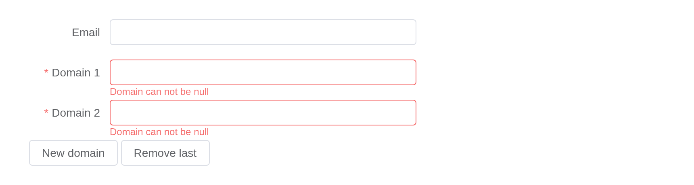
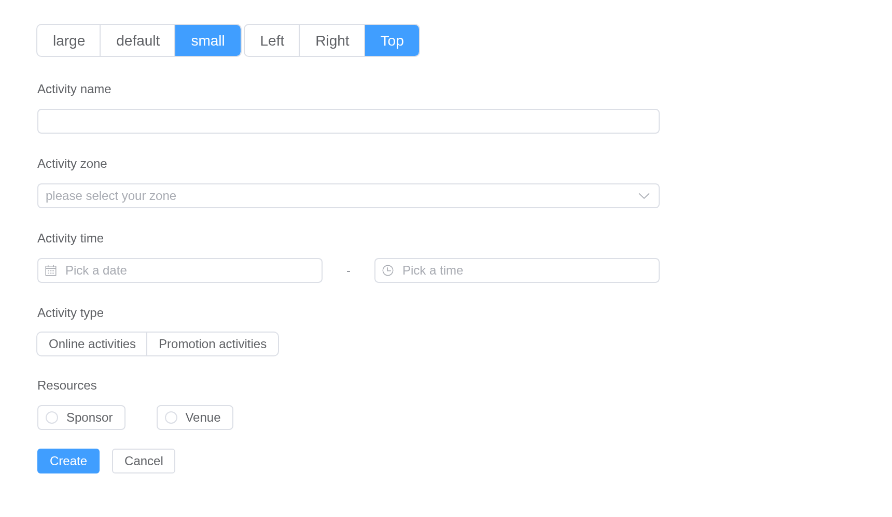

# Form

Form consists of `input`, `radio`, `select`, `checkbox` and so on. With
form, you can collect, verify and submit data.

> **Tip**
>
> The component has been upgraded with a flex layout to replace the old
> float layout.

## Basic Form

It includes all kinds of input items, such as `input`, `select`, `radio`
and `checkbox`.

In each `form` component, you need a `form-item` field to be the
container of your input item.

[`el_form_item()`](https://kaipingyang.github.io/shiny.element/reference/el_form_item.md)
puts the date and the time under one label, in columns.

``` r

el_form(
  id = "activity",
  label_width = "auto",
  width = "600px",
  submit_label = "Create",
  reset_label = "Cancel",
  el_form_field("name", "input", label = "Activity name"),
  el_form_field(
    "region",
    "select",
    label = "Activity zone",
    choices = c("Zone one" = "shanghai", "Zone two" = "beijing"),
    placeholder = "please select your zone"
  ),
  el_form_item(
    "Activity time",
    el_form_field(
      "date1",
      "date-picker",
      placeholder = "Pick a date",
      style = "width: 100%"
    ),
    "-",
    el_form_field(
      "date2",
      "time-picker",
      placeholder = "Pick a time",
      style = "width: 100%"
    )
  ),
  el_form_field("delivery", "switch", label = "Instant delivery"),
  el_form_field(
    "type",
    "checkbox-group",
    label = "Activity type",
    choices = c(
      "Online activities",
      "Promotion activities",
      "Offline activities",
      "Simple brand exposure"
    )
  ),
  el_form_field(
    "resource",
    "radio-group",
    label = "Resources",
    choices = c("Sponsor", "Venue")
  ),
  el_form_field("desc", "textarea", label = "Activity form")
)
```

> **Tip**
>
> [W3C](https://www.w3.org/MarkUp/html-spec/html-spec_8.html#SEC8.2)
> regulates that
>
> > *When there is only one single-line text input field in a form, the
> > user agent should accept Enter in that field as a request to submit
> > the form.*
>
> To prevent this behavior, you can add `@submit.prevent` on
> `<el-form>`.

## Inline Form

When the vertical space is limited and the form is relatively simple,
you can put it in one line.

Set the `inline` attribute to `true` and the form will be inline.

``` r

el_form(
  id = "search",
  inline = TRUE,
  label_width = NULL,
  submit_label = "Query",
  el_form_field(
    "user",
    "input",
    label = "Approved by",
    placeholder = "Approved by",
    clearable = TRUE
  ),
  el_form_field(
    "region",
    "select",
    label = "Activity zone",
    choices = c("Zone one" = "shanghai", "Zone two" = "beijing"),
    placeholder = "Activity zone",
    clearable = TRUE
  ),
  el_form_field(
    "date",
    "date-picker",
    label = "Activity time",
    placeholder = "Pick a date",
    clearable = TRUE
  )
)
```

## Alignment

Depending on your design, there are several different ways to align your
label element.

You can set `label-position` of `el-form-item` separately 2.7.7. If the
value is empty, the `label-position` of `el-form` is used.

The `label-position` attribute decides how labels align, it can be `top`
or `left`. When set to `top`, labels will be placed at the top of the
form field.

The two radio groups are fields with `report = TRUE`: they report as
`input$align_position` and `input$align_item_position` as they change,
and the server moves the labels – the form’s with
`update_el_form(label_position =)`, the fields’ by giving the fields
again with their own `label_position`.

``` r

positions <- c(Left = "left", Right = "right", Top = "top")
fields <- function(item_position = "") {
  list(
    el_form_field(
      "position",
      "radio-group",
      label = "Form Align",
      label_position = "right",
      choices = positions,
      value = "right",
      button = TRUE,
      report = TRUE
    ),
    el_form_field(
      "item_position",
      "radio-group",
      label = "Form Item Align",
      label_position = "right",
      choices = c(Empty = "", positions),
      value = item_position,
      button = TRUE,
      report = TRUE
    ),
    el_form_field(
      "name",
      "input",
      label = "Name",
      label_position = item_position
    ),
    el_form_field(
      "region",
      "input",
      label = "Activity zone",
      label_position = item_position
    ),
    el_form_field(
      "type",
      "input",
      label = "Activity form",
      label_position = item_position
    )
  )
}
ui <- el_page(
  do.call(
    el_form,
    c(
      list(
        id = "align",
        label_position = "right",
        label_width = "auto",
        width = "600px",
        submit_label = NULL
      ),
      fields()
    )
  )
)
server <- function(input, output, session) {
  observeEvent(input$align_position, ignoreInit = TRUE, {
    update_el_form(session, "align", label_position = input$align_position)
  })
  observeEvent(input$align_item_position, ignoreInit = TRUE, {
    update_el_form(
      session,
      "align",
      fields = fields(input$align_item_position)
    )
  })
}
shinyApp(ui, server)
```



## Validation

Form component allows you to verify your data, helping you find and
correct errors.

Just add the `rules` attribute for `Form` component, pass validation
rules, and set `prop` attribute for `FormItem` as a specific key that
needs to be validated. See more information at
[async-validator](https://github.com/yiminghe/async-validator).

``` r

ui <- el_page(
  el_form(
    id = "rules",
    label_width = "120px",
    submit_label = "Create",
    reset_label = "Reset",
    el_form_field(
      "name",
      "input",
      label = "Activity name",
      rules = list(
        el_rule(required = TRUE, message = "Please input Activity name"),
        el_rule(min = 3, max = 5, message = "Length should be 3 to 5")
      )
    ),
    el_form_field(
      "region",
      "select",
      label = "Activity zone",
      choices = c("Zone one" = "shanghai", "Zone two" = "beijing"),
      rules = el_rule(
        required = TRUE,
        message = "Please select Activity zone",
        trigger = "change"
      )
    ),
    el_form_field(
      "type",
      "checkbox-group",
      label = "Activity type",
      choices = c("Online activities", "Promotion activities"),
      rules = el_rule(
        type = "array",
        required = TRUE,
        trigger = "change",
        message = "Please select at least one activity type"
      )
    )
  ),
  verbatimTextOutput("verdict")
)

server <- function(input, output, session) {
  output$verdict <- renderPrint({
    req(input$rules_submit)
    input$rules_valid
  })
}

shinyApp(ui, server)
```


## Custom Validation Rules

This example shows how to customize your own validation rules to finish
a two-factor password verification.

Here we use `status-icon` to reflect validation result as an icon.

``` r

ui <- el_page(el_form(
  id = "account",
  status_icon = TRUE,
  label_width = "120px",
  submit_label = "Submit",
  width = "480px",
  el_form_field(
    "pass",
    "password",
    label = "Password",
    rules = el_rule(required = TRUE, message = "Please input the password")
  ),
  el_form_field(
    "check",
    "password",
    label = "Confirm",
    rules = el_rule(
      trigger = "blur",
      validator = JS(
        "function(rule, value, callback, source) {",
        "  if (!value) return callback(new Error('Please input the password again'));",
        "  value !== source.pass ? callback(new Error(\"Two inputs don't match!\")) : callback();",
        "}"
      )
    )
  ),
  el_form_field(
    "age",
    "input",
    label = "Age",
    rules = el_rule(
      trigger = "blur",
      validator = JS(
        "function(rule, value, callback) {",
        "  var n = Number(value);",
        "  if (!value) return callback(new Error('Please input the age'));",
        "  if (isNaN(n)) return callback(new Error('Please input digits'));",
        "  n < 18 ? callback(new Error('Age must be greater than 18')) : callback();",
        "}"
      )
    )
  )
))

shinyApp(ui, function(input, output, session) {})
```


> **Tip**
>
> Custom validate callback function must be called. See more advanced
> usage at
> [async-validator](https://github.com/yiminghe/async-validator).

## Add/Delete Form Item

In addition to passing all validation rules at once on the form
component, you can also pass the validation rules or delete rules on a
single form field dynamically.

``` r

domain <- function(i) {
  el_form_field(
    paste0("domain", i),
    "input",
    label = paste("Domain", i),
    rules = el_rule(required = TRUE, message = "Domain can not be null")
  )
}

ui <- el_page(
  el_form(
    id = "domains",
    submit_label = NULL,
    label_width = "100px",
    width = "480px",
    el_form_field(
      "email",
      "input",
      label = "Email",
      rules = el_rule(type = "email", message = "Please input a correct email")
    ),
    domain(1)
  ),
  el_button("more", "New domain"),
  el_button("fewer", "Remove last")
)

server <- function(input, output, session) {
  n <- reactiveVal(1)
  redraw <- function() {
    update_el_form(
      id = "domains",
      fields = c(
        list(el_form_field("email", "input", label = "Email")),
        lapply(seq_len(n()), domain)
      )
    )
  }
  observeEvent(input$more, {
    n(n() + 1)
    redraw()
  })
  observeEvent(input$fewer, {
    n(max(1, n() - 1))
    redraw()
  })
}

shinyApp(ui, server)
```



## Number Validate

Number Validate need a `.number` modifier added on the input `v-model`
binding，it’s used to transform the string value to the number which is
provided by Vue.

``` r

ui <- el_page(el_form(
  id = "aged",
  submit_label = "Submit",
  label_width = "100px",
  width = "420px",
  el_form_field(
    "age",
    "input",
    label = "Age",
    rules = list(
      el_rule(required = TRUE, message = "Age is required"),
      el_rule(
        type = "number",
        message = "Age must be a number",
        transform = JS("function(v) { return Number(v); }")
      )
    )
  )
))

shinyApp(ui, function(input, output, session) {})
```


> **Tip**
>
> When an `el-form-item` is nested in another `el-form-item`, its label
> width will be `0`. You can set `label-width` on that `el-form-item` if
> needed.

## Size Control

All components in a Form inherit their `size` attribute from that Form.
Similarly, FormItem also has a `size` attribute.

Still you can fine tune each component’s `size` if you don’t want that
component to inherit its size from From or FormItem.

The radio buttons set the form’s `size` and `label_position` with
[`update_el_form()`](https://kaipingyang.github.io/shiny.element/reference/el_form.md).

``` r

ui <- el_page(
  tags$div(
    el_radio_group(
      "form_size",
      choices = c("large", "default", "small"),
      selected = "default",
      button = TRUE
    ),
    el_radio_group(
      "form_position",
      choices = c(Left = "left", Right = "right", Top = "top"),
      selected = "right",
      button = TRUE
    )
  ),
  tags$br(),
  el_form(
    id = "sized",
    label_width = "auto",
    label_position = "right",
    width = "600px",
    submit_label = "Create",
    reset_label = "Cancel",
    el_form_field("name", "input", label = "Activity name"),
    el_form_field(
      "region",
      "select",
      label = "Activity zone",
      choices = c("Zone one" = "shanghai", "Zone two" = "beijing"),
      placeholder = "please select your zone"
    ),
    el_form_item(
      "Activity time",
      el_form_field(
        "date1",
        "date-picker",
        placeholder = "Pick a date",
        style = "width: 100%"
      ),
      "-",
      el_form_field(
        "date2",
        "time-picker",
        placeholder = "Pick a time",
        style = "width: 100%"
      )
    ),
    el_form_field(
      "type",
      "checkbox-group",
      label = "Activity type",
      choices = c("Online activities", "Promotion activities"),
      button = TRUE
    ),
    el_form_field(
      "resource",
      "radio-group",
      label = "Resources",
      choices = c("Sponsor", "Venue"),
      border = TRUE
    )
  )
)
server <- function(input, output, session) {
  observeEvent(input$form_size, ignoreInit = TRUE, {
    update_el_form(session, "sized", size = input$form_size)
  })
  observeEvent(input$form_position, ignoreInit = TRUE, {
    update_el_form(session, "sized", label_position = input$form_position)
  })
}
shinyApp(ui, server)
```



## Accessibility

When only a single input (or related control such as select or checkbox)
is inside of a `el-form-item`, the form item’s label will automatically
be attached to that input. However, if multiple inputs are inside of the
`el-form-item`, the form item will be assigned the
[WAI-ARIA](https://www.w3.org/WAI/standards-guidelines/aria/) role of
[group](https://www.w3.org/TR/wai-aria/#group) instead. In this case, it
is your responsibility to assign assistive labels to the individual
inputs.

A field’s label is tied to its control, so a screen reader announces it.
Under a label for a group, each control needs a label of its own:
`aria_label`. The notes are beside the forms here, a form holding only
fields.

``` r

el_space(
  fill = TRUE,
  direction = "vertical",
  width = "600px",
  el_alert(
    type = "info",
    show_icon = TRUE,
    closable = FALSE,
    title = '"Full Name" label is automatically attached to the input:'
  ),
  el_form(
    id = "a11y_name",
    label_position = "left",
    label_width = "140px",
    submit_label = NULL,
    el_form_field("full_name", "input", label = "Full Name")
  ),
  el_alert(
    type = "info",
    show_icon = TRUE,
    closable = FALSE,
    title = paste(
      '"Your Information" serves as a label for the group of inputs.',
      "You must specify labels on the individal inputs. Placeholders are",
      'not replacements for using the "label" attribute.'
    )
  ),
  el_form(
    id = "a11y_group",
    label_position = "left",
    label_width = "140px",
    submit_label = NULL,
    el_form_item(
      "Your Information",
      el_form_field(
        "first_name",
        "input",
        aria_label = "First Name",
        placeholder = "First Name"
      ),
      el_form_field(
        "last_name",
        "input",
        aria_label = "Last Name",
        placeholder = "Last Name"
      ),
      gutter = 20
    )
  )
)
```

## API

Element Plus’s tables, and beside each entry where it is in R.

### Form Attributes

| Element | In R | Description | Type | Accepted | Default |
|----|----|----|----|----|----|
| `model` | `each field's`value`; update_el_form(model =)` | Data of form component. | [^1]`Record<string, any>` |  | — |
| `rules` | `el_form_field(rules =)` | Validation rules of form. | [^2]`FormRules` |  | — |
| `inline` | `el_form(inline =)` | Whether the form is inline. | [^3] |  | false |
| `label-position` | `el_form(label_position =)` | Position of label. If set to `'left'` or `'right'`, `label-width` prop is also required. | [^4]`'left' \\| 'right' \\| 'top'` |  | right |
| `label-width` | `el_form(label_width =)` | Width of label, e.g. `'50px'`. All its direct child form items will inherit this value. `auto` is supported. | [^5] / [^6] |  | ’’ |
| `label-suffix` | `el_form(label_suffix =)` | Suffix of the label. | [^7] |  | ’’ |
| `hide-required-asterisk` | `el_form(hide_required_asterisk =)` | Whether to hide required fields should have a red asterisk (star) beside their labels. | [^8] |  | false |
| `require-asterisk-position` | `el_form(require_asterisk_position =)` | Position of asterisk. | [^9]`'left' \\| 'right'` |  | left |
| `show-message` | `el_form(show_message =)` | Whether to show the error message. | [^10] |  | true |
| `inline-message` | `el_form(inline_message =)` | Whether to display the error message inline with the form item. | [^11] |  | false |
| `status-icon` | `el_form(status_icon =)` | Whether to display an icon indicating the validation result. | [^12] |  | false |
| `validate-on-rule-change` | `el_form(validate_on_rule_change =)` | Whether to trigger validation when the `rules` prop is changed. | [^13] |  | true |
| `size` | `el_form(size =)` | Control the size of components in this form. | [^14]`'' \\| 'large' \\| 'default' \\| 'small'` |  | — |
| `disabled` | `el_form(disabled =)` | Whether to disable all components in this form. Before ^(2.12.0), if set to `true`, it will override the `disabled` prop of the inner component. After ^(2.12.0), the configuration of the internal components takes precedence. | [^15] |  | false |
| `scroll-to-error` | `el_form(scroll_to_error =)` | When validation fails, scroll to the first error form entry. | [^16] |  | false |
| `scroll-into-view-options` | `el_form(scroll_into_view_options =)` | When validation fails, it scrolls to the first error item based on the scrollIntoView option. [scrollIntoView](https://developer.mozilla.org/en-US/docs/Web/API/Element/scrollIntoView). | [^17]`ScrollIntoViewOptions` / [^18] |  | true |

### Form Events

| Element    | In R                  | Description                             |
|------------|-----------------------|-----------------------------------------|
| `validate` | `input$<id>_validate` | triggers after a form item is validated |

### Form Slots

| Element   | In R            | Description               |
|-----------|-----------------|---------------------------|
| `default` | default content | customize default content |

### Form Exposes

| Element | In R | Description |
|----|----|----|
| `validate` | `call_el(session, id, "validate")` | Validate the whole form. Receives a callback or returns `Promise`. |
| `validateField` | `call_el(session, id, "validateField")` | Validate specified fields. |
| `resetFields` | `call_el(session, id, "resetFields")` | Reset specified fields and remove validation result. |
| `scrollToField` | `call_el(session, id, "scrollToField")` | Scroll to the specified fields. |
| `clearValidate` | `call_el(session, id, "clearValidate")` | Clear validation messages for all or specified fields. |
| `getField` | `call_el(session, id, "getField")` | Get a field context. |
| `setInitialValues` | `call_el(session, id, "setInitialValues")` | Set initial values for form fields. When `resetFields` is called, fields will reset to these values. |

### FormItem Attributes

| Element | In R | Description | Type | Accepted | Default |
|----|----|----|----|----|----|
| `prop` | `el_form_field(prop =)` | A key of `model`. It could be a path of the property (e.g `a.b.0` or `['a', 'b', '0']`). In the use of `validate` and `resetFields` method, the attribute is required. | [^19] / [^20] |  | — |
| `label` | `el_form_field(label =)` | Label text. | [^21] |  | — |
| `label-position` | `el_form(label_position =)` | Position of item label. If set to `'left'` or `'right'`, `label-width` prop is also required. Default extend `label-position` of `form`. | [^22]`'left' \\| 'right' \\| 'top'` |  | ’’ |
| `label-width` | `el_form(label_width =)` | Width of label, e.g. `'50px'`. `'auto'` is supported. | [^23] / [^24] |  | — |
| `required` | `el_form_field(required =)` | Whether the field is required or not, will be determined by validation rules if omitted. | [^25] |  | — |
| `rules` | `el_form_field(rules =)` | Validation rules of form, see the [following table](#formitemrule), more advanced usage at [async-validator](https://github.com/yiminghe/async-validator). | [^26]`Arrayable<FormItemRule>` |  | — |
| `error` | `el_form_field(error =)` | Field error message, set its value and the field will validate error and show this message immediately. | [^27] |  | — |
| `show-message` | `el_form(show_message =)` | Whether to show the error message. | [^28] |  | true |
| `inline-message` | `el_form(inline_message =)` | Inline style validate message. | [^29] |  | false |
| `size` | `el_form(size =)` | Control the size of components in this form-item. | [^30]`'' \\| 'large' \\| 'default' \\| 'small'` |  | — |
| `for` | `el_form_field(for =)` | Same as for in native label. | [^31] |  | — |
| `validate-status` | `el_form_field(validate_status =)` | Validation state of formItem. | [^32]`'' \\| 'error' \\| 'validating' \\| 'success'` |  | — |

### FormItem Slots

| Element | In R | Description |
|----|----|----|
| `default` | default content | Content of Form Item. |
| `label` | `slots = list(label = )` | Custom content to display on label. |
| `error` | `slots = list(error = )` | Custom content to display validation message. |

### FormItem Exposes

| Element | In R | Description |
|----|----|----|
| `validate` | `call_el(session, id, "validate")` | Validate form item. |
| `resetField` | `call_el(session, id, "resetField")` | Reset current field and remove validation result. |
| `clearValidate` | `call_el(session, id, "clearValidate")` | Remove validation status of the field. |
| `setInitialValue` | `call_el(session, id, "setInitialValue")` | Set initial value for this field. When `resetField` is called, the field will reset to this value. |

[^1]: object

[^2]: object

[^3]: boolean

[^4]: enum

[^5]: string

[^6]: number

[^7]: string

[^8]: boolean

[^9]: enum

[^10]: boolean

[^11]: boolean

[^12]: boolean

[^13]: boolean

[^14]: enum

[^15]: boolean

[^16]: boolean

[^17]: object

[^18]: boolean

[^19]: string

[^20]: string\[\]

[^21]: string

[^22]: enum

[^23]: string

[^24]: number

[^25]: boolean

[^26]: object

[^27]: string

[^28]: boolean

[^29]: boolean

[^30]: enum

[^31]: string

[^32]: enum
