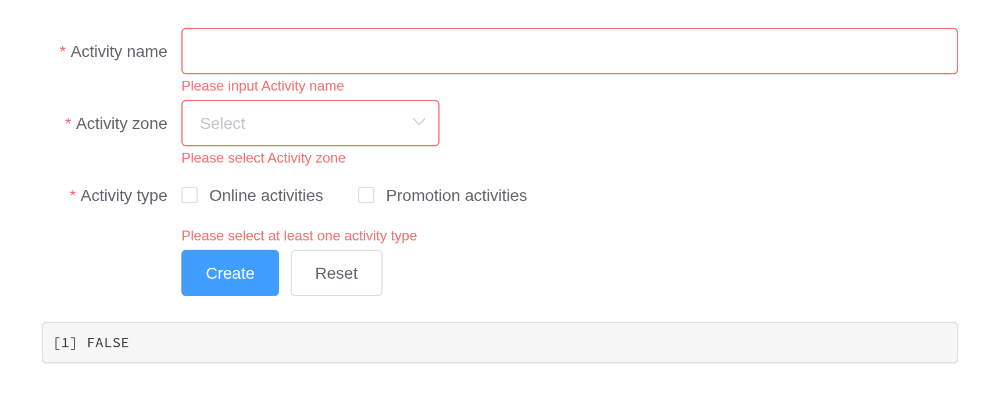
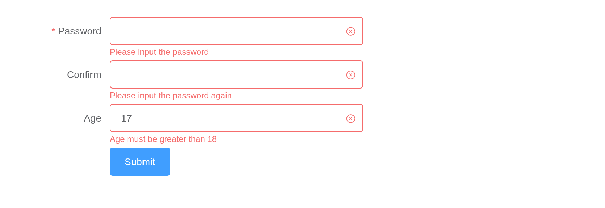
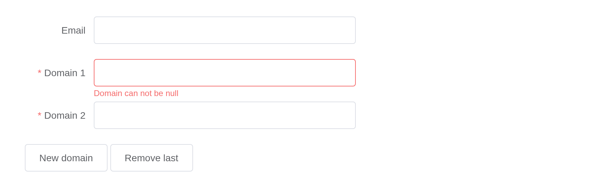
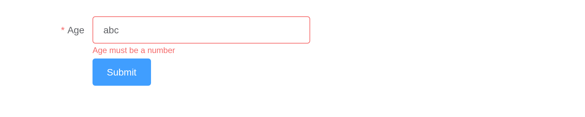

# Form

Form consists of inputs, radios, selects, checkboxes and so on; with it
you can collect, verify and submit data.
[`el_form()`](https://kaipingyang.github.io/shiny.element/reference/el_form.md)
holds its fields, declared with
[`el_form_field()`](https://kaipingyang.github.io/shiny.element/reference/el_form_field.md),
in one model, and reports it as `input$<id>`, with `input$<id>_valid`
and `input$<id>_submit` when submitted. Its standalone counterparts –
any input with a `label` – are in the forms article.

## Basic form

``` r

el_form(id = "activity", label_width = "120px", submit_label = "Create", reset_label = "Cancel",
  el_form_field("name", "input", label = "Activity name"),
  el_form_field("region", "select", label = "Activity zone",
                choices = c("Zone one" = "shanghai", "Zone two" = "beijing"),
                placeholder = "please select your zone"),
  el_form_field("date", "date-picker", label = "Activity time", placeholder = "Pick a date"),
  el_form_field("delivery", "switch", label = "Instant delivery"),
  el_form_field("type", "checkbox-group", label = "Activity type",
                choices = c("Online activities", "Promotion activities", "Offline activities")),
  el_form_field("resource", "radio-group", label = "Resources",
                choices = c("Sponsor", "Venue")),
  el_form_field("desc", "textarea", label = "Activity form"))
```

## Inline form

``` r

el_form(id = "search", inline = TRUE, submit_label = "Query",
  el_form_field("user", "input", label = "Approved by", placeholder = "Approved by"),
  el_form_field("region", "select", label = "Activity zone",
                choices = c("Zone one" = "shanghai", "Zone two" = "beijing")))
```

## Alignment

`label_position` puts the labels `"right"` (the default), `"left"` or on
`"top"`.

``` r

el_form(id = "aligned", label_position = "top", submit_label = NULL, width = "360px",
  el_form_field("name", "input", label = "Name"),
  el_form_field("region", "input", label = "Activity zone"),
  el_form_field("type", "input", label = "Activity form"))
```

## Validation

Each field’s `rules`, from
[`el_rule()`](https://kaipingyang.github.io/shiny.element/reference/el_rule.md),
run on blur or change and on submit.

``` r

ui <- el_page(
  el_form(id = "rules", label_width = "120px", submit_label = "Create", reset_label = "Reset",
    el_form_field("name", "input", label = "Activity name", rules = list(
      el_rule(required = TRUE, message = "Please input Activity name"),
      el_rule(min = 3, max = 5, message = "Length should be 3 to 5"))),
    el_form_field("region", "select", label = "Activity zone",
                  choices = c("Zone one" = "shanghai", "Zone two" = "beijing"),
                  rules = el_rule(required = TRUE, message = "Please select Activity zone",
                                  trigger = "change")),
    el_form_field("type", "checkbox-group", label = "Activity type",
                  choices = c("Online activities", "Promotion activities"),
                  rules = el_rule(type = "array", required = TRUE, trigger = "change",
                                  message = "Please select at least one activity type"))),
  verbatimTextOutput("verdict"))

server <- function(input, output, session) {
  output$verdict <- renderPrint({ req(input$rules_submit); input$rules_valid })
}

shinyApp(ui, server)
```



## Custom validation rules

`el_rule(validator = JS(...))` is Element’s custom rule; `status_icon`
marks each field’s verdict.

``` r

ui <- el_page(el_form(id = "account", status_icon = TRUE, label_width = "120px",
  submit_label = "Submit", width = "480px",
  el_form_field("pass", "password", label = "Password",
                rules = el_rule(required = TRUE, message = "Please input the password")),
  el_form_field("check", "password", label = "Confirm",
                rules = el_rule(trigger = "blur", validator = JS(
                  "function(rule, value, callback) {",
                  "  value ? callback() : callback(new Error('Please input the password again'));",
                  "}"))),
  el_form_field("age", "input", label = "Age", rules = el_rule(trigger = "blur", validator = JS(
    "function(rule, value, callback) {",
    "  var n = Number(value);",
    "  if (!value) return callback(new Error('Please input the age'));",
    "  if (isNaN(n)) return callback(new Error('Please input digits'));",
    "  n < 18 ? callback(new Error('Age must be greater than 18')) : callback();",
    "}")))))

shinyApp(ui, function(input, output, session) {})
```



## Delete or add form items dynamically

`update_el_form(fields =)` replaces the field list; what was entered
stays.

``` r

domain <- function(i) el_form_field(paste0("domain", i), "input", label = paste("Domain", i),
  rules = el_rule(required = TRUE, message = "Domain can not be null"))

ui <- el_page(
  el_form(id = "domains", submit_label = NULL, label_width = "100px", width = "480px",
          el_form_field("email", "input", label = "Email",
                        rules = el_rule(type = "email", message = "Please input a correct email")),
          domain(1)),
  el_button("more", "New domain"), el_button("fewer", "Remove last"))

server <- function(input, output, session) {
  n <- reactiveVal(1)
  redraw <- function() update_el_form(id = "domains", fields = c(
    list(el_form_field("email", "input", label = "Email")), lapply(seq_len(n()), domain)))
  observeEvent(input$more, { n(n() + 1); redraw() })
  observeEvent(input$fewer, { n(max(1, n() - 1)); redraw() })
}

shinyApp(ui, server)
```



## Number validate

``` r

ui <- el_page(el_form(id = "aged", submit_label = "Submit", label_width = "100px", width = "420px",
  el_form_field("age", "input", label = "Age", rules = list(
    el_rule(required = TRUE, message = "Age is required"),
    el_rule(type = "number", message = "Age must be a number",
            transform = JS("function(v) { return Number(v); }"))))))

shinyApp(ui, function(input, output, session) {})
```



## Size control

`size` sizes every control in the form; a field’s own `size` overrides
it.

``` r

el_form(id = "small", size = "mini", label_width = "120px", submit_label = "Create", width = "480px",
  el_form_field("name", "input", label = "Activity name"),
  el_form_field("region", "select", label = "Activity zone",
                choices = c("Zone one" = "shanghai", "Zone two" = "beijing")),
  el_form_field("resource", "radio-group", label = "Resources", choices = c("Sponsor", "Venue")))
```

## API

### Form Attributes

| Element | In R | Description | Type | Accepted | Default |
|----|----|----|----|----|----|
| `model` | `each field's`value`; update_el_form(model =)` | data of form component | object | — | — |
| `rules` | `el_form_field(rules =)` | validation rules of form | object | — | — |
| `inline` | `el_form(inline =)` | whether the form is inline | boolean | — | false |
| `label-position` | `el_form(label_position =)` | position of label. If set to ‘left’ or ‘right’, `label-width` prop is also required | string | left / right / top | right |
| `label-width` | `el_form(label_width =)` | width of label, e.g. ‘50px’. All its direct child form items will inherit this value. Width `auto` is supported. | string | — | — |
| `label-suffix` | `el_form(label_suffix =)` | suffix of the label | string | — | — |
| `hide-required-asterisk` | `el_form(hide_required_asterisk =)` | whether to hide a red asterisk (star) next to the required field label. | boolean | — | false |
| `show-message` | `el_form(show_message =)` | whether to show the error message | boolean | — | true |
| `inline-message` | `el_form(inline_message =)` | whether to display the error message inline with the form item | boolean | — | false |
| `status-icon` | `el_form(status_icon =)` | whether to display an icon indicating the validation result | boolean | — | false |
| `validate-on-rule-change` | `el_form(validate_on_rule_change =)` | whether to trigger validation when the `rules` prop is changed | boolean | — | true |
| `size` | `el_form(size =)` | control the size of components in this form | string | medium / small / mini | — |
| `disabled` | `el_form(disabled =)` | whether to disabled all components in this form. If set to true, it cannot be overridden by its inner components’ `disabled` prop | boolean | — | false |

### Form Methods

| Element | In R | Description |
|----|----|----|
| `validate` | `el_call(session, id, "validate")` | validate the whole form. Takes a callback as a param. After validation, the callback will be executed with two params: a boolean indicating if the validation has passed, and an object containing all fields that fail the validation. Returns a promise if callback is omitted |
| `validateField` | `el_call(session, id, "validateField")` | validate one or several form items |
| `resetFields` | `el_call(session, id, "resetFields")` | reset all the fields and remove validation result |
| `clearValidate` | `el_call(session, id, "clearValidate")` | clear validation message for certain fields. The parameter is prop name or an array of prop names of the form items whose validation messages will be removed. When omitted, all fields’ validation messages will be cleared |

### Form Events

| Element    | In R                  | Description                             |
|------------|-----------------------|-----------------------------------------|
| `validate` | `input$<id>_validate` | triggers after a form item is validated |

### Form-Item Attributes

| Element | In R | Description | Type | Accepted | Default |
|----|----|----|----|----|----|
| `prop` | `el_form_field(prop =)` | a key of `model`. In the use of validate and resetFields method, the attribute is required | string |  |  |
| `label` | `el_form_field(label =)` | label | string | — | — |
| `label-width` | `el_form(label_width =)` | width of label, e.g. ‘50px’. Width `auto` is supported. | string | — | — |
| `required` | `el_form_field(required =)` | whether the field is required or not, will be determined by validation rules if omitted | boolean | — | false |
| `rules` | `el_form_field(rules =)` | validation rules of form | object | — | — |
| `error` | `el_form_field(error =)` | field error message, set its value and the field will validate error and show this message immediately | string | — | — |
| `show-message` | `el_form(show_message =)` | whether to show the error message | boolean | — | true |
| `inline-message` | `el_form(inline_message =)` | inline style validate message | boolean | — | false |
| `size` | `el_form(size =)` | control the size of components in this form-item | string | medium / small / mini | \- |

### Form-Item Slot

| Element | In R                     | Description      |
|---------|--------------------------|------------------|
| `label` | `slots = list(label = )` | content of label |

### Form-Item Scoped Slot

| Element | In R | Description |
|----|----|----|
| `error` | `slots = list(error = )` | Custom content to display validation message. The scope parameter is { error } |

### Form-Item Methods

| Element | In R | Description |
|----|----|----|
| `resetField` | `el_call(session, id, "resetField")` | reset current field and remove validation result |
| `clearValidate` | `el_call(session, id, "clearValidate")` | remove validation status of the field |
