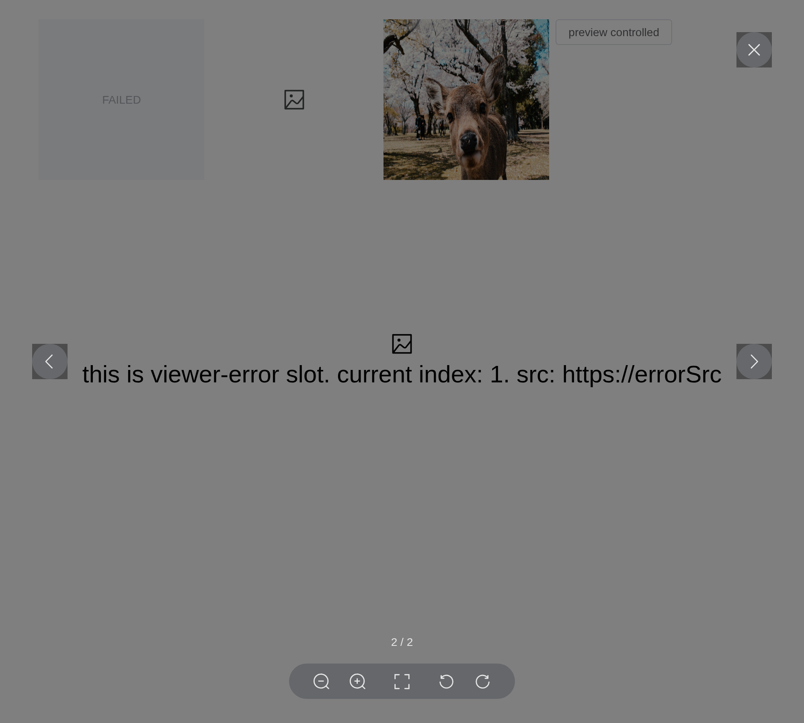

# Image

Besides the native features of img, support lazy load, custom
placeholder and load failure, etc.

## Basic Usage

Indicate how the image should be resized to fit its container by `fit`,
same as native
[object-fit](https://developer.mozilla.org/en-US/docs/Web/CSS/object-fit).

``` r

url <- "https://fuss10.elemecdn.com/e/5d/4a731a90594a4af544c0c25941171jpeg.jpeg"
tagList(
  tags$style(
    ".demo-image .block { padding: 30px 0; text-align: center;
       border-right: solid 1px var(--el-border-color); display: inline-block;
       width: 20%; min-width: 100px; box-sizing: border-box; vertical-align: top; }
     .demo-image .block:last-child { border-right: none; }
     .demo-image .demonstration { display: block; margin-bottom: 20px;
       color: var(--el-text-color-secondary); font-size: 14px; }"
  ),
  tags$div(
    class = "demo-image",
    lapply(c("fill", "contain", "cover", "none", "scale-down"), function(f) {
      tags$div(
        class = "block",
        tags$span(class = "demonstration", f),
        el_image(src = url, fit = f, style = "width: 100px; height: 100px")
      )
    })
  )
)
```

fill

contain

cover

none

scale-down

## Placeholder

Custom placeholder content when image hasn’t loaded yet by
`slot = placeholder`

``` r

src <- "https://cube.elemecdn.com/6/94/4d3ea53c084bad6931a56d5158a48jpeg.jpeg"
tagList(
  tags$style(
    ".demo-image__placeholder .block { padding: 30px 0; text-align: center;
       border-right: solid 1px var(--el-border-color); display: inline-block;
       width: 49%; box-sizing: border-box; vertical-align: top; }
     .demo-image__placeholder .demonstration { display: block; margin-bottom: 20px;
       color: var(--el-text-color-secondary); font-size: 14px; }
     .demo-image__placeholder .el-image { padding: 0 5px; max-width: 300px;
       max-height: 200px; }
     .demo-image__placeholder .image-slot { display: flex; justify-content: center;
       align-items: center; width: 100%; height: 100%;
       background: var(--el-fill-color-light);
       color: var(--el-text-color-secondary); font-size: 14px; }
     .demo-image__placeholder .dot { animation: dot 2s infinite steps(3, start);
       overflow: hidden; }"
  ),
  tags$div(
    class = "demo-image__placeholder",
    tags$div(
      class = "block",
      tags$span(class = "demonstration", "Default"),
      el_image(src = src)
    ),
    tags$div(
      class = "block",
      tags$span(class = "demonstration", "Custom"),
      el_image(
        src = src,
        slots = list(
          placeholder = tags$div(
            class = "image-slot",
            "Loading",
            tags$span(class = "dot", "...")
          )
        )
      )
    )
  )
)
```

Default

Custom

## Load Failed

Custom failed content when error occurs to image load by `slot = error`
and `slot = viewer-error`.

The third image’s preview has a picture that fails to load, drawn by its
`viewer-error` slot; the button opens the same list in an
[`el_image_viewer()`](https://kaipingyang.github.io/shiny.element/reference/el_image_viewer.md),
with `update_el_image_viewer(visible = TRUE)`.

``` r

url <- "https://fuss10.elemecdn.com/a/3f/3302e58f9a181d2509f3dc0fa68b0jpeg.jpeg"
src_list <- c(url, "https://errorSrc")
viewer_error <- template(
  slot = "viewer-error",
  scope = "{ activeIndex, src }",
  tags$div(
    class = "image-slot viewer-error",
    el_icon("Picture"),
    tags$span(
      "this is viewer-error slot. current index: {{ activeIndex }}. src:",
      "{{ src }}"
    )
  )
)
ui <- el_page(
  tags$style(
    ".demo-image__error .el-image { max-width: 300px; max-height: 200px;
       width: 100%; }
     .demo-image__error .image-slot { display: flex; justify-content: center;
       align-items: center; flex-direction: column; font-size: 30px;
       height: 200px; background: #fff; }
     .demo-image__error .image-slot .el-icon { font-size: 30px; }
     .image-viewer-slot { background: var(--el-fill-color-light); }
     .viewer-error { color: #000; }"
  ),
  tags$div(
    class = "demo-image__error",
    style = "display: flex; gap: 8px",
    el_image(),
    el_image(
      slots = list(
        error = tags$div(
          class = "image-viewer-slot image-slot",
          el_icon("Picture")
        )
      )
    ),
    el_image(
      src = url,
      preview_src_list = src_list,
      show_progress = TRUE,
      slots = list(`viewer-error` = viewer_error)
    ),
    tags$div(el_button("err_open", "preview controlled")),
    el_image_viewer(
      "err_viewer",
      url_list = src_list,
      show_progress = TRUE,
      slots = list(`viewer-error` = viewer_error)
    )
  )
)
server <- function(input, output, session) {
  observeEvent(input$err_open, {
    update_el_image_viewer(session, "err_viewer", visible = TRUE)
  })
}
shinyApp(ui, server)
```



## Lazy Load

> **Tip**
>
> Native `loading` has been supported since 2.2.3, you can use
> `loading = "lazy"` to replace `lazy = true`.
>
> If the current browser supports native lazy loading, the native lazy
> loading will be used first, otherwise will be implemented through
> scroll.

Use lazy load by `lazy = true`. Image will load until scroll into view
when set. You can indicate scroll container that adds scroll listener to
by `scroll-container`. If undefined, will be the nearest parent
container whose overflow property is auto or scroll.

``` r

urls <- paste0(
  "https://fuss10.elemecdn.com/",
  c(
    "a/3f/3302e58f9a181d2509f3dc0fa68b0jpeg.jpeg",
    "1/34/19aa98b1fcb2781c4fba33d850549jpeg.jpeg",
    "0/6f/e35ff375812e6b0020b6b4e8f9583jpeg.jpeg",
    "9/bb/e27858e973f5d7d3904835f46abbdjpeg.jpeg",
    "d/e6/c4d93a3805b3ce3f323f7974e6f78jpeg.jpeg",
    "3/28/bbf893f792f03a54408b3b7a7ebf0jpeg.jpeg",
    "2/11/6535bcfb26e4c79b48ddde44f4b6fjpeg.jpeg"
  )
)
tagList(
  tags$style(
    ".demo-image__lazy { height: 400px; overflow-y: auto; }
     .demo-image__lazy .el-image { display: block; min-height: 200px;
       margin-bottom: 10px; }
     .demo-image__lazy .el-image:last-child { margin-bottom: 0; }"
  ),
  tags$div(
    class = "demo-image__lazy",
    lapply(urls, function(u) el_image(src = u, lazy = TRUE))
  )
)
```

## Image Preview

allow big image preview by setting `previewSrcList` prop. You can
initialize the position of the first picture previewed by
`initial-index`. The default initial position is 0.

``` r

url <- "https://fuss10.elemecdn.com/a/3f/3302e58f9a181d2509f3dc0fa68b0jpeg.jpeg"
src_list <- paste0(
  "https://fuss10.elemecdn.com/",
  c(
    "a/3f/3302e58f9a181d2509f3dc0fa68b0jpeg.jpeg",
    "1/34/19aa98b1fcb2781c4fba33d850549jpeg.jpeg",
    "0/6f/e35ff375812e6b0020b6b4e8f9583jpeg.jpeg",
    "9/bb/e27858e973f5d7d3904835f46abbdjpeg.jpeg",
    "d/e6/c4d93a3805b3ce3f323f7974e6f78jpeg.jpeg",
    "3/28/bbf893f792f03a54408b3b7a7ebf0jpeg.jpeg",
    "2/11/6535bcfb26e4c79b48ddde44f4b6fjpeg.jpeg"
  )
)
tags$div(
  class = "demo-image__preview",
  el_image(
    src = url,
    zoom_rate = 1.2,
    max_scale = 7,
    min_scale = 0.2,
    preview_src_list = src_list,
    show_progress = TRUE,
    initial_index = 4,
    fit = "cover",
    style = "width: 100px; height: 100px"
  )
)
```

## Manually Open Preview

The first button opens the image’s preview from the server with
`call_el(session, "pic", "showPreview")`; the second opens an
[`el_image_viewer()`](https://kaipingyang.github.io/shiny.element/reference/el_image_viewer.md),
the viewer alone, with `update_el_image_viewer(visible = TRUE)`.

``` r

url <- "https://fuss10.elemecdn.com/a/3f/3302e58f9a181d2509f3dc0fa68b0jpeg.jpeg"
src_list <- paste0(
  "https://fuss10.elemecdn.com/",
  c(
    "a/3f/3302e58f9a181d2509f3dc0fa68b0jpeg.jpeg",
    "1/34/19aa98b1fcb2781c4fba33d850549jpeg.jpeg",
    "0/6f/e35ff375812e6b0020b6b4e8f9583jpeg.jpeg",
    "9/bb/e27858e973f5d7d3904835f46abbdjpeg.jpeg",
    "d/e6/c4d93a3805b3ce3f323f7974e6f78jpeg.jpeg",
    "3/28/bbf893f792f03a54408b3b7a7ebf0jpeg.jpeg",
    "2/11/6535bcfb26e4c79b48ddde44f4b6fjpeg.jpeg"
  )
)
ui <- el_page(
  tags$div(
    style = "display: flex; gap: 48px",
    tags$div(
      style = "display: grid; gap: 12px",
      el_button("pic_open", "openPreview with showPreview method"),
      el_image(
        "pic",
        src = url,
        show_progress = TRUE,
        preview_src_list = src_list,
        fit = "cover",
        style = "width: 100px; height: 100px"
      )
    ),
    tags$div(
      el_button("viewer_open", "preview controlled"),
      el_image_viewer(
        "viewer",
        url_list = src_list,
        show_progress = TRUE,
        initial_index = 4
      )
    )
  )
)
server <- function(input, output, session) {
  observeEvent(input$pic_open, call_el(session, "pic", "showPreview"))
  observeEvent(input$viewer_open, {
    update_el_image_viewer(session, "viewer", visible = TRUE)
  })
}
shinyApp(ui, server)
```


## Custom Toolbar

Custom toolbar content by `toolbar` slot, starting from version 2.9.7,
the slot has a new `setActiveItem` function, which can be switched
according to the index.

The `toolbar` slot’s scope has the viewer’s actions; the download link
reads the image’s own `previewSrcList`.

``` r

url <- "https://fuss10.elemecdn.com/a/3f/3302e58f9a181d2509f3dc0fa68b0jpeg.jpeg"
src_list <- paste0(
  "https://fuss10.elemecdn.com/",
  c(
    "a/3f/3302e58f9a181d2509f3dc0fa68b0jpeg.jpeg",
    "1/34/19aa98b1fcb2781c4fba33d850549jpeg.jpeg",
    "0/6f/e35ff375812e6b0020b6b4e8f9583jpeg.jpeg",
    "9/bb/e27858e973f5d7d3904835f46abbdjpeg.jpeg",
    "d/e6/c4d93a3805b3ce3f323f7974e6f78jpeg.jpeg",
    "3/28/bbf893f792f03a54408b3b7a7ebf0jpeg.jpeg",
    "2/11/6535bcfb26e4c79b48ddde44f4b6fjpeg.jpeg"
  )
)
tags$div(
  class = "demo-image__custom-toolbar",
  el_image(
    src = url,
    preview_src_list = src_list,
    fit = "cover",
    show_progress = TRUE,
    style = "width: 100px; height: 100px",
    slots = list(
      toolbar = template(
        slot = "toolbar",
        scope = "{ actions, prev, next, reset, activeIndex, setActiveItem }",
        htmltools::HTML(paste0(
          "<el-icon @click=\"prev\"><Back /></el-icon>",
          "<el-icon @click=\"next\"><Right /></el-icon>",
          "<el-icon @click=\"setActiveItem(previewSrcList.length - 1)\">",
          "<DArrowRight /></el-icon>",
          "<el-icon @click=\"actions('zoomOut')\"><ZoomOut /></el-icon>",
          "<el-icon @click=\"actions('zoomIn', { enableTransition: false, zoomRate: 2 })\">",
          "<ZoomIn /></el-icon>",
          "<el-icon @click=\"actions('clockwise', { rotateDeg: 180, enableTransition: false })\">",
          "<RefreshRight /></el-icon>",
          "<el-icon @click=\"actions('anticlockwise')\"><RefreshLeft /></el-icon>",
          "<el-icon @click=\"reset\"><Refresh /></el-icon>",
          "<a :href=\"previewSrcList[activeIndex]\" download target=\"_blank\" ",
          "style=\"color: inherit; display: flex\">",
          "<el-icon><Download /></el-icon></a>"
        ))
      )
    )
  )
)
```

## Custom progress

By setting the `show-progress` prop to control whether to display
progress when previewing an image. After version 2.9.8, the progress
content will be displayed as long as the `progress` slot is used.

``` r

url <- "https://fuss10.elemecdn.com/a/3f/3302e58f9a181d2509f3dc0fa68b0jpeg.jpeg"
src_list <- paste0(
  "https://fuss10.elemecdn.com/",
  c(
    "a/3f/3302e58f9a181d2509f3dc0fa68b0jpeg.jpeg",
    "1/34/19aa98b1fcb2781c4fba33d850549jpeg.jpeg",
    "0/6f/e35ff375812e6b0020b6b4e8f9583jpeg.jpeg",
    "9/bb/e27858e973f5d7d3904835f46abbdjpeg.jpeg",
    "d/e6/c4d93a3805b3ce3f323f7974e6f78jpeg.jpeg",
    "3/28/bbf893f792f03a54408b3b7a7ebf0jpeg.jpeg",
    "2/11/6535bcfb26e4c79b48ddde44f4b6fjpeg.jpeg"
  )
)
tags$div(
  class = "demo-image__custom-progress",
  el_image(
    src = url,
    preview_src_list = src_list,
    fit = "cover",
    style = "width: 100px; height: 100px",
    slots = list(
      progress = template(
        slot = "progress",
        scope = "{ activeIndex, total }",
        htmltools::HTML("<span>{{ activeIndex + 1 + '-' + total }}</span>")
      )
    )
  )
)
```

## API

Element Plus’s tables, and beside each entry where it is in R.

### Image Attributes

| Element | In R | Description | Type | Accepted | Default |
|----|----|----|----|----|----|
| `src` | `el_image(src =)` | image source, same as native. | [^1] |  | ’’ |
| `fit` | `el_image(fit =)` | indicate how the image should be resized to fit its container, same as [object-fit](https://developer.mozilla.org/en-US/docs/Web/CSS/object-fit). | [^2]`'' \\| 'fill' \\| 'contain' \\| 'cover' \\| 'none' \\| 'scale-down'` |  | ’’ |
| `hide-on-click-modal` | `el_image(hide_on_click_modal =)` | when enabling preview, use this flag to control whether clicking on backdrop can exit preview mode. | [^3] |  | false |
| `loading` | `el_image(loading =)` | Indicates how the browser should load the image, same as [native](https://developer.mozilla.org/en-US/docs/Web/HTML/Element/img#attr-loading). | [^4]`'eager' \\| 'lazy'` |  | — |
| `lazy` | `el_image(lazy =)` | whether to use lazy load. | [^5] |  | false |
| `scroll-container` | `el_image(scroll_container =)` | the container to add scroll listener when using lazy load. By default, the container to add scroll listener when using lazy load. | [^6] / [^7]`HTMLElement` |  | — |
| `alt` | `el_image(alt =)` | native attribute `alt`. | [^8] |  | — |
| `referrerpolicy` | `el_image(referrerpolicy =)` | native attribute [referrerPolicy](https://developer.mozilla.org/en-US/docs/Web/API/HTMLImageElement/referrerPolicy). | [^9] |  | — |
| `crossorigin` | `el_image(crossorigin =)` | native attribute [crossorigin](https://developer.mozilla.org/en-US/docs/Web/HTML/Attributes/crossorigin). | [^10]`'' \\| 'anonymous' \\| 'use-credentials'` |  | — |
| `preview-src-list` | `el_image(preview_src_list =)` | allow big image preview. | [^11]`string[]` |  | \[\] |
| `z-index` | `el_image(z_index =)` | set image preview z-index. | [^12] |  | — |
| `initial-index` | `el_image(initial_index =)` | initial preview image index, less than the length of `url-list`. | [^13] |  | 0 |
| `close-on-press-escape` | `el_image(close_on_press_escape =)` | whether the image-viewer can be closed by pressing ESC. | [^14] |  | true |
| `preview-teleported` | `el_image(preview_teleported =)` | whether to append image-viewer to body. A nested parent element attribute transform should have this attribute set to `true`. | [^15] |  | false |
| `infinite` | `el_image(infinite =)` | whether the viewer preview is infinite. | [^16] |  | true |
| `zoom-rate` | `el_image(zoom_rate =)` | the zoom rate of the image viewer zoom event. | [^17] |  | 1.2 |
| `scale` | `el_image(scale =)` | the preview image scale. | [^18] |  | 1 |
| `min-scale` | `el_image(min_scale =)` | the min scale of the image viewer zoom event. | [^19] |  | 0.2 |
| `max-scale` | `el_image(max_scale =)` | the max scale of the image viewer zoom event. | [^20] |  | 7 |
| `show-progress` | `el_image(show_progress =)` | whether to display the preview image progress content. | [^21] |  | false |

### Image Events

| Element | In R | Description |
|----|----|----|
| `load` | `input$<id>_load` | same as native load. |
| `error` | `input$<id>_error` | same as native error. |
| `switch` | `input$<id>_switch` | trigger when switching images. |
| `close` | `input$<id>_close` | trigger when clicking on close button or when `hide-on-click-modal` enabled clicking on backdrop. |
| `show` | `input$<id>_show` | trigger when the viewer displays |

### Image Slots

| Element | In R | Description |
|----|----|----|
| `placeholder` | `slots = list(placeholder = )` | custom placeholder content when image hasn’t loaded yet. |
| `error` | `slots = list(error = )` | custom image load failed content. |
| `viewer` | `slots = list(viewer = )` | custom content when image preview. |

### Image Exposes

| Element | In R | Description |
|----|----|----|
| `showPreview` | `call_el(session, id, "showPreview")` | manually open preview big image |

### Image Viewer Attributes

| Element | In R | Description | Type | Accepted | Default |
|----|----|----|----|----|----|
| `url-list` | `el_image_viewer(url_list =)` | preview link list. | [^22]`string[]` |  | \[\] |
| `z-index` | `el_image(z_index =)` | preview backdrop z-index. | [^23] / [^24] |  | — |
| `initial-index` | `el_image(initial_index =)` | the initial preview image index, less than or equal to the length of `url-list`. | [^25] |  | 0 |
| `infinite` | `el_image(infinite =)` | whether preview is infinite. | [^26] |  | true |
| `hide-on-click-modal` | `el_image(hide_on_click_modal =)` | whether user can emit close event when clicking backdrop. | [^27] |  | false |
| `teleported` | `el_image_viewer(teleported =)` | whether to append image itself to body. A nested parent element attribute transform should have this attribute set to `true`. | [^28] |  | false |
| `zoom-rate` | `el_image(zoom_rate =)` | the zoom rate of the image viewer zoom event. | [^29] |  | 1.2 |
| `scale` | `el_image(scale =)` | the preview image scale. | [^30] |  | 1 |
| `min-scale` | `el_image(min_scale =)` | the min scale of the image viewer zoom event. | [^31] |  | 0.2 |
| `max-scale` | `el_image(max_scale =)` | the max scale of the image viewer zoom event. | [^32] |  | 7 |
| `close-on-press-escape` | `el_image(close_on_press_escape =)` | whether the image-viewer can be closed by pressing ESC. | [^33] |  | true |
| `show-progress` | `el_image(show_progress =)` | whether to display the preview image progress content | [^34] |  | false |

### Image Viewer Events

| Element | In R | Description |
|----|----|----|
| `close` | `input$<id>_close` | trigger when clicking on close button or when `hide-on-click-modal` enabled clicking on backdrop. |
| `error` | `input$<id>_error` | same as native error. |
| `switch` | `input$<id>_switch` | trigger when switching images. |
| `rotate` | `input$<id>_rotate` | trigger when rotating images. |

### Image Viewer Slots

| Element | In R | Description |
|----|----|----|
| `default` | default content | custom content |
| `progress` | `slots = list(progress = )` | custom progress content (Priority is higher than `show-progress` prop) |
| `toolbar` | `slots = list(toolbar = )` | custom toolbar content |
| `viewer-error` | `slots = list(viewer-error = )` | custom image load failed content. |

### Image Viewer Exposes

| Element | In R | Description |
|----|----|----|
| `setActiveItem` | `call_el(session, id, "setActiveItem")` | manually switch image |

[^1]: string

[^2]: enum

[^3]: boolean

[^4]: enum

[^5]: boolean

[^6]: string

[^7]: object

[^8]: string

[^9]: string

[^10]: enum

[^11]: array

[^12]: number

[^13]: number

[^14]: boolean

[^15]: boolean

[^16]: boolean

[^17]: number

[^18]: number

[^19]: number

[^20]: number

[^21]: boolean

[^22]: array

[^23]: number

[^24]: string

[^25]: number

[^26]: boolean

[^27]: boolean

[^28]: boolean

[^29]: number

[^30]: number

[^31]: number

[^32]: number

[^33]: boolean

[^34]: boolean
