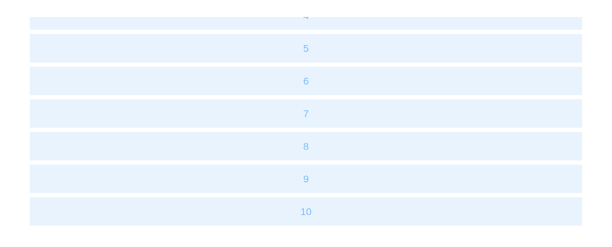

# InfiniteScroll

Load more while reaching the bottom. `input$<id>_load` rises by one each
time more is wanted; the server renders it into a
[`uiOutput()`](https://rdrr.io/pkg/shiny/man/htmlOutput.html) inside.

## Basic usage

``` r

ui <- el_page(el_infinite_scroll("feed", height = "300px", uiOutput("rows")))

server <- function(input, output, session) {
  n <- reactiveVal(10)
  observeEvent(input$feed_load, n(n() + 5))
  output$rows <- renderUI(tags$ul(style = "padding: 0; margin: 0",
    lapply(seq_len(n()), function(i) tags$li(style = "list-style: none; height: 40px; line-height: 40px; background: #e8f3fe; margin: 6px; color: #7dbcfc; text-align: center", i))))
}

shinyApp(ui, server)
```



## Disable loading

`update_el_infinite_scroll(disabled = TRUE)` stops asking – while a load
is under way, and when there is nothing more.

``` r

ui <- el_page(el_infinite_scroll("list", height = "300px", uiOutput("items")), textOutput("note"))

server <- function(input, output, session) {
  n <- reactiveVal(10)
  observeEvent(input$list_load, {
    if (n() >= 20) return(update_el_infinite_scroll(id = "list", disabled = TRUE))
    n(n() + 2)
  })
  output$items <- renderUI(tags$ul(lapply(seq_len(n()), function(i) tags$li(i))))
  output$note <- renderText(if (n() >= 20) "No more" else "")
}

shinyApp(ui, server)
```


## API

### Attributes

| Element | In R | Description | Type | Accepted | Default |
|----|----|----|----|----|----|
| `infinite-scroll-disabled` | `disabled` | is disabled | boolean | \- | false |
| `infinite-scroll-delay` | `delay` | throttle delay (ms) | number | \- | 200 |
| `infinite-scroll-distance` | `distance` | trigger distance (px) | number | \- | 0 |
| `infinite-scroll-immediate` | `immediate` | Whether to execute the loading method immediately, in case the content cannot be filled up in the initial state. | boolean | \- | true |
