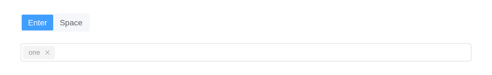
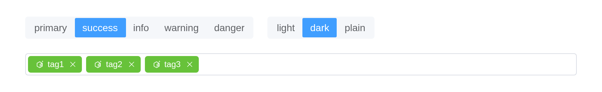

# InputTag

The InputTag component allows users to add content as tags.

## Basic Usage

Press the Enter key to add the input as a tag.

``` r

el_input_tag(
  "tags",
  placeholder = "Please input",
  aria_label = "Please click the Enter key after input"
)
```

## Custom Trigger

You can customize the key used to trigger the input tag. The default key
is Enter.

The segmented control sets the key that makes a tag, with
`update_el_input_tag(trigger =)`.

``` r

ui <- el_page(
  tags$div(
    el_segmented("tags_key", value = "Space", options = c("Enter", "Space"))
  ),
  tags$br(),
  el_input_tag("tags_trigger", trigger = "Space", placeholder = "Please input")
)
server <- function(input, output, session) {
  observeEvent(input$tags_key, ignoreInit = TRUE, {
    update_el_input_tag(session, "tags_trigger", trigger = input$tags_key)
  })
}
shinyApp(ui, server)
```



## Maximum Tags

You can set a limit on the number of tags that can be added.

``` r

el_input_tag("tags_max", max = 3, placeholder = "enter up to 3 tags")
```

## Collapse Tags

Use the collapse tags attribute to merge them into one piece of text.
You can use the collapse tags tooltip property to enable the behavior of
hovering over collapsed text to display specific selected values. Using
the collapse tags tooltip attribute will render the max attribute
invalid.

``` r

words <- c("tag1", "tag2", "tag3", "tag4", "tag5")
tags$div(
  tags$p("use collapse-tags"),
  el_input_tag(
    "tags_col1",
    value = words,
    collapse_tags = TRUE,
    placeholder = "Please input",
    aria_label = "Please click the Enter key after input"
  ),
  tags$p("use collapse-tags-tooltip"),
  el_input_tag(
    "tags_col2",
    value = words,
    collapse_tags = TRUE,
    collapse_tags_tooltip = TRUE,
    placeholder = "Please input",
    aria_label = "Please click the Enter key after input"
  ),
  tags$p("use max-collapse-tags"),
  el_input_tag(
    "tags_col3",
    value = words,
    collapse_tags = TRUE,
    collapse_tags_tooltip = TRUE,
    max_collapse_tags = 3,
    placeholder = "Please input",
    aria_label = "Please click the Enter key after input"
  )
)
```

use collapse-tags

use collapse-tags-tooltip

use max-collapse-tags

## Disabled

You can set the InputTag to be disabled.

``` r

el_input_tag(
  "tags_dis",
  value = c("tag1", "tag2", "tag3"),
  disabled = TRUE,
  placeholder = "Please input"
)
```

## Clearable

You can set whether to show the clear button.

``` r

el_input_tag(
  "tags_clear",
  value = c("tag1", "tag2", "tag3"),
  clearable = TRUE,
  placeholder = "Please input"
)
```

## Custom Clear Icon

You can customize the clear icon by setting the `clear-icon` attribute.

``` r

el_input_tag(
  "tags_clear_icon",
  value = c("custom", "clear", "icon"),
  clearable = TRUE,
  clear_icon = "CloseBold",
  placeholder = "Custom clear icon"
)
```

## Draggable

You can set whether tags can be dragged.

``` r

el_input_tag(
  "tags_drag",
  value = c("tag1", "tag2", "tag3"),
  draggable = TRUE,
  placeholder = "Please input"
)
```

## Delimiter

You can add a tag when a delimiter is matched.

``` r

el_input_tag(
  "tags_delim",
  draggable = TRUE,
  delimiter = ",",
  placeholder = "Try to separate words with ,"
)
```

## Sizes

Add `size` attribute to change the size of InputTag. In addition to the
default size, there are two other options: `large`, `small`.

``` r

tagList(
  el_input_tag("tags_l", size = "large", placeholder = "Please input"),
  tags$br(),
  el_input_tag("tags_d", placeholder = "Please input"),
  tags$br(),
  el_input_tag("tags_s", size = "small", placeholder = "Please input")
)
```

  

  

## Custom Tag

You can customize the tag content by `tag` slot.

The segmented controls set the tags’ `tag_type` and `tag_effect`, with
[`update_el_input_tag()`](https://kaipingyang.github.io/shiny.element/reference/el_input_tag.md);
the `tag` slot draws each one.

``` r

ui <- el_page(
  tags$div(
    style = "display: flex; gap: 20px",
    el_segmented(
      "tags_type",
      value = "primary",
      options = c("primary", "success", "info", "warning", "danger")
    ),
    el_segmented(
      "tags_effect",
      value = "plain",
      options = c("light", "dark", "plain")
    )
  ),
  tags$br(),
  el_input_tag(
    "tags_tpl",
    value = c("tag1", "tag2", "tag3"),
    tag_type = "primary",
    tag_effect = "plain",
    placeholder = "Please input",
    slots = list(
      tag = template(
        slot = "tag",
        scope = "{ value }",
        tags$div(
          style = "display: flex; align-items: center",
          el_icon("ElementPlus", style = "margin-right: 4px"),
          tags$span("{{ value }}")
        )
      )
    )
  )
)
server <- function(input, output, session) {
  observeEvent(input$tags_type, ignoreInit = TRUE, {
    update_el_input_tag(session, "tags_tpl", tag_type = input$tags_type)
  })
  observeEvent(input$tags_effect, ignoreInit = TRUE, {
    update_el_input_tag(session, "tags_tpl", tag_effect = input$tags_effect)
  })
}
shinyApp(ui, server)
```



## Custom Prefix and Suffix

You can customize the prefix and suffix of the InputTag by `prefix` and
`suffix` slot.

``` r

el_input_tag(
  "tags_ps",
  clearable = TRUE,
  placeholder = "Please input",
  slots = list(prefix = el_icon("ElementPlus"), suffix = el_icon("Search"))
)
```

## API

Element Plus’s tables, and beside each entry where it is in R.

### Attributes

| Element | In R | Description | Type | Accepted | Default |
|----|----|----|----|----|----|
| `model-value` | `value`; `input$<id>` | binding value | [^1]`string[]` |  | — |
| `max` | `max` | max number tags that can be enter | [^2] |  | — |
| `tag-type` | `tag_type` | tag type | [^3]`'' \\| 'success' \\| 'info' \\| 'warning' \\| 'danger'` |  | info |
| `tag-effect` | `tag_effect` | tag effect | [^4]`'' \\| 'light' \\| 'dark' \\| 'plain'` |  | light |
| `effect` | `effect` | tooltip theme, built-in theme: `dark` / `light` | [^5]`'dark' \\| 'light'` / [^6] |  | light |
| `trigger` | `trigger` | the key to trigger input tag | [^7]`'Enter' \\| 'Space'` |  | Enter |
| `draggable` | `draggable` | whether tags can be dragged | [^8] |  | false |
| `delimiter` | `delimiter` | add a tag when a delimiter is matched | [^9] / [^10] |  | — |
| `size` | `size` | input box size | [^11]`'large' \\| 'default' \\| 'small'` |  | — |
| `collapse-tags` | `collapse_tags` | whether to collapse tags to a text when multiple selecting | [^12] |  | false |
| `collapse-tags-tooltip` | `collapse_tags_tooltip` | whether show all selected tags when mouse hover text of collapse-tags. To use this, collapse-tags must be true | [^13] |  | false |
| `save-on-blur` | `save_on_blur` | whether to save the input value when the input loses focus | [^14] |  | true |
| `clearable` | `clearable` | whether to show clear button | [^15] |  | false |
| `clear-icon` | `clear_icon` | custom clear icon component | [^16] / [^17]`Component` |  | CircleClose |
| `disabled` | `disabled` | whether to disable input-tag | [^18] |  | false |
| `validate-event` | `validate_event` | whether to trigger form validation | [^19] |  | true |
| `readonly` | `readonly` | same as `readonly` in native input | [^20] |  | false |
| `autofocus` | `autofocus` | same as `autofocus` in native input | [^21] |  | false |
| `id` | `id`, the Shiny input’s | same as `id` in native input | [^22] |  | — |
| `tabindex` | `tabindex` | same as `tabindex` in native input | [^23] / [^24] |  | — |
| `max-collapse-tags` | `max_collapse_tags` | the max tags number to be shown. To use this, collapse-tags must be true | [^25] |  | 1 |
| `maxlength` | `maxlength` | same as `maxlength` in native input | [^26] / [^27] |  | — |
| `minlength` | `minlength` | same as `minlength` in native input | [^28] / [^29] |  | — |
| `placeholder` | `placeholder` | placeholder of input | [^30] |  | — |
| `autocomplete` | `autocomplete` | same as `autocomplete` in native input | [^31] |  | off |
| `aria-label` | `aria_label` | native `aria-label` attribute | [^32] |  | — |

### Events

| Element | In R | Description |
|----|----|----|
| `change` | `input$<id>`, the value | triggers when the modelValue change |
| `input` | `input$<id>_input` | triggers when the input value change |
| `add-tag` | `input$<id>_add_tag` | triggers when a tag is added |
| `remove-tag` | `input$<id>_remove_tag` | triggers when a tag is removed |
| `drag-tag` | `input$<id>_drag_tag` | triggers when a tag is dragged |
| `focus` | `input$<id>_focus` | triggers when InputTag focuses |
| `blur` | `input$<id>_blur` | triggers when InputTag blurs |
| `clear` | `input$<id>_clear` | triggers when the clear icon is clicked |

### Slots

| Element  | In R                      | Description                |
|----------|---------------------------|----------------------------|
| `tag`    | `slots = list(tag = )`    | content as tag             |
| `prefix` | `slots = list(prefix = )` | content as InputTag prefix |
| `suffix` | `slots = list(suffix = )` | content as InputTag suffix |

### Exposes

| Element | In R                            | Description             |
|---------|---------------------------------|-------------------------|
| `focus` | `call_el(session, id, "focus")` | focus the input element |
| `blur`  | `call_el(session, id, "blur")`  | blur the input element  |

[^1]: array

[^2]: number

[^3]: enum

[^4]: enum

[^5]: enum

[^6]: string

[^7]: enum

[^8]: boolean

[^9]: string

[^10]: regex

[^11]: enum

[^12]: boolean

[^13]: boolean

[^14]: boolean

[^15]: boolean

[^16]: string

[^17]: object

[^18]: boolean

[^19]: boolean

[^20]: boolean

[^21]: boolean

[^22]: string

[^23]: string

[^24]: number

[^25]: number

[^26]: string

[^27]: number

[^28]: string

[^29]: number

[^30]: string

[^31]: string

[^32]: string
