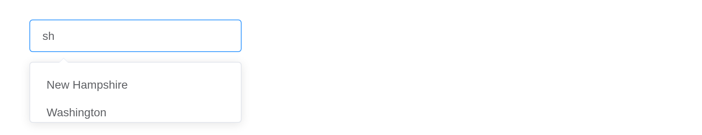

# Input

Input data using mouse or keyboard. `input$<id>` is the text, reported a
quarter-second after the user stops typing, as
[`textInput()`](https://rdrr.io/pkg/shiny/man/textInput.html) does.

## Basic usage

``` r

el_input("text", placeholder = "Please input", width = "240px")
```

## Disabled

``` r

el_input("dis", placeholder = "Please input", disabled = TRUE, width = "240px")
```

## Clearable

``` r

el_input("clr", value = "Clear me", clearable = TRUE, width = "240px")
```

## Password box

``` r

el_input("pwd", value = "secret", show_password = TRUE, width = "240px")
```

## Input with icon

`prefix_icon` and `suffix_icon` take icon classes; the `prefix` and
`suffix` slots take markup.

``` r

el_input("ic1", placeholder = "Pick a date", suffix_icon = "el-icon-date", width = "240px")
el_input("ic2", placeholder = "Type something", prefix_icon = "el-icon-search", width = "240px")
el_input("ic3", placeholder = "Slot", width = "240px", slots = list(
  suffix = el$icon("date", class = "el-input__icon")))
```

## Textarea

``` r

el_input("ta", type = "textarea", rows = 2, placeholder = "Please input", width = "400px")
```

## Autosize textarea

`autosize` grows the box with its text, between optional row limits.

``` r

el_input("as1", type = "textarea", autosize = TRUE, placeholder = "Please input", width = "400px")
tags$div(style = "height: 16px")
el_input("as2", type = "textarea", autosize = list(minRows = 2, maxRows = 4),
         placeholder = "Please input", width = "400px")
```

## Mixed input

The `prepend` and `append` slots put an element before or after the
input.

``` r

el_input("m1", placeholder = "Please input", width = "420px",
         slots = list(prepend = "Http://"))
tags$div(style = "height: 16px")
el_input("m2", placeholder = "Please input", width = "420px", slots = list(append = ".com"))
tags$div(style = "height: 16px")
el_input("m3", placeholder = "Please input", width = "420px", slots = list(
  append = el$button(slot = "append", icon = "el-icon-search")))
```

## Sizes

``` r

tagList(lapply(c("default", "medium", "small", "mini"), function(s)
  el_input(paste0("sz_", s), placeholder = s, size = if (s != "default") s,
           suffix_icon = "el-icon-date", width = "200px")))
```

## Autocomplete

[`el_autocomplete()`](https://kaipingyang.github.io/shiny.element/reference/el_autocomplete.md)
suggests as the user types, from a list sent with the page, or – with
`remote = TRUE` – from the server.

``` r

el_autocomplete("rest", placeholder = "Please input", width = "260px",
                suggestions = c("vue", "element", "cooking", "mint-ui", "vuex", "vue-router", "babel"))
```

## Custom template

The `default` slot, scoped with `item`, draws each suggestion.

``` r

el_autocomplete("tpl", width = "300px", placeholder = "Please input", suggestions = list(
  list(value = "vue", link = "https://github.com/vuejs/vue"),
  list(value = "element", link = "https://github.com/ElemeFE/element"),
  list(value = "vuex", link = "https://github.com/vuejs/vuex")),
  slots = list(default = template(
    tags$div(style = "line-height: 1.2; padding: 6px 0",
      tags$div("{{ item.value }}"),
      tags$span(style = "font-size: 12px; color: #b4b4b4", "{{ item.link }}")),
    scope = "{ item }")))
```

## Remote search

``` r

ui <- el_page(el_autocomplete("state", remote = TRUE, placeholder = "A state", width = "260px"))

server <- function(input, output, session) {
  observeEvent(input$state_query, {
    hits <- grep(input$state_query, state.name, ignore.case = TRUE, value = TRUE)
    update_el_autocomplete(id = "state", suggestions = head(hits, 8))
  })
}

shinyApp(ui, server)
```



## Limit length

``` r

el_input("lim1", value = "Hello", maxlength = 10, show_word_limit = TRUE, width = "300px")
tags$div(style = "height: 16px")
el_input("lim2", type = "textarea", maxlength = 30, show_word_limit = TRUE, width = "300px")
```

## API

### Input Attributes

| Element | In R | Description | Type | Accepted | Default |
|----|----|----|----|----|----|
| `type` | `el_input(type =)` | type of input | string | text, textarea and other [native input types](https://developer.mozilla.org/en-US/docs/Web/HTML/Element/input#Form_%3Cinput%3E_types) | text |
| `value` | `el_input(value =)` | binding value | string / number | — | — |
| `maxlength` | `el_input(maxlength =)` | same as `maxlength` in native input | number | — | — |
| `minlength` | `el_input(minlength =)` | same as `minlength` in native input | number | — | — |
| `show-word-limit` | `el_input(show_word_limit =)` | whether show word count，only works when `type` is ‘text’ or ‘textarea’ | boolean | — | false |
| `placeholder` | `el_input(placeholder =)` | placeholder of Input | string | — | — |
| `clearable` | `el_input(clearable =)` | whether to show clear button | boolean | — | false |
| `show-password` | `el_input(show_password =)` | whether to show toggleable password input | boolean | — | false |
| `disabled` | `el_input(disabled =)` | whether Input is disabled | boolean | — | false |
| `size` | `el_input(size =)` | size of Input, works when `type` is not ‘textarea’ | string | medium / small / mini | — |
| `prefix-icon` | `el_input(prefix_icon =)` | prefix icon class | string | — | — |
| `suffix-icon` | `el_input(suffix_icon =)` | suffix icon class | string | — | — |
| `rows` | `el_input(rows =)` | number of rows of textarea, only works when `type` is ‘textarea’ | number | — | 2 |
| `autosize` | `el_input(autosize =)` | whether textarea has an adaptive height, only works when `type` is ‘textarea’. Can accept an object, e.g. { minRows: 2, maxRows: 6 } | boolean / object | — | false |
| `autocomplete` | `el_input(autocomplete =)` | same as `autocomplete` in native input | string | on/off | off |
| `auto-complete` | `(deprecated upstream;`autocomplete`)` | @DEPRECATED in next major version | string | on/off | off |
| `name` | `el_input(name =)` | same as `name` in native input | string | — | — |
| `readonly` | `el_input(readonly =)` | same as `readonly` in native input | boolean | — | false |
| `max` | `el_input(max =)` | same as `max` in native input | — | — | — |
| `min` | `el_input(min =)` | same as `min` in native input | — | — | — |
| `step` | `el_input(step =)` | same as `step` in native input | — | — | — |
| `resize` | `el_input(resize =)` | control the resizability | string | none, both, horizontal, vertical | — |
| `autofocus` | `el_input(autofocus =)` | same as `autofocus` in native input | boolean | — | false |
| `form` | `el_input(form =)` | same as `form` in native input | string | — | — |
| `label` | `el_input(label =)` | label text | string | — | — |
| `tabindex` | `el_input(tabindex =)` | input tabindex | string | \- | \- |
| `validate-event` | `el_input(validate_event =)` | whether to trigger form validation | boolean | \- | true |

### Input Events

| Element | In R | Description |
|----|----|----|
| `blur` | `input$<id>_blur` | triggers when Input blurs |
| `focus` | `input$<id>_focus` | triggers when Input focuses |
| `change` | `input$<id>_change` | triggers only when the input box loses focus or the user presses Enter |
| `input` | `input$<id>_input` | triggers when the Input value change |
| `clear` | `input$<id>_clear` | triggers when the Input is cleared by clicking the clear button |

### Input Methods

| Element  | In R                             | Description                      |
|----------|----------------------------------|----------------------------------|
| `focus`  | `el_call(session, id, "focus")`  | focus the input element          |
| `blur`   | `el_call(session, id, "blur")`   | blur the input element           |
| `select` | `el_call(session, id, "select")` | select the text in input element |

### Autocomplete Attributes

| Element | In R | Description | Type | Accepted | Default |
|----|----|----|----|----|----|
| `placeholder` | `el_input(placeholder =)` | the placeholder of Autocomplete | string | — | — |
| `clearable` | `el_input(clearable =)` | whether to show clear button | boolean | — | false |
| `disabled` | `el_input(disabled =)` | whether Autocomplete is disabled | boolean | — | false |
| `value-key` | `el_autocomplete(value_key =)` | key name of the input suggestion object for display | string | — | value |
| `icon` | `el_autocomplete(icon =)` | icon name | string | — | — |
| `value` | `el_input(value =)` | binding value | string | — | — |
| `debounce` | `el_autocomplete(debounce =)` | debounce delay when typing, in milliseconds | number | — | 300 |
| `placement` | `el_autocomplete(placement =)` | placement of the popup menu | string | top / top-start / top-end / bottom / bottom-start / bottom-end | bottom-start |
| `fetch-suggestions` | `el_autocomplete(fetch_suggestions =)` | a method to fetch input suggestions. When suggestions are ready, invoke `callback(data:[])` to return them to Autocomplete | Function(queryString, callback) | — | — |
| `popper-class` | `el_autocomplete(popper_class =)` | custom class name for autocomplete’s dropdown | string | — | — |
| `trigger-on-focus` | `el_autocomplete(trigger_on_focus =)` | whether show suggestions when input focus | boolean | — | true |
| `name` | `el_input(name =)` | same as `name` in native input | string | — | — |
| `select-when-unmatched` | `el_autocomplete(select_when_unmatched =)` | whether to emit a `select` event on enter when there is no autocomplete match | boolean | — | false |
| `label` | `el_input(label =)` | label text | string | — | — |
| `prefix-icon` | `el_input(prefix_icon =)` | prefix icon class | string | — | — |
| `suffix-icon` | `el_input(suffix_icon =)` | suffix icon class | string | — | — |
| `hide-loading` | `el_autocomplete(hide_loading =)` | whether to hide the loading icon in remote search | boolean | — | false |
| `popper-append-to-body` | `el_autocomplete(popper_append_to_body =)` | whether to append the dropdown to body. If the positioning of the dropdown is wrong, you can try to set this prop to false | boolean | \- | true |
| `highlight-first-item` | `el_autocomplete(highlight_first_item =)` | whether to highlight first item in remote search suggestions by default | boolean | — | false |

### Autocomplete Slots

| Element   | In R                       | Description                     |
|-----------|----------------------------|---------------------------------|
| `prefix`  | `slots = list(prefix = )`  | content as Input prefix         |
| `suffix`  | `slots = list(suffix = )`  | content as Input suffix         |
| `prepend` | `slots = list(prepend = )` | content to prepend before Input |
| `append`  | `slots = list(append = )`  | content to append after Input   |

### Autocomplete Events

| Element | In R | Description |
|----|----|----|
| `select` | `input$<id>_select` | triggers when a suggestion is clicked |
| `change` | `input$<id>_change` | triggers when the icon inside Input value change |

### Autocomplete Methods

| Element | In R                            | Description             |
|---------|---------------------------------|-------------------------|
| `focus` | `el_call(session, id, "focus")` | focus the input element |
