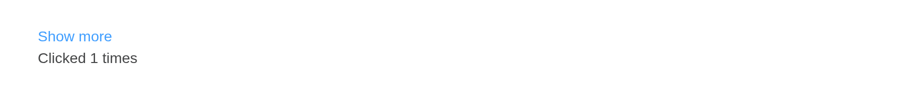

# Link

Text hyperlink. Given an `id`, a link counts its clicks as
[`actionLink()`](https://rdrr.io/pkg/shiny/man/actionButton.html) does.

## Basic

``` r

types <- c("default", "primary", "success", "warning", "danger", "info")
tagList(lapply(types, function(t) tags$span(style = "margin-right: 16px",
  el_link(tools::toTitleCase(t), href = if (t == "default") "https://element.eleme.io",
          type = t))))
```

[Default](https://element.eleme.io) Primary Success Warning Danger Info

## Disabled

``` r

types <- c("default", "primary", "success", "warning", "danger", "info")
tagList(lapply(types, function(t) tags$span(style = "margin-right: 16px",
  el_link(tools::toTitleCase(t), type = t, disabled = TRUE))))
```

Default Primary Success Warning Danger Info

## Underline

``` r

tags$span(style = "margin-right: 16px", el_link("Without underline", underline = FALSE))
el_link("With underline")
```

Without underline With underline

## Icon

``` r

tags$span(style = "margin-right: 16px", el_link("Edit", icon = "el-icon-edit"))
el_link(tagList("Check", el_icon("view", class = "el-icon--right")), type = "primary")
```

Edit Check

## A link the server hears

``` r

ui <- el_page(el_link("Show more", id = "more", type = "primary"), textOutput("n"))

server <- function(input, output, session) {
  output$n <- renderText(paste("Clicked", input$more, "times"))
}

shinyApp(ui, server)
```



## API

### Attributes

| Element | In R | Description | Type | Accepted | Default |
|----|----|----|----|----|----|
| `type` | `type` | type | string | primary / success / warning / danger / info | default |
| `underline` | `underline` | whether the component has underline | boolean | — | true |
| `disabled` | `disabled` | whether the component is disabled | boolean | — | false |
| `href` | `href` | same as native hyperlink’s `href` | string | — | \- |
| `icon` | `icon` | class name of icon | string | — | \- |
