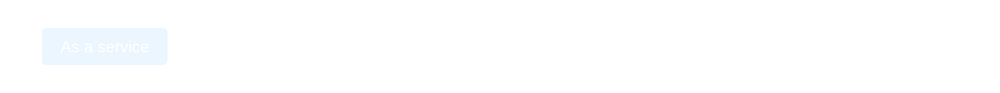

# Loading

Show animation while loading data.

## Loading inside a container

Displays animation in a container (such as a table) while loading data.

Element Plus provides two ways to invoke Loading: directive and service.
For the custom directive `v-loading`, you just need to bind a `boolean`
value to it. By default, the loading mask will append to the element
where the directive is used. Adding the `body` modifier makes the mask
append to the body element.

A table’s own `loading` draws Element Plus’s mask over it, as
`v-loading` does; `update_el_table(loading =)` turns it on and off.

``` r

el_table("ld_tbl", loading = TRUE, data = data.frame(
  Date = c("2016-05-02", "2016-05-04", "2016-05-01"), Name = c("John Smith", "John Smith", "John Smith"),
  Address = rep("No.1518,  Jinshajiang Road, Putuo District", 3)))
```

## Customization

You can customize loading text, loading spinner and background color.

Add attribute `element-loading-text` to the element on which `v-loading`
is bound, and its value will be displayed under the spinner. Similarly,
the `element-loading-spinner / element-loading-svg` and
`element-loading-background` attributes are used to set the svg icon,
background color value, and loading icon, respectively.

[`el_loading()`](https://kaipingyang.github.io/shiny.element/reference/el_loading.md)
covers an element of your choice, with your text, spinner and
background.

``` r

ui <- el_page(
  el_button("go", "Cover the table"),
  tags$div(id = "covered", el_table("ld_tbl2", data = data.frame(Date = "2016-05-02", Name = "John"))))
server <- function(input, output, session) {
  observeEvent(input$go, el_loading(session, "covering", target = "#covered", text = "Loading...",
                                    background = "rgba(122, 122, 122, 0.8)"))
}
shinyApp(ui, server)
```


> **Warning**
>
> Although the `element-loading-spinner / element-loading-svg` attribute
> supports incoming HTML fragments, it is very dangerous to dynamically
> render arbitrary HTML on the website, because it is easy to cause [XSS
> attack](https://en.wikipedia.org/wiki/Cross-site_scripting). Please
> make sure that the content of
> `element-loading-spinner / element-loading-svg` is trustworthy.
> **Never** assign user-submitted content to the
> `element-loading-spinner / element-loading-svg` attribute.

## Full screen loading

Show a full screen animation while loading data.

When used as a directive, a full screen Loading requires the
`fullscreen` modifier, and it will be appended to body. In this case, if
you wish to disable scrolling on body, you can add another modifier
`lock`. When used as a service, Loading will be full screen by default.

``` r

ui <- el_page(el_button("full", "As a service", type = "primary"))
server <- function(input, output, session) {
  observeEvent(input$full, {
    el_loading(session, "page", text = "Loading", fullscreen = TRUE, lock = TRUE)
    later::later(function() el_loading_close(session, "page"), 2)
  })
}
shinyApp(ui, server)
```



## Service

You can also invoke Loading with a service. Import Loading service:

Invoke it:

The parameter `options` is the configuration of Loading, and its details
can be found in the following table. `LoadingService` returns a Loading
instance, and you can close it by invoking its `close` method:

Note that in this case the full screen Loading is singleton. If a new
full screen Loading is invoked before an existing one is closed, the
existing full screen Loading instance will be returned instead of
actually creating another Loading instance:

Calling the `close` method on any one of them can close this full screen
Loading.

If Element Plus is imported entirely, a globally method `$loading` will
be registered to `app.config.globalProperties`. You can invoke it like
this: `this.$loading(options)`, and it also returns a Loading instance.

## App context inheritance

Now loading accepts a `context` as second parameter of the loading
constructor which allows you to inject current app’s context to loading
which allows you to inherit all the properties of the app.

You can use it like this:

> **Tip**
>
> If you globally registered ElLoading component, it will automatically
> inherit your app context.

## API

Element Plus’s tables, and beside each entry where it is in R.

### Options

| Element | In R | Description | Type | Accepted | Default |
|----|----|----|----|----|----|
| `target` | `target` | the DOM node Loading needs to cover. Accepts a DOM object or a string. If it’s a string, it will be passed to `document.querySelector` to get the corresponding DOM node | [^1] / [^2] |  | document.body |
| `body` | `body` | same as the `body` modifier of `v-loading` | [^3] |  | false |
| `fullscreen` | `fullscreen` | same as the `fullscreen` modifier of `v-loading` | [^4] |  | true |
| `lock` | `lock` | same as the `lock` modifier of `v-loading` | [^5] |  | false |
| `text` | `text` | loading text that displays under the spinner | [^6] / [^7] / [^8]`VNode[]` |  | — |
| `spinner` | `spinner` | class name of the custom spinner | [^9] |  | — |
| `background` | `background` | background color of the mask | [^10] |  | — |
| `customClass` | `custom_class` | custom class name for loading | [^11] |  | — |
| `svg` | `svg` | custom SVG element to override the default loading spinner | [^12] |  | — |
| `svgViewBox` | `svg_view_box` | sets the viewBox attribute for loading svg element | [^13] |  | — |
| `beforeClose` | `before_close` | Function executed before loading attempts to close. If this function returns false, the closing process will be aborted. Otherwise, the loading will close. | [^14]`() => boolean` |  | — |
| `closed` | [`el_loading_close()`](https://kaipingyang.github.io/shiny.element/reference/el_loading_close.md) | Function triggered after loading has completely closed | [^15]`() => void` |  | — |

[^1]: string

[^2]: HTMLElement

[^3]: boolean

[^4]: boolean

[^5]: boolean

[^6]: string

[^7]: VNode

[^8]: array

[^9]: string

[^10]: string

[^11]: string

[^12]: string

[^13]: string

[^14]: Function

[^15]: Function
