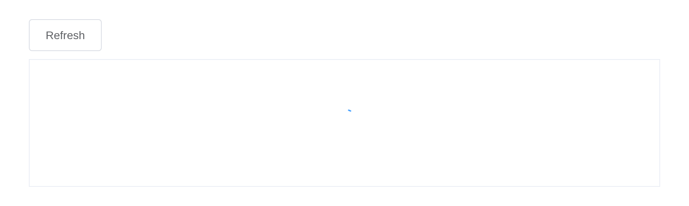
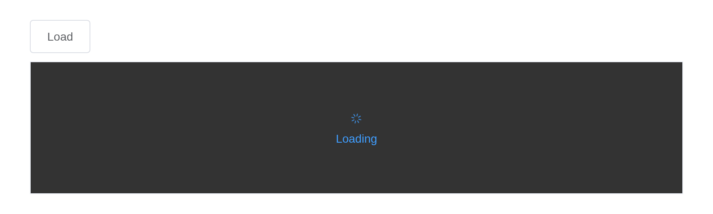

# Loading

Show animation while loading data. Element offers a directive and a
service; from the server it is the service:
[`el_loading()`](https://kaipingyang.github.io/shiny.element/reference/el_loading.md)
opens a named mask, over an element or the whole page, and
[`el_loading_close()`](https://kaipingyang.github.io/shiny.element/reference/el_loading_close.md)
shuts it. A table has `loading` of its own, the directive’s.

## Loading inside a container

``` r

ui <- el_page(
  el_button("refresh", "Refresh"),
  tags$div(id = "panel", style = "height: 160px; border: 1px solid #ebeef5; margin-top: 10px",
           tableOutput("rows")))

server <- function(input, output, session) {
  observeEvent(input$refresh, {
    el_loading(session, "busy", target = "#panel")
    on.exit(el_loading_close(session, "busy"), add = TRUE)
    Sys.sleep(3)
    output$rows <- renderTable(head(mtcars[, 1:4], 3))
  })
}

shinyApp(ui, server)
```



## Customization

`text`, `spinner` and `background` dress the mask.

``` r

ui <- el_page(
  el_button("load", "Load"),
  tags$div(id = "box", style = "height: 160px; border: 1px solid #ebeef5; margin-top: 10px"))

server <- function(input, output, session) {
  observeEvent(input$load, {
    el_loading(session, "fetch", target = "#box", text = "Loading",
               spinner = "el-icon-loading", background = "rgba(0, 0, 0, 0.8)")
    later::later(function() el_loading_close(session, "fetch"), 5)
  })
}

shinyApp(ui, server)
```



## Full screen loading

``` r

ui <- el_page(el_button("full", "As a service", type = "primary"))

server <- function(input, output, session) {
  observeEvent(input$full, {
    el_loading(session, "page", fullscreen = TRUE, lock = TRUE, text = "Loading")
    later::later(function() el_loading_close(session, "page"), 2)
  })
}

shinyApp(ui, server)
```


## API

### Options

| Element | In R | Description | Type | Accepted | Default |
|----|----|----|----|----|----|
| `target` | `target` | the DOM node Loading needs to cover. Accepts a DOM object or a string. If it’s a string, it will be passed to `document.querySelector` to get the corresponding DOM node | object/string | — | document.body |
| `body` | `body` | same as the `body` modifier of `v-loading` | boolean | — | false |
| `fullscreen` | `fullscreen` | same as the `fullscreen` modifier of `v-loading` | boolean | — | true |
| `lock` | `lock` | same as the `lock` modifier of `v-loading` | boolean | — | false |
| `text` | `text` | loading text that displays under the spinner | string | — | — |
| `spinner` | `spinner` | class name of the custom spinner | string | — | — |
| `background` | `background` | background color of the mask | string | — | — |
| `customClass` | `custom_class` | custom class name for Loading | string | — | — |
