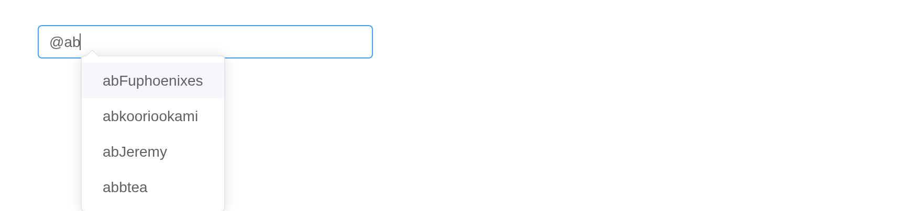
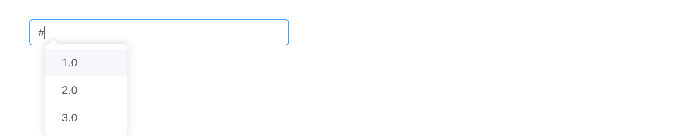
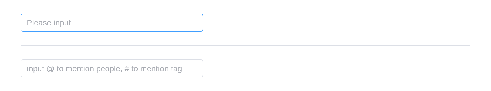

# Mention

Used to mention someone or something in an input.

## Basic Usage

The most basic usage.

``` r

el_mention(
  "mention",
  value = "@",
  width = "320px",
  placeholder = "Please input",
  options = c("Fuphoenixes", "kooriookami", "Jeremy", "btea")
)
```

## Props

You can customize the alias of the `options` through the `props`
attribute.

``` r

el_mention(
  "mention_props",
  value = "@",
  width = "320px",
  placeholder = "Please input",
  props = list(label = "name", value = "id", disabled = "unable"),
  options = list(
    list(name = "Fuphoenixes", id = "Fuphoenixes", unable = TRUE),
    list(name = "kooriookami", id = "kooriookami"),
    list(name = "Jeremy", id = "Jeremy", unable = TRUE),
    list(name = "btea", id = "btea")
  )
)
```

## Textarea

The input type can be set to `textarea`.

``` r

el_mention(
  "mention_area",
  type = "textarea",
  width = "320px",
  placeholder = "Please input",
  options = c("Fuphoenixes", "kooriookami", "Jeremy", "btea")
)
```

## Customize label

Customize label by `label` slot.

``` r

avatars <- c(
  Fuphoenixes = "https://avatars.githubusercontent.com/u/27912232",
  kooriookami = "https://avatars.githubusercontent.com/u/38392315",
  Jeremy = "https://avatars.githubusercontent.com/u/15975785",
  btea = "https://avatars.githubusercontent.com/u/24516654"
)
el_mention(
  "mention_label",
  width = "320px",
  placeholder = "Please input",
  options = unname(Map(
    function(value, avatar) list(value = value, avatar = avatar),
    names(avatars),
    avatars
  )),
  slots = list(
    label = template(
      slot = "label",
      scope = "{ item }",
      htmltools::HTML(paste0(
        "<div style=\"display: flex; align-items: center\">",
        "<el-avatar :size=\"24\" :src=\"item.avatar\" />",
        "<span style=\"margin-left: 6px\">{{ item.value }}</span></div>"
      ))
    )
  )
)
```

## Load remote options

Load options asynchronously.

`input$<id>_search` is the text after the prefix, as it is typed; the
server shows `loading` while it looks, then answers with the options.

``` r

ui <- el_page(
  el_mention("mention_load", width = "320px", placeholder = "Please input")
)
server <- function(input, output, session) {
  observeEvent(input$mention_load_search, {
    pattern <- input$mention_load_search$pattern
    update_el_mention(session, "mention_load", loading = TRUE)
    later::later(
      function() {
        names <- paste0(
          pattern,
          c("Fuphoenixes", "kooriookami", "Jeremy", "btea")
        )
        update_el_mention(
          session,
          "mention_load",
          options = stats::setNames(names, names),
          loading = FALSE
        )
      },
      1.5
    )
  })
}
shinyApp(ui, server)
```



## Customize trigger token

Customize trigger token by `prefix` props. Default to `@`,
`Array<string>` also supported.

Which list the server answers with depends on the prefix typed.

``` r

mock <- list(
  "@" = c("Fuphoenixes", "kooriookami", "Jeremy", "btea"),
  "#" = c("1.0", "2.0", "3.0")
)
ui <- el_page(
  el_mention(
    "mention_prefix",
    width = "320px",
    prefix = c("@", "#"),
    placeholder = "input @ to mention people, # to mention tag"
  )
)
server <- function(input, output, session) {
  observeEvent(input$mention_prefix_search, {
    update_el_mention(
      session,
      "mention_prefix",
      options = mock[[input$mention_prefix_search$prefix]] %||% character()
    )
  })
}
shinyApp(ui, server)
```



## Delete as a whole

Set the `whole` attribute to `true`, and when you press the backspace,
the mention will be deleted as a whole. Set the `check-is-whole`
attribute to customize the checking logic.

With `whole = TRUE` a backspace deletes a mention whole; the second
input’s `check_is_whole` decides what counts as one.

``` r

mock <- list(
  "@" = c("Fuphoenixes", "kooriookami", "Jeremy", "btea"),
  "#" = c("1.0", "2.0", "3.0")
)
ui <- el_page(
  el_mention(
    "mention_whole",
    whole = TRUE,
    width = "320px",
    placeholder = "Please input",
    options = mock[["@"]]
  ),
  el_divider(),
  el_mention(
    "mention_whole2",
    prefix = c("@", "#"),
    whole = TRUE,
    width = "320px",
    placeholder = "input @ to mention people, # to mention tag",
    check_is_whole = JS(sprintf(
      "function(pattern, prefix) { return (%s[prefix] || []).indexOf(pattern) >= 0; }",
      jsonlite::toJSON(mock)
    ))
  )
)
server <- function(input, output, session) {
  observeEvent(input$mention_whole2_search, {
    update_el_mention(
      session,
      "mention_whole2",
      options = mock[[input$mention_whole2_search$prefix]] %||% character()
    )
  })
}
shinyApp(ui, server)
```



## Work with form

to work with `el-form`.

``` r

people <- c("Fuphoenixes", "kooriookami", "Jeremy", "btea")
el_form(
  id = "mention_form",
  label_width = NULL,
  width = "600px",
  submit_label = "Submit",
  reset_label = "Reset",
  el_form_field(
    "name",
    "mention",
    label = "name",
    choices = people,
    rules = el_rule(required = TRUE, message = "Please input name")
  ),
  el_form_field(
    "desc",
    "mention-textarea",
    label = "desc",
    choices = people,
    rules = el_rule(required = TRUE, message = "Please input desc")
  )
)
```

Since this component is developed based on the component
[`el-input`](https://kaipingyang.github.io/shiny.element/articles/components/input.html#attributes)
, the original properties have not changed, so no repetition here, and
please go to the original component to view the documentation.

## API

Element Plus’s tables, and beside each entry where it is in R.

### Attributes

| Element | In R | Description | Type | Accepted | Default |
|----|----|----|----|----|----|
| `options` | `options` | mention options list | [^1]`MentionOption[]` |  | `[]` |
| `props` | `props` | configuration options | [^2]`MentionOptionProps` |  | `{value: 'value', label: 'label', disabled: 'disabled'}` |
| `prefix` | `prefix` | prefix character to trigger mentions. The string length must be exactly 1 | [^3] \\ | [^4]`string[]` |  |
| `split` | `split` | character to split mentions. The string length must be exactly 1 | [^5] |  | `' '` |
| `filter-option` | `filter_option` | customize filter option logic | [^6] \\ | [^7]`(pattern: string, option: MentionOption) => boolean` |  |
| `placement` | `placement` | set popup placement | [^8]`'bottom' \\| 'top'` |  | `'bottom'` |
| `show-arrow` | `show_arrow` | whether the dropdown panel has an arrow | [^9] |  | `false` |
| `offset` | `offset` | offset of the dropdown panel | [^10] |  | `0` |
| `whole` | `whole` | when backspace is pressed to delete, whether the mention content is deleted as a whole | [^11] |  | `false` |
| `check-is-whole` | `check_is_whole` | when backspace is pressed to delete, check if the mention is a whole | [^12]`(pattern: string, prefix: string) => boolean` |  | — |
| `loading` | `loading` | whether the dropdown panel of mentions is in a loading state | [^13] |  | `false` |
| `model-value` | `value`; `input$<id>` | input value | [^14] |  | — |
| `popper-class` | `popper_class` | custom class name for dropdown panel | [^15] / [^16] |  | ’’ |
| `popper-style` | `popper_style` | custom style for dropdown panel | [^17] / [^18] |  | — |
| `popper-options` | `popper_options` | [popper.js](https://popper.js.org/docs/v2/) parameters | [^19] refer to [popper.js doc](https://popper.js.org/docs/v2/) |  | — |

### Events

| Element | In R | Description |
|----|----|----|
| `search` | `input$<id>_search` | trigger when prefix hit |
| `select` | `input$<id>_select` | trigger when user select the option |
| `whole-remove` | `input$<id>_whole_remove` | trigger when a whole mention is removed and `whole` is `true` or `check-is-whole` is `true` |

### Slots

| Element   | In R                       | Description                           |
|-----------|----------------------------|---------------------------------------|
| `label`   | `slots = list(label = )`   | content as option label               |
| `loading` | `slots = list(loading = )` | content as option loading             |
| `header`  | `slots = list(header = )`  | content at the top of the dropdown    |
| `footer`  | `slots = list(footer = )`  | content at the bottom of the dropdown |

[^1]: array

[^2]: object

[^3]: string

[^4]: array

[^5]: string

[^6]: false

[^7]: Function

[^8]: string

[^9]: boolean

[^10]: number

[^11]: boolean

[^12]: Function

[^13]: boolean

[^14]: string

[^15]: string

[^16]: object

[^17]: string

[^18]: object

[^19]: object
