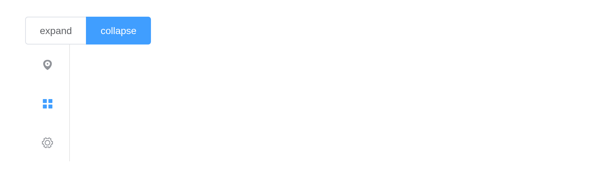

# NavMenu

Menu that provides navigation for your website. `items` nests to any
depth: an item is `list(index =, label =, icon =)`, with `children` it
is a submenu, and with `group = TRUE` a group. `input$<id>` is the index
chosen, `input$<id>_path` the indexes down to it; `active` is the
current item, and
[`update_el_menu()`](https://kaipingyang.github.io/shiny.element/reference/update_el_menu.md)
moves it.

## Top bar

``` r

items <- list(
  list(index = "1", label = "Processing Center"),
  list(index = "2", label = "Workspace", children = list(
    list(index = "2-1", label = "item one"), list(index = "2-2", label = "item two"),
    list(index = "2-4", label = "item four", children = list(
      list(index = "2-4-1", label = "item one"), list(index = "2-4-2", label = "item two"))))),
  list(index = "3", label = "Info", disabled = TRUE),
  list(index = "4", label = "Orders"))
el_menu("top", mode = "horizontal", active = "1", items = items)
tags$div(style = "height: 20px")
el_menu("dark", mode = "horizontal", active = "1", items = items,
        background_color = "#545c64", text_color = "#fff", active_text_color = "#ffd04b")
```

## Side bar

``` r

el_menu("side", active = "2", width = "240px", items = list(
  list(index = "1", label = "Navigator One", icon = "el-icon-location", children = list(
    list(label = "Group One", group = TRUE, children = list(
      list(index = "1-1", label = "item one"), list(index = "1-2", label = "item two"))),
    list(index = "1-4", label = "item four", children = list(list(index = "1-4-1", label = "item one"))))),
  list(index = "2", label = "Navigator Two", icon = "el-icon-menu"),
  list(index = "3", label = "Navigator Three", icon = "el-icon-document", disabled = TRUE),
  list(index = "4", label = "Navigator Four", icon = "el-icon-setting")))
```

## Collapse

`collapse` folds a vertical menu to its icons;
`update_el_menu(collapse =)` toggles it.

``` r

ui <- el_page(
  el_radio_group("fold", choices = c(expand = "open", collapse = "fold"), selected = "open", button = TRUE),
  el_menu("nav", active = "2", items = list(
    list(index = "1", label = "Navigator One", icon = "el-icon-location", children = list(
      list(index = "1-1", label = "item one"))),
    list(index = "2", label = "Navigator Two", icon = "el-icon-menu"),
    list(index = "4", label = "Navigator Four", icon = "el-icon-setting"))))

server <- function(input, output, session) {
  observeEvent(input$fold, update_el_menu(id = "nav", collapse = input$fold == "fold"))
}

shinyApp(ui, server)
```



## API

### Menu Attribute

| Element | In R | Description | Type | Accepted | Default |
|----|----|----|----|----|----|
| `mode` | `mode` | menu display mode | string | horizontal / vertical | vertical |
| `collapse` | `collapse` | whether the menu is collapsed (available only in vertical mode) | boolean | — | false |
| `background-color` | `background_color` | background color of Menu (hex format) | string | — | \#ffffff |
| `text-color` | `text_color` | text color of Menu (hex format) | string | — | \#303133 |
| `active-text-color` | `active_text_color` | text color of currently active menu item (hex format) | string | — | \#409EFF |
| `default-active` | `active` | index of currently active menu | string | — | — |
| `default-openeds` | `default_openeds` | array that contains indexes of currently active sub-menus | Array | — | — |
| `unique-opened` | `unique_opened` | whether only one sub-menu can be active | boolean | — | false |
| `menu-trigger` | `menu_trigger` | how sub-menus are triggered, only works when `mode` is ‘horizontal’ | string | hover / click | hover |
| `router` | `router` | whether `vue-router` mode is activated. If true, index will be used as ‘path’ to activate the route action | boolean | — | false |
| `collapse-transition` | `collapse_transition` | whether to enable the collapse transition | boolean | — | true |

### Menu Methods

| Element | In R                            | Description               |
|---------|---------------------------------|---------------------------|
| `open`  | `el_call(session, id, "open")`  | open a specific sub-menu  |
| `close` | `el_call(session, id, "close")` | close a specific sub-menu |

### Menu Events

| Element | In R | Description |
|----|----|----|
| `select` | one of the component’s inputs – see its reference page | callback function when menu is activated |
| `open` | `input$<id>_open` | callback function when sub-menu expands |
| `close` | `input$<id>_close` | callback function when sub-menu collapses |

### Menu-Item Events

| Element | In R | Description |
|----|----|----|
| `click` | one of the component’s inputs – see its reference page | callback function when menu-item is clicked |

### SubMenu Attribute

| Element | In R | Description | Type | Accepted | Default |
|----|----|----|----|----|----|
| `index` | field `index` of each of `items` | unique identification | string | — | — |
| `popper-class` | field `popper_class` of each of `items` | custom class name for the popup menu | string | — | — |
| `show-timeout` | field `show_timeout` of each of `items` | timeout before showing a sub-menu | number | — | 300 |
| `hide-timeout` | field `hide_timeout` of each of `items` | timeout before hiding a sub-menu | number | — | 300 |
| `disabled` | field `disabled` of each of `items` | whether the sub-menu is disabled | boolean | — | false |
| `popper-append-to-body` | field `popper_append_to_body` of each of `items` | whether to append the popup menu to body. If the positioning of the menu is wrong, you can try setting this prop | boolean | \- | level one Submenu: true / other Submenus: false |

### Menu-Item Attribute

| Element | In R | Description | Type | Accepted | Default |
|----|----|----|----|----|----|
| `index` | field `index` of each of `items` | unique identification | string/null | — | null |
| `route` | field `route` of each of `items` | Vue Router object | object | — | — |
| `disabled` | field `disabled` of each of `items` | whether disabled | boolean | — | false |

### Menu-Group Attribute

| Element | In R                             | Description | Type   | Accepted | Default |
|---------|----------------------------------|-------------|--------|----------|---------|
| `title` | field `title` of each of `items` | group title | string | —        | —       |
