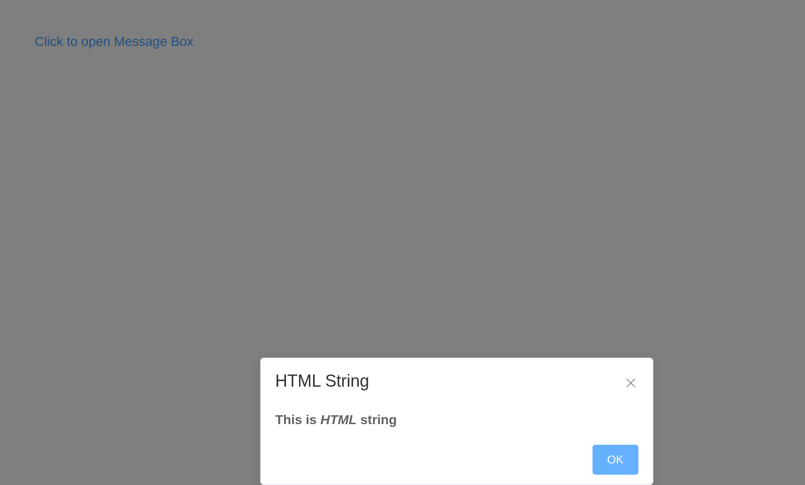
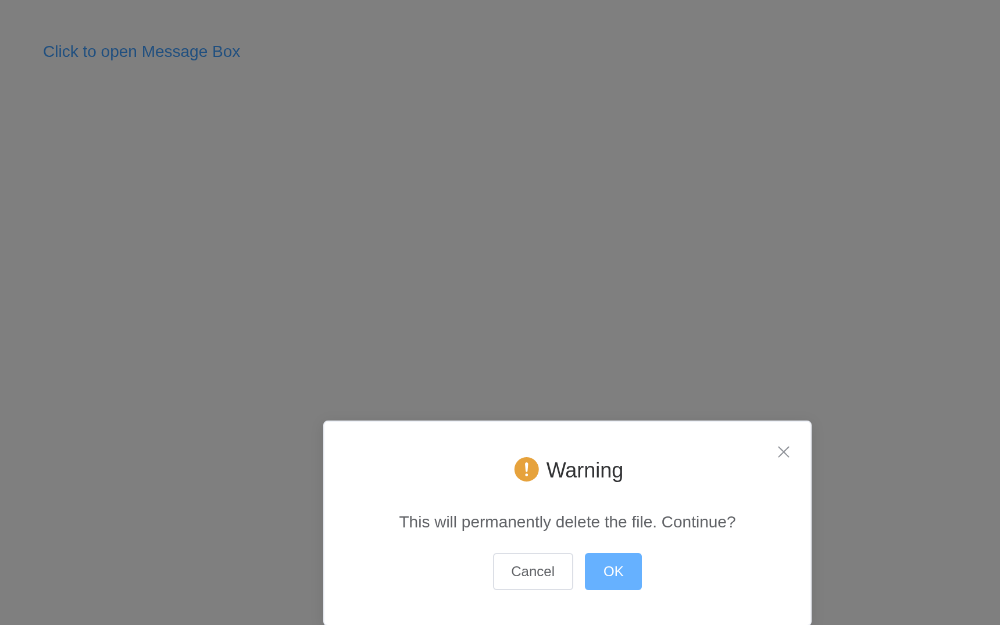

# MessageBox

Modal boxes that alert, confirm or ask.
[`el_message_box()`](https://kaipingyang.github.io/shiny.element/reference/el_message_box.md)
opens one from the server; the answer arrives as `input$<id>` –
`"confirm"`, `"cancel"` or `"close"`, and for a prompt a list of
`action` and `value`.

## Alert

``` r

ui <- el_page(el_button("open", "Click to open the Message Box", type = "text"))

server <- function(input, output, session) {
  observeEvent(input$open, el_message_box(id = "seen", message = "This is a message",
    title = "Title", box_type = "alert", confirm_button_text = "OK"))
}

shinyApp(ui, server)
```


## Confirm

``` r

ui <- el_page(el_button("delete", "Delete the file", type = "text"), verbatimTextOutput("answer"))

server <- function(input, output, session) {
  observeEvent(input$delete, el_message_box(id = "sure",
    message = "This will permanently delete the file. Continue?", title = "Warning",
    type = "warning", confirm_button_text = "OK", cancel_button_text = "Cancel"))
  output$answer <- renderPrint(input$sure)
}

shinyApp(ui, server)
```


## Prompt

`input_pattern` and `input_error_message` check what is typed.

``` r

ui <- el_page(el_button("ask", "Change your email", type = "text"), verbatimTextOutput("email"))

server <- function(input, output, session) {
  observeEvent(input$ask, el_message_box(id = "email", box_type = "prompt",
    message = "Please input your e-mail", title = "Tip",
    input_pattern = "[\\w!#$%&'*+/=?^_`{|}~-]+(?:\\.[\\w!#$%&'*+/=?^_`{|}~-]+)*@(?:[\\w](?:[\\w-]*[\\w])?\\.)+[\\w](?:[\\w-]*[\\w])?",
    input_error_message = "Invalid Email"))
  output$email <- renderPrint(input$email)
}

shinyApp(ui, server)
```


## Use HTML string

``` r

ui <- el_page(el_button("open", "Click to open Message Box", type = "text"))

server <- function(input, output, session) {
  observeEvent(input$open, el_message_box(id = "html", title = "HTML String", box_type = "alert",
    message = "<strong>This is <i>HTML</i> string</strong>", dangerously_use_html_string = TRUE))
}

shinyApp(ui, server)
```



## Distinguishing cancel and close

``` r

ui <- el_page(el_button("open", "Click to open Message Box", type = "text"), verbatimTextOutput("how"))

server <- function(input, output, session) {
  observeEvent(input$open, el_message_box(id = "leave",
    message = "You have unsaved changes, save and proceed?", title = "Confirm",
    distinguish_cancel_and_close = TRUE, confirm_button_text = "Save",
    cancel_button_text = "Discard Changes"))
  output$how <- renderPrint(input$leave)
}

shinyApp(ui, server)
```


## Centered content

``` r

ui <- el_page(el_button("open", "Click to open Message Box", type = "text"))

server <- function(input, output, session) {
  observeEvent(input$open, el_message_box(id = "centered", center = TRUE, type = "warning",
    message = "This will permanently delete the file. Continue?", title = "Warning"))
}

shinyApp(ui, server)
```



## API

### Options

| Element | In R | Description | Type | Accepted | Default |
|----|----|----|----|----|----|
| `title` | `title` | title of the MessageBox | string | — | — |
| `message` | `message` | content of the MessageBox | string | — | — |
| `dangerouslyUseHTMLString` | `dangerously_use_html_string` | whether `message` is treated as HTML string | boolean | — | false |
| `type` | `type` | message type, used for icon display | string | success / info / warning / error | — |
| `iconClass` | `icon_class` | custom icon’s class, overrides `type` | string | — | — |
| `customClass` | `custom_class` | custom class name for MessageBox | string | — | — |
| `callback` |  | MessageBox closing callback if you don’t prefer Promise | function(action), where action can be ‘confirm’, ‘cancel’ or ‘close’, and `instance` is the MessageBox instance. You can access to that instance’s attributes and methods | — | — |
| `showClose` | `show_close` | whether to show close icon of MessageBox | boolean | — | true |
| `beforeClose` | `before_close` | callback before MessageBox closes, and it will prevent MessageBox from closing | function(action, instance, done), where `action` can be ‘confirm’, ‘cancel’ or ‘close’; `instance` is the MessageBox instance, and you can access to that instance’s attributes and methods; `done` is for closing the instance | — | — |
| `distinguishCancelAndClose` | `distinguish_cancel_and_close` | whether to distinguish canceling and closing the MessageBox | boolean | — | false |
| `lockScroll` | `lock_scroll` | whether to lock body scroll when MessageBox prompts | boolean | — | true |
| `showCancelButton` | `show_cancel_button` | whether to show a cancel button | boolean | — | false (true when called with confirm and prompt) |
| `showConfirmButton` | `show_confirm_button` | whether to show a confirm button | boolean | — | true |
| `cancelButtonText` | `cancel_button_text` | text content of cancel button | string | — | Cancel |
| `confirmButtonText` | `confirm_button_text` | text content of confirm button | string | — | OK |
| `cancelButtonClass` | `cancel_button_class` | custom class name of cancel button | string | — | — |
| `confirmButtonClass` | `confirm_button_class` | custom class name of confirm button | string | — | — |
| `closeOnClickModal` | `close_on_click_modal` | whether MessageBox can be closed by clicking the mask | boolean | — | true (false when called with alert) |
| `closeOnPressEscape` | `close_on_press_escape` | whether MessageBox can be closed by pressing the ESC | boolean | — | true (false when called with alert) |
| `closeOnHashChange` | `close_on_hash_change` | whether to close MessageBox when hash changes | boolean | — | true |
| `showInput` | `show_input` | whether to show an input | boolean | — | false (true when called with prompt) |
| `inputPlaceholder` | `input_placeholder` | placeholder of input | string | — | — |
| `inputType` | `input_type` | type of input | string | — | text |
| `inputValue` | `input_value` | initial value of input | string | — | — |
| `inputPattern` | `input_pattern` | regexp for the input | regexp | — | — |
| `inputValidator` | `input_validator` | validation function for the input. Should returns a boolean or string. If a string is returned, it will be assigned to inputErrorMessage | function | — | — |
| `inputErrorMessage` | `input_error_message` | error message when validation fails | string | — | Illegal input |
| `center` | `center` | whether to align the content in center | boolean | — | false |
| `roundButton` | `round_button` | whether to use round button | boolean | — | false |
