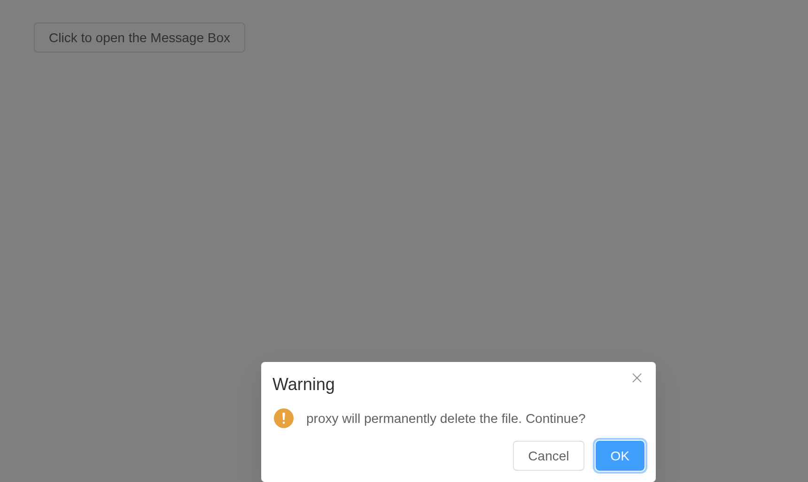
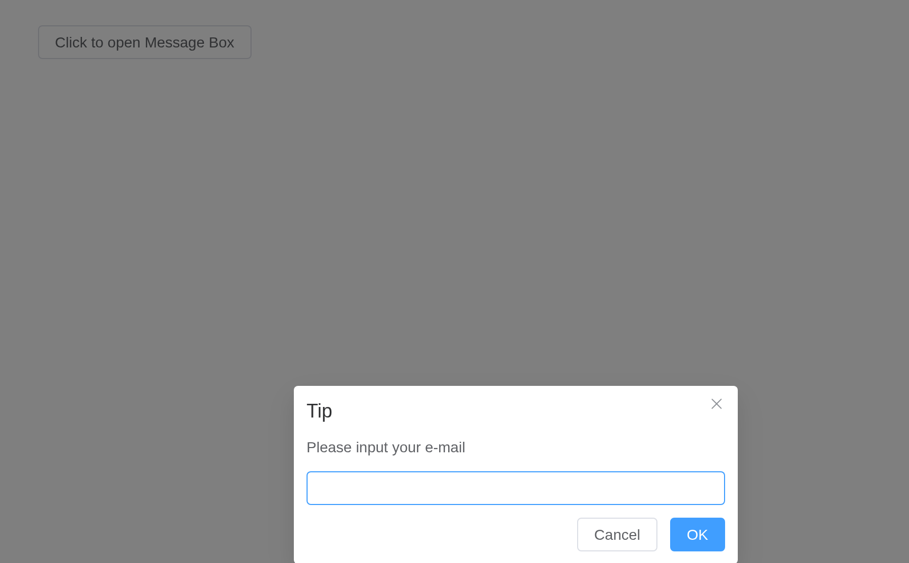

# Message

A set of modal boxes simulating system message box, mainly for alerting
information, confirm operations and prompting messages.

> **Tip**
>
> By design MessageBox provides simulations of system’s `alert`,
> `confirm` and `prompt`，so it’s content should be simple. For more
> complicated contents, please use Dialog.

## Alert

Alert interrupts user operation until the user confirms.

Open an alert by calling the `ElMessageBox.alert` method. It simulates
the system’s `alert`, and cannot be closed by pressing ESC or clicking
outside the box. In this example, two parameters `message` and `title`
are received. It is worth mentioning that when the box is closed, it
returns a `Promise` object for further processing. If you are not sure
if your target browsers support `Promise`, you should import a third
party polyfill or use callbacks instead like this example.

The answer is `input$<id>`: `"confirm"`, `"cancel"` or `"close"`.

``` r

ui <- el_page(el_button("open", "Click to open the Message Box", plain = TRUE))
server <- function(input, output, session) {
  observeEvent(
    input$open,
    el_message_box(
      session,
      "answer",
      "This is a message",
      title = "Title",
      box_type = "alert",
      confirm_button_text = "OK"
    )
  )
}
shinyApp(ui, server)
```


## Confirm

Confirm is used to ask users’ confirmation.

Call `ElMessageBox.confirm` method to open a confirm, and it simulates
the system’s `confirm`. We can also highly customize Message Box by
passing a third attribute `options` which is a literal object. The
attribute `type` indicates the message type, and it’s value can be
`primary`, `success`, `error`, `info` and `warning`. Note that the
second attribute `title` must be a `string`, and if it is an `object`,
it will be handled as the attribute `options`. Here we use `Promise` to
handle further processing. `primary` has been added in 2.9.11.

``` r

ui <- el_page(el_button("open", "Click to open the Message Box", plain = TRUE))
server <- function(input, output, session) {
  observeEvent(
    input$open,
    el_message_box(
      session,
      "answer",
      "proxy will permanently delete the file. Continue?",
      title = "Warning",
      type = "warning",
      confirm_button_text = "OK",
      cancel_button_text = "Cancel"
    )
  )
  observeEvent(
    input$answer,
    el_message(session, paste("Answer:", input$answer))
  )
}
shinyApp(ui, server)
```



## Prompt

Prompt is used when user input is required.

Call `ElMessageBox.prompt` method to open a prompt, and it simulates the
system’s `prompt`. You can use `inputPattern` parameter to specify your
own RegExp pattern. Use `inputValidator` to specify validation method,
and it should return `Boolean` or `String`. Returning `false` or
`String` means the validation has failed, and the string returned will
be used as the `inputErrorMessage`. In addition, you can customize the
placeholder of the input box with `inputPlaceholder` parameter.

``` r

ui <- el_page(el_button("open", "Click to open Message Box", plain = TRUE))
server <- function(input, output, session) {
  observeEvent(
    input$open,
    el_message_box(
      session,
      "email",
      "Please input your e-mail",
      title = "Tip",
      box_type = "prompt",
      confirm_button_text = "OK",
      cancel_button_text = "Cancel",
      input_pattern = "[\\w!#$%&'*+/=?^_`{|}~-]+(?:\\.[\\w!#$%&'*+/=?^_`{|}~-]+)*@(?:[\\w](?:[\\w-]*[\\w])?\\.)+[\\w](?:[\\w-]*[\\w])?",
      input_error_message = "Invalid Email"
    )
  )
}
shinyApp(ui, server)
```



## Use VNode

`message` can be VNode.

> **In R**
>
> A VNode is a Vue render function’s; from R, send the message as HTML
> with `dangerously_use_html_string = TRUE`.

## Use VNode With Action Handlers

You can receive `{ confirm, cancel, close }` as parameters in `message`,
which allows custom content to trigger the same MessageBox actions
programmatically and automatically close the instance.

> **In R**
>
> A VNode is a Vue render function’s; from R, send the message as HTML
> with `dangerously_use_html_string = TRUE`.

## Customization

Can be customized to show various content.

The three methods mentioned above are repackagings of the `ElMessageBox`
method. This example calls `ElMessageBox` method directly using the
`showCancelButton` attribute, which is used to indicate if a cancel
button is displayed. Besides we can use `cancelButtonClass` to add a
custom style and `cancelButtonText` to customize the button text (the
confirm button also has these fields, and a complete list of fields can
be found at the end of this documentation). This example also uses the
`beforeClose` attribute. It is a method and will be triggered when the
MessageBox instance will be closed, and its execution will stop the
instance from closing. It has three parameters: `action`, `instance` and
`done`. Using it enables you to manipulate the instance before it
closes, e.g. activating `loading` for confirm button; you can invoke the
`done` method to close the MessageBox instance (if `done` is not called
inside `beforeClose`, the instance will not be closed).

``` r

ui <- el_page(el_button("open", "Click to open Message Box", plain = TRUE))
server <- function(input, output, session) {
  observeEvent(
    input$open,
    el_message_box(
      session,
      "answer",
      "This is a message",
      title = "Title",
      show_cancel_button = TRUE,
      confirm_button_text = "OK",
      cancel_button_text = "Cancel",
      confirm_button_type = "danger",
      button_size = "small"
    )
  )
}
shinyApp(ui, server)
```


## Use HTML String

`message` supports HTML string.

Set `dangerouslyUseHTMLString` to true and `message` will be treated as
an HTML string.

``` r

ui <- el_page(el_button("open", "Click to open Message Box", plain = TRUE))
server <- function(input, output, session) {
  observeEvent(
    input$open,
    el_message_box(
      session,
      "answer",
      "<strong>proxy is <i>HTML</i> string</strong>",
      title = "HTML String",
      box_type = "alert",
      dangerously_use_html_string = TRUE
    )
  )
}
shinyApp(ui, server)
```


> **Warning**
>
> Although `message` property supports HTML strings, dynamically
> rendering arbitrary HTML on your website can be very dangerous because
> it can easily lead to [XSS
> attacks](https://en.wikipedia.org/wiki/Cross-site_scripting). So when
> `dangerouslyUseHTMLString` is on, please make sure the content of
> `message` is trusted, and **never** assign `message` to user-provided
> content.

## Distinguishing cancel and close

In some cases, clicking the cancel button and close button may have
different meanings.

By default, the parameters of Promise’s reject callback and `callback`
are ‘cancel’ when the user cancels (clicking the cancel button) and
closes (clicking the close button or mask layer, pressing the ESC key)
the MessageBox. If `distinguishCancelAndClose` is set to true, the
parameters of the above two operations are ‘cancel’ and ‘close’
respectively.

``` r

ui <- el_page(el_button("open", "Click to open Message Box", plain = TRUE))
server <- function(input, output, session) {
  observeEvent(
    input$open,
    el_message_box(
      session,
      "answer",
      "You have unsaved changes, save and proceed?",
      title = "Confirm",
      distinguish_cancel_and_close = TRUE,
      confirm_button_text = "Save",
      cancel_button_text = "Discard Changes"
    )
  )
}
shinyApp(ui, server)
```


## Centered content

Content of MessageBox can be centered.

Setting `center` to `true` will center the content.

``` r

ui <- el_page(el_button("open", "Click to open Message Box", plain = TRUE))
server <- function(input, output, session) {
  observeEvent(
    input$open,
    el_message_box(
      session,
      "answer",
      "proxy will permanently delete the file. Continue?",
      title = "Warning",
      type = "warning",
      center = TRUE,
      confirm_button_text = "OK",
      cancel_button_text = "Cancel"
    )
  )
}
shinyApp(ui, server)
```


## Customized Icon

The icon can be customized to any Vue component or [render function
(JSX)](https://vuejs.org/guide/extras/render-function.html).

``` r

ui <- el_page(el_button("open", "Click to open Message Box", plain = TRUE))
server <- function(input, output, session) {
  observeEvent(
    input$open,
    el_message_box(
      session,
      "answer",
      "Are you sure to delete this?",
      title = "Warning",
      type = "warning",
      icon = "Delete",
      confirm_button_text = "OK",
      cancel_button_text = "Cancel"
    )
  )
}
shinyApp(ui, server)
```


## Draggable

MessageBox can be draggable.

Setting `draggable` to `true` allows user to drag MessageBox. Set
`overflow` 2.5.4 to `true` can drag overflow the viewport.

``` r

ui <- el_page(el_button("open", "Click to open Message Box", plain = TRUE))
server <- function(input, output, session) {
  observeEvent(
    input$open,
    el_message_box(
      session,
      "answer",
      "proxy will permanently delete the file. Continue?",
      title = "Warning",
      type = "warning",
      draggable = TRUE,
      confirm_button_text = "OK",
      cancel_button_text = "Cancel"
    )
  )
}
shinyApp(ui, server)
```


## Global method

If Element Plus is fully imported, it will add the following global
methods for `app.config.globalProperties`: `$msgbox`, `$alert`,
`$confirm` and `$prompt`. So in a Vue instance you can call `MessageBox`
like what we did in this page. The parameters are:

- `$msgbox(options)`
- `$alert(message, title, options)` or `$alert(message, options)`
- `$confirm(message, title, options)` or `$confirm(message, options)`
- `$prompt(message, title, options)` or `$prompt(message, options)`

## App context inheritance \> 2.0.4

Now message box accepts a `context` as second (fourth if you are using
message box variants) parameter of the message constructor which allows
you to inject current app’s context to message which allows you to
inherit all the properties of the app.

## Local import

If you prefer importing `MessageBox` on demand:

The corresponding methods are: `ElMessageBox`, `ElMessageBox.alert`,
`ElMessageBox.confirm` and `ElMessageBox.prompt`. The parameters are the
same as above.

## API

Element Plus’s tables, and beside each entry where it is in R.

### Options

| Element | In R | Description | Type | Accepted | Default |
|----|----|----|----|----|----|
| `autofocus` | `autofocus` | auto focus when open MessageBox | [^1] |  | true |
| `title` | `title` | title of the MessageBox | [^2] |  | ’’ |
| `message` | `message` | content of the MessageBox | [^3] / [^4] / [^5]`() => VNode` ^(2.2.17) / [^6]`({ confirm, cancel, close }) => VNode` ^(2.14.0) |  | — |
| `dangerouslyUseHTMLString` | `dangerously_use_html_string` | whether `message` is treated as HTML string | [^7] |  | false |
| `type` | `type` | message type, used for icon display | [^8]`'primary' (2.9.11) \\| 'success' \\| 'info' \\| 'warning' \\| 'error'` |  | ’’ |
| `icon` | `icon` | custom icon component, overrides `type` | [^9] / [^10] |  | ’’ |
| `closeIcon` | `close_icon` | custom close icon component, default is Close | [^11] / [^12] |  | ’’ |
| `customClass` | `custom_class` | custom class name for MessageBox | [^13] |  | ’’ |
| `customStyle` | `custom_style` | custom inline style for MessageBox | [^14] |  | {} |
| `modal` | `modal` | whether a mask is displayed | [^15] |  | true |
| `modalClass` | `modal_class` | custom class names for mask | string |  | — |
| `callback` | \``input$<id>`, the answer`| MessageBox closing callback if you don't prefer Promise | ^[Function]`(value: string, action: Action) =\> any \\ | (action: Action) =\> any`| | null | |`showClose`|`show_close`| whether to show close icon of MessageBox | ^[boolean] | | true | |`beforeClose`|`before_close`| callback before MessageBox closes, and it will prevent MessageBox from closing | ^[Function]`(action: Action, instance: MessageBoxState, done: () =\> void) =\> void`| | null | |`distinguishCancelAndClose`|`distinguish_cancel_and_close`| whether to distinguish canceling and closing the MessageBox | ^[boolean] | | false | |`lockScroll`|`lock_scroll`| whether to lock body scroll when MessageBox prompts | ^[boolean] | | true | |`showCancelButton`|`show_cancel_button`| whether to show a cancel button | ^[boolean] | | false (true when called with confirm and prompt) | |`showConfirmButton`|`show_confirm_button`| whether to show a confirm button | ^[boolean] | | true | |`cancelButtonText`|`cancel_button_text`| text content of cancel button | ^[string] | | Cancel | |`confirmButtonText`|`confirm_button_text`| text content of confirm button | ^[string] | | OK | |`cancelButtonType`|`cancel_button_type`| type of cancel button | ^[enum]`‘primary’ \\ | ‘success’ \\ | ‘warning’ \\ | ‘danger’ \\ |

[^1]: boolean

[^2]: string

[^3]: string

[^4]: VNode

[^5]: Function

[^6]: Function

[^7]: boolean

[^8]: enum

[^9]: string

[^10]: Component

[^11]: string

[^12]: Component

[^13]: string

[^14]: CSSProperties

[^15]: boolean
