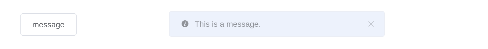
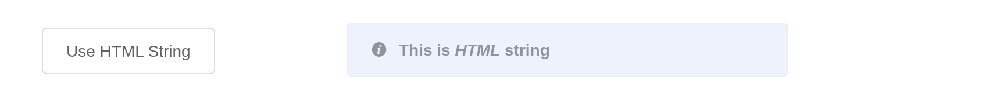

# Message

Feedback after an activity, at the top of the page, gone on its own.
[`el_message()`](https://kaipingyang.github.io/shiny.element/reference/el_message.md)
shows one from the server; given an `id`,
[`el_message_close()`](https://kaipingyang.github.io/shiny.element/reference/el_feedback_close.md)
closes it and `input$<id>_close` reports it closed.

## Basic usage

``` r

ui <- el_page(el_button("show", "Show message", plain = TRUE))

server <- function(input, output, session) {
  observeEvent(input$show, el_message(message = "This is a message."))
}

shinyApp(ui, server)
```


## Types

``` r

ui <- el_page(el_button("ok", "success", plain = TRUE), el_button("warn", "warning", plain = TRUE),
              el_button("bad", "error", plain = TRUE))

server <- function(input, output, session) {
  observeEvent(input$ok, el_message(message = "Congrats, this is a success message.", type = "success"))
  observeEvent(input$warn, el_message(message = "Warning, this is a warning message.", type = "warning"))
  observeEvent(input$bad, el_message(message = "Oops, this is an error message.", type = "error"))
}

shinyApp(ui, server)
```


## Closable

``` r

ui <- el_page(el_button("show", "message", plain = TRUE))

server <- function(input, output, session) {
  observeEvent(input$show, el_message(message = "This is a message.", show_close = TRUE, duration = 0))
}

shinyApp(ui, server)
```



## Centered text

``` r

ui <- el_page(el_button("show", "Centered text", plain = TRUE))

server <- function(input, output, session) {
  observeEvent(input$show, el_message(message = "Centered text", center = TRUE))
}

shinyApp(ui, server)
```


## Use HTML string

The message is then inserted as markup – pass only what you control.

``` r

ui <- el_page(el_button("show", "Use HTML String", plain = TRUE))

server <- function(input, output, session) {
  observeEvent(input$show, el_message(message = "<strong>This is <i>HTML</i> string</strong>",
                                       dangerously_use_html_string = TRUE))
}

shinyApp(ui, server)
```



## Closed from the server

``` r

ui <- el_page(el_button("upload", "Upload", type = "primary"))

server <- function(input, output, session) {
  observeEvent(input$upload, {
    el_message(message = "Uploading...", id = "busy", duration = 0, icon_class = "el-icon-loading")
    later::later(function() {
      el_message_close(session, "busy")
      el_message(session, "Uploaded", type = "success")
    }, 5)
  })
}

shinyApp(ui, server)
```


## API

### Options

| Element | In R | Description | Type | Accepted | Default |
|----|----|----|----|----|----|
| `message` | `message` | message text | string / VNode | — | — |
| `type` | `type` | message type | string | success/warning/info/error | info |
| `iconClass` | `icon_class` | custom icon’s class, overrides `type` | string | — | — |
| `dangerouslyUseHTMLString` | `dangerously_use_html_string` | whether `message` is treated as HTML string | boolean | — | false |
| `customClass` | `custom_class` | custom class name for Message | string | — | — |
| `duration` | `duration` | display duration, millisecond. If set to 0, it will not turn off automatically | number | — | 3000 |
| `showClose` | `show_close` | whether to show a close button | boolean | — | false |
| `center` | `center` | whether to center the text | boolean | — | false |
| `onClose` |  | callback function when closed with the message instance as the parameter | function | — | — |
| `offset` | `offset` | set the distance to the top of viewport | number | — | 20 |

### Methods

| Element | In R                            | Description       |
|---------|---------------------------------|-------------------|
| `close` | `el_call(session, id, "close")` | close the Message |
