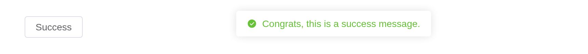
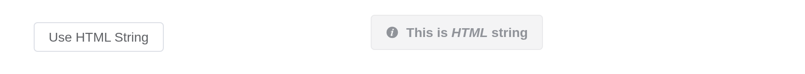
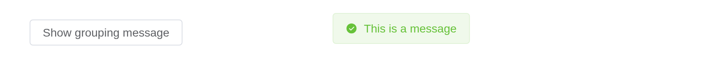
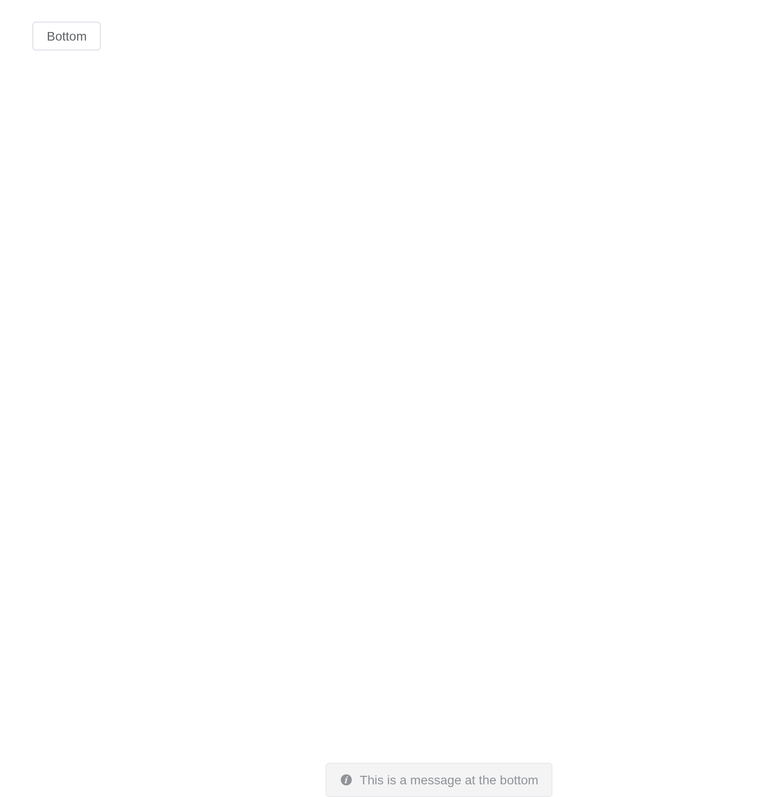

# Message

Used to show feedback after an activity. The difference with
Notification is that the latter is often used to show a system level
passive notification.

## Basic usage

Displays at the top by default, and disappears after 3 seconds. You can
control the position using the `placement` property.

The setup of Message is very similar to notification, so parts of the
options won’t be explained in detail here. You can check the options
table below combined with notification doc to understand it. Element
Plus has registered a `$message` method for invoking. Message can take a
string or a VNode as parameter, and it will be shown as the main body.

Messages are sent from the server, `el_message(session, ...)`.

``` r

ui <- el_page(el_button("show", "Show message", plain = TRUE))
server <- function(input, output, session) {
  observeEvent(input$show, el_message(session, "This is a message."))
}
shinyApp(ui, server)
```


## Types

Used to show the feedback of Primary, Success, Warning, Info and Error
activities.

When you need more customizations, Message component can also take an
object as parameter. For example, setting value of `type` can define
different types, and its default is `info`. In such cases the main body
is passed in as the value of `message`. Also, we have registered methods
for different types, so you can directly call it without passing a type
like `open4`. `primary` has been added in 2.9.11.

``` r

types <- c("primary", "success", "warning", "info", "error")
ui <- el_page(lapply(types, function(t) el_button(paste0("m_", t), tools::toTitleCase(t), plain = TRUE)))
server <- function(input, output, session) {
  for (t in types) local({
    t <- t
    observeEvent(input[[paste0("m_", t)]],
                 el_message(session, paste("Congrats, this is a", t, "message."), type = t))
  })
}
shinyApp(ui, server)
```


## Plain

Set `plain` to have a plain background.

``` r

ui <- el_page(el_button("show", "Success", plain = TRUE))
server <- function(input, output, session) {
  observeEvent(input$show, el_message(session, "Congrats, this is a success message.",
                                      type = "success", plain = TRUE))
}
shinyApp(ui, server)
```



## Closable

A close button can be added.

A default Message cannot be closed manually. If you need a closable
message, you can set `showClose` field. Besides, same as notification,
message has a controllable `duration`. Default duration is 3000 ms, and
it won’t disappear when set to `0`.

``` r

ui <- el_page(el_button("show", "Message", plain = TRUE))
server <- function(input, output, session) {
  observeEvent(input$show, el_message(session, "This is a message.", show_close = TRUE, duration = 0))
}
shinyApp(ui, server)
```


## Use HTML string

`message` supports HTML string.

Set `dangerouslyUseHTMLString` to true and `message` will be treated as
an HTML string.

``` r

ui <- el_page(el_button("show", "Use HTML String", plain = TRUE))
server <- function(input, output, session) {
  observeEvent(input$show, el_message(session, "<strong>This is <i>HTML</i> string</strong>",
                                      dangerously_use_html_string = TRUE))
}
shinyApp(ui, server)
```



> **Warning**
>
> Although `message` property supports HTML strings, dynamically
> rendering arbitrary HTML on your website can be very dangerous because
> it can easily lead to [XSS
> attacks](https://en.wikipedia.org/wiki/Cross-site_scripting). So when
> `dangerouslyUseHTMLString` is on, please make sure the content of
> `message` is trusted, and **never** assign `message` to user-provided
> content.

## Grouping

merge messages with the same content.

Set `grouping` to true and the same content of `message` will be merged.

``` r

ui <- el_page(el_button("show", "Show grouping message", plain = TRUE))
server <- function(input, output, session) {
  observeEvent(input$show, el_message(session, "This is a message", grouping = TRUE,
                                      type = "success"))
}
shinyApp(ui, server)
```



## Placement

Control the position where messages appear. Messages can be displayed at
the top (default) or other placements of the viewport.

``` r

ui <- el_page(el_button("show", "Bottom", plain = TRUE))
server <- function(input, output, session) {
  observeEvent(input$show, el_message(session, "This is a message at the bottom", placement = "bottom"))
}
shinyApp(ui, server)
```



## Global method

Element Plus has added a global method `$message` for
`app.config.globalProperties`. So in a vue instance you can call
`Message` like what we did in this page.

## Local import

In this case you should call `ElMessage(options)`. We have also
registered methods for different types,
e.g. `ElMessage.success(options)`. You can call `ElMessage.closeAll()`
to manually close all the instances.

## App context inheritance

Now message accepts a `context` as second parameter of the message
constructor which allows you to inject current app’s context to message
which allows you to inherit all the properties of the app.

You can use it like this:

> **Tip**
>
> If you globally registered ElMessage component, it will automatically
> inherit your app context.

## API

Element Plus’s tables, and beside each entry where it is in R.

### Options

| Element | In R | Description | Type | Accepted | Default |
|----|----|----|----|----|----|
| `message` | `message` | message text | [^1] / [^2] / [^3]`() => VNode` |  | ’’ |
| `type` | `type` | message type | [^4]`'primary' (2.9.11) \\| 'success' \\| 'warning' \\| 'info' \\| 'error'` |  | info |
| `plain` | `plain` | whether message is plain | [^5] |  | false |
| `icon` | `icon` | custom icon component, overrides `type` | [^6] / [^7] |  | — |
| `dangerouslyUseHTMLString` | `dangerously_use_html_string` | whether `message` is treated as HTML string | [^8] |  | false |
| `customClass` | `custom_class` | custom class name for Message | [^9] |  | ’’ |
| `duration` | `duration` | display duration, millisecond. If set to 0, it will not turn off automatically | [^10] |  | 3000 |
| `showClose` | `show_close` | whether to show a close button | [^11] |  | false |
| `onClose` | `(JS only; Shiny hears through the id)` | callback function when closed with the message instance as the parameter | [^12]`() => void` |  | — |
| `offset` | `offset` | set the distance to the viewport edge (top when placement is ‘top’, bottom when placement is ‘bottom’) | [^13] |  | 16 |
| `placement` | `placement` | message placement position | [^14]`'top' \\| 'top-left' \\| 'top-right' \\| 'bottom' \\| 'bottom-left' \\| 'bottom-right'` |  | top |
| `appendTo` | `append_to` | set the root element for the message, default to `document.body` | [^15] / [^16] |  | — |
| `grouping` | `grouping` | merge messages with the same content, type of VNode message is not supported | [^17] |  | false |
| `repeatNum` | `repeat_num` | The number of repetitions, similar to badge, is used as the initial number when used with `grouping` | [^18] |  | 1 |

[^1]: string

[^2]: VNode

[^3]: Function

[^4]: enum

[^5]: boolean

[^6]: string

[^7]: Component

[^8]: boolean

[^9]: string

[^10]: number

[^11]: boolean

[^12]: Function

[^13]: number

[^14]: enum

[^15]: CSSSelector

[^16]: HTMLElement

[^17]: boolean

[^18]: number
