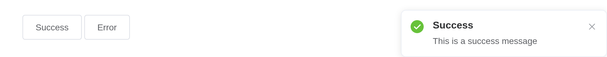
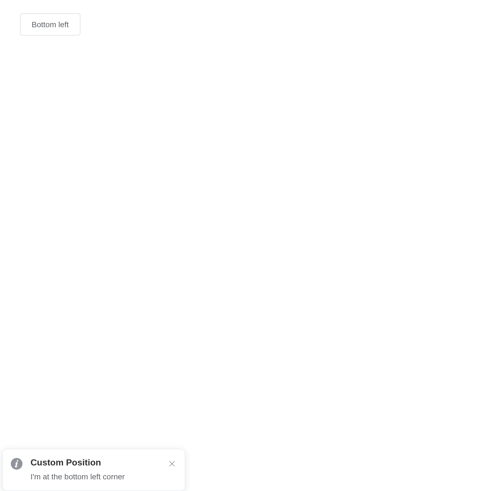
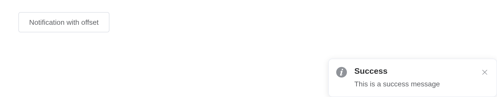
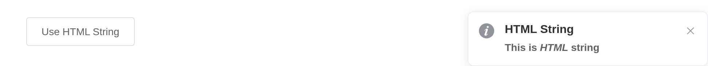
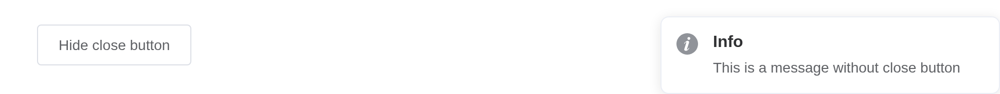

# Notification

A global notification at a corner of the page.
[`el_notification()`](https://kaipingyang.github.io/shiny.element/reference/el_notification.md)
shows one from the server; given an `id`, `input$<id>_click` and
`input$<id>_close` report it.

## Basic usage

``` r

ui <- el_page(el_button("auto", "Closes automatically", plain = TRUE),
              el_button("stay", "Won't close automatically", plain = TRUE))

server <- function(input, output, session) {
  observeEvent(input$auto, el_notification(title = "Title", message = "This is a reminder"))
  observeEvent(input$stay, el_notification(title = "Prompt", duration = 0,
                                            message = "This is a message that does not close automatically"))
}

shinyApp(ui, server)
```


## With types

``` r

ui <- el_page(el_button("ok", "Success", plain = TRUE), el_button("bad", "Error", plain = TRUE))

server <- function(input, output, session) {
  observeEvent(input$ok, el_notification(title = "Success", message = "This is a success message", type = "success"))
  observeEvent(input$bad, el_notification(title = "Error", message = "This is an error message", type = "error"))
}

shinyApp(ui, server)
```



## Custom position

``` r

ui <- el_page(el_button("bl", "Bottom left", plain = TRUE))

server <- function(input, output, session) {
  observeEvent(input$bl, el_notification(title = "Custom Position", position = "bottom-left",
                                          message = "I'm at the bottom left corner"))
}

shinyApp(ui, server)
```



## With offset

``` r

ui <- el_page(el_button("off", "Notification with offset", plain = TRUE))

server <- function(input, output, session) {
  observeEvent(input$off, el_notification(title = "Success", offset = 100,
                                           message = "This is a success message"))
}

shinyApp(ui, server)
```



## Use HTML string

``` r

ui <- el_page(el_button("h", "Use HTML String", plain = TRUE))

server <- function(input, output, session) {
  observeEvent(input$h, el_notification(title = "HTML String", dangerously_use_html_string = TRUE,
                                         message = "<strong>This is <i>HTML</i> string</strong>"))
}

shinyApp(ui, server)
```



## Hide close button

``` r

ui <- el_page(el_button("n", "Hide close button", plain = TRUE))

server <- function(input, output, session) {
  observeEvent(input$n, el_notification(title = "Info", show_close = FALSE,
                                         message = "This is a message without close button"))
}

shinyApp(ui, server)
```



## API

### Options

| Element | In R | Description | Type | Accepted | Default |
|----|----|----|----|----|----|
| `title` | `title` | title | string | — | — |
| `message` | `message` | description text | string/Vue.VNode | — | — |
| `dangerouslyUseHTMLString` | `dangerously_use_html_string` | whether `message` is treated as HTML string | boolean | — | false |
| `type` | `type` | notification type | string | success/warning/info/error | — |
| `iconClass` | `icon_class` | custom icon’s class. It will be overridden by `type` | string | — | — |
| `customClass` | `custom_class` | custom class name for Notification | string | — | — |
| `duration` | `duration` | duration before close. It will not automatically close if set 0 | number | — | 4500 |
| `position` | `position` | custom position | string | top-right/top-left/bottom-right/bottom-left | top-right |
| `showClose` | `show_close` | whether to show a close button | boolean | — | true |
| `onClose` |  | callback function when closed | function | — | — |
| `onClick` |  | callback function when notification clicked | function | — | — |
| `offset` | `offset` | offset from the top edge of the screen. Every Notification instance of the same moment should have the same offset | number | — | 0 |

### Methods

| Element | In R                            | Description            |
|---------|---------------------------------|------------------------|
| `close` | `el_call(session, id, "close")` | close the Notification |
