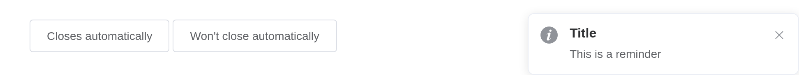
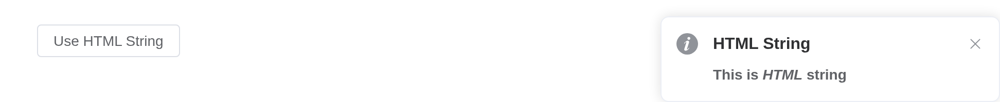
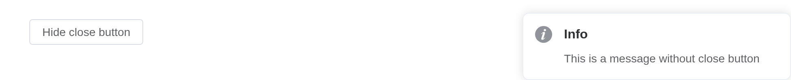

# Notification

Displays a global notification message at a corner of the page.

## Basic usage

Element Plus has registered the `$notify` method and it receives an
object as its parameter. In the simplest case, you can set the `title`
field and the`message` field for the title and body of the notification.
By default, the notification automatically closes after 4500ms, but by
setting `duration` you can control its duration. Specifically, if set to
`0`, it will not close automatically. Note that `duration` receives a
`Number` in milliseconds.

Notifications are sent from the server, `el_notification(session, ...)`.

``` r

ui <- el_page(el_button("show", "Closes automatically", plain = TRUE))
server <- function(input, output, session) {
  observeEvent(
    input$show,
    el_notification(session, title = "Title", message = "This is a reminder")
  )
}
shinyApp(ui, server)
```



## With types

We provide five types: primary, success, warning, info and error.

Element Plus provides five notification types: `primary`, `success`,
`warning`, `info` and `error`. They are set by the `type` field, and
other values will be ignored. We also registered methods for these types
that can be invoked directly like `open3` and `open4` without passing a
`type` field. `primary` has been added in 2.9.11.

``` r

types <- c("primary", "success", "warning", "info", "error")
ui <- el_page(lapply(types, function(t) {
  el_button(paste0("n_", t), tools::toTitleCase(t), plain = TRUE)
}))
server <- function(input, output, session) {
  for (t in types) {
    local({
      t <- t
      observeEvent(
        input[[paste0("n_", t)]],
        el_notification(
          session,
          title = tools::toTitleCase(t),
          type = t,
          message = paste("This is a", t, "message")
        )
      )
    })
  }
}
shinyApp(ui, server)
```


## Custom position

Notification can emerge from any corner you like.

The `position` attribute defines which corner Notification slides in. It
can be `top-right`, `top-left`, `bottom-right` or `bottom-left`.
Defaults to `top-right`.

``` r

pos <- c("top-right", "bottom-right", "bottom-left", "top-left")
ui <- el_page(lapply(pos, function(p) {
  el_button(paste0("n_", gsub("-", "_", p)), p, plain = TRUE)
}))
server <- function(input, output, session) {
  for (p in pos) {
    local({
      p <- p
      observeEvent(
        input[[paste0("n_", gsub("-", "_", p))]],
        el_notification(
          session,
          title = "Custom Position",
          position = p,
          message = paste("I'm at the", p, "corner")
        )
      )
    })
  }
}
shinyApp(ui, server)
```


## With offset

Customize Notification’s offset from the edge of the screen.

Set the `offset` attribute to customize Notification’s offset from the
edge of the screen. Note that every Notification instance of the same
moment should have the same offset.

``` r

ui <- el_page(el_button("show", "Notification with offset", plain = TRUE))
server <- function(input, output, session) {
  observeEvent(
    input$show,
    el_notification(
      session,
      title = "Success",
      offset = 100,
      message = "This is a success message"
    )
  )
}
shinyApp(ui, server)
```


## Use HTML string

`message` supports HTML string.

Set `dangerouslyUseHTMLString` to true and `message` will be treated as
an HTML string.

``` r

ui <- el_page(el_button("show", "Use HTML String", plain = TRUE))
server <- function(input, output, session) {
  observeEvent(
    input$show,
    el_notification(
      session,
      title = "HTML String",
      dangerously_use_html_string = TRUE,
      message = "<strong>This is <i>HTML</i> string</strong>"
    )
  )
}
shinyApp(ui, server)
```



> **Warning**
>
> Although `message` property supports HTML strings, dynamically
> rendering arbitrary HTML on your website can be very dangerous because
> it can easily lead to [XSS
> attacks](https://en.wikipedia.org/wiki/Cross-site_scripting). So when
> `dangerouslyUseHTMLString` is on, please make sure the content of
> `message` is trusted, and **never** assign `message` to user-provided
> content.

## Message using functions

`message` can be VNode.

After 2.9.0, `message` supports a function whose return value is a
VNode.

A message can be a VNode, given as
[`JS()`](https://kaipingyang.github.io/shiny.element/reference/JS.md)
code calling `Vue.h()`; one whose props change is a function returning
it.

``` r

ui <- el_page(
  el_button("open", "Common VNode", plain = TRUE),
  el_button("open1", "Dynamic props", plain = TRUE)
)
server <- function(input, output, session) {
  observeEvent(input$open, {
    el_notification(
      session,
      title = "Use Vnode",
      message = JS(
        "Vue.h('p', null, [
          Vue.h('span', null, 'Message can be '),
          Vue.h('i', { style: 'color: teal' }, 'VNode')
        ])"
      )
    )
  })
  observeEvent(input$open1, {
    el_notification(
      session,
      title = "Use Vnode",
      message = JS(
        "(function() {
          var checked = Vue.ref(false);
          return function() {
            return Vue.h(ElementPlus.ElSwitch, {
              modelValue: checked.value,
              'onUpdate:modelValue': function(v) { checked.value = v; }
            });
          };
        })()"
      )
    )
  })
}
shinyApp(ui, server)
```


## With progress bar

Display a progress bar indicating the remaining time before the
notification auto-closes.

Set `progress` to `true` to enable the progress bar. The progress bar
will show a countdown matching the `duration`. Pass an object to
`progress` to customize it with the options of
[Progress](https://kaipingyang.github.io/shiny.element/articles/components/progress.html#attributes),
e.g. `color`, which overrides the `type`-based status color. When
`pauseOnHover` is `true` (default), hovering over the notification will
pause both the timer and the progress bar.

``` r

ui <- el_page(el_button("show", "With progress bar", plain = TRUE))
server <- function(input, output, session) {
  observeEvent(
    input$show,
    el_notification(
      session,
      title = "Progress",
      progress = TRUE,
      duration = 5000,
      message = "Closes when the bar runs out"
    )
  )
}
shinyApp(ui, server)
```


## Hide close button

It is possible to hide the close button

Set the `showClose` attribute to `false` so the notification cannot be
closed by the user.

``` r

ui <- el_page(el_button("show", "Hide close button", plain = TRUE))
server <- function(input, output, session) {
  observeEvent(
    input$show,
    el_notification(
      session,
      title = "Info",
      type = "info",
      show_close = FALSE,
      message = "This is a message without close button"
    )
  )
}
shinyApp(ui, server)
```



## Global method

Element Plus has added a global method `$notify` for
`app.config.globalProperties`. So in a vue instance you can call
`Notification` like what we did in this page.

## Local import

In this case you should call `ElNotification(options)`. We have also
registered methods for different types,
e.g. `ElNotification.success(options)`. You can call
`ElNotification.closeAll()` to manually close all the instances. In
2.10.5 you can manually update the offsets of all instances in a
specific direction by calling `ElNotification.updateOffsets(position)`.

## App context inheritance \> 2.0.4

Now notification accepts a `context` as second parameter of the message
constructor which allows you to inject current app’s context to
notification which allows you to inherit all the properties of the app.

You can use it like this:

> **Tip**
>
> If you globally registered ElNotification component, it will
> automatically inherit your app context.

## API

Element Plus’s tables, and beside each entry where it is in R.

### Options

| Element | In R | Description | Type | Accepted | Default |
|----|----|----|----|----|----|
| `title` | `title` | title | [^1] |  | ’’ |
| `message` | `message` | description text | [^2] / [^3] / [^4]`() => VNode` |  | ’’ |
| `dangerouslyUseHTMLString` | `dangerously_use_html_string` | whether `message` is treated as HTML string | [^5] |  | false |
| `type` | `type` | notification type | [^6]`'primary' (2.9.11) \\| 'success' \\| 'warning' \\| 'info' \\| 'error' \\| ''` |  | ’’ |
| `icon` | `icon` | custom icon component. It will be overridden by `type` | [^7] / [^8] |  | — |
| `customClass` | `custom_class` | custom class name for Notification | [^9] |  | ’’ |
| `duration` | `duration` | duration before close. It will not automatically close if set 0 | [^10] |  | 4500 |
| `position` | `position` | custom position | [^11]`'top-right' \\| 'top-left' \\| 'bottom-right' \\| 'bottom-left'` |  | top-right |
| `showClose` | `show_close` | whether to show a close button | [^12] |  | true |
| `onClose` | `input$<id>_close` | callback function when closed | [^13]`() => void` |  | — |
| `onClick` | `input$<id>_click` | callback function when notification clicked | [^14]`() => void` |  | — |
| `offset` | `offset` | offset from the top edge of the screen. Every Notification instance of the same moment should have the same offset | [^15] |  | 0 |
| `appendTo` | `append_to` | set the root element for the notification, default to `document.body` | [^16] / [^17] |  | — |
| `zIndex` | `z_index` | initial zIndex | [^18] |  | 0 |
| `closeIcon` | `close_icon` | custom close icon | [^19] / [^20] |  | Close |
| `progress` | `progress` | progress bar indicating auto-close countdown. Set `true` to show a default bar, or pass an object with [Progress options](https://kaipingyang.github.io/shiny.element/articles/components/progress.html#attributes) to customize it (`percentage`, `type`, `duration`, `indeterminate` and `width` are excluded) | [^21] / [^22] |  | false |
| `pauseOnHover` | `pause_on_hover` | whether to pause the timer when hovering over the notification | [^23] |  | true |

[^1]: string

[^2]: string

[^3]: VNode

[^4]: Function

[^5]: boolean

[^6]: enum

[^7]: string

[^8]: Component

[^9]: string

[^10]: number

[^11]: enum

[^12]: boolean

[^13]: Function

[^14]: Function

[^15]: number

[^16]: CSSSelector

[^17]: HTMLElement

[^18]: number

[^19]: string

[^20]: Component

[^21]: boolean

[^22]: object

[^23]: boolean
