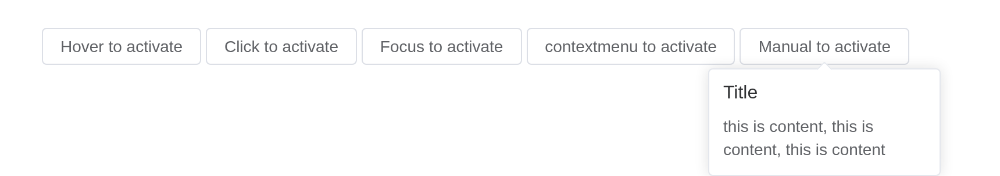

# Popover

## Placement

Popover has 9 placements.

Use attribute `content` to set the display content when hover. The
attribute `placement` determines the position of the Popover. Its value
is `[orientation]-[alignment]` with four orientations `top`, `left`,
`right`, `bottom` and three alignments `start`, `end`, `null`, and the
default alignment is null. Take `placement="left-end"` for example,
Popover will display on the left of the element which you are hovering
and the bottom of the Popover aligns with the bottom of the element.

``` r

places <- c(
  "top-start",
  "top",
  "top-end",
  "left",
  "right",
  "bottom-start",
  "bottom",
  "bottom-end"
)
tags$div(
  style = "padding: 60px 100px; display: flex; flex-wrap: wrap; gap: 12px",
  lapply(places, function(p) {
    el_popover(
      paste0("po_", gsub("-", "_", p)),
      reference = el$button(p),
      placement = p,
      title = "Title",
      popover_width = 200,
      content = "this is content, this is content, this is content"
    )
  })
)
```

## Basic usage

Popover is built with `ElTooltip`. So for some duplicated attributes,
please refer to the documentation of Tooltip.

The `trigger` attribute is used to define how popover is triggered:
`hover`, `click`, `focus` or `contextmenu` . If you want to manually
control it, you can set `:visible`.

Each button opens its popover as its label says: `contextmenu` on a
right-click, as the browser’s own menu, not on a left click. The last
one is opened and closed by the server, `update_el_popover(visible =)`.

``` r

pop <- function(id, label, trigger, placement = NULL, ...) {
  el_popover(
    id,
    reference = el_button(label = label),
    trigger = trigger,
    placement = placement,
    title = "Title",
    popover_width = 200,
    content = "this is content, this is content, this is content",
    ...
  )
}
ui <- el_page(
  tags$style(".el-button + .el-button { margin-left: 8px; }"),
  pop("p_hover", "Hover to activate", "hover", "top-start"),
  pop("p_click", "Click to activate", "click", "bottom"),
  pop("p_focus", "Focus to activate", "focus", "right"),
  pop("p_contextmenu", "contextmenu to activate", "contextmenu"),
  el_popover(
    "p_manual",
    reference = el_button("p_manual_btn", "Manual to activate"),
    visible = FALSE,
    placement = "bottom",
    title = "Title",
    popover_width = 200,
    content = "this is content, this is content, this is content"
  )
)
server <- function(input, output, session) {
  observeEvent(input$p_manual_btn, {
    update_el_popover(
      session,
      "p_manual",
      visible = input$p_manual_btn %% 2 == 1
    )
  })
}
shinyApp(ui, server)
```



## Virtual triggering

Like Tooltip, Popover can be triggered by virtual elements, if your use
case includes separate the triggering element and the content element,
you should definitely use the mechanism, normally we use `#reference` to
place our triggering element, with `virtual-ref` API you can set your
triggering element anywhere you like, but notice that the triggering
element should be an element that accepts `mouse` and `keyboard` event.

> **Warning**
>
> `v-popover` is about to be deprecated, please use `virtual-ref` as
> alternative.

`virtual_ref` is a CSS selector for the element that opens the popover,
wherever it is on the page.

``` r

tagList(
  el_button("vp_btn", "Click me"),
  el_popover(
    "vp",
    title = "With title",
    content = "Some content",
    trigger = "click",
    virtual_ref = "#vp_btn"
  )
)
```

## Rich content

Other components/elements can be nested in popover. Following is an
example of nested table.

replace the `content` attribute with a default `slot`.

A popover holds any UI: a table, or rich content beside an avatar. A
select inside one wants `teleported = FALSE`: its options are otherwise
drawn outside the popover, and choosing one closes it, as in Element
itself.

``` r

avatar <- "https://avatars.githubusercontent.com/u/72015883?v=4"
tags$div(
  style = "display: flex; align-items: center",
  el_popover(
    "addr",
    reference = el_button(
      label = "Click to activate",
      style = "margin-right: 16px"
    ),
    trigger = "click",
    popover_width = 400,
    placement = "right",
    body = el_table(
      data = data.frame(
        date = c("2016-05-02", "2016-05-04", "2016-05-01", "2016-05-03"),
        name = "Jack",
        address = "New York City"
      ),
      columns = list(
        el_table_column("date", "date", width = 150),
        el_table_column("name", "name", width = 100),
        el_table_column("address", "address", width = 300)
      )
    )
  ),
  el_popover(
    "rich",
    reference = el_avatar(src = avatar),
    popover_width = 300,
    popper_style = paste(
      "box-shadow: rgb(14 18 22 / 35%) 0px 10px 38px -10px,",
      "rgb(14 18 22 / 20%) 0px 10px 20px -15px; padding: 20px;"
    ),
    body = tags$div(
      class = "demo-rich-conent",
      style = "display: flex; gap: 16px; flex-direction: column",
      el_avatar(size = 60, src = avatar, style = "margin-bottom: 8px"),
      tags$div(
        tags$p(
          class = "demo-rich-content__name",
          style = "margin: 0; font-weight: 500",
          "Element Plus"
        ),
        tags$p(
          class = "demo-rich-content__mention",
          style = "margin: 0; font-size: 14px; color: var(--el-color-info)",
          "@element-plus"
        )
      ),
      tags$p(
        class = "demo-rich-content__desc",
        style = "margin: 0",
        "Element Plus, a Vue 3 based component library for developers,",
        "designers and product managers"
      )
    )
  )
)
```

## Nested operation

Of course, you can nest other operations. It’s more light-weight than
using a dialog.

Opened and closed from the server with `update_el_popover(visible =)`.

``` r

ui <- el_page(el_popover(
  "confirm",
  popover_width = 160,
  placement = "top",
  reference = el_button("delete", "Delete"),
  body = tagList(
    tags$p("Are you sure to delete this?"),
    el_button("no", "cancel", size = "small", text = TRUE),
    el_button("yes", "confirm", size = "small", type = "primary")
  )
))
server <- function(input, output, session) {
  observeEvent(input$delete, update_el_popover(id = "confirm", visible = TRUE))
  observeEvent(
    c(input$no, input$yes),
    update_el_popover(id = "confirm", visible = FALSE),
    ignoreInit = TRUE
  )
}
shinyApp(ui, server)
```


## Directive

You can still using popover in directive way but this is **not
recommended** anymore since this makes your application complicated, you
may refer to the virtual triggering for more information.

> **In R**
>
> Element Plus’s `v-popover` directive is template syntax on another
> component’s element, and each component here is an application of its
> own, so it has no R form. `virtual_ref` does what it does – see
> Virtual triggering above.

## API

Element Plus’s tables, and beside each entry where it is in R.

### Attributes

| Element | In R | Description | Type | Accepted | Default |
|----|----|----|----|----|----|
| `trigger` | `trigger` | how the popover is triggered, not valid in controlled mode | [^1]`'click' \\| 'focus' \\| 'hover' \\| 'contextmenu'` / [^2]`Array<'click' \\| 'focus' \\| 'hover' \\| 'contextmenu'>` |  | hover |
| `trigger-keys` | `trigger_keys` | When you click the mouse to focus on the trigger element, you can define a set of keyboard codes to control the display of popover through the keyboard, not valid in controlled mode | [^3] |  | \[‘Enter’,‘Space’\] |
| `title` | `title` | popover title | [^4] |  | — |
| `effect` | `effect` | Tooltip theme, built-in theme: `dark` / `light` | [^5]`'dark' \\| 'light'` / [^6] |  | light |
| `content` | `content` | popover content, can be replaced with a default `slot` | [^7] |  | ’’ |
| `width` | `popover_width` | popover width | [^8] / [^9] |  | 150 |
| `placement` | `placement` | popover placement | [^10]`'top' \\| 'top-start' \\| 'top-end' \\| 'bottom' \\| 'bottom-start' \\| 'bottom-end' \\| 'left' \\| 'left-start' \\| 'left-end' \\| 'right' \\| 'right-start' \\| 'right-end'` |  | bottom |
| `disabled` | `disabled` | whether Popover is disabled | [^11] |  | false |
| `visible` | `visible` | whether popover is visible | [^12] / [^13] |  | null |
| `offset` | `offset` | popover offset, `Popover` is built with `Tooltip`, offset of `Popover` is `undefined`, but offset of `Tooltip` is 12 | [^14] |  | undefined |
| `transition` | `transition` | popover transition animation, the default is el-fade-in-linear | [^15] |  | — |
| `show-arrow` | `show_arrow` | whether a tooltip arrow is displayed or not. For more info, please refer to [ElPopper](https://github.com/element-plus/element-plus/tree/dev/packages/components/popper) | [^16] |  | true |
| `popper-options` | `popper_options` | parameters for [popper.js](https://popper.js.org/docs/v2/) | [^17] |  | `{modifiers: [{name: 'computeStyles',options: {gpuAcceleration: false}}]}` |
| `popper-class` | `popper_class` | custom class name for popover | [^18] |  | — |
| `popper-style` | `popper_style` | custom style for popover | [^19] / [^20] |  | — |
| `show-after` | `show_after` | delay of appearance, in millisecond, not valid in controlled mode | [^21] |  | 0 |
| `hide-after` | `hide_after` | delay of disappear, in millisecond, not valid in controlled mode | [^22] |  | 200 |
| `auto-close` | `auto_close` | timeout in milliseconds to hide tooltip, not valid in controlled mode | [^23] |  | 0 |
| `tabindex` | `tabindex` | [tabindex](https://developer.mozilla.org/en-US/docs/Web/HTML/Global_attributes/tabindex) of Popover | [^24] / [^25] |  | 0 |
| `teleported` | `teleported` | whether popover dropdown is teleported to the body | [^26] |  | true |
| `append-to` | `append_to` | which element the popover CONTENT appends to | [^27] / [^28] |  | body |
| `persistent` | `persistent` | when popover inactive and `persistent` is `false` , popover will be destroyed | [^29] |  | true |
| `virtual-triggering` | `virtual_triggering` | Indicates whether virtual triggering is enabled | [^30] |  | — |
| `virtual-ref` | `virtual_ref` | Indicates the reference element to which the popover is attached | [^31] |  | — |
| `tooltip` |  | Inherits all attributes from Tooltip | — |  | — |

### Slots

| Element | In R | Description |
|----|----|----|
| `default` | default content | content of popover, version ^(2.13.4) and later can receive the hide parameter. |
| `reference` | `slots = list(reference = )` | HTML element that triggers popover, only a single root element is accepted |

### Events

| Element | In R | Description |
|----|----|----|
| `show` | `input$<id>_show` | triggers when popover shows |
| `before-enter` | `input$<id>_before_enter` | triggers when the entering transition before |
| `after-enter` | `input$<id>_after_enter` | triggers when the entering transition ends |
| `hide` | `input$<id>_hide` | triggers when popover hides |
| `before-leave` | `input$<id>_before_leave` | triggers when the leaving transition before |
| `after-leave` | `input$<id>_after_leave` | triggers when the leaving transition ends |

### Exposes

| Element | In R                           | Description  |
|---------|--------------------------------|--------------|
| `hide`  | `call_el(session, id, "hide")` | hide popover |

[^1]: enum

[^2]: array

[^3]: Array

[^4]: string

[^5]: enum

[^6]: string

[^7]: string

[^8]: string

[^9]: number

[^10]: enum

[^11]: boolean

[^12]: boolean

[^13]: null

[^14]: number

[^15]: string

[^16]: boolean

[^17]: object

[^18]: string

[^19]: string

[^20]: object

[^21]: number

[^22]: number

[^23]: number

[^24]: number

[^25]: string

[^26]: boolean

[^27]: CSSSelector

[^28]: HTMLElement

[^29]: boolean

[^30]: boolean

[^31]: HTMLElement
