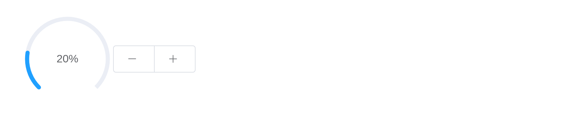

# Progress

Progress shows how far an operation has got;
[`update_el_progress()`](https://kaipingyang.github.io/shiny.element/reference/update_el_progress.md)
moves it from the server.

## Linear progress bar

`format`, a
[`JS()`](https://kaipingyang.github.io/shiny.element/reference/JS.md)
function, writes the text.

``` r

tagList(lapply(list(
  el_progress("p1", percentage = 50),
  el_progress("p2", percentage = 100, format = JS("function(p) { return p === 100 ? 'Full' : p + '%'; }")),
  el_progress("p3", percentage = 100, status = "success"),
  el_progress("p4", percentage = 100, status = "warning"),
  el_progress("p5", percentage = 50, status = "exception")),
  function(x) tags$div(style = "width: 400px; margin-bottom: 12px", x)))
```

## Internal percentage

``` r

tagList(lapply(list(
  el_progress("i1", percentage = 70, text_inside = TRUE, stroke_width = 26),
  el_progress("i2", percentage = 100, text_inside = TRUE, stroke_width = 24, status = "success"),
  el_progress("i3", percentage = 80, text_inside = TRUE, stroke_width = 22, status = "warning"),
  el_progress("i4", percentage = 50, text_inside = TRUE, stroke_width = 20, status = "exception")),
  function(x) tags$div(style = "width: 400px; margin-bottom: 12px", x)))
```

## Custom color

`color` is a colour, a
[`JS()`](https://kaipingyang.github.io/shiny.element/reference/JS.md)
function of the percentage, or a list of stops.

``` r

tagList(lapply(list(
  el_progress("c1", percentage = 20, color = "#409eff"),
  el_progress("c2", percentage = 50, color = JS(
    "function(p) { return p < 30 ? '#909399' : p < 70 ? '#e6a23c' : '#67c23a'; }")),
  el_progress("c3", percentage = 80, color = list(
    list(color = "#f56c6c", percentage = 20), list(color = "#e6a23c", percentage = 40),
    list(color = "#5cb87a", percentage = 60), list(color = "#1989fa", percentage = 80),
    list(color = "#6f7ad3", percentage = 100)))),
  function(x) tags$div(style = "width: 400px; margin-bottom: 12px", x)))
```

## Circular progress bar

``` r

el_progress("o1", type = "circle", percentage = 0)
el_progress("o2", type = "circle", percentage = 25)
el_progress("o3", type = "circle", percentage = 100, status = "success")
el_progress("o4", type = "circle", percentage = 70, status = "warning")
el_progress("o5", type = "circle", percentage = 50, status = "exception")
```

## Dashboard progress bar

``` r

ui <- el_page(el_progress("dash", type = "dashboard", percentage = 10),
              el_button_group(el_button("minus", NULL, icon = "el-icon-minus"),
                              el_button("plus", NULL, icon = "el-icon-plus")))

server <- function(input, output, session) {
  pct <- reactiveVal(10)
  observeEvent(input$plus, pct(min(100, pct() + 10)))
  observeEvent(input$minus, pct(max(0, pct() - 10)))
  observe(update_el_progress(id = "dash", percentage = pct()))
}

shinyApp(ui, server)
```



## API

### Attributes

| Element | In R | Description | Type | Accepted | Default |
|----|----|----|----|----|----|
| `percentage` | `percentage` | percentage, **required** | number | 0-100 | 0 |
| `type` | `type` | the type of progress bar | string | line/circle/dashboard | line |
| `stroke-width` | `stroke_width` | the width of progress bar | number | — | 6 |
| `text-inside` | `text_inside` | whether to place the percentage inside progress bar, only works when `type` is ‘line’ | boolean | — | false |
| `status` | `status` | the current status of progress bar | string | success/exception/warning | — |
| `color` | `color` | background color of progress bar. Overrides `status` prop | string/function/array | — | ’’ |
| `width` | `width` | the canvas width of circle progress bar | number | — | 126 |
| `show-text` | `show_text` | whether to show percentage | boolean | — | true |
| `stroke-linecap` | `stroke_linecap` | circle/dashboard type shape at the end path | string | butt/round/square | round |
| `format` | `format` | custom text format | function(percentage) | — | — |
| `define-back-color` | `define_back_color` | background color of progress bar (hex format) | string | — | — |
| `text-color` | `text_color` | text color of progress bar (hex format) | string | — | — |
