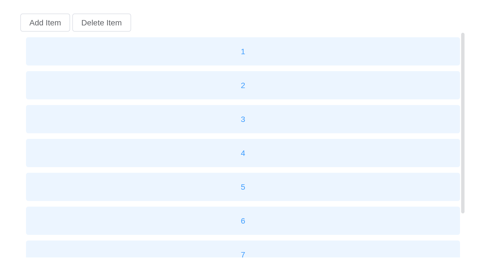

# Scrollbar

Used to replace the browser’s native scrollbar.

## Basic usage

Use `height` property to set the height of the scrollbar, or if not set,
it adapts according to the parent container height.

``` r

item <- function(i) {
  tags$p(
    class = "scrollbar-demo-item",
    style = paste(
      "display: flex; align-items: center; justify-content: center; height: 50px; margin: 10px;",
      "text-align: center; border-radius: 4px; background: var(--el-color-primary-light-9);",
      "color: var(--el-color-primary)"
    ),
    i
  )
}
el_scrollbar(height = "400px", lapply(1:20, item))
```

## Horizontal scroll

When the element width is greater than the scrollbar width, the
horizontal scrollbar is displayed.

``` r

item <- function(i) {
  tags$p(
    style = paste(
      "flex-shrink: 0; display: flex; align-items: center; justify-content: center; width: 100px;",
      "height: 50px; margin: 10px; border-radius: 4px; background: var(--el-color-danger-light-9);",
      "color: var(--el-color-danger)"
    ),
    i
  )
}
el_scrollbar(tags$div(style = "display: flex", lapply(1:50, item)))
```

## Max height

The scrollbar is displayed only when the element height exceeds the max
height.

The buttons add and delete items: the scrollbar appears once they pass
`max_height`.

``` r

ui <- el_page(
  tags$style(
    ".scrollbar-demo-item { display: flex; align-items: center;
       justify-content: center; height: 50px; margin: 10px; text-align: center;
       border-radius: 4px; background: var(--el-color-primary-light-9);
       color: var(--el-color-primary); }"
  ),
  el_button("sb_add", "Add Item"),
  el_button("sb_delete", "Delete Item"),
  el_scrollbar(max_height = "400px", uiOutput("sb_items"))
)
server <- function(input, output, session) {
  count <- reactiveVal(3)
  observeEvent(input$sb_add, count(count() + 1))
  observeEvent(input$sb_delete, count(max(0, count() - 1)))
  output$sb_items <- renderUI({
    lapply(seq_len(count()), function(i) {
      tags$p(class = "scrollbar-demo-item", i)
    })
  })
}
shinyApp(ui, server)
```



## Manual scroll

Use `setScrollTop` and `setScrollLeft` methods can control scrollbar
manually.

The slider scrolls the area from the server,
`call_el(session, "sb", "setScrollTop", list(px))`, and follows it back:
`input$sb_scroll` says where it is. Twenty items of 60px and a margin
make 1210px, 830px more than the 380px shown.

``` r

ui <- el_page(
  tags$style(
    ".scrollbar-demo-item { display: flex; align-items: center;
       justify-content: center; height: 50px; margin: 10px; text-align: center;
       border-radius: 4px; background: var(--el-color-primary-light-9);
       color: var(--el-color-primary); }
     .el-slider { margin-top: 20px; }"
  ),
  el_scrollbar(
    id = "sb",
    height = "400px",
    events = "scroll",
    always = TRUE,
    tags$div(lapply(1:20, function(i) tags$p(class = "scrollbar-demo-item", i)))
  ),
  el_slider(
    "sb_slider",
    value = 0,
    max = 830,
    format_tooltip = JS("function(value) { return value + ' px'; }")
  )
)
server <- function(input, output, session) {
  observeEvent(input$sb_slider, ignoreInit = TRUE, {
    call_el(session, "sb", "setScrollTop", list(input$sb_slider))
  })
  observeEvent(input$sb_scroll, {
    update_el_slider(
      session,
      "sb_slider",
      value = round(input$sb_scroll$scrollTop)
    )
  })
}
shinyApp(ui, server)
```


## Infinite scroll

`end-reached` is triggered when the scrollbar reaches the end. It can be
used as an infinite scroll.

Reaching an end is `input$<id>_end_reached`: `"bottom"`, `"top"`, …

``` r

item <- function(i) {
  tags$p(
    style = paste(
      "display: flex; align-items: center; justify-content: center; height: 50px; margin: 10px;",
      "border-radius: 4px; background: var(--el-color-primary-light-9); color: var(--el-color-primary)"
    ),
    i
  )
}
el_scrollbar(id = "sb_more", height = "400px", lapply(1:30, item))
```

## API

Element Plus’s tables, and beside each entry where it is in R.

### Attributes

| Element | In R | Description | Type | Accepted | Default |
|----|----|----|----|----|----|
| `height` | `height` | height of scrollbar | [^1] / [^2] |  | — |
| `max-height` | `max_height` | max height of scrollbar | [^3] / [^4] |  | — |
| `native` | `native` | whether to use the native scrollbar style | [^5] |  | false |
| `wrap-style` | `wrap_style` | style of wrap container | [^6] / [^7]`CSSProperties \\| CSSProperties[] \\| string[]` |  | — |
| `wrap-class` | `wrap_class` | class of wrap container | [^8] |  | — |
| `view-style` | `view_style` | style of view | [^9] / [^10]`CSSProperties \\| CSSProperties[] \\| string[]` |  | — |
| `view-class` | `view_class` | class of view | [^11] |  | — |
| `noresize` | `noresize` | do not respond to container size changes, if the container size does not change, it is better to set it to optimize performance | [^12] |  | false |
| `tag` | `tag` | element tag of the view | [^13] |  | div |
| `always` | `always` | always show scrollbar | [^14] |  | false |
| `min-size` | `min_size` | minimum size of scrollbar | [^15] |  | 20 |
| `id` | `id`, the Shiny input’s | id of view | [^16] |  | — |
| `role` | `role` | role of view | [^17] |  | — |
| `aria-label` | `aria_label` | aria-label of view | [^18] |  | — |
| `aria-orientation` | `aria_orientation` | aria-orientation of view | [^19]`'horizontal' \\| 'vertical'` |  | — |
| `tabindex` | `tabindex` | tabindex of wrap container | [^20] / [^21] |  | — |
| `distance` | `distance` | trigger end-reached event distance(px) | [^22] |  | 0 |

### Events

| Element | In R | Description |
|----|----|----|
| `scroll` | `input$<id>_scroll`, with `events = "scroll"` | triggers when scrolling, return distance of scrolling |
| `end-reached` | `input$<id>_end_reached` | triggers when the end of a scroll is triggered |

### Slots

| Element   | In R            | Description               |
|-----------|-----------------|---------------------------|
| `default` | default content | customize default content |

### Exposes

| Element | In R | Description |
|----|----|----|
| `handleScroll` | `call_el(session, id, "handleScroll")` | handle scroll event |
| `scrollTo` | `call_el(session, id, "scrollTo")` | scrolls to a particular set of coordinates |
| `setScrollTop` | `call_el(session, id, "setScrollTop")` | Set distance to scroll top |
| `setScrollLeft` | `call_el(session, id, "setScrollLeft")` | Set distance to scroll left |
| `update` | `call_el(session, id, "update")` | update scrollbar state manually |

[^1]: string

[^2]: number

[^3]: string

[^4]: number

[^5]: boolean

[^6]: string

[^7]: object

[^8]: string

[^9]: string

[^10]: object

[^11]: string

[^12]: boolean

[^13]: string

[^14]: boolean

[^15]: number

[^16]: string

[^17]: string

[^18]: string

[^19]: enum

[^20]: number

[^21]: string

[^22]: number
