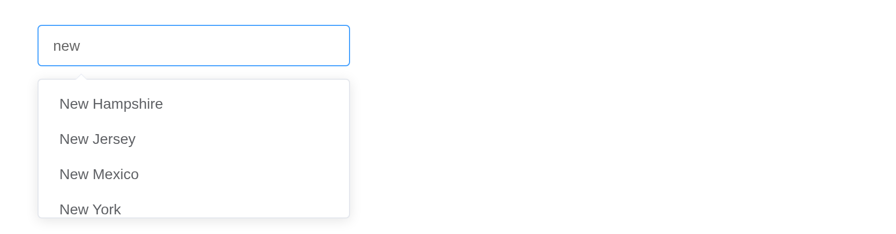

# Select

When there are plenty of options, use a drop-down menu to display and
select desired ones. `choices` and `selected` take what
[`selectInput()`](https://rdrr.io/pkg/shiny/man/selectInput.html) takes;
Element’s names, `options` and `value`, work too.

## Basic usage

``` r

el_select("food", choices = c("Golden Pot" = "1", "Fried Rice" = "2",
                              "Noodles" = "3", "Dumplings" = "4"), width = "240px")
```

## Disabled option

``` r

el_select("opt", width = "240px", choices = list(
  list(value = "1", label = "Golden Pot"), list(value = "2", label = "Fried Rice", disabled = TRUE),
  list(value = "3", label = "Noodles")))
```

## Disabled select

``` r

el_select("dis", choices = c("Golden Pot", "Fried Rice"), disabled = TRUE, width = "240px")
```

## Clearable single select

``` r

el_select("clr", choices = c("Golden Pot", "Fried Rice"), selected = "Fried Rice",
          clearable = TRUE, width = "240px")
```

## Basic multiple select

``` r

dishes <- c("Golden Pot", "Fried Rice", "Noodles", "Dumplings", "Hot Pot")
el_select("m1", choices = dishes, selected = dishes[1:3], multiple = TRUE, width = "360px")
tags$div(style = "height: 16px")
el_select("m2", choices = dishes, selected = dishes[1:3], multiple = TRUE,
          collapse_tags = TRUE, width = "240px")
```

## Custom template

`option_template` draws each option; it is `opt` there, with every field
its choice carries.

``` r

el_select("city", width = "240px", choices = list(
  list(value = "beijing", label = "Beijing", code = "PEK"),
  list(value = "shanghai", label = "Shanghai", code = "SHA"),
  list(value = "chengdu", label = "Chengdu", code = "CTU")),
  option_template = tagList(
    tags$span(style = "float: left", "{{ opt.label }}"),
    tags$span(style = "float: right; color: #8492a6; font-size: 13px", "{{ opt.code }}")))
```

## Grouping

A named list of vectors groups the choices, as in
[`selectInput()`](https://rdrr.io/pkg/shiny/man/selectInput.html).

``` r

el_select("grp", width = "240px", choices = list(
  "Popular cities" = c(Shanghai = "sh", Beijing = "bj"),
  "City name" = c(Chengdu = "cd", Shenzhen = "sz", Guangzhou = "gz")))
```

## Option filtering

``` r

el_select("flt", choices = c("Golden Pot", "Fried Rice", "Noodles"), filterable = TRUE,
          placeholder = "Type to filter", width = "240px")
```

## Remote search

With `remote = TRUE` the server does the search: the text arrives as
`input$<id>_query`, and
[`update_el_select()`](https://kaipingyang.github.io/shiny.element/reference/update_el_select.md)
with the matches answers it.

``` r

ui <- el_page(el_select("states", filterable = TRUE, remote = TRUE, multiple = TRUE,
                        placeholder = "Please enter a keyword", width = "300px"))

server <- function(input, output, session) {
  observeEvent(input$states_query, {
    update_el_select(id = "states",
      choices = grep(input$states_query, state.name, ignore.case = TRUE, value = TRUE))
  })
}

shinyApp(ui, server)
```



## Create new items

``` r

el_select("tags", choices = c("HTML", "CSS", "JavaScript"), multiple = TRUE,
          filterable = TRUE, allow_create = TRUE, default_first_option = TRUE,
          placeholder = "Choose tags for your article", width = "300px")
```

## API

### Select Attributes

| Element | In R | Description | Type | Accepted | Default |
|----|----|----|----|----|----|
| `value` | `selected (or value)` | binding value | boolean / string / number | — | — |
| `multiple` | `multiple` | whether multiple-select is activated | boolean | — | false |
| `disabled` | `disabled` | whether Select is disabled | boolean | — | false |
| `value-key` | `value_key` | unique identity key name for value, required when value is an object | string | — | value |
| `size` | `size` | size of Input | string | large/small/mini | — |
| `clearable` | `clearable` | whether select can be cleared | boolean | — | false |
| `collapse-tags` | `collapse_tags` | whether to collapse tags to a text when multiple selecting | boolean | — | false |
| `multiple-limit` | `multiple_limit` | maximum number of options user can select when `multiple` is `true`. No limit when set to 0 | number | — | 0 |
| `name` | `name` | the name attribute of select input | string | — | — |
| `autocomplete` | `autocomplete` | the autocomplete attribute of select input | string | — | off |
| `auto-complete` | `(deprecated upstream;`autocomplete`)` | @DEPRECATED in next major version | string | — | off |
| `placeholder` | `placeholder` | placeholder | string | — | Select |
| `filterable` | `filterable` | whether Select is filterable | boolean | — | false |
| `allow-create` | `allow_create` | whether creating new items is allowed. To use this, `filterable` must be true | boolean | — | false |
| `filter-method` | `filter_method` | custom filter method | function | — | — |
| `remote` | `remote` | whether options are loaded from server | boolean | — | false |
| `remote-method` | `remote_method` | custom remote search method | function | — | — |
| `loading` | `loading` | whether Select is loading data from server | boolean | — | false |
| `loading-text` | `loading_text` | displayed text while loading data from server | string | — | Loading |
| `no-match-text` | `no_match_text` | displayed text when no data matches the filtering query, you can also use slot `empty` | string | — | No matching data |
| `no-data-text` | `no_data_text` | displayed text when there is no options, you can also use slot `empty` | string | — | No data |
| `popper-class` | `popper_class` | custom class name for Select’s dropdown | string | — | — |
| `reserve-keyword` | `reserve_keyword` | when `multiple` and `filter` is true, whether to reserve current keyword after selecting an option | boolean | — | false |
| `default-first-option` | `default_first_option` | select first matching option on enter key. Use with `filterable` or `remote` | boolean | \- | false |
| `popper-append-to-body` | `popper_append_to_body` | whether to append the popper menu to body. If the positioning of the popper is wrong, you can try to set this prop to false | boolean | \- | true |
| `automatic-dropdown` | `automatic_dropdown` | for non-filterable Select, this prop decides if the option menu pops up when the input is focused | boolean | \- | false |

### Select Events

| Element | In R | Description |
|----|----|----|
| `change` | `input$<id>`, the value | triggers when the selected value changes |
| `visible-change` | `input$<id>_visible_change` | triggers when the dropdown appears/disappears |
| `remove-tag` | `input$<id>_remove_tag` | triggers when a tag is removed in multiple mode |
| `clear` | `input$<id>_clear` | triggers when the clear icon is clicked in a clearable Select |
| `blur` | `input$<id>_blur` | triggers when Input blurs |
| `focus` | `input$<id>_focus` | triggers when Input focuses |

### Select Slots

| Element  | In R                      | Description                      |
|----------|---------------------------|----------------------------------|
| `prefix` | `slots = list(prefix = )` | content as Select prefix         |
| `empty`  | `slots = list(empty = )`  | content when there is no options |

### Option Group Attributes

| Element | In R | Description | Type | Accepted | Default |
|----|----|----|----|----|----|
| `label` | `label` | name of the group | string | — | — |
| `disabled` | `disabled` | whether to disable all options in this group | boolean | — | false |

### Option Attributes

| Element | In R | Description | Type | Accepted | Default |
|----|----|----|----|----|----|
| `value` | `value` | value of option | string/number/object | — | — |
| `label` | `label` | label of option, same as `value` if omitted | string/number | — | — |
| `disabled` | `disabled` | whether option is disabled | boolean | — | false |

### Methods

| Element | In R | Description |
|----|----|----|
| `focus` | `el_call(session, id, "focus")` | focus the Input component |
| `blur` | `el_call(session, id, "blur")` | blur the Input component, and hide the dropdown |
