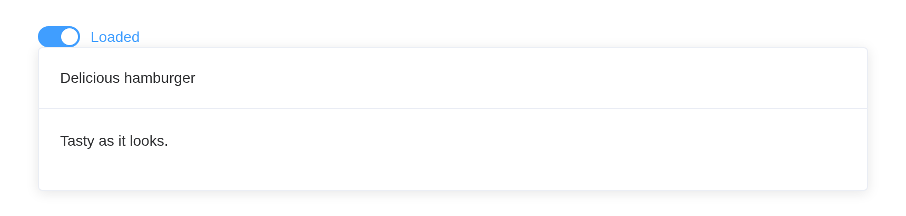

# Skeleton

A placeholder while data loads. `update_el_skeleton(loading = FALSE)`
swaps in the real content, given in `...`.

## Basic usage

``` r

el_skeleton("sk1")
```

## Configurable rows

``` r

el_skeleton("sk2", rows = 6)
```

## Animation

``` r

el_skeleton("sk3", rows = 6, animated = TRUE)
```

## Customized template

The `template` slot draws the placeholder, from `el$skeleton_item()`s.

``` r

el_skeleton("sk4", slots = list(template = tags$div(style = "width: 240px",
  el$skeleton_item(variant = "image", style = "width: 240px; height: 240px"),
  tags$div(style = "padding: 14px",
    el$skeleton_item(variant = "p", style = "width: 50%"),
    tags$div(style = "display: flex; justify-content: space-between; margin-top: 16px",
      el$skeleton_item(variant = "text", style = "margin-right: 16px"),
      el$skeleton_item(variant = "text", style = "width: 30%"))))))
```

## Loading state

``` r

ui <- el_page(
  el_switch("done", active_text = "Loaded"),
  el_skeleton("card", rows = 4, animated = TRUE,
    el_card(header = "Delicious hamburger", tags$p("Tasty as it looks."))))

server <- function(input, output, session) {
  observeEvent(input$done, update_el_skeleton(id = "card", loading = !input$done))
}

shinyApp(ui, server)
```



## Rendering a list of data

`count` repeats the placeholder.

``` r

el_skeleton("sk5", count = 3, rows = 1)
```

## Avoiding rendering bouncing

`throttle` waits that many milliseconds before showing the placeholder,
so a quick load never flashes it.

``` r

el_skeleton("sk6", throttle = 500, rows = 2, tags$p("Loaded"))
```

## API

### Skeleton Attributes

| Element | In R | Description | Type | Accepted | Default |
|----|----|----|----|----|----|
| `animated` | `animated` | whether showing the animation | boolean | true / false | false |
| `count` | `count` | how many fake items to render to the DOM | number | integer | 1 |
| `loading` | `loading` | whether showing the skeleton | boolean | true / false | true |
| `rows` | `rows` | numbers of the row, only useful when no template slot were given | number | integer | 4 |
| `throttle` | `throttle` | Rendering delay in millseconds | number | integer | 0 |

### Skeleton Item Attributes

| Element | In R | Description | Type | Accepted | Default |
|----|----|----|----|----|----|
| `variant` | `template(variant =)` | The current rendering skeleton type | Enum(string) | p / h1 / h3 / text / caption / button / image / circle / rect | text |

### Skeleton Slots

| Element    | In R                        | Description                        |
|------------|-----------------------------|------------------------------------|
| `default`  | default content             | Real rendering DOM                 |
| `template` | `slots = list(template = )` | Custom rendering skeleton template |
