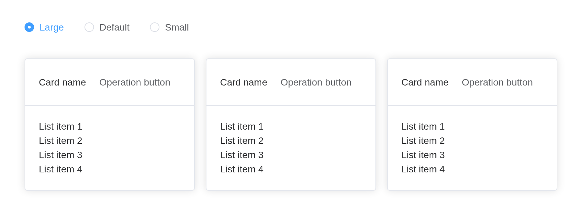
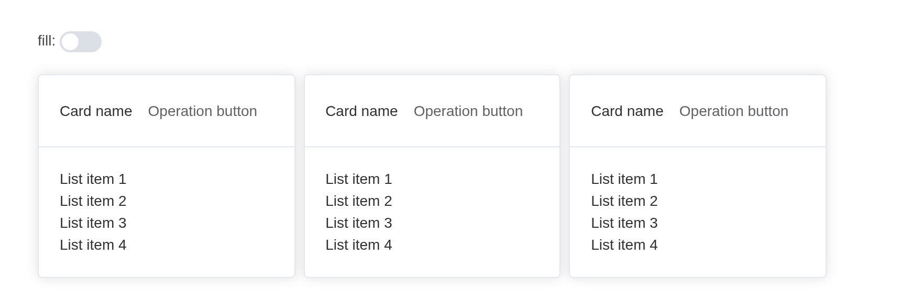
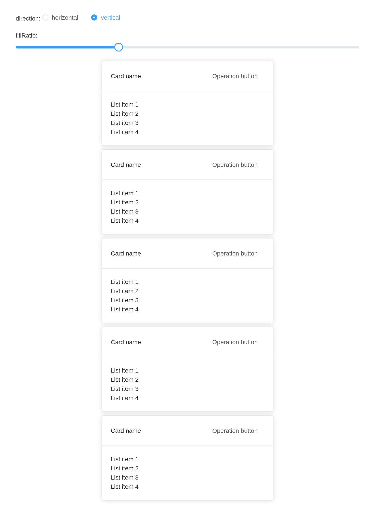

# Space

Even though we have
[Divider](https://kaipingyang.github.io/shiny.element/articles/components/divider.md),
but sometimes we need more than one
[Divider](https://kaipingyang.github.io/shiny.element/articles/components/divider.md)
to split the elements apart, so we stack each elements upon
[Divider](https://kaipingyang.github.io/shiny.element/articles/components/divider.md),
but doing so not only makes our code ugly but also makes it difficult to
maintain. **Space** is this kind of component provides us both
productivity and elegance.

## Basic usage

The basic use case is using this component to provide unified space
between each components

Using Space to provide space

``` r

card <- function(i) {
  el_card(
    style = "width: 250px",
    header = tags$div(
      style = "display: flex; justify-content: space-between; align-items: center",
      tags$span("Card name"),
      el_button(label = "Operation button", text = TRUE)
    ),
    lapply(1:4, function(o) tags$div(paste("List item", o)))
  )
}
el_space(wrap = TRUE, lapply(1:3, card))
```

## Vertical layout

Using `direction` attribute to control the layout, we use
`flex-direction` to implement this.

We also provide vertical layout.

``` r

card <- function(i) {
  el_card(
    style = "width: 250px",
    header = tags$div(
      style = "display: flex; justify-content: space-between; align-items: center",
      tags$span("Card name"),
      el_button(label = "Operation button", text = TRUE)
    ),
    lapply(1:4, function(o) tags$div(paste("List item", o)))
  )
}
el_space(direction = "vertical", lapply(1:2, card))
```

## Control the size of the space

Control the space size via `size` API.

You can set the size with built-in sizes `small`, `default`, `large`,
these size corresponds to `8px`, `12px`, `16px`. The default size is
`small`, A.K.A. `8px`

You can also using customized size to override it. Refer to the next
part.

The radios set the inner space’s `size` with
[`update_el_space()`](https://kaipingyang.github.io/shiny.element/reference/el_space.md).

``` r

card <- function(i) {
  el_card(
    style = "width: 250px",
    header = tags$div(
      style = "display: flex; justify-content: space-between; align-items: center",
      tags$span("Card name"),
      el_button(label = "Operation button", text = TRUE)
    ),
    lapply(1:4, function(o) tags$div(paste("List item", o)))
  )
}
ui <- el_page(
  tags$div(
    style = "display: flex; flex-direction: column; align-items: flex-start; gap: 30px",
    el_radio_group(
      "sp_size",
      choices = c(Large = "large", Default = "default", Small = "small"),
      selected = "default"
    ),
    el_space(id = "sp_cards", wrap = TRUE, size = "default", lapply(1:3, card))
  )
)
server <- function(input, output, session) {
  observeEvent(input$sp_size, ignoreInit = TRUE, {
    update_el_space(session, "sp_cards", size = input$sp_size)
  })
}
shinyApp(ui, server)
```



## Customized Size

Sometimes built-in sizes could not meet the business needs, we can use
custom size (number type) to control the space between items.

The slider sets the space’s `size` in pixels.

``` r

card <- function(i) {
  el_card(
    style = "width: 250px",
    header = tags$div(
      style = "display: flex; justify-content: space-between; align-items: center",
      tags$span("Card name"),
      el_button(label = "Operation button", text = TRUE)
    ),
    lapply(1:4, function(o) tags$div(paste("List item", o)))
  )
}
ui <- el_page(
  el_slider("sp_px", value = 20),
  el_space(id = "sp_px_cards", wrap = TRUE, size = 20, lapply(1:2, card))
)
server <- function(input, output, session) {
  observeEvent(input$sp_px, ignoreInit = TRUE, {
    update_el_space(session, "sp_px_cards", size = input$sp_px)
  })
}
shinyApp(ui, server)
```


> **Tip**
>
> Do not use `ElSpace` with components that depend on ancestor width
> (height), e.g. `ElSlider`, in this case when you drag the trigger
> button the bar will grow which causes misplacement between cursor and
> trigger button.

## Auto wrapping

When in **horizontal** mode, using `wrap` (**bool type**) to control
auto wrapping behavior.

Using `wrap` to control line wrap

``` r

el_space(
  wrap = TRUE,
  lapply(1:20, function(i) {
    tags$div(el_button(label = "Text button", text = TRUE))
  })
)
```

## Spacer

Sometimes we want something more than blank space, so we have (spacer)
to help us.

## Literal type spacer

``` r

el_space(
  size = 10,
  spacer = "|",
  lapply(1:2, function(i) tags$div(el_button(label = paste("button", i))))
)
```

## Spacer can also be VNode

A spacer can be a VNode too, built in the browser from
[`JS()`](https://kaipingyang.github.io/shiny.element/reference/JS.md)
code.

``` r

el_space(
  size = 10,
  spacer = JS("Vue.h(ElementPlus.ElDivider, { direction: 'vertical' })"),
  lapply(1:2, function(i) tags$div(el_button(label = paste("button", i))))
)
```

## Alignment

Setting this attribute can adjust the alignment of child nodes, the
desirable value can be found at
[align-items](https://developer.mozilla.org/en-US/docs/Web/CSS/align-items).

Using `alignment`

``` r

box <- function(alignment = NULL) {
  tags$div(
    class = "alignment-container",
    el_space(
      alignment = alignment,
      "string",
      el_button(label = "button"),
      el_card(header = "header", "body")
    )
  )
}
tagList(
  tags$style(
    ".alignment-container { width: 240px; margin-bottom: 20px; padding: 8px;
       border: 1px solid var(--el-border-color); }"
  ),
  box(),
  box("flex-start"),
  box("flex-end")
)
```

## Fill the container

Through the `fill` **(Boolean type)** parameter, you can control whether
the child node automatically fills the container.

In the following example, when set to `fill`, the width of the child
node will automatically adapt to the width of the container.

Use fill to automatically fill the container with child nodes

The switch sets `fill` with
[`update_el_space()`](https://kaipingyang.github.io/shiny.element/reference/el_space.md).

``` r

card <- function(i) {
  el_card(
    header = tags$div(
      style = "display: flex; justify-content: space-between; align-items: center",
      tags$span("Card name"),
      el_button(label = "Operation button", text = TRUE)
    ),
    lapply(1:4, function(o) tags$div(paste("List item", o)))
  )
}
ui <- el_page(
  tags$div(
    style = "margin-bottom: 15px",
    "fill: ",
    el_switch("sp_fill_on", value = TRUE)
  ),
  el_space(id = "sp_fill", fill = TRUE, wrap = TRUE, lapply(1:3, card))
)
server <- function(input, output, session) {
  observeEvent(input$sp_fill_on, ignoreInit = TRUE, {
    update_el_space(session, "sp_fill", fill = input$sp_fill_on)
  })
}
shinyApp(ui, server)
```



You can also use the `fillRatio` parameter to customize the filling
ratio. The default value is `100`, which represents filling based on the
width of the parent container at `100%`.

It should be noted that the expression of horizontal layout and vertical
layout is slightly different, the specific effect can be viewed in the
following example.

Use fillRatio to customize the fill ratio

The radios set `direction`, the slider `fill_ratio`.

``` r

card <- function(i) {
  el_card(
    header = tags$div(
      style = "display: flex; justify-content: space-between; align-items: center",
      tags$span("Card name"),
      el_button(label = "Operation button", text = TRUE)
    ),
    lapply(1:4, function(o) tags$div(paste("List item", o)))
  )
}
ui <- el_page(
  tags$div(
    style = "margin-bottom: 15px",
    "direction: ",
    el_radio_group(
      "sp_dir",
      choices = c("horizontal", "vertical"),
      selected = "horizontal"
    )
  ),
  tags$div(
    style = "margin-bottom: 15px",
    "fillRatio:",
    el_slider("sp_ratio", value = 30)
  ),
  el_space(
    id = "sp_ratio_cards",
    fill = TRUE,
    wrap = TRUE,
    fill_ratio = 30,
    direction = "horizontal",
    width = "100%",
    lapply(1:5, card)
  )
)
server <- function(input, output, session) {
  observeEvent(input$sp_dir, ignoreInit = TRUE, {
    update_el_space(session, "sp_ratio_cards", direction = input$sp_dir)
  })
  observeEvent(input$sp_ratio, ignoreInit = TRUE, {
    update_el_space(session, "sp_ratio_cards", fill_ratio = input$sp_ratio)
  })
}
shinyApp(ui, server)
```



## API

Element Plus’s tables, and beside each entry where it is in R.

### Attributes

| Element | In R | Description | Type | Accepted | Default |
|----|----|----|----|----|----|
| `alignment` | `alignment` | Controls the alignment of items | [^1]`'center' \\| 'normal' \\| 'stretch' \\| ...` [align-items](https://developer.mozilla.org/en-US/docs/Web/CSS/align-items) |  | center |
| `class` | an HTML attribute of the tag; [`tagAppendAttributes()`](https://rstudio.github.io/htmltools/reference/tagAppendAttributes.html) | className | [^2] / [^3] / [^4] |  | — |
| `direction` | `direction` | Placement direction | [^5]`'vertical' \\| 'horizontal'` |  | horizontal |
| `prefix-cls` | `(internal upstream)` | Prefix for space-items | [^6] |  | — |
| `style` | an HTML attribute of the tag; [`tagAppendAttributes()`](https://rstudio.github.io/htmltools/reference/tagAppendAttributes.html) | Extra style rules | [^7] / [^8]`CSSProperties \\| CSSProperties[] \\| string[]` |  | — |
| `spacer` | `spacer` | Spacer | [^9] / [^10] / [^11] |  | — |
| `size` | `size` | Spacing size | [^12]`'default' \\| 'small' \\| 'large'` / [^13] / [^14]`[number, number]` |  | small |
| `wrap` | `wrap` | Auto wrapping | [^15] |  | false |
| `fill` | `fill` | Whether to fill the container | [^16] |  | false |
| `fill-ratio` | `fill_ratio` | Ratio of fill | [^17] |  | 100 |

### Slots

| Element   | In R            | Description        |
|-----------|-----------------|--------------------|
| `default` | default content | Items to be spaced |

[^1]: enum

[^2]: string

[^3]: object

[^4]: array

[^5]: enum

[^6]: string

[^7]: string

[^8]: object

[^9]: string

[^10]: number

[^11]: VNode

[^12]: enum

[^13]: number

[^14]: array

[^15]: boolean

[^16]: boolean

[^17]: number
