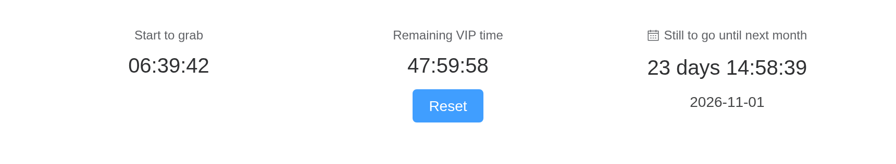

# Statistic

Display statistics.

## Basic usage

To highlight a number or a group of numbers, such as statistical value,
amount, and ranking, you can add elements such as icon and unit before
and after the number and title. And use
[vueuse](https://vueuse.org/core/useTransition/) to add animated
transitions to value.

``` r

el_row(
  el_col(span = 6, el_statistic(title = "Daily active users", value = 268500)),
  el_col(
    span = 6,
    el_statistic(
      value = 138,
      slots = list(
        title = tags$div(
          style = "display: inline-flex; align-items: center",
          "Ratio of men to women ",
          el_icon("Warning", size = "12px")
        ),
        suffix = "/100"
      )
    )
  ),
  el_col(span = 6, el_statistic(title = "Total Transactions", value = 172000)),
  el_col(
    span = 6,
    el_statistic(
      title = "Feedback number",
      value = 562,
      slots = list(suffix = el_icon("ChatLineRound"))
    )
  )
)
```

## Countdown

Countdown component, support to add other components control countdown.

`input$<id>_finish` fires at zero. Reset sets the second one’s `value`
again, with
[`update_el_countdown()`](https://kaipingyang.github.io/shiny.element/reference/el_statistic.md).

``` r

next_month <- as.POSIXct(
  format(seq(Sys.Date(), by = "month", length.out = 2)[2], "%Y-%m-01")
)
col <- function(...) {
  el_col(
    xs = 24,
    sm = 12,
    md = 8,
    style = "text-align: center; margin-bottom: 16px",
    ...
  )
}
ui <- el_page(
  el_row(
    gutter = 16,
    col(el_countdown(
      "cd_grab",
      title = "Start to grab",
      value = Sys.time() + 60 * 60 * 7
    )),
    col(
      el_countdown(
        "cd_vip",
        title = "Remaining VIP time",
        format = "HH:mm:ss",
        value = Sys.time() + 60 * 60 * 24 * 2 - 60 * 60
      ),
      tags$div(
        style = "margin-top: 8px",
        el_button("cd_reset", "Reset", type = "primary")
      )
    ),
    col(
      el_countdown(
        "cd_month",
        format = "DD [days] HH:mm:ss",
        value = next_month,
        slots = list(
          title = tags$div(
            style = "display: inline-flex; align-items: center",
            el_icon("Calendar", size = 12, style = "margin-right: 4px"),
            "Still to go until next month"
          )
        )
      ),
      tags$div(style = "margin-top: 8px", format(next_month, "%Y-%m-%d"))
    )
  )
)
server <- function(input, output, session) {
  observeEvent(input$cd_reset, {
    update_el_countdown(
      session,
      "cd_vip",
      value = Sys.time() + 60 * 60 * 24 * 2
    )
  })
}
shinyApp(ui, server)
```



> **Tip**
>
> In formatting it is suggested to be in the range of days

## Card usage

Card usage display, can be freely combined

``` r

card <- function(title, value, delta, up) {
  el_col(
    span = 8,
    tags$div(
      style = paste(
        "height: 100%; padding: 16px; border-radius: 4px; background: var(--el-bg-color-overlay)"
      ),
      el_statistic(title = title, value = value),
      tags$div(
        style = "font-size: 12px; color: var(--el-text-color-regular); margin-top: 16px",
        "than yesterday ",
        tags$span(
          style = sprintf(
            "color: var(--el-color-%s)",
            if (up) "success" else "error"
          ),
          delta,
          el_icon(if (up) "CaretTop" else "CaretBottom")
        )
      )
    )
  )
}
el_row(
  gutter = 16,
  card("Daily active users", 98500, "24%", TRUE),
  card("Monthly Active Users", 693700, "12%", FALSE),
  card("New transactions today", 72000, "16%", TRUE)
)
```

than yesterday 24%

than yesterday 12%

than yesterday 16%

## API

Element Plus’s tables, and beside each entry where it is in R.

### Statistic Attributes

| Element | In R | Description | Type | Accepted | Default |
|----|----|----|----|----|----|
| `value` | `el_statistic(value =)` | Numerical content | [^1] |  | 0 |
| `decimal-separator` | `el_statistic(decimal_separator =)` | Setting the decimal point | [^2] |  | . |
| `formatter` | `el_statistic(formatter =)` | Custom numerical presentation | [^3]`(value: number) => string \\| number` |  | — |
| `group-separator` | `el_statistic(group_separator =)` | Sets the thousandth identifier | [^4] |  | , |
| `precision` | `el_statistic(precision =)` | numerical precision | [^5] |  | 0 |
| `prefix` | `el_statistic(prefix =)` | Sets the prefix of a number | [^6] |  | — |
| `suffix` | `el_statistic(suffix =)` | Sets the suffix of a number | [^7] |  | — |
| `title` | `el_statistic(title =)` | Numeric titles | [^8] |  | — |
| `value-style` | `el_statistic(value_style =)` | Styles numeric values | [^9] / [^10]`CSSProperties \\| CSSProperties[] \\| string[]` |  | — |

### Statistic Slots

| Element  | In R                      | Description                 |
|----------|---------------------------|-----------------------------|
| `prefix` | `slots = list(prefix = )` | Numeric prefix              |
| `suffix` | `slots = list(suffix = )` | Suffixes for numeric values |
| `title`  | `slots = list(title = )`  | Numeric titles              |

### Countdown Attributes

| Element | In R | Description | Type | Accepted | Default |
|----|----|----|----|----|----|
| `value` | `el_statistic(value =)` | target time | [^11] / [^12] |  | — |
| `format` | `el_countdown(format =)` | Formatting the countdown display | [^13] |  | HH:mm:ss |
| `prefix` | `el_statistic(prefix =)` | Sets the prefix of a countdown | [^14] |  | — |
| `suffix` | `el_statistic(suffix =)` | Sets the suffix of a countdown | [^15] |  | — |
| `title` | `el_statistic(title =)` | countdown titles | [^16] |  | — |
| `value-style` | `el_statistic(value_style =)` | Styles countdown values | [^17] / [^18]`CSSProperties \\| CSSProperties[] \\| string[]` |  | — |

### Countdown Events

| Element  | In R                | Description                  |
|----------|---------------------|------------------------------|
| `change` | `input$<id>_change` | Time difference change event |
| `finish` | `input$<id>_finish` | countdown end event          |

### Countdown Slots

| Element  | In R                      | Description            |
|----------|---------------------------|------------------------|
| `prefix` | `slots = list(prefix = )` | countdown value prefix |
| `suffix` | `slots = list(suffix = )` | countdown value suffix |
| `title`  | `slots = list(title = )`  | countdown title        |

[^1]: number

[^2]: string

[^3]: Function

[^4]: string

[^5]: number

[^6]: string

[^7]: string

[^8]: string

[^9]: string

[^10]: object

[^11]: number

[^12]: Dayjs

[^13]: string

[^14]: string

[^15]: string

[^16]: string

[^17]: string

[^18]: object
