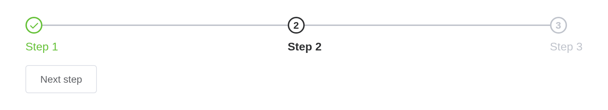

# Steps

Guide the user through a process. `steps` is a list of
`list(title =, description =, icon =, status =)`; `active` the step
reached, 0-based, which
[`update_el_steps()`](https://kaipingyang.github.io/shiny.element/reference/update_el_steps.md)
moves.

## Basic usage

``` r

ui <- el_page(
  el_steps("wizard", active = 0, finish_status = "success", steps = list(
    list(title = "Step 1"), list(title = "Step 2"), list(title = "Step 3"))),
  tags$div(style = "margin-top: 12px", el_button("nxt", "Next step")))

server <- function(input, output, session) {
  observeEvent(input$nxt, update_el_steps(id = "wizard", active = (input$wizard + 1) %% 4))
}

shinyApp(ui, server)
```



## Step bar that contains status

``` r

el_steps("st", space = 200, active = 1, finish_status = "success", steps = list(
  list(title = "Done"), list(title = "Processing"), list(title = "Step 3")))
```

## Center

``` r

el_steps("ce", active = 2, align_center = TRUE, steps = list(
  list(title = "Step 1", description = "Some description"),
  list(title = "Step 2", description = "Some description"),
  list(title = "Step 3", description = "Some description"),
  list(title = "Step 4", description = "Some description")))
```

## Step bar with description

``` r

el_steps("de", active = 1, steps = list(
  list(title = "Step 1", description = "Some description"),
  list(title = "Step 2", description = "Some description"),
  list(title = "Step 3", description = "Some description")))
```

## Step bar with icon

``` r

el_steps("ic", active = 1, steps = list(
  list(title = "Step 1", icon = "el-icon-edit"),
  list(title = "Step 2", icon = "el-icon-upload"),
  list(title = "Step 3", icon = "el-icon-picture")))
```

## Vertical step bar

``` r

tags$div(style = "height: 300px", el_steps("ve", direction = "vertical", active = 1, steps = list(
  list(title = "Step 1"), list(title = "Step 2"), list(title = "Step 3"))))
```

## Simple step bar

``` r

el_steps("si", active = 1, simple = TRUE, steps = list(
  list(title = "Step 1", icon = "el-icon-edit"),
  list(title = "Step 2", icon = "el-icon-upload"),
  list(title = "Step 3", icon = "el-icon-picture")))
```

## API

### Steps Attributes

| Element | In R | Description | Type | Accepted | Default |
|----|----|----|----|----|----|
| `space` | `space` | the spacing of each step, will be responsive if omitted. Supports percentage. | number / string | — | — |
| `direction` | `direction` | display direction | string | vertical/horizontal | horizontal |
| `active` | `active` | current activation step | number | — | 0 |
| `process-status` | `process_status` | status of current step | string | wait / process / finish / error / success | process |
| `finish-status` | `finish_status` | status of end step | string | wait / process / finish / error / success | finish |
| `align-center` | `align_center` | center title and description | boolean | — | false |
| `simple` | `simple` | whether to apply simple theme | boolean | \- | false |

### Step Attributes

| Element | In R | Description | Type | Accepted | Default |
|----|----|----|----|----|----|
| `title` | field `title` of each of `steps` | step title | string | — | — |
| `description` | field `description` of each of `steps` | step description | string | — | — |
| `icon` | field `icon` of each of `steps` | step icon | step icon’s class name. Icons can be passed via named slot as well | string | — |
| `status` | field `status` of each of `steps` | current status. It will be automatically set by Steps if not configured. | wait / process / finish / error / success |  |  |

### Step Slot

| Element       | In R                           | Description      |
|---------------|--------------------------------|------------------|
| `icon`        | `slots = list(icon = )`        | custom icon      |
| `title`       | `slots = list(title = )`       | step title       |
| `description` | `slots = list(description = )` | step description |
