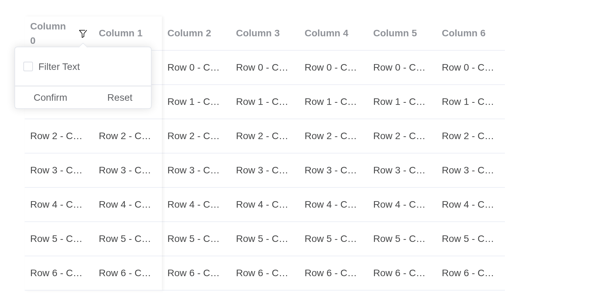

# Virtualized Table

Along with evolutionary web development, table component has always been
the most popular component in our web apps especially for dashboards,
data analysis. For [Table
V1](https://kaipingyang.github.io/shiny.element/articles/components/table.md),
with even just 1000 records of data, it can be very annoying when using
it, because of the poor performance.

With Virtualized Table, you can render massive chunks of data in a blink
of an eye.

> **Tip**
>
> This component is **still under testing**, use at your own risk. If
> you find any bugs or issues, please report them at
> [GitHub](https://github.com/element-plus/element-plus/issues) for us
> to fix. Also there were some APIs which are not mentioned in this
> documentation, some of them were not fully developed yet, which is why
> they are not mentioned here.
>
> **Even though** Virtualized Table is efficient, when the data load is
> too large, your **network** and **memory size** can become the
> bottleneck of your app. So keep in mind that Virtualized Table is
> never the ultimate solution for everything, consider paginating your
> data, adding filters etc.

## Basic usage

Let’s demonstrate the performance of the Virtualized Table by rendering
a basic example with 10 columns and 1000 rows.

A data.frame, its columns made from its variables.

``` r

df <- data.frame(
  check.names = FALSE,
  setNames(
    lapply(1:10, function(j) paste0("Row ", 1:1000, " - Col ", j)),
    paste0("column-", 1:10)
  )
)
el_table_v2("tv_basic", data = df, table_v2_width = 700, height = 400)
```

## Auto resizer

When you do not want to manually pass the `width` and `height`
properties to the table, you can wrap the table component with the
AutoResizer. This will automatically update the width and height for
you.

Resize your browser to see how it works.

> **Tip**
>
> Make sure the parent node of the `AutoResizer` **HAS A FIXED HEIGHT**,
> since its default height value is set to 100%. Alternatively, you can
> define it by passing the `style` attribute to `AutoResizer`.

`auto_resize = TRUE` sizes the table to its container, which needs a
height of its own.

``` r

df <- data.frame(
  id = 1:1000,
  name = paste("Name", 1:1000),
  value = round(runif(1000) * 100)
)
tags$div(
  style = "height: 400px",
  el_table_v2("tv_auto", data = df, auto_resize = TRUE)
)
```

## Customize Cell Renderer

Of course, you can render the table cell according to your needs. Here’s
a simple example of how to customize your cell.

A cell drawn with a template: the `cell` slot, its scope the row and
column.

``` r

df <- data.frame(
  name = paste("User", 1:200),
  state = sample(c("active", "inactive"), 200, TRUE)
)
el_table_v2(
  "tv_cell",
  data = df,
  table_v2_width = 700,
  height = 300,
  slots = list(
    cell = template(
      htmltools::HTML(paste0(
        "<el-tag v-if=\"column.dataKey === 'state'\" :type=\"rowData.state === 'active' ? 'success' : 'info'\">",
        "{{ rowData.state }}</el-tag><span v-else>{{ rowData[column.dataKey] }}</span>"
      )),
      slot = "cell",
      scope = "{ rowData, column }"
    )
  )
)
```

## Table with selections

Using customized cell renderer to allow selection for your table.

A checkbox column, drawn by the `cell` and `header-cell` slots: a field
of each row, `checked`, holds the tick. `$setInput()` reports the rows
ticked to the server as `input$tv_sel_checked`; it is Shiny’s
`setInputValue()`, which a template cannot otherwise reach.

``` r

# the grid upstream's examples use: Row i - Col j
grid <- function(cols = 10, rows = 200) {
  df <- data.frame(
    check.names = FALSE,
    setNames(
      lapply(seq_len(cols) - 1, function(j) {
        paste0("Row ", seq_len(rows) - 1, " - Col ", j)
      }),
      paste0("column-", seq_len(cols) - 1)
    )
  )
  cbind(id = paste0("row-", seq_len(rows) - 1), df)
}
grid_columns <- function(cols = 10, width = 150) {
  lapply(seq_len(cols) - 1, function(j) {
    k <- paste0("column-", j)
    list(key = k, dataKey = k, title = paste("Column", j), width = width)
  })
}
df <- grid()
df$checked <- FALSE
report <- "$setInput('tv_sel_checked', data.filter(r => r.checked).map(r => r.id))"
el_table_v2(
  "tv_sel",
  data = df,
  columns = c(list(list(key = "selection", width = 50)), grid_columns()),
  table_v2_width = 700,
  height = 400,
  fixed = TRUE,
  slots = list(
    cell = template(
      HTML(paste0(
        "<el-checkbox v-if=\"column.key === 'selection'\" ",
        "v-model=\"rowData.checked\" @change=\"",
        report,
        "\" />",
        "<div v-else class=\"el-table-v2__cell-text\">",
        "{{ rowData[column.dataKey] }}</div>"
      )),
      slot = "cell",
      scope = "{ rowData, column }"
    ),
    "header-cell" = template(
      HTML(paste0(
        "<el-checkbox v-if=\"column.key === 'selection'\" ",
        ":model-value=\"data.every(r => r.checked)\" ",
        ":indeterminate=\"data.some(r => r.checked) && !data.every(r => r.checked)\" ",
        "@change=\"v => { data.forEach(r => r.checked = v); ",
        report,
        " }\" />",
        "<div v-else class=\"el-table-v2__header-cell-text\">",
        "{{ column.title }}</div>"
      )),
      slot = "header-cell",
      scope = "{ column }"
    )
  )
)
```

## Inline editing

Just as we demonstrated with selections above, you can use the same
method to enable inline editing.

The first column edits in place: a click turns the cell into an input,
Enter or leaving it turns it back. Each edit is reported as
`input$tv_edit_edited`.

``` r

# the grid upstream's examples use: Row i - Col j
grid <- function(cols = 10, rows = 200) {
  df <- data.frame(
    check.names = FALSE,
    setNames(
      lapply(seq_len(cols) - 1, function(j) {
        paste0("Row ", seq_len(rows) - 1, " - Col ", j)
      }),
      paste0("column-", seq_len(cols) - 1)
    )
  )
  cbind(id = paste0("row-", seq_len(rows) - 1), df)
}
grid_columns <- function(cols = 10, width = 150) {
  lapply(seq_len(cols) - 1, function(j) {
    k <- paste0("column-", j)
    list(key = k, dataKey = k, title = paste("Column", j), width = width)
  })
}
df <- grid()
df$editing <- FALSE
cols <- grid_columns()
cols[[1]]$title <- "Editable Column"
el_table_v2(
  "tv_edit",
  data = df,
  columns = cols,
  table_v2_width = 700,
  height = 400,
  fixed = TRUE,
  slots = list(
    cell = template(
      HTML(paste0(
        "<template v-if=\"column.key === 'column-0'\">",
        "<el-input v-if=\"rowData.editing\" v-model=\"rowData[column.dataKey]\" ",
        ":ref=\"el => el && el.focus()\" ",
        "@blur=\"rowData.editing = false\" ",
        "@keydown.enter=\"rowData.editing = false\" ",
        "@change=\"v => $setInput('tv_edit_edited', {id: rowData.id, value: v})\" />",
        "<div v-else class=\"table-v2-inline-editing-trigger\" ",
        "@click=\"rowData.editing = true\">{{ rowData[column.dataKey] }}</div>",
        "</template>",
        "<div v-else class=\"el-table-v2__cell-text\">",
        "{{ rowData[column.dataKey] }}</div>"
      )),
      slot = "cell",
      scope = "{ rowData, column }"
    )
  )
)
tags$style(
  ".table-v2-inline-editing-trigger {
    border: 1px transparent dotted;
    padding: 4px;
  }
  .table-v2-inline-editing-trigger:hover {
    border-color: var(--el-color-primary);
  }"
)
```

## Table with status

You can highlight your table content to distinguish between “success,
information, warning, danger” and other states.

To customize the appearance of rows, use the `row-class-name` attribute.
For example, every 10th row is highlighted using the `bg-blue-200`
class, and every 5th row with the `bg-red-100` class.

``` r

df <- data.frame(id = 1:200, name = paste("Name", 1:200))
tagList(
  tags$style(".tv-odd { background: var(--el-color-primary-light-9); }"),
  el_table_v2(
    "tv_rowclass",
    data = df,
    table_v2_width = 700,
    height = 300,
    row_class = JS(
      "function({ rowIndex }) { return rowIndex % 2 ? 'tv-odd' : ''; }"
    )
  )
)
```

## Table with sticky rows

You can make some rows stick to the top of the table, and that can be
very easily achieved by using the `fixed-data` attribute.

You can dynamically set the sticky row based on scroll events, as shown
in this example.

``` r

df <- data.frame(id = 1:200, name = paste("Name", 1:200))
el_table_v2(
  "tv_sticky",
  data = df,
  table_v2_width = 700,
  height = 300,
  fixed_data = list(list(id = "Pinned", name = "Stays on top"))
)
```

## Table with fixed columns

If you want to have columns stick to the left or right for some reason,
you can achieve this by adding special attributes to the table.

You can set the column’s attribute `fixed` to `true` (representing
`FixedDir.LEFT`) or `FixedDir.LEFT` or `FixedDir.RIGHT`

``` r

cols <- lapply(1:10, function(j) {
  list(
    key = paste0("c", j),
    dataKey = paste0("c", j),
    title = paste("Column", j),
    width = 150,
    fixed = if (j == 1) {
      "left"
    } else if (j == 10) {
      "right"
    }
  )
})
df <- data.frame(
  check.names = FALSE,
  setNames(
    lapply(1:10, function(j) paste0("Row ", 1:200, " - Col ", j)),
    paste0("c", 1:10)
  )
)
el_table_v2(
  "tv_fixed",
  data = df,
  columns = cols,
  table_v2_width = 700,
  height = 300,
  fixed = TRUE
)
```

## Grouping header

By customizing your header renderer, you can group your header as shown
in this example.

> **Tip**
>
> In this case we used `JSX` feature which is not supported in the
> playground. You may try them out in your local environment or on
> online IDEs such as `codesandbox`.
>
> It is recommended that you write your table component in JSX, since it
> contains VNode manipulations.

Three header rows, `header_height = c(50, 40, 50)`. The `header` slot
redraws the first two as groups of four and two columns; the grouping is
upstream’s own function, given as `methods` and drawing with `Vue.h()`.

``` r

# the grid upstream's examples use: Row i - Col j
grid <- function(cols = 10, rows = 200) {
  df <- data.frame(
    check.names = FALSE,
    setNames(
      lapply(seq_len(cols) - 1, function(j) {
        paste0("Row ", seq_len(rows) - 1, " - Col ", j)
      }),
      paste0("column-", seq_len(cols) - 1)
    )
  )
  cbind(id = paste0("row-", seq_len(rows) - 1), df)
}
grid_columns <- function(cols = 10, width = 150) {
  lapply(seq_len(cols) - 1, function(j) {
    k <- paste0("column-", j)
    list(key = k, dataKey = k, title = paste("Column", j), width = width)
  })
}
cols <- grid_columns(15, width = 100)
for (j in 1:3) {
  cols[[j]]$fixed <- "left"
}
for (j in 14:15) {
  cols[[j]]$fixed <- "right"
}
el_table_v2(
  "tv_group",
  data = grid(15),
  columns = cols,
  header_height = c(50, 40, 50),
  header_class = JS(
    "function({ headerIndex }) { return headerIndex === 1 ? 'el-primary-color' : ''; }"
  ),
  table_v2_width = 700,
  height = 400,
  fixed = TRUE,
  methods = list(
    groupCells = JS(
      "function({ cells, columns, headerIndex }) {
        if (headerIndex === 2) return cells;
        var out = [], width = 0, idx = 0;
        columns.forEach(function(column, i) {
          if (column.placeholderSign === ElementPlus.TableV2Placeholder) {
            out.push(cells[i]);
            return;
          }
          width += cells[i].props.column.width;
          idx++;
          var next = columns[i + 1];
          if (i === columns.length - 1 ||
              next.placeholderSign === ElementPlus.TableV2Placeholder ||
              idx === (headerIndex === 0 ? 4 : 2)) {
            out.push(Vue.h('div', {
              class: 'custom-header-cell',
              role: 'columnheader',
              style: Object.assign({}, cells[i].props.style, {
                width: width + 'px', display: 'flex',
                alignItems: 'center', justifyContent: 'center'
              })
            }, 'Group width ' + width));
            width = 0;
            idx = 0;
          }
        });
        return out;
      }"
    )
  ),
  slots = list(
    header = template(
      HTML('<component v-for="c in groupCells(props)" :is="c" />'),
      slot = "header",
      scope = "props"
    )
  )
)
```

## Filter

Virtualized Table provides custom header renderers for creating
customized headers. We can then utilize these to render filters.

The `header-cell` slot puts a filter in the first column’s header. The
filtering is the server’s: Confirm sends the choice as
`input$tv_filter_on`, and the server answers with
`update_el_table_v2(data =)`.

``` r

# the grid upstream's examples use: Row i - Col j
grid <- function(cols = 10, rows = 200) {
  df <- data.frame(
    check.names = FALSE,
    setNames(
      lapply(seq_len(cols) - 1, function(j) {
        paste0("Row ", seq_len(rows) - 1, " - Col ", j)
      }),
      paste0("column-", seq_len(cols) - 1)
    )
  )
  cbind(id = paste0("row-", seq_len(rows) - 1), df)
}
grid_columns <- function(cols = 10, width = 150) {
  lapply(seq_len(cols) - 1, function(j) {
    k <- paste0("column-", j)
    list(key = k, dataKey = k, title = paste("Column", j), width = width)
  })
}
cols <- grid_columns(width = 100)
for (j in 1:2) {
  cols[[j]]$fixed <- "left"
}
ui <- el_page(
  el_table_v2(
    "tv_filter",
    data = grid(),
    columns = cols,
    table_v2_width = 700,
    height = 400,
    fixed = TRUE,
    slots = list(
      "header-cell" = template(
        HTML(paste0(
          "<div v-if=\"column.key === 'column-0'\" ",
          "style=\"display: flex; align-items: center; gap: 8px\">",
          "<span>{{ column.title }}</span>",
          "<el-popover ref=\"filterPop\" trigger=\"click\" :width=\"200\">",
          "<template #reference><button type=\"button\" ",
          "class=\"el-table-v2__demo-filter-btn\" aria-label=\"Filter\">",
          "<el-icon :size=\"14\"><Filter /></el-icon></button></template>",
          "<el-checkbox v-model=\"column.filterOn\">Filter Text</el-checkbox>",
          "<div class=\"el-table-v2__demo-filter\">",
          "<el-button text @click=\"$refs.filterPop.hide(); ",
          "$setInput('tv_filter_on', !!column.filterOn)\">Confirm</el-button>",
          "<el-button text @click=\"column.filterOn = false; ",
          "$refs.filterPop.hide(); $setInput('tv_filter_on', false)\">",
          "Reset</el-button></div></el-popover></div>",
          "<div v-else class=\"el-table-v2__header-cell-text\">",
          "{{ column.title }}</div>"
        )),
        slot = "header-cell",
        scope = "{ column }"
      )
    )
  ),
  tags$style(
    ".el-table-v2__demo-filter {
      border-top: var(--el-border);
      margin: 12px -12px -12px;
      padding: 0 12px;
      display: flex;
      justify-content: space-between;
    }
    .el-table-v2__demo-filter-btn {
      display: flex;
      cursor: pointer;
      padding: 0;
      background: transparent;
      border: none;
    }"
  )
)
server <- function(input, output, session) {
  observeEvent(input$tv_filter_on, {
    rows <- if (input$tv_filter_on) 100 else 200
    update_el_table_v2(id = "tv_filter", data = grid(rows = rows))
  })
}
shinyApp(ui, server)
```



## Sortable

You can sort the table with sort state.

Sorting is the server’s: `input$<id>_column_sort` says which column and
which way.

``` r

df <- data.frame(id = 1:200, value = round(runif(200) * 100))
cols <- list(
  list(key = "id", dataKey = "id", title = "Id", width = 150, sortable = TRUE),
  list(
    key = "value",
    dataKey = "value",
    title = "Value",
    width = 150,
    sortable = TRUE
  )
)
el_table_v2(
  "tv_sort",
  data = df,
  columns = cols,
  table_v2_width = 700,
  height = 300,
  sort_by = list(key = "id", order = "asc")
)
```

## Controlled Sort

You can define multiple sortable columns as needed. Keep in mind that if
you define multiple sortable columns, the UI may appear confusing to
your users, as it becomes unclear which column is currently being
sorted.

``` r

df <- data.frame(id = 1:200, value = round(runif(200) * 100))
cols <- list(
  list(key = "id", dataKey = "id", title = "Id", width = 150, sortable = TRUE),
  list(
    key = "value",
    dataKey = "value",
    title = "Value",
    width = 150,
    sortable = TRUE
  )
)
el_table_v2(
  "tv_csort",
  data = df,
  columns = cols,
  table_v2_width = 700,
  height = 300,
  sort_state = list(id = "desc", value = "asc")
)
```

## Cross hovering

When dealing with a large list, it’s easy to lose track of the current
row and column you are visiting. In such cases, using this feature can
be very helpful.

Hovering a cell lights its row and its column. `cell_props` gives every
cell a `data-key` naming its column and marks the table with the column
the pointer is over; the stylesheet does the rest.

``` r

# the grid upstream's examples use: Row i - Col j
grid <- function(cols = 10, rows = 200) {
  df <- data.frame(
    check.names = FALSE,
    setNames(
      lapply(seq_len(cols) - 1, function(j) {
        paste0("Row ", seq_len(rows) - 1, " - Col ", j)
      }),
      paste0("column-", seq_len(cols) - 1)
    )
  )
  cbind(id = paste0("row-", seq_len(rows) - 1), df)
}
grid_columns <- function(cols = 10, width = 150) {
  lapply(seq_len(cols) - 1, function(j) {
    k <- paste0("column-", j)
    list(key = k, dataKey = k, title = paste("Column", j), width = width)
  })
}
cols <- c(
  list(list(
    key = "column-n-1",
    width = 50,
    title = "Row No.",
    align = "center",
    cellRenderer = JS("function({ rowIndex }) { return String(rowIndex + 1); }")
  )),
  grid_columns()
)
tagList(
  tags$style(HTML(paste0(
    sprintf(
      "[data-hover-col='%d'] [data-key='hovering-col-%d']",
      0:10,
      0:10
    ),
    " { background: var(--el-table-row-hover-bg-color); }",
    collapse = "\n"
  ))),
  el_table_v2(
    "tv_cross",
    data = grid(),
    columns = cols,
    table_v2_width = 700,
    height = 400,
    cell_props = JS(
      "function({ columnIndex }) {
        var table = function(e) { return e.currentTarget.closest('.el-table-v2'); };
        return {
          'data-key': 'hovering-col-' + columnIndex,
          onMouseenter: function(e) { table(e).setAttribute('data-hover-col', columnIndex); },
          onMouseleave: function(e) { table(e).removeAttribute('data-hover-col'); }
        };
      }"
    )
  )
)
```

## Colspan

The virtualized table doesn’t use the built-in `table` element, so
`colspan` and `rowspan` behave a bit differently compared to
[TableV1](https://kaipingyang.github.io/shiny.element/articles/components/table.md).
However, with a customized row renderer, these features can still be
implemented. In this section, we’ll demonstrate how to achieve this.

The `row` slot draws each row’s cells; `methods` holds upstream’s own
function, which widens the second cell over the next ones with
`Vue.cloneVNode()`.

``` r

# the grid upstream's examples use: Row i - Col j
grid <- function(cols = 10, rows = 200) {
  df <- data.frame(
    check.names = FALSE,
    setNames(
      lapply(seq_len(cols) - 1, function(j) {
        paste0("Row ", seq_len(rows) - 1, " - Col ", j)
      }),
      paste0("column-", seq_len(cols) - 1)
    )
  )
  cbind(id = paste0("row-", seq_len(rows) - 1), df)
}
grid_columns <- function(cols = 10, width = 150) {
  lapply(seq_len(cols) - 1, function(j) {
    k <- paste0("column-", j)
    list(key = k, dataKey = k, title = paste("Column", j), width = width)
  })
}
el_table_v2(
  "tv_colspan",
  data = grid(),
  columns = grid_columns(),
  table_v2_width = 700,
  height = 400,
  fixed = TRUE,
  methods = list(
    rowCells = JS(
      "function({ rowIndex, cells }) {
        cells = cells.slice();
        var span = (rowIndex % 4) + 1;
        if (span > 1) {
          var width = parseInt(cells[1].props.style.width);
          for (var i = 1; i < span; i++) {
            width += parseInt(cells[1 + i].props.style.width);
            cells[1 + i] = null;
          }
          cells[1] = Vue.cloneVNode(cells[1], { style: Object.assign({},
            cells[1].props.style, { width: width + 'px',
              backgroundColor: 'var(--el-color-primary-light-3)' }) });
        }
        return cells.filter(Boolean);
      }"
    )
  ),
  slots = list(
    row = template(
      HTML('<component v-for="c in rowCells(props)" :is="c" />'),
      slot = "row",
      scope = "props"
    )
  )
)
```

## Rowspan

Since we have covered [Colspan](#colspan), it’s worth noting that we
also have row span. It’s a little bit different from colspan but the
idea is basically the same.

The `row` slot draws each row’s cells; `methods` holds upstream’s own
function, which makes every other first cell two rows tall.

``` r

# the grid upstream's examples use: Row i - Col j
grid <- function(cols = 10, rows = 200) {
  df <- data.frame(
    check.names = FALSE,
    setNames(
      lapply(seq_len(cols) - 1, function(j) {
        paste0("Row ", seq_len(rows) - 1, " - Col ", j)
      }),
      paste0("column-", seq_len(cols) - 1)
    )
  )
  cbind(id = paste0("row-", seq_len(rows) - 1), df)
}
grid_columns <- function(cols = 10, width = 150) {
  lapply(seq_len(cols) - 1, function(j) {
    k <- paste0("column-", j)
    list(key = k, dataKey = k, title = paste("Column", j), width = width)
  })
}
el_table_v2(
  "tv_rowspan",
  data = grid(),
  columns = grid_columns(),
  table_v2_width = 700,
  height = 400,
  fixed = TRUE,
  methods = list(
    rowCells = JS(
      "function({ rowIndex, cells }) {
        cells = cells.slice();
        if (rowIndex % 2 === 0 && rowIndex <= 198) {
          cells[0] = Vue.cloneVNode(cells[0], { style: Object.assign({},
            cells[0].props.style, { height: (2 * 50 - 1) + 'px',
              alignSelf: 'flex-start', zIndex: 1,
              backgroundColor: 'var(--el-color-primary-light-3)' }) });
        }
        return cells;
      }"
    )
  ),
  slots = list(
    row = template(
      HTML('<component v-for="c in rowCells(props)" :is="c" />'),
      slot = "row",
      scope = "props"
    )
  )
)
```

## Rowspan and Colspan together

We can combine rowspan and colspan together to meet your business goal!

Column and row spans together, from one `row` function in `methods`.

``` r

# the grid upstream's examples use: Row i - Col j
grid <- function(cols = 10, rows = 200) {
  df <- data.frame(
    check.names = FALSE,
    setNames(
      lapply(seq_len(cols) - 1, function(j) {
        paste0("Row ", seq_len(rows) - 1, " - Col ", j)
      }),
      paste0("column-", seq_len(cols) - 1)
    )
  )
  cbind(id = paste0("row-", seq_len(rows) - 1), df)
}
grid_columns <- function(cols = 10, width = 150) {
  lapply(seq_len(cols) - 1, function(j) {
    k <- paste0("column-", j)
    list(key = k, dataKey = k, title = paste("Column", j), width = width)
  })
}
el_table_v2(
  "tv_spans",
  data = grid(),
  columns = grid_columns(),
  table_v2_width = 700,
  height = 400,
  fixed = TRUE,
  methods = list(
    rowCells = JS(
      "function({ rowIndex, cells }) {
        cells = cells.slice();
        var span = (rowIndex % 4) + 1;
        if (span > 1) {
          var width = parseInt(cells[1].props.style.width);
          for (var i = 1; i < span; i++) {
            width += parseInt(cells[1 + i].props.style.width);
            cells[1 + i] = null;
          }
          cells[1] = Vue.cloneVNode(cells[1], { style: Object.assign({},
            cells[1].props.style, { width: width + 'px',
              backgroundColor: 'var(--el-color-primary-light-3)' }) });
        }
        var style = cells[0].props.style;
        if (rowIndex % 2 === 0 && rowIndex <= 198) {
          cells[0] = Vue.cloneVNode(cells[0], { style: Object.assign({}, style,
            { height: '100px', alignSelf: 'flex-start', zIndex: 1,
              backgroundColor: 'var(--el-color-danger-light-3)' }) });
        } else {
          // the cell above covers this one: an empty box keeps the width
          cells[0] = Vue.h('div', { style: Object.assign({}, style,
            { width: parseInt(style.width) + 'px' }) });
        }
        return cells.filter(Boolean);
      }"
    )
  ),
  slots = list(
    row = template(
      HTML('<component v-for="c in rowCells(props)" :is="c" />'),
      slot = "row",
      scope = "props"
    )
  )
)
```

## Tree data

Virtual Table can also render data in a tree-like structure. By clicking
the arrow icon, you can expand or collapse the tree nodes.

``` r

rows <- lapply(1:50, function(i) {
  list(
    id = paste0("r", i),
    name = paste("Parent", i),
    children = lapply(1:3, function(j) {
      list(id = paste0("r", i, "-", j), name = paste("Child", i, j))
    })
  )
})
el_table_v2(
  "tv_tree",
  data = rows,
  expand_column_key = "name",
  table_v2_width = 700,
  height = 300,
  columns = list(
    list(key = "name", dataKey = "name", title = "Name", width = 300),
    list(key = "id", dataKey = "id", title = "Id", width = 150)
  )
)
```

## Dynamic height rows

Virtual Table is capable of rendering rows with dynamic heights. If
you’re working with data and are uncertain about the content size, this
feature is ideal for rendering rows that adjust to the content’s height.
To enable this, pass down the `estimated-row-height` attribute. The
closer the estimated height matches the actual content, the smoother the
rendering experience.

> **Tip**
>
> Each row’s height is dynamically measured during rendering the rows.
> As a result, if you’re trying to display a large amount of data, the
> UI **might be** bouncing.

`estimated_row_height` lets each row take the height of its content.

``` r

df <- data.frame(
  id = 1:100,
  text = vapply(1:100, function(i) strrep("text ", (i %% 7 + 1) * 8), "")
)
el_table_v2(
  "tv_dyn",
  data = df,
  estimated_row_height = 50,
  table_v2_width = 700,
  height = 300,
  columns = list(
    list(key = "id", dataKey = "id", title = "Id", width = 80),
    list(key = "text", dataKey = "text", title = "Text", width = 600)
  )
)
```

## Detail view

Using dynamic height rendering, you can also display a detailed view
within the table.

Each row has a child holding its detail; expanded, the `row` slot draws
the child as a block of text rather than cells.

``` r

# the grid upstream's examples use: Row i - Col j
grid <- function(cols = 10, rows = 200) {
  df <- data.frame(
    check.names = FALSE,
    setNames(
      lapply(seq_len(cols) - 1, function(j) {
        paste0("Row ", seq_len(rows) - 1, " - Col ", j)
      }),
      paste0("column-", seq_len(cols) - 1)
    )
  )
  cbind(id = paste0("row-", seq_len(rows) - 1), df)
}
grid_columns <- function(cols = 10, width = 150) {
  lapply(seq_len(cols) - 1, function(j) {
    k <- paste0("column-", j)
    list(key = k, dataKey = k, title = paste("Column", j), width = width)
  })
}
detail <- paste(
  "Velit sed aspernatur tempora. Natus consequatur officiis dicta vel",
  "assumenda. Itaque est temporibus minus quis. Ipsum commodiab porro vel",
  "voluptas illum. Qui quam nulla et dolore autem itaque est."
)
df <- grid()
rows <- lapply(seq_len(nrow(df)), function(i) {
  row <- as.list(df[i, ])
  row$children <- list(list(id = paste0(row$id, "-detail"), detail = detail))
  row
})
el_table_v2(
  "tv_detail",
  data = rows,
  columns = grid_columns(),
  expand_column_key = "column-0",
  estimated_row_height = 50,
  table_v2_width = 700,
  height = 400,
  slots = list(
    row = template(
      HTML(paste0(
        "<div v-if=\"props.rowData.detail\" style=\"padding: 24px\">",
        "{{ props.rowData.detail }}</div>",
        "<component v-else v-for=\"c in props.cells\" :is=\"c\" />"
      )),
      slot = "row",
      scope = "props"
    )
  )
)
```

## Customized Footer

Render a customized footer when you want to show a concluding message or
information.

``` r

df <- data.frame(id = 1:200, name = paste("Name", 1:200))
el_table_v2(
  "tv_footer",
  data = df,
  table_v2_width = 700,
  height = 300,
  footer_height = 50,
  slots = list(
    footer = tags$div(
      style = "display: flex; align-items: center; justify-content: center; height: 100%",
      "Display a message in the footer"
    )
  )
)
```

## Customized Empty Renderer

Render a customized empty element.

``` r

el_table_v2(
  "tv_empty",
  data = list(),
  table_v2_width = 700,
  height = 300,
  columns = list(list(key = "a", dataKey = "a", title = "A", width = 150)),
  slots = list(
    empty = tags$div(
      style = "display: flex; justify-content: center",
      el_empty()
    )
  )
)
```

## Overlay

Render an overlay on top of the table when you want to show a loading
indicator or something else.

``` r

df <- data.frame(id = 1:200, name = paste("Name", 1:200))
el_table_v2(
  "tv_overlay",
  data = df,
  table_v2_width = 700,
  height = 300,
  slots = list(
    overlay = tags$div(
      class = "el-loading-mask",
      style = "display: flex; align-items: center; justify-content: center",
      el_icon("Loading", class = "is-loading", size = "26px")
    )
  )
)
```

## Manual scrolling

Use the methods provided by Table V2 to scroll manually/programmatically
with desired offset/rows.

> **Tip**
>
> The second parameter for `scrollToRow` is the scrolling strategy which
> by default is `auto`, it calculates the position to scroll by itself.
> If you wish to scroll to a specific position, you can define the
> strategy yourself. The available options are
> `"auto" | "center" | "end" | "start" | "smart"`
>
> The difference between `smart` and `auto` is that `auto` is a subset
> of `smart` scroll strategy.

`el_call(session, "tv_scroll", "scrollToRow", list(100))` scrolls it
from the server.

``` r

df <- data.frame(id = 1:1000, name = paste("Name", 1:1000))
el_table_v2("tv_scroll", data = df, table_v2_width = 700, height = 300)
```

## API

Element Plus’s tables, and beside each entry where it is in R.

### TableV2 Attributes

| Element | In R | Description | Type | Accepted | Default |
|----|----|----|----|----|----|
| `cache` | `cache` | Number of rows rendered in advance to boost the performance | `number` |  | 2 |
| `estimated-row-height` | `estimated_row_height` | The estimated row height for rendering dynamic height rows | `number` |  | — |
| `header-class` | `header_class` | Customized class name passed to header wrapper | `string` / Function\<[HeaderClassGetter](#typings)\> |  | — |
| `header-props` | `header_props` | Customized props name passed to header component | `object` / Function\<[HeaderPropsGetter](#typings)\> |  | — |
| `header-cell-props` | `header_cell_props` | Customized props name passed to header cell component | `object` / Function\<[HeaderCellPropsGetter](#typings)\> |  | — |
| `header-height` | `header_height` | The height of the header is set by `height`. If given an array, it renders header rows equal to its length | `number`/ `number[]` |  | 50 |
| `footer-height` | `footer_height` | The height of the footer element, when provided, will be part to the calculation of the table’s height. | `number` |  | 0 |
| `row-class` | `row_class` | Customized class name passed to row wrapper | `string` / Function\<[RowClassGetter](#typings)\> |  | — |
| `row-key` | `row_key` | The key of each row, if not provided, will be the index of the row | `string` / `Symbol` / `number` |  | id |
| `row-props` | `row_props` | Customized props name passed to row component | `object` / Function\<[RowPropsGetter](#typings)\> |  | — |
| `row-height` | `row_height` | The height of each row, used for calculating the total height of the table | `number` |  | 50 |
| `row-event-handlers` | `row_event_handlers` | A collection of handlers attached to each row | `object`\<[RowEventHandlers](#typings)\> |  | — |
| `cell-props` | `cell_props` | extra props passed to each cell (except header cells) | `object` / Function\<[CellPropsGetter](#typings)\> |  | — |
| `columns` | `columns` | An array of column definitions. | [Column\[\]](#column-attribute) |  | — |
| `data` | `data` | An array of data to be rendered in the table. | [Data\[\]](#typings) |  | \[\] |
| `data-getter` | `data_getter` | A method to customize data fetch from the data source. | Function\<[DataGetter\<T\>](#typings)\> |  | — |
| `fixed-data` | `fixed_data` | Data for rendering rows above the main content and below the header | `object`\<[Data](#typings)\> |  | — |
| `expand-column-key` | `expand_column_key` | The column key indicates which row is expandable | `string` |  | — |
| `expanded-row-keys` | `expanded_row_keys` | An array of keys for expanded rows, can be used with `v-model` | [KeyType\[\]](#typings) |  | — |
| `default-expanded-row-keys` | `default_expanded_row_keys` | An array of keys for default expanded rows, **NON REACTIVE** | [KeyType\[\]](#typings) |  | — |
| `class` | an HTML attribute of the tag; [`tagAppendAttributes()`](https://rstudio.github.io/htmltools/reference/tagAppendAttributes.html) | Class name for the virtual table, will be applied to all three tables (left, right, main) | `string` / `array` / `object` |  | — |
| `fixed` | `fixed` | Flag indicates the table column’s width to be fixed or flexible. | `boolean` |  | false |
| `width` | `width` | Width of the table | `number` |  | — |
| `height` | `height` | Height of the table | `number` |  | — |
| `max-height` | `max_height` | Maximum height of the table | `number` |  | — |
| `indent-size` | `indent_size` | horizontal indentation of tree table | `number` |  | 12 |
| `h-scrollbar-size` | `h_scrollbar_size` | Indicates the horizontal scrollbar’s size for the table, used to prevent the horizontal and vertical scrollbar to collapse | `number` |  | 6 |
| `v-scrollbar-size` | `v_scrollbar_size` | Indicates the vertical scrollbar’s size for the table, used to prevent the horizontal and vertical scrollbar to collapse | `number` |  | 6 |
| `scrollbar-always-on` | `scrollbar_always_on` | If true, the scrollbar will always be shown instead of when mouse is placed above the table | `boolean` |  | false |
| `sort-by` | `sort_by` | Sort indicator | `object`\<[SortBy](#typings)\> |  | {} |
| `sort-state` | `sort_state` | Multiple sort indicator | `object`\<[SortState](#typings)\> |  | undefined |

### TableV2 Slots

| Element | In R | Description |
|----|----|----|
| `cell` | `slots = list(cell = )` | `object`\<[CellSlotProps](#typings)\> |
| `header` | `slots = list(header = )` | `object`\<[HeaderSlotProps](#typings)\> |
| `header-cell` | `slots = list(header-cell = )` | `object`\<[HeaderCellSlotProps](#typings)\> |
| `row` | `slots = list(row = )` | `object`\<[RowSlotProps](#typings)\> |
| `footer` | `slots = list(footer = )` | — |
| `empty` | `slots = list(empty = )` | — |
| `overlay` | `slots = list(overlay = )` | — |

### TableV2 Events

| Element | In R | Description |
|----|----|----|
| `column-sort` | `input$<id>_column_sort` | Invoked when column sorted |
| `expanded-rows-change` | `input$<id>_expanded_rows_change` | Invoked when expanded rows changed |
| `end-reached` | `input$<id>_end_reached` | Invoked when the end of the table is reached. The callback contain the remain distance, it is the usually the scrollbar height. |
| `scroll` | `input$<id>_scroll` | Invoked after scrolling |
| `rows-rendered` | `input$<id>_rows_rendered` | Invoked when rows are rendered |
| `row-expand` | `input$<id>_row_expand` | Invoked when expand/collapse the tree node by clicking the arrow icon |

### TableV2 Exposes

| Element | In R | Description |
|----|----|----|
| `scrollTo` | `el_call(session, id, "scrollTo")` | Scroll to a given position |
| `scrollToLeft` | `el_call(session, id, "scrollToLeft")` | Scroll to a given horizontal position |
| `scrollToTop` | `el_call(session, id, "scrollToTop")` | Scroll to a given vertical position |
| `scrollToRow` | `el_call(session, id, "scrollToRow")` | scroll to a given row with specified scroll strategy |

### Column Attribute

| Element | In R | Description | Type | Accepted | Default |
|----|----|----|----|----|----|
| `align` | field `align` of each of `columns` | Alignment of the table cell content | [Alignment](https://github.com/element-plus/element-plus/blob/b92b22932758f0ddea98810ae248f6ca62f77e25/packages/components/table-v2/src/constants.ts#L6) |  | left |
| `class` | an HTML attribute of the tag; [`tagAppendAttributes()`](https://rstudio.github.io/htmltools/reference/tagAppendAttributes.html) | Class name for the column | `string` |  | — |
| `key` | field `key` of each of `columns` | Unique identification | [KeyType](#typings) |  | — |
| `dataKey` | field `data_key` of each of `columns` | Unique identification of data | [KeyType](#typings) |  | — |
| `fixed` | `fixed` | Fixed direction of the column | `boolean` / [FixedDir](https://github.com/element-plus/element-plus/blob/b92b22932758f0ddea98810ae248f6ca62f77e25/packages/components/table-v2/src/constants.ts#L11) |  | false |
| `flexGrow` | field `flex_grow` of each of `columns` | CSSProperties flex grow, Only useful when this is not a fixed table | `number` |  | 0 |
| `flexShrink` | field `flex_shrink` of each of `columns` | CSSProperties flex shrink, Only useful when this is not a fixed table | `number` |  | 1 |
| `headerClass` | `header_class` | Used for customizing header column class | `string` |  | — |
| `hidden` | field `hidden` of each of `columns` | Whether the column is invisible | `boolean` |  | — |
| `style` | an HTML attribute of the tag; [`tagAppendAttributes()`](https://rstudio.github.io/htmltools/reference/tagAppendAttributes.html) | Customized style for column cell, will be merged with grid cell | [^1]`CSSProperties` |  | — |
| `sortable` | field `sortable` of each of `columns` | Indicates whether the column is sortable | `boolean` |  | — |
| `title` | field `title` of each of `columns` | The default text rendered in header cell | `string` |  | — |
| `maxWidth` | field `max_width` of each of `columns` | Maximum width for the column | `number` |  | — |
| `minWidth` | field `min_width` of each of `columns` | Minimum width for the column | `number` |  | — |
| `width` | `width` | Width for the column | `number` |  | — |
| `cellRenderer` | field `cell_renderer` of each of `columns` | Customized Cell renderer | `VueComponent` / (props: [CellRenderProps](#typings)) =\> VNode |  | — |
| `headerCellRenderer` | field `header_cell_renderer` of each of `columns` | Customized Header renderer | `VueComponent` / (props: [HeaderRenderProps](#typings)) =\> VNode |  | — |

[^1]: object
