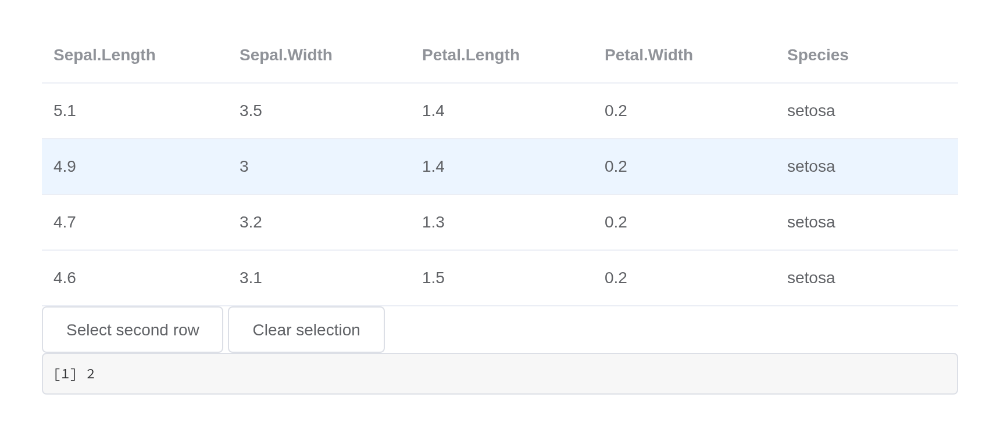
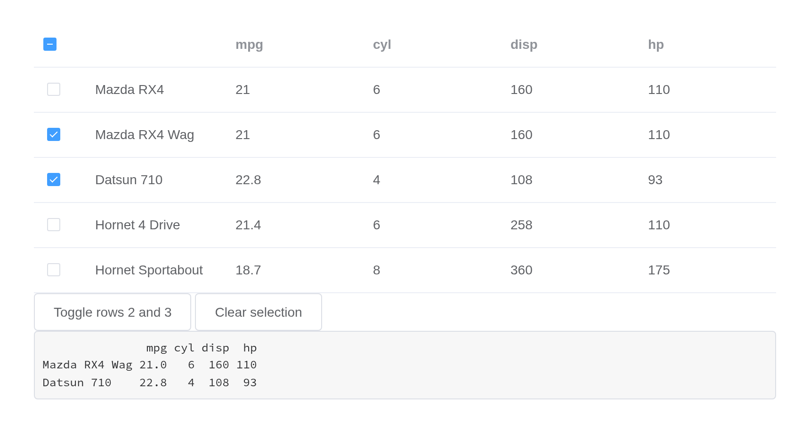
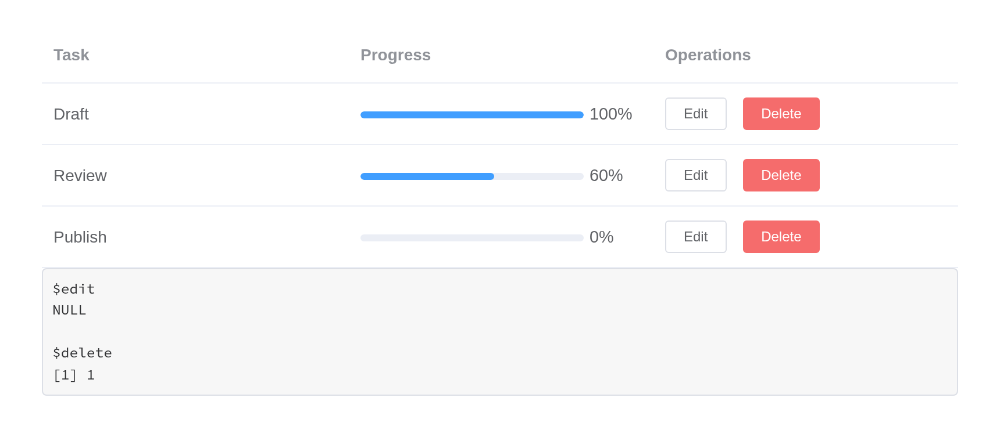
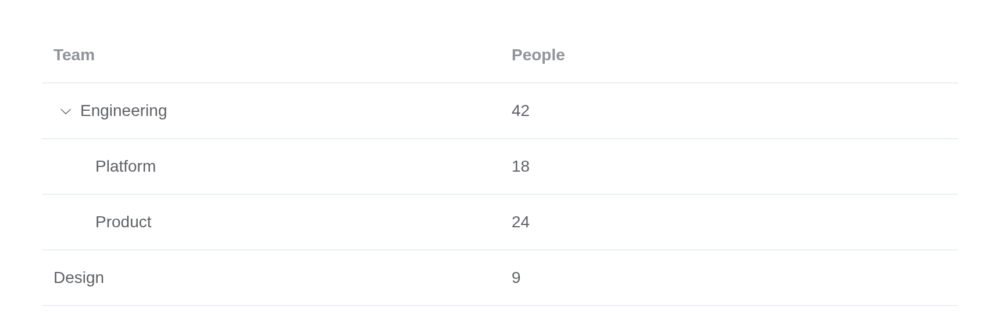
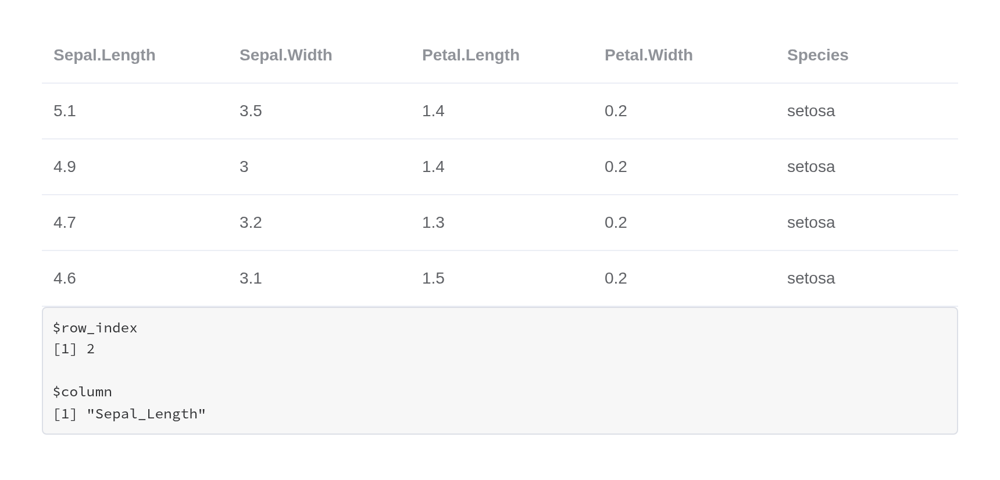
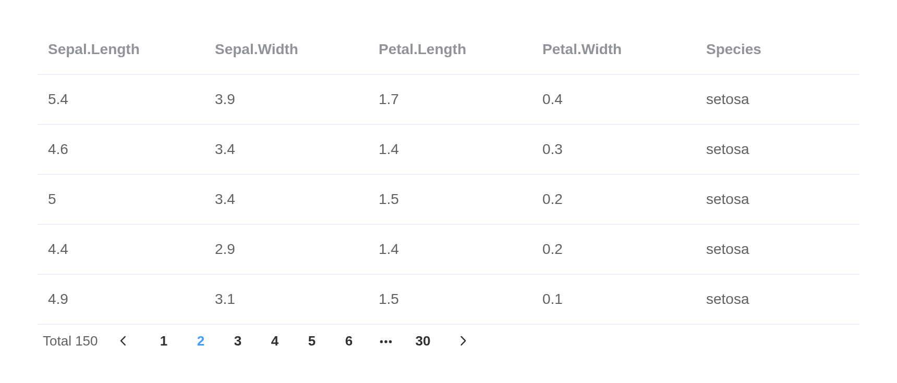

# Table

Display multiple data with similar format. You can sort, filter, compare
your data in a table.
[`el_table()`](https://kaipingyang.github.io/shiny.element/reference/el_table.md)
takes a data frame; its column names, a dot turned into `_` (Element
reads a dotted `prop` as a path), are the columns unless `columns` says
otherwise. Row names that name something – `mtcars`’ car names – become
a first column.

## Basic table

``` r

el_table("cars", data = head(mtcars[, 1:5], 4))
```

## Striped table

``` r

el_table("striped", data = head(mtcars[, 1:5], 4), stripe = TRUE)
```

## Table with border

``` r

el_table("bordered", data = head(mtcars[, 1:5], 4), border = TRUE)
```

## Table with status

`row_class_name` names a class per row, through a
[`JS()`](https://kaipingyang.github.io/shiny.element/reference/JS.md)
function; style the class as you like.

``` r

tagList(
  tags$style(".el-table .warning-row { background: oldlace; }
              .el-table .success-row { background: #f0f9eb; }"),
  el_table("status", data = head(mtcars[, 1:4], 4), row_class_name = JS(
    "function({row, rowIndex}) {",
    "  return rowIndex === 1 ? 'warning-row' : rowIndex === 3 ? 'success-row' : '';",
    "}")))
```

## Table with fixed header

`height` fixes the header and scrolls the body.

``` r

el_table("fixedhead", data = iris, height = "250px")
```

## Table with fixed column

A column’s `fixed` is `TRUE` (left), `"left"` or `"right"`.

``` r

el_table("fixedcol", data = head(mtcars, 4), border = TRUE, columns = c(
  list(list(prop = "mpg", label = "MPG", width = "120", fixed = TRUE)),
  lapply(names(mtcars)[-1], function(n) list(prop = n, label = n, width = "120")),
  list(list(label = "Operations", width = "120", fixed = "right",
            cell = el$button(type = "text", size = "small", "Detail")))))
```

## Fixed columns and header

``` r

el_table("fixedboth", data = head(mtcars, 12), height = "250px", columns = c(
  list(list(prop = "mpg", label = "MPG", width = "120", fixed = TRUE)),
  lapply(names(mtcars)[-1], function(n) list(prop = n, label = n, width = "120"))))
```

## Fluid-height table with fixed header

`max_height`: the table grows with its rows until it reaches it, then
scrolls.

``` r

el_table("fluid", data = head(mtcars[, 1:5], 10), max_height = "250px")
```

## Grouping table head

A column with `children` is a group header over them.

``` r

people <- data.frame(date = "2016-05-03", name = "Tom", state = "California",
                     city = "Los Angeles", address = "No. 189, Grove St", zip = "CA 90036")
el_table("grouped", data = people[rep(1, 3), ], border = TRUE, columns = list(
  list(prop = "date", label = "Date", width = "150"),
  list(label = "Delivery Info", children = list(
    list(prop = "name", label = "Name", width = "120"),
    list(label = "Address Info", children = list(
      list(prop = "state", label = "State", width = "120"),
      list(prop = "city", label = "City", width = "120"),
      list(prop = "address", label = "Address"),
      list(prop = "zip", label = "Zip", width = "120")))))))
```

## Single select

`highlight_current_row` marks the clicked row;
`input$<id>_current_change` reports it. `setCurrentRow()` moves it from
the server – the row named by
[`el_table_row()`](https://kaipingyang.github.io/shiny.element/reference/el_table_row.md),
since Element needs the row itself.

``` r

ui <- el_page(
  el_table("single", data = head(iris, 4), highlight_current_row = TRUE),
  el_button("second", "Select second row"), el_button("clear", "Clear selection"),
  verbatimTextOutput("current"))

server <- function(input, output, session) {
  observeEvent(input$second, el_call(session, "single", "setCurrentRow", list(el_table_row(2))))
  observeEvent(input$clear, el_call(session, "single", "setCurrentRow"))
  output$current <- renderPrint(input$single_current_change$row_index)
}

shinyApp(ui, server)
```



## Multiple select

`selection = TRUE` adds the checkbox column and reports
`input$<id>_selected_rows`, the 1-based row numbers, and
`input$<id>_selected`, the rows. Prefer the numbers: a row of mixed
types comes back from JSON as text.

``` r

cars <- head(mtcars[, 1:4], 5)

ui <- el_page(
  el_table("cars", data = cars, selection = TRUE),
  el_button("toggle", "Toggle rows 2 and 3"), el_button("none", "Clear selection"),
  verbatimTextOutput("picked"))

server <- function(input, output, session) {
  observeEvent(input$toggle, for (i in 2:3)
    el_call(session, "cars", "toggleRowSelection", list(el_table_row(i))))
  observeEvent(input$none, el_call(session, "cars", "clearSelection"))
  output$picked <- renderPrint(cars[input$cars_selected_rows, ])
}

shinyApp(ui, server)
```



## Sorting

A column’s `sortable`; `default_sort` the starting order.
`sortable = "custom"` leaves the sorting to the server, through
`input$<id>_sort_change`.

``` r

el_table("sorted", data = head(mtcars[, 1:4], 6),
         default_sort = list(prop = "mpg", order = "descending"), columns = list(
  list(prop = "mpg", label = "MPG", sortable = TRUE),
  list(prop = "cyl", label = "Cylinders", sortable = TRUE),
  list(prop = "disp", label = "Displacement")))
```

## Filter

`filters` lists the choices; `filter_method`, a
[`JS()`](https://kaipingyang.github.io/shiny.element/reference/JS.md)
function, decides.

``` r

staff <- data.frame(name = c("Tom", "Ada", "Linus", "Grace"),
                    tag = c("Home", "Office", "Home", "Office"))
el_table("filtered", data = staff, columns = list(
  list(prop = "name", label = "Name"),
  list(prop = "tag", label = "Tag", filters = list(
    list(text = "Home", value = "Home"), list(text = "Office", value = "Office")),
    filter_method = JS("function(value, row) { return row.tag === value; }"),
    cell = el$tag(":type" = "scope.row.tag === 'Home' ? 'primary' : 'success'",
                  "disable-transitions" = NA, "{{ scope.row.tag }}"))))
```

## Custom column template

A column’s `cell` is markup drawn once per row, with the row as
`scope.row`. Element’s own tags work there, written with `el$`. A button
reports with `rowAction()`: `rowAction('edit', scope)` sets
`input$<id>_edit` to the row’s number and the row.

``` r

tasks <- data.frame(task = c("Draft", "Review", "Publish"), done = c(100, 60, 0))

ui <- el_page(
  el_table("tasks", data = tasks, columns = list(
    list(prop = "task", label = "Task"),
    list(prop = "done", label = "Progress",
         cell = el$progress(":percentage" = "scope.row.done")),
    list(label = "Operations", cell = tagList(
      el$button(size = "mini", "@click" = "rowAction('edit', scope)", "Edit"),
      el$button(size = "mini", type = "danger", "@click" = "rowAction('delete', scope)", "Delete")))
  )),
  verbatimTextOutput("which"))

server <- function(input, output, session) {
  output$which <- renderPrint(list(edit = input$tasks_edit$row_index,
                                   delete = input$tasks_delete$row_index))
}

shinyApp(ui, server)
```



## Table with custom header

`header_html` is a column’s header, as markup – pass only what you
control.

``` r

el_table("hdr", data = head(mtcars[, 1:3], 3), columns = list(
  list(prop = "mpg", label = "MPG", header_html = "<b>MPG</b> <small>(miles/gallon)</small>"),
  list(prop = "cyl", label = "Cylinders"), list(prop = "disp", label = "Displacement")))
```

## Expandable row

A column of `type = "expand"` opens each row onto its `cell`.

``` r

el_table("exp", data = data.frame(name = c("Tom", "Ada"), city = c("Los Angeles", "London"),
                                  shop = c("No. 189, Grove St", "1 Baker St")),
  default_expand_all = TRUE, columns = list(
    list(type = "expand", cell = tags$p("City: {{ scope.row.city }} -- Shop: {{ scope.row.shop }}")),
    list(prop = "name", label = "Name")))
```

## Tree data and lazy mode

Rows nest through a `children` list, keyed by `row_key`. With
`lazy = TRUE` a row’s children come from the server when it opens, asked
for through `input$<id>_load` and answered with
[`el_load_children()`](https://kaipingyang.github.io/shiny.element/reference/el_load_children.md);
a row with children to load carries `hasChildren = TRUE`.

``` r

org <- list(
  list(id = 1, name = "Engineering", size = 42, children = list(
    list(id = 11, name = "Platform", size = 18), list(id = 12, name = "Product", size = 24))),
  list(id = 2, name = "Design", size = 9))
el_table("org", data = org, row_key = "id", default_expand_all = TRUE,
         columns = list(list(prop = "name", label = "Team"), list(prop = "size", label = "People")))
```

``` r

teams <- data.frame(id = c(1, 2), name = c("Engineering", "Design"),
                    size = c(42, 9), hasChildren = c(TRUE, FALSE))

ui <- el_page(el_table("teams", data = teams, row_key = "id", lazy = TRUE,
                       columns = list(list(prop = "name", label = "Team"),
                                      list(prop = "size", label = "People"))))

server <- function(input, output, session) {
  observeEvent(input$teams_load, {
    el_load_children(id = "teams", request = input$teams_load, children = data.frame(
      id = c(11, 12), name = c("Platform", "Product"), size = c(18, 24)))
  })
}

shinyApp(ui, server)
```



## Summary row

``` r

el_table("sums", data = head(mtcars[, c("mpg", "hp", "wt")], 5),
         show_summary = TRUE, sum_text = "Total", border = TRUE)
```

## Rowspan and colspan

`span_method`, a
[`JS()`](https://kaipingyang.github.io/shiny.element/reference/JS.md)
function, returns each cell’s `[rowspan, colspan]`.

``` r

el_table("spans", data = head(mtcars[, 1:4], 6), border = TRUE, span_method = JS(
  "function({row, column, rowIndex, columnIndex}) {",
  "  if (columnIndex === 0) return rowIndex % 2 === 0 ? [2, 1] : [0, 0];",
  "}"))
```

## Custom index

A column of `type = "index"` numbers the rows; its `index`, a number or
a [`JS()`](https://kaipingyang.github.io/shiny.element/reference/JS.md)
function, sets how.

``` r

el_table("idx", data = head(iris[, c(1, 5)], 4), columns = list(
  list(type = "index", index = JS("function(i) { return i * 2; }")),
  list(prop = "Sepal_Length", label = "Sepal length"), list(prop = "Species", label = "Species")))
```

## For Shiny

### Formatting

A column’s `formatter` is a
[`JS()`](https://kaipingyang.github.io/shiny.element/reference/JS.md)
function given the row, the column, the value and its index; formatting
in R first is usually simpler.

``` r

el_table("sales", data = data.frame(region = c("North", "South"), amount = c(1234.5, 987.25)),
  columns = list(list(prop = "region", label = "Region"),
                 list(prop = "amount", label = "Amount", align = "right", formatter = JS(
                   "function(row, col, value) { return '$' + value.toFixed(2); }"))))
```

### Row events

Every Element table event is forwarded as `input$<id>_<event>`, an event
input: a row event carries `row_index`, the `row` and the `column` prop;
a cell event adds its `value`.

``` r

ui <- el_page(el_table("flowers", data = head(iris, 4)), verbatimTextOutput("clicked"))

server <- function(input, output, session) {
  output$clicked <- renderPrint(input$flowers_row_click[c("row_index", "column")])
}

shinyApp(ui, server)
```



### Server-side paging

Pair the table with
[`el_pagination()`](https://kaipingyang.github.io/shiny.element/reference/el_pagination.md)
and send one page at a time; the pager reports its page as `input$<id>`.

``` r

page_size <- 5
page_of <- function(n) iris[(n - 1) * page_size + seq_len(page_size), ]

ui <- el_page(
  el_table("rows", data = page_of(1)),
  el_pagination("pager", total = nrow(iris), page_size = page_size,
                layout = "total, prev, pager, next"))

server <- function(input, output, session) {
  observeEvent(input$pager, update_el_table(session, "rows", data = page_of(input$pager)))
}

shinyApp(ui, server)
```



### A table that starts hidden

A table drawn inside a tab or collapse that starts closed measures its
columns as zero; `el_call(session, id, "doLayout")` measures again.
`loading = TRUE`, or `update_el_table(loading =)`, covers it with
Element’s loading mask while data is fetched.

## API

### Table Attributes

| Element | In R | Description | Type | Accepted | Default |
|----|----|----|----|----|----|
| `data` | `data` | Table data | array | — | — |
| `height` | `height` | Table’s height. By default it has an `auto` height. If its value is a number, the height is measured in pixels; if its value is a string, the value will be assigned to element’s style.height, the height is affected by external styles | string/number | — | — |
| `max-height` | `max_height` | Table’s max-height. The legal value is a number or the height in px. | string/number | — | — |
| `stripe` | `stripe` | whether Table is striped | boolean | — | false |
| `border` | `border` | whether Table has vertical border | boolean | — | false |
| `size` | `size` | size of Table | string | medium / small / mini | — |
| `fit` | `fit` | whether width of column automatically fits its container | boolean | — | true |
| `show-header` | `show_header` | whether Table header is visible | boolean | — | true |
| `highlight-current-row` | `highlight_current_row` | whether current row is highlighted | boolean | — | false |
| `highlight-selection-row` | `highlight_selection_row` | whether selection row is highlighted | boolean | — | false |
| `current-row-key` | `current_row_key` | key of current row, a set only prop | string,number | — | — |
| `row-class-name` | `row_class_name` | function that returns custom class names for a row, or a string assigning class names for every row | Function({row, rowIndex})/String | — | — |
| `row-style` | `row_style` | function that returns custom style for a row, or an object assigning custom style for every row | Function({row, rowIndex})/Object | — | — |
| `cell-class-name` | `cell_class_name` | function that returns custom class names for a cell, or a string assigning class names for every cell | Function({row, column, rowIndex, columnIndex})/String | — | — |
| `cell-style` | `cell_style` | function that returns custom style for a cell, or an object assigning custom style for every cell | Function({row, column, rowIndex, columnIndex})/Object | — | — |
| `header-row-class-name` | `header_row_class_name` | function that returns custom class names for a row in table header, or a string assigning class names for every row in table header | Function({row, rowIndex})/String | — | — |
| `header-row-style` | `header_row_style` | function that returns custom style for a row in table header, or an object assigning custom style for every row in table header | Function({row, rowIndex})/Object | — | — |
| `header-cell-class-name` | `header_cell_class_name` | function that returns custom class names for a cell in table header, or a string assigning class names for every cell in table header | Function({row, column, rowIndex, columnIndex})/String | — | — |
| `header-cell-style` | `header_cell_style` | function that returns custom style for a cell in table header, or an object assigning custom style for every cell in table header | Function({row, column, rowIndex, columnIndex})/Object | — | — |
| `row-key` | `row_key` | key of row data, used for optimizing rendering. Required if `reserve-selection` is on or display tree data. When its type is String, multi-level access is supported, e.g. `user.info.id`, but `user.info[0].id` is not supported, in which case `Function` should be used. | Function(row)/String | — | — |
| `empty-text` | `empty_text` | Displayed text when data is empty. You can customize this area with `slot="empty"` | String | — | No Data |
| `default-expand-all` | `default_expand_all` | whether expand all rows by default, works when the table has a column type=“expand” or contains tree structure data | Boolean | — | false |
| `expand-row-keys` | `expand_row_keys` | set expanded rows by this prop, prop’s value is the keys of expand rows, you should set row-key before using this prop | Array | — |  |
| `default-sort` | `default_sort` | set the default sort column and order. property `prop` is used to set default sort column, property `order` is used to set default sort order | Object | `order`: ascending, descending | if `prop` is set, and `order` is not set, then `order` is default to ascending |
| `tooltip-effect` | `tooltip_effect` | tooltip `effect` property | String | dark/light |  |
| `show-summary` | `show_summary` | whether to display a summary row | Boolean | — | false |
| `sum-text` | `sum_text` | displayed text for the first column of summary row | String | — | Sum |
| `summary-method` | `summary_method` | custom summary method | Function({ columns, data }) | — | — |
| `span-method` | `span_method` | method that returns rowspan and colspan | Function({ row, column, rowIndex, columnIndex }) | — | — |
| `select-on-indeterminate` | `select_on_indeterminate` | controls the behavior of master checkbox in multi-select tables when only some rows are selected (but not all). If true, all rows will be selected, else deselected. | Boolean | — | true |
| `indent` | `indent` | horizontal indentation of tree data | Number | — | 16 |
| `lazy` | `lazy` | whether to lazy loading data | Boolean | — | — |
| `load` | `load` | method for loading child row data, only works when `lazy` is true | Function(row, treeNode, resolve) | — | — |
| `tree-props` | `tree_props` | configuration for rendering nested data | Object | — | { hasChildren: ‘hasChildren’, children: ‘children’ } |

### Table Events

| Element | In R | Description |
|----|----|----|
| `select` | `input$<id>_select` | triggers when user clicks the checkbox in a row |
| `select-all` | `input$<id>_select_all` | triggers when user clicks the checkbox in table header |
| `selection-change` | one of the component’s inputs – see its reference page | triggers when selection changes |
| `cell-mouse-enter` | `input$<id>_cell_mouse_enter` | triggers when hovering into a cell |
| `cell-mouse-leave` | `input$<id>_cell_mouse_leave` | triggers when hovering out of a cell |
| `cell-click` | `input$<id>_cell_click` | triggers when clicking a cell |
| `cell-dblclick` | `input$<id>_cell_dblclick` | triggers when double clicking a cell |
| `row-click` | `input$<id>_row_click` | triggers when clicking a row |
| `row-contextmenu` | `input$<id>_row_contextmenu` | triggers when user right clicks on a row |
| `row-dblclick` | `input$<id>_row_dblclick` | triggers when double clicking a row |
| `header-click` | `input$<id>_header_click` | triggers when clicking a column header |
| `header-contextmenu` | `input$<id>_header_contextmenu` | triggers when user right clicks on a column header |
| `sort-change` | `input$<id>_sort_change` | triggers when Table’s sorting changes |
| `filter-change` | `input$<id>_filter_change` | column’s key. If you need to use the filter-change event, this attribute is mandatory to identify which column is being filtered |
| `current-change` | `input$<id>_current_change` | triggers when current row changes |
| `header-dragend` | `input$<id>_header_dragend` | triggers after changing a column’s width by dragging the column header’s border |
| `expand-change` | `input$<id>_expand_change` | triggers when user expands or collapses a row (for expandable table, second param is expandedRows; for tree Table, second param is expanded) |

### Table Methods

| Element | In R | Description |
|----|----|----|
| `clearSelection` | `el_call(session, id, "clearSelection")` | used in multiple selection Table, clear user selection |
| `toggleRowSelection` | `el_call(session, id, "toggleRowSelection")` | used in multiple selection Table, toggle if a certain row is selected. With the second parameter, you can directly set if this row is selected |
| `toggleAllSelection` | `el_call(session, id, "toggleAllSelection")` | used in multiple selection Table, toggle the selected state of all rows |
| `toggleRowExpansion` | `el_call(session, id, "toggleRowExpansion")` | used in expandable Table or tree Table, toggle if a certain row is expanded. With the second parameter, you can directly set if this row is expanded or collapsed |
| `setCurrentRow` | `el_call(session, id, "setCurrentRow")` | used in single selection Table, set a certain row selected. If called without any parameter, it will clear selection. |
| `clearSort` | `el_call(session, id, "clearSort")` | clear sorting, restore data to the original order |
| `clearFilter` | `el_call(session, id, "clearFilter")` | clear filters of the columns whose `columnKey` are passed in. If no params, clear all filters |
| `doLayout` | `el_call(session, id, "doLayout")` | refresh the layout of Table. When the visibility of Table changes, you may need to call this method to get a correct layout |
| `sort` | `el_call(session, id, "sort")` | sort Table manually. Property `prop` is used to set sort column, property `order` is used to set sort order |

### Table Slot

| Element | In R | Description |
|----|----|----|
| `append` | `slots = list(append = )` | Contents to be inserted after the last row. You may need this slot if you want to implement infinite scroll for the table. This slot will be displayed above the summary row if there is one. |

### Table-column Attributes

| Element | In R | Description | Type | Accepted | Default |
|----|----|----|----|----|----|
| `type` | field `type` of each of `columns` | type of the column. If set to `selection`, the column will display checkbox. If set to `index`, the column will display index of the row (staring from 1). If set to `expand`, the column will display expand icon. | string | selection/index/expand | — |
| `index` | field `index` of each of `columns` | customize indices for each row, works on columns with `type=index` | number, Function(index) | \- | \- |
| `label` | field `label` of each of `columns` | column label | string | — | — |
| `column-key` | field `column_key` of each of `columns` | column’s key. If you need to use the filter-change event, you need this attribute to identify which column is being filtered | string | string | — |
| `prop` | field `prop` of each of `columns` | field name. You can also use its alias: `property` | string | — | — |
| `width` | `width` | column width | string | — | — |
| `min-width` | field `min_width` of each of `columns` | column minimum width. Columns with `width` has a fixed width, while columns with `min-width` has a width that is distributed in proportion | string | — | — |
| `fixed` | field `fixed` of each of `columns` | whether column is fixed at left/right. Will be fixed at left if `true` | string/boolean | true/left/right | — |
| `render-header` | field `render_header` of each of `columns` | render function for table header of this column | Function(h, { column, \$index }) | — | — |
| `sortable` | field `sortable` of each of `columns` | whether column can be sorted. Remote sorting can be done by setting this attribute to ‘custom’ and listening to the `sort-change` event of Table | boolean, string | true, false, custom | false |
| `sort-method` | field `sort_method` of each of `columns` | sorting method, works when `sortable` is `true`. Should return a number, just like Array.sort | Function(a, b) | — | — |
| `sort-by` | field `sort_by` of each of `columns` | specify which property to sort by, works when `sortable` is `true` and `sort-method` is `undefined`. If set to an Array, the column will sequentially sort by the next property if the previous one is equal | Function(row, index)/String/Array | — | — |
| `sort-orders` | field `sort_orders` of each of `columns` | the order of the sorting strategies used when sorting the data, works when `sortable` is `true`. Accepts an array, as the user clicks on the header, the column is sorted in order of the elements in the array | array | the elements in the array need to be one of the following: `ascending`, `descending` and `null` (restores to the original order) | \[‘ascending’, ‘descending’, null\] |
| `resizable` | field `resizable` of each of `columns` | whether column width can be resized, works when `border` of `el-table` is `true` | boolean | — | false |
| `formatter` | field `formatter` of each of `columns` | function that formats cell content | Function(row, column, cellValue, index) | — | — |
| `show-overflow-tooltip` | field `show_overflow_tooltip` of each of `columns` | whether to hide extra content and show them in a tooltip when hovering on the cell | boolean | — | false |
| `align` | field `align` of each of `columns` | alignment | string | left/center/right | left |
| `header-align` | field `header_align` of each of `columns` | alignment of the table header. If omitted, the value of the above `align` attribute will be applied | String | left/center/right | — |
| `class-name` | field `class_name` of each of `columns` | class name of cells in the column | string | — | — |
| `label-class-name` | field `label_class_name` of each of `columns` | class name of the label of this column | string | — | — |
| `selectable` | field `selectable` of each of `columns` | function that determines if a certain row can be selected, works when `type` is ‘selection’ | Function(row, index) | — | — |
| `reserve-selection` | field `reserve_selection` of each of `columns` | whether to reserve selection after data refreshing, works when `type` is ‘selection’. Note that `row-key` is required for this to work | boolean | — | false |
| `filters` | field `filters` of each of `columns` | an array of data filtering options. For each element in this array, `text` and `value` are required | Array\[{ text, value }\] | — | — |
| `filter-placement` | field `filter_placement` of each of `columns` | placement for the filter dropdown | String | same as Tooltip’s `placement` | — |
| `filter-multiple` | field `filter_multiple` of each of `columns` | whether data filtering supports multiple options | Boolean | — | true |
| `filter-method` | field `filter_method` of each of `columns` | data filtering method. If `filter-multiple` is on, this method will be called multiple times for each row, and a row will display if one of the calls returns `true` | Function(value, row, column) | — | — |
| `filtered-value` | field `filtered_value` of each of `columns` | filter value for selected data, might be useful when table header is rendered with `render-header` | Array | — | — |

### Table-column Scoped Slot

| Element | In R | Description |
|----|----|----|
| `header` | `slots = list(header = )` | Custom content for table header. The scope parameter is { column, \$index } |
