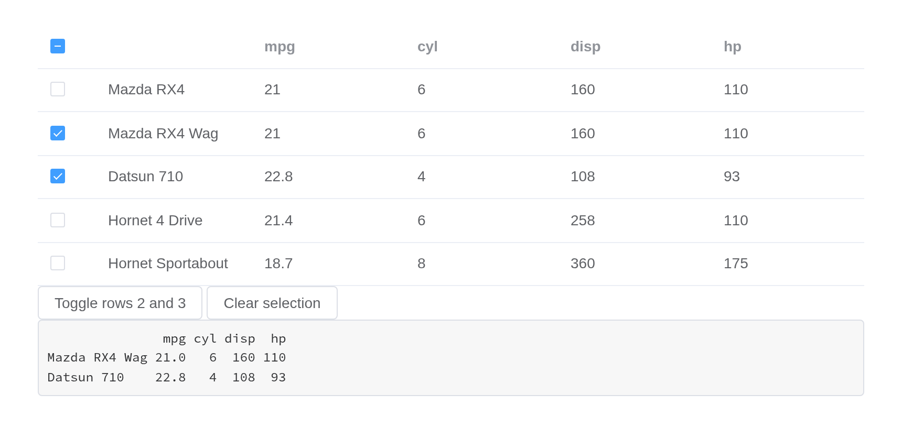
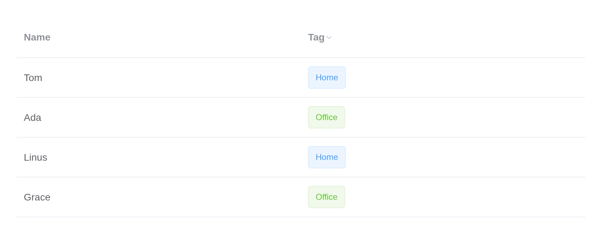
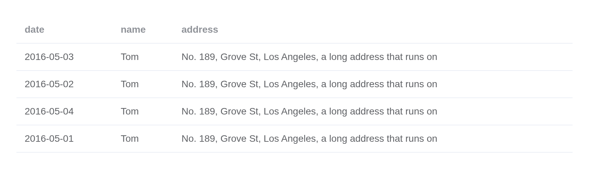
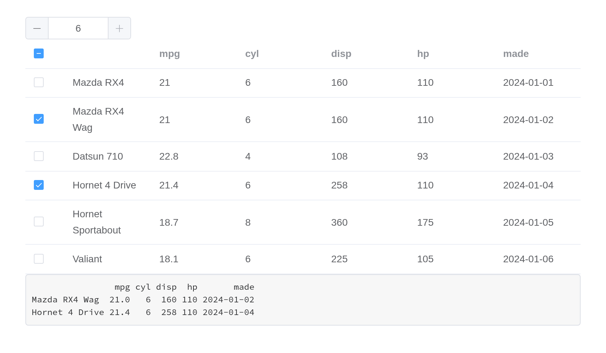

# Table

Display multiple data with similar format. You can sort, filter, compare
your data in a table.

## Basic table

Basic table is just for data display.

After setting attribute `data` of `el-table` with an object array, you
can use `prop` (corresponding to a key of the object in `data` array) in
`el-table-column` to insert data to table columns, and set the attribute
`label` to define the column name. You can also use the attribute
`width` to define the width of columns.

``` r

tableData <- data.frame(
  date = c("2016-05-03", "2016-05-02", "2016-05-04", "2016-05-01"),
  name = "Tom",
  address = "No. 189, Grove St, Los Angeles"
)
el_table(
  data = tableData,
  columns = list(
    el_table_column("date", "Date", width = 180),
    el_table_column("name", "Name", width = 180),
    el_table_column("address", "Address")
  )
)
```

## Striped Table

Striped table makes it easier to distinguish different rows.

Attribute `stripe` accepts a `Boolean`. If `true`, table will be
striped.

``` r

tableData <- data.frame(
  date = c("2016-05-03", "2016-05-02", "2016-05-04", "2016-05-01"),
  name = "Tom",
  address = "No. 189, Grove St, Los Angeles"
)
el_table(
  data = tableData,
  stripe = TRUE,
  columns = list(
    el_table_column("date", "Date", width = 180),
    el_table_column("name", "Name", width = 180),
    el_table_column("address", "Address")
  )
)
```

## Table with border

By default, Table has no vertical border. If you need it, you can set
attribute `border` to `true`.

``` r

tableData <- data.frame(
  date = c("2016-05-03", "2016-05-02", "2016-05-04", "2016-05-01"),
  name = "Tom",
  address = "No. 189, Grove St, Los Angeles"
)
el_table(
  data = tableData,
  border = TRUE,
  columns = list(
    el_table_column("date", "Date", width = 180),
    el_table_column("name", "Name", width = 180),
    el_table_column("address", "Address")
  )
)
```

## Table with status

You can highlight your table content to distinguish between “success,
information, warning, danger” and other states.

Use `row-class-name` in `el-table` to add custom classes to a certain
row. Then you can style it with custom classes.

``` r

tableData <- data.frame(
  date = c("2016-05-03", "2016-05-02", "2016-05-04", "2016-05-01"),
  name = "Tom",
  address = "No. 189, Grove St, Los Angeles"
)
tagList(
  tags$style(
    ".el-table .warning-row {
  --el-table-tr-bg-color: var(--el-color-warning-light-9);
}
.el-table .success-row {
  --el-table-tr-bg-color: var(--el-color-success-light-9);
}"
  ),
  el_table(
    data = tableData,
    row_class_name = JS(
      "function({ row, rowIndex }) {",
      "  if (rowIndex === 1) return 'warning-row';",
      "  if (rowIndex === 3) return 'success-row';",
      "  return '';",
      "}"
    ),
    columns = list(
      el_table_column("date", "Date", width = 180),
      el_table_column("name", "Name", width = 180),
      el_table_column("address", "Address")
    )
  )
)
```

## Table with show overflow tooltip

When the content is too long, it will break into multiple lines, you can
use `show-overflow-tooltip` to keep it in one line.

Attribute `show-overflow-tooltip`, which accepts a `Boolean` value. When
set `true`, the extra content will show in tooltip when hover on the
cell.

``` r

tableData <- data.frame(
  date = c("2016-05-04", "2016-05-03", "2016-05-02", "2016-05-01"),
  name = c("Aleyna Kutzner", "Helen Jacobi", "Brandon Deckert", "Margie Smith"),
  address = c(
    "Lohrbergstr. 86c, Süd Lilli, Saarland",
    "760 A Street, South Frankfield, Illinois",
    "Arnold-Ohletz-Str. 41a, Alt Malinascheid, Thüringen",
    "23618 Windsor Drive, West Ricardoview, Idaho"
  )
)
el_table(
  data = tableData,
  columns = list(
    el_table_column(type = "selection", width = 55),
    el_table_column(label = "Date", width = 120, cell = "{{ scope.row.date }}"),
    el_table_column("name", "Name", width = 120),
    el_table_column(
      "address",
      "use show-overflow-tooltip",
      width = 240,
      show_overflow_tooltip = TRUE
    ),
    el_table_column("address", "address")
  )
)
```

## Table with fixed header

When there are too many rows, you can use a fixed header.

By setting the attribute `height` of `el-table`, you can fix the table
header without any other codes.

``` r

tableData <- data.frame(
  date = c(
    "2016-05-03",
    "2016-05-02",
    "2016-05-04",
    "2016-05-01",
    "2016-05-08",
    "2016-05-06",
    "2016-05-07"
  ),
  name = "Tom",
  address = "No. 189, Grove St, Los Angeles"
)
el_table(
  data = tableData,
  height = 250,
  columns = list(
    el_table_column("date", "Date", width = 180),
    el_table_column("name", "Name", width = 180),
    el_table_column("address", "Address")
  )
)
```

## Table with fixed column

When there are too many columns, you can fix some of them.

Attribute `fixed` is used in `el-table-column`, it accepts a `Boolean`.
If `true`, the column will be fixed at left. It also accepts two string
literals: ‘left’ and ‘right’, both indicating that the column will be
fixed at corresponding direction.

The buttons report to the server with `rowAction()`: in an app, Detail
sets `input$<id>_detail` to the row.

``` r

tableData <- data.frame(
  date = c("2016-05-03", "2016-05-02", "2016-05-04", "2016-05-01"),
  name = "Tom",
  state = "California",
  city = "Los Angeles",
  address = "No. 189, Grove St, Los Angeles",
  zip = "CA 90036",
  tag = c("Home", "Office", "Home", "Office")
)
el_table(
  data = tableData,
  columns = list(
    el_table_column("date", "Date", width = 150, fixed = TRUE),
    el_table_column("name", "Name", width = 120),
    el_table_column("state", "State", width = 120),
    el_table_column("city", "City", width = 120),
    el_table_column("address", "Address", width = 600),
    el_table_column("zip", "Zip", width = 120),
    el_table_column(
      label = "Operations",
      fixed = "right",
      min_width = 120,
      cell = tagList(
        el$button(
          link = NA,
          type = "primary",
          size = "small",
          "@click" = "rowAction('detail', scope)",
          "Detail"
        ),
        el$button(link = NA, type = "primary", size = "small", "Edit")
      )
    )
  )
)
```

## Table with fixed columns and header

When you have huge chunks of data to put in a table, you can fix the
header and columns at the same time.

Fix columns and header at the same time by combining the above two
examples.

``` r

tableData <- data.frame(
  date = c(
    "2016-05-03",
    "2016-05-02",
    "2016-05-04",
    "2016-05-01",
    "2016-05-08",
    "2016-05-06",
    "2016-05-07"
  ),
  name = "Tom",
  state = "California",
  city = "Los Angeles",
  address = "No. 189, Grove St, Los Angeles",
  zip = "CA 90036"
)
el_table(
  data = tableData,
  height = 250,
  columns = list(
    el_table_column("date", "Date", width = 150, fixed = TRUE),
    el_table_column("name", "Name", width = 120),
    el_table_column("state", "State", width = 120),
    el_table_column("city", "City", width = 320),
    el_table_column("address", "Address", width = 600),
    el_table_column("zip", "Zip")
  )
)
```

## Fluid-height Table with fixed header (and columns)

When the the data is dynamically changed, you might want the table to
have a maximum height rather than a fixed height and to show the scroll
bar if needed.

By setting the attribute `max-height` of `el-table`, you can fix the
table header. The table body scrolls only if the height of the rows
exceeds the max height value.

The rows are the server’s, rendered from a reactive value: Remove
reports its row as `input$fluid_remove`, Add Item asks for one more, and
the table is rendered again with the rows that are left.

``` r

row <- function(date) {
  data.frame(
    date = format(date),
    name = "Tom",
    state = "California",
    city = "Los Angeles",
    address = "No. 189, Grove St, Los Angeles",
    zip = "CA 90036"
  )
}
tableData <- do.call(rbind, lapply(as.Date("2016-05-01") + 0:2, row))

ui <- el_page(
  el_table_output("fluid"),
  tags$div(
    style = "margin-top: 12px",
    el_button("add_item", "Add Item", width = "100%")
  )
)

server <- function(input, output, session) {
  rows <- reactiveVal(tableData)
  day <- reactiveVal(Sys.Date())
  output$fluid <- render_el_table(el_table(
    data = rows(),
    max_height = 250,
    columns = list(
      el_table_column("date", "Date", width = 150, fixed = TRUE),
      el_table_column("name", "Name", width = 120),
      el_table_column("state", "State", width = 120),
      el_table_column("city", "City", width = 120),
      el_table_column("address", "Address", width = 600),
      el_table_column("zip", "Zip", width = 120),
      el_table_column(
        label = "Operations",
        fixed = "right",
        min_width = 120,
        cell = el$button(
          link = NA,
          type = "primary",
          size = "small",
          "@click.prevent" = "rowAction('remove', scope)",
          "Remove"
        )
      )
    )
  ))
  observeEvent(input$fluid_remove, {
    rows(rows()[-input$fluid_remove$row_index, ])
  })
  observeEvent(input$add_item, {
    day(day() + 1)
    rows(rbind(rows(), row(day())))
  })
}

shinyApp(ui, server)
```


## Grouping table head

When the data structure is complex, you can use group header to show the
data hierarchy.

Only need to place el-table-column inside a el-table-column, you can
achieve group header.

``` r

tableData <- data.frame(
  date = c(
    "2016-05-03",
    "2016-05-02",
    "2016-05-04",
    "2016-05-01",
    "2016-05-08",
    "2016-05-06",
    "2016-05-07"
  ),
  name = "Tom",
  state = "California",
  city = "Los Angeles",
  address = "No. 189, Grove St, Los Angeles",
  zip = "CA 90036"
)
el_table(
  data = tableData,
  columns = list(
    el_table_column("date", "Date", width = 150),
    el_table_column(
      label = "Delivery Info",
      el_table_column("name", "Name", width = 120),
      el_table_column(
        label = "Address Info",
        el_table_column("state", "State", width = 120),
        el_table_column("city", "City", width = 120),
        el_table_column("address", "Address"),
        el_table_column("zip", "Zip", width = 120)
      )
    )
  )
)
```

## Table with fixed group header

fixed group head is supported

The attribute `fixed` of the group header is determined by the outermost
`el-table-column`

``` r

tableData <- data.frame(
  date = c(
    "2016-05-03",
    "2016-05-02",
    "2016-05-04",
    "2016-05-01",
    "2016-05-08",
    "2016-05-06",
    "2016-05-07"
  ),
  name = "Tom",
  state = "California",
  city = "Los Angeles",
  address = "No. 189, Grove St, Los Angeles",
  zip = "CA 90036"
)
el_table(
  data = tableData,
  height = 250,
  columns = list(
    el_table_column("date", "Date"),
    el_table_column("name", "Name"),
    el_table_column("zip", "Zip"),
    el_table_column(
      label = "Address Info",
      fixed = "right",
      el_table_column("state", "State"),
      el_table_column("city", "City"),
      el_table_column("address", "Address", min_width = 200)
    )
  )
)
```

## Single select

Single row selection is supported.

Table supports single row selection. You can activate it by adding the
`highlight-current-row` attribute. An event called `current-change` will
be triggered when row selection changes, and its parameters are the rows
after and before this change: `currentRow` and `oldCurrentRow`. If you
need to display row index, you can add a new `el-table-column` with its
`type` attribute assigned to `index`, and you will see the index
starting from 1.

The buttons call the table’s `setCurrentRow()` from the server; the row
clicked or set arrives as `input$single_current_change`.

``` r

tableData <- data.frame(
  date = c("2016-05-03", "2016-05-02", "2016-05-04", "2016-05-01"),
  name = "Tom",
  address = "No. 189, Grove St, Los Angeles"
)

ui <- el_page(
  el_table_output("single"),
  tags$div(
    style = "margin-top: 20px",
    el_button("second", "Select second row"),
    el_button("clear", "Clear selection")
  )
)

server <- function(input, output, session) {
  output$single <- render_el_table(el_table(
    data = tableData,
    highlight_current_row = TRUE,
    columns = list(
      el_table_column(type = "index", width = 50),
      el_table_column("date", "Date", width = 120),
      el_table_column("name", "Name", width = 120),
      el_table_column("address", "Address")
    )
  ))
  observeEvent(input$second, {
    call_el(session, "single", "setCurrentRow", list(el_table_row(2)))
  })
  observeEvent(input$clear, call_el(session, "single", "setCurrentRow"))
}

shinyApp(ui, server)
```


## Multiple select

You can also select multiple rows.

After 2.8.3, `toggleRowSelection` supports the third parameter
`ignoreSelectable` to determine whether to ignore the selectable
attribute.

Activating multiple selection is easy: simply add an `el-table-column`
with its `type` set to `selection`.

Rows 1 and 2 cannot be ticked (`selectable`). The first button toggles
rows 2 and 3 whatever `selectable` says, the second only where it
allows; the rows ticked arrive as `input$multi` (their numbers) and
`input$multi_selection_change` (the rows).

``` r

tableData <- data.frame(
  id = 1:7,
  date = c(
    "2016-05-03",
    "2016-05-02",
    "2016-05-04",
    "2016-05-01",
    "2016-05-08",
    "2016-05-06",
    "2016-05-07"
  ),
  name = "Tom",
  address = "No. 189, Grove St, Los Angeles"
)

ui <- el_page(
  el_table_output("multi"),
  tags$div(
    style = "margin-top: 20px",
    el_button("toggle", "Toggle selection status of second and third rows"),
    el_button(
      "toggle_selectable",
      "Toggle selection status based on selectable"
    ),
    el_button("clear", "Clear selection")
  )
)

server <- function(input, output, session) {
  output$multi <- render_el_table(el_table(
    data = tableData,
    row_key = "id",
    columns = list(
      el_table_column(
        type = "selection",
        width = 55,
        selectable = JS("function(row) { return ![1, 2].includes(row.id); }")
      ),
      el_table_column(
        label = "Date",
        width = 120,
        cell = "{{ scope.row.date }}"
      ),
      el_table_column("name", "Name", width = 120),
      el_table_column("address", "Address")
    )
  ))
  toggle <- function(ignore_selectable) {
    for (i in 2:3) {
      call_el(
        session,
        "multi",
        "toggleRowSelection",
        list(el_table_row(i), NULL, ignore_selectable)
      )
    }
  }
  observeEvent(input$toggle, toggle(TRUE))
  observeEvent(input$toggle_selectable, toggle(FALSE))
  observeEvent(input$clear, call_el(session, "multi", "clearSelection"))
}

shinyApp(ui, server)
```



## Sorting

Sort the data to find or compare data quickly.

Set attribute `sortable` in a certain column to sort the data based on
this column. It accepts `Boolean` with a default value `false`. Set
table attribute `default-sort` to determine default sort column and
order. To apply your own sorting rules, use `sort-method` or `sort-by`.
If you need remote sorting from backend, set `sortable` to `custom`, and
listen to the `sort-change` event on Table. In the event handler, you
have access to the sorting column and sorting order so that you can
fetch sorted table data from API. In this example we use another
attribute named `formatter` to format the value of certain columns. It
accepts a function which has two parameters: `row` and `column`. You can
handle it according to your own needs.

``` r

tableData <- data.frame(
  date = c("2016-05-03", "2016-05-02", "2016-05-04", "2016-05-01"),
  name = "Tom",
  address = "No. 189, Grove St, Los Angeles"
)
el_table(
  data = tableData,
  default_sort = list(prop = "date", order = "descending"),
  columns = list(
    el_table_column("date", "Date", sortable = TRUE, width = 180),
    el_table_column("name", "Name", width = 180),
    el_table_column(
      "address",
      "Address",
      formatter = JS("function(row, column) { return row.address; }")
    )
  )
)
```

## Filter

Filter the table to find desired data.

Set attribute `filters` and `filter-method` in `el-table-column` makes
this column filterable. `filters` is an array, and `filter-method` is a
function deciding which rows are displayed. It has three parameters:
`value`, `row` and `column`.

The buttons call the table’s `clearFilter()` from the server: with the
date column’s `column_key`, or with nothing for every column.

``` r

tableData <- data.frame(
  date = c("2016-05-03", "2016-05-02", "2016-05-04", "2016-05-01"),
  name = "Tom",
  address = "No. 189, Grove St, Los Angeles",
  tag = c("Home", "Office", "Home", "Office")
)

ui <- el_page(
  el_button("reset_date", "reset date filter"),
  el_button("reset_all", "reset all filters"),
  el_table_output("filtered")
)

server <- function(input, output, session) {
  output$filtered <- render_el_table(el_table(
    data = tableData,
    row_key = "date",
    columns = list(
      el_table_column(
        "date",
        "Date",
        sortable = TRUE,
        width = 180,
        column_key = "date",
        filters = lapply(
          c("2016-05-01", "2016-05-02", "2016-05-03", "2016-05-04"),
          function(d) list(text = d, value = d)
        ),
        filter_method = JS(
          "function(value, row, column) {",
          "  return row[column['property']] === value;",
          "}"
        )
      ),
      el_table_column("name", "Name", width = 180),
      el_table_column(
        "address",
        "Address",
        formatter = JS("function(row, column) { return row.address; }")
      ),
      el_table_column(
        "tag",
        "Tag",
        width = 100,
        filters = list(
          list(text = "Home", value = "Home"),
          list(text = "Office", value = "Office")
        ),
        filter_method = JS(
          "function(value, row) { return row.tag === value; }"
        ),
        filter_placement = "bottom-end",
        cell = el$tag(
          ":type" = "scope.row.tag === 'Home' ? 'primary' : 'success'",
          "disable-transitions" = NA,
          "{{ scope.row.tag }}"
        )
      )
    )
  ))
  observeEvent(input$reset_date, {
    call_el(session, "filtered", "clearFilter", list(list("date")))
  })
  observeEvent(input$reset_all, call_el(session, "filtered", "clearFilter"))
}

shinyApp(ui, server)
```



## Custom column template

Customize table column so it can be integrated with other components.

You have access to the following data: row, column, \$index and store
(state management of Table) by
[slot](https://v3.vuejs.org/guide/component-slots.html).

Edit and Delete report to the server with `rowAction()`, as
`input$custom_edit` and `input$custom_delete`: the row’s number and the
row.

``` r

tableData <- data.frame(
  date = c("2016-05-03", "2016-05-02", "2016-05-04", "2016-05-01"),
  name = "Tom",
  address = "No. 189, Grove St, Los Angeles"
)

ui <- el_page(
  el_table_output("custom"),
  verbatimTextOutput("which")
)

server <- function(input, output, session) {
  output$custom <- render_el_table(el_table(
    data = tableData,
    columns = list(
      el_table_column(
        label = "Date",
        width = 180,
        cell = tags$div(
          style = "display: flex; align-items: center",
          htmltools::tag("el-icon", list(htmltools::tag("timer", list()))),
          tags$span(style = "margin-left: 10px", "{{ scope.row.date }}")
        )
      ),
      el_table_column(
        label = "Name",
        width = 180,
        cell = el$popover(
          effect = "light",
          trigger = "hover",
          placement = "top",
          width = "auto",
          tags$template(
            `v-slot:default` = NA,
            tags$div("name: {{ scope.row.name }}"),
            tags$div("address: {{ scope.row.address }}")
          ),
          tags$template(
            `v-slot:reference` = NA,
            el$tag("{{ scope.row.name }}")
          )
        )
      ),
      el_table_column(
        label = "Operations",
        cell = tagList(
          el$button(
            size = "small",
            "@click" = "rowAction('edit', scope)",
            "Edit"
          ),
          el$button(
            size = "small",
            type = "danger",
            "@click" = "rowAction('delete', scope)",
            "Delete"
          )
        )
      )
    )
  ))
  output$which <- renderPrint(list(
    edit = input$custom_edit$row_index,
    delete = input$custom_delete$row_index
  ))
}

shinyApp(ui, server)
```


## Table with custom header

Customize table header so it can be even more customized.

You can customize how the header looks by header
[slots](https://v3.vuejs.org/guide/component-slots.html).

The search box is the column’s `header` template. What is typed lives in
a store, `$store.search.text`, reported as `input$search`; the table is
rendered again with the rows that match.

``` r

tableData <- data.frame(
  date = c("2016-05-03", "2016-05-02", "2016-05-04", "2016-05-01"),
  name = c("Tom", "John", "Morgan", "Jessy"),
  address = "No. 189, Grove St, Los Angeles"
)

ui <- el_page(
  vue_store("search", data = list(text = ""), input = "text"),
  el_table_output("searchable")
)

server <- function(input, output, session) {
  matches <- reactive({
    text <- input$search %||% ""
    !nzchar(text) | grepl(tolower(text), tolower(tableData$name), fixed = TRUE)
  })
  output$searchable <- render_el_table(el_table(
    data = tableData[matches(), ],
    columns = list(
      el_table_column("date", "Date"),
      el_table_column("name", "Name"),
      el_table_column(
        align = "right",
        header = el$input(
          "v-model" = "$store.search.text",
          size = "small",
          placeholder = "Type to search"
        ),
        cell = tagList(
          el$button(
            size = "small",
            "@click" = "rowAction('edit', scope)",
            "Edit"
          ),
          el$button(
            size = "small",
            type = "danger",
            "@click" = "rowAction('delete', scope)",
            "Delete"
          )
        )
      )
    )
  ))
}

shinyApp(ui, server)
```


## Expandable row

When the row content is too long and you do not want to display the
horizontal scroll bar, you can use the expandable row feature.

After 2.9.7, `preserve-expanded-content` is added to control whether to
preserve expanded row content in DOM when collapsed.

Activate expandable row by adding type=“expand” and slot. The template
for el-table-column will be rendered as the contents of the expanded
row, and you can access the same attributes as when you are using `slot`
in custom column templates.

Each row opens to its details and a table of its own, the family. The
switches are the server’s: the parent’s border and
`preserve_expanded_content` render the table again – patched in place,
the open rows stay open – the child tables’ border goes through a store
their template reads, `$store.expand.child`.

``` r

family <- data.frame(
  name = c("Jerry", "Spike", "Tyke"),
  state = "California",
  city = "San Francisco",
  address = "3650 21st St, San Francisco",
  zip = "CA 94114"
)
tableData <- lapply(
  c(
    "2016-05-03",
    "2016-05-02",
    "2016-05-04",
    "2016-05-01",
    "2016-05-08",
    "2016-05-06",
    "2016-05-07"
  ),
  function(date) {
    list(
      date = date,
      name = "Tom",
      state = "California",
      city = "San Francisco",
      address = "3650 21st St, San Francisco",
      zip = "CA 94114",
      family = family
    )
  }
)

ui <- el_page(
  vue_store("expand", data = list(child = FALSE)),
  tags$div(
    style = "display: flex; gap: 8px; align-items: center",
    "switch parent border:",
    el_switch("parent_border"),
    "switch child border:",
    el_switch("child_border"),
    "preserve expanded:",
    el_switch("preserve")
  ),
  el_table_output("expandable")
)

server <- function(input, output, session) {
  output$expandable <- render_el_table(el_table(
    data = tableData,
    border = isTRUE(input$parent_border),
    preserve_expanded_content = isTRUE(input$preserve),
    columns = list(
      el_table_column(
        type = "expand",
        cell = tags$div(
          style = "margin: 16px",
          tags$p("State: {{ scope.row.state }}"),
          tags$p("City: {{ scope.row.city }}"),
          tags$p("Address: {{ scope.row.address }}"),
          tags$p("Zip: {{ scope.row.zip }}"),
          tags$h3("Family"),
          el$table(
            ":data" = "scope.row.family",
            ":border" = "$store.expand.child",
            el$table_column(label = "Name", prop = "name"),
            el$table_column(label = "State", prop = "state"),
            el$table_column(label = "City", prop = "city"),
            el$table_column(label = "Address", prop = "address"),
            el$table_column(label = "Zip", prop = "zip")
          )
        )
      ),
      el_table_column("date", "Date"),
      el_table_column("name", "Name")
    )
  ))
  observeEvent(input$child_border, {
    update_vue(session, "expand", child = input$child_border)
  })
}

shinyApp(ui, server)
```


## Tree data and lazy mode

You can display tree structure data. When row contains the `children`
field, it is treated as nested data. For rendering nested data, the prop
`row-key` is required. Also, child row data can be loaded
asynchronously. Set `lazy` property of Table to true and the function
`load`. Specify `hasChildren` attribute in row to determine which row
contains children. Both `children` and `hasChildren` can be configured
via `tree-props`.

The second table loads a row’s children when it is opened, with `load`,
in the browser. Without `load` the server loads them: see
[`el_load_children()`](https://kaipingyang.github.io/shiny.element/reference/el_load_children.md).

``` r

tableData <- list(
  list(
    id = 1,
    date = "2016-05-02",
    name = "wangxiaohu",
    address = "No. 189, Grove St, Los Angeles"
  ),
  list(
    id = 2,
    date = "2016-05-04",
    name = "wangxiaohu",
    address = "No. 189, Grove St, Los Angeles"
  ),
  list(
    id = 3,
    date = "2016-05-01",
    name = "wangxiaohu",
    address = "No. 189, Grove St, Los Angeles",
    children = list(
      list(
        id = 31,
        date = "2016-05-01",
        name = "wangxiaohu",
        address = "No. 189, Grove St, Los Angeles"
      ),
      list(
        id = 32,
        date = "2016-05-01",
        name = "wangxiaohu",
        address = "No. 189, Grove St, Los Angeles"
      )
    )
  ),
  list(
    id = 4,
    date = "2016-05-03",
    name = "wangxiaohu",
    address = "No. 189, Grove St, Los Angeles"
  )
)
tableData1 <- data.frame(
  id = 1:4,
  date = c("2016-05-02", "2016-05-04", "2016-05-01", "2016-05-03"),
  name = "wangxiaohu",
  hasChildren = c(FALSE, FALSE, TRUE, FALSE),
  address = "No. 189, Grove St, Los Angeles"
)
tags$div(
  el_table(
    data = tableData,
    row_key = "id",
    border = TRUE,
    default_expand_all = TRUE,
    columns = list(
      el_table_column("date", "Date", sortable = TRUE),
      el_table_column("name", "Name", sortable = TRUE),
      el_table_column("address", "Address", sortable = TRUE)
    )
  ),
  tags$div(style = "height: 20px"),
  el_table(
    data = tableData1,
    row_key = "id",
    border = TRUE,
    lazy = TRUE,
    tree_props = list(children = "children", hasChildren = "hasChildren"),
    load = JS(
      "function(row, treeNode, resolve) {",
      "  setTimeout(function() {",
      "    resolve([",
      "      { id: 31, date: '2016-05-01', name: 'wangxiaohu',",
      "        address: 'No. 189, Grove St, Los Angeles' },",
      "      { id: 32, date: '2016-05-01', name: 'wangxiaohu',",
      "        address: 'No. 189, Grove St, Los Angeles' }",
      "    ]);",
      "  }, 1000);",
      "}"
    ),
    columns = list(
      el_table_column("date", "Date"),
      el_table_column("name", "Name"),
      el_table_column("address", "Address")
    )
  )
)
```

## Selectable tree

When `treeProps.checkStrictly` is true, the selection state of parent
and child nodes is no longer associated, that is, when the parent node
is selected, its child nodes will not be selected; when
`treeProps.checkStrictly` is false, the selection state of parent and
child nodes will be associated with the selection state of child nodes,
that is, when the parent node is selected, all its child nodes will be
selected.

The radio buttons set `tree_props = list(checkStrictly =)`, rendering
the table again: ticked strictly, a row ticks on its own, not with its
children. Rows 1 and 31 cannot be ticked.

``` r

row <- function(id, date, children = NULL) {
  r <- list(
    id = id,
    date = date,
    name = "wangxiaohu",
    address = "No. 189, Grove St, Los Angeles"
  )
  if (length(children)) {
    r$children <- children
  }
  r
}
tableData <- list(
  row(1, "2016-05-02"),
  row(2, "2016-05-04"),
  row(
    3,
    "2016-05-01",
    list(row(31, "2016-05-01"), row(32, "2016-05-01"), row(33, "2016-05-01"))
  ),
  row(4, "2016-05-03")
)

ui <- el_page(
  el_radio_group(
    "strict_mode",
    choices = c("true", "false"),
    value = "false",
    button = TRUE
  ),
  el_table_output("strict")
)

server <- function(input, output, session) {
  output$strict <- render_el_table(el_table(
    data = tableData,
    row_key = "id",
    default_expand_all = TRUE,
    tree_props = list(checkStrictly = identical(input$strict_mode, "true")),
    columns = list(
      el_table_column(
        type = "selection",
        width = 55,
        selectable = JS("function(row) { return ![1, 31].includes(row.id); }")
      ),
      el_table_column("date", "Date"),
      el_table_column("name", "Name"),
      el_table_column("address", "Address")
    )
  ))
}

shinyApp(ui, server)
```


## Summary row

For table of numbers, you can add an extra row at the table footer
displaying each column’s sum.

You can add the summary row by setting `show-summary` to `true`. By
default, for the summary row, the first column does not sum anything up
but always displays ‘Sum’ (you can configure the displayed text using
`sum-text`), while other columns sum every number in that column up and
display them. You can of course define your own sum behaviour. To do so,
pass a method to `summary-method`, which returns an array, and each
element of the returned array will be displayed in the columns of the
summary row, It can be a VNode or string. The second table of this
example is a detailed demo.

``` r

tableData <- data.frame(
  id = c("12987122", "12987123", "12987124", "12987125", "12987126"),
  name = "Tom",
  amount1 = c("234", "165", "324", "621", "539"),
  amount2 = c("3.2", "4.43", "1.9", "2.2", "4.1"),
  amount3 = c(10, 12, 9, 17, 15)
)
tags$div(
  el_table(
    data = tableData,
    border = TRUE,
    show_summary = TRUE,
    columns = list(
      el_table_column("id", "ID", width = 180),
      el_table_column("name", "Name"),
      el_table_column("amount1", "Amount 1", sortable = TRUE),
      el_table_column("amount2", "Amount 2", sortable = TRUE),
      el_table_column("amount3", "Amount 3", sortable = TRUE)
    )
  ),
  tags$div(style = "height: 20px"),
  el_table(
    data = tableData,
    border = TRUE,
    height = 200,
    show_summary = TRUE,
    summary_method = JS(
      "function({ columns, data }) {",
      "  return columns.map(function(column, index) {",
      "    if (index === 0) {",
      "      return Vue.h('div', { style: { textDecoration: 'underline' } }, ['Total Cost']);",
      "    }",
      "    var values = data.map(function(item) { return Number(item[column.property]); });",
      "    if (values.every(function(value) { return Number.isNaN(value); })) return 'N/A';",
      "    return '$ ' + values.reduce(function(prev, curr) {",
      "      return Number.isNaN(curr) ? prev : prev + curr;",
      "    }, 0);",
      "  });",
      "}"
    ),
    columns = list(
      el_table_column("id", "ID", width = 180),
      el_table_column("name", "Name"),
      el_table_column("amount1", "Cost 1 ($)"),
      el_table_column("amount2", "Cost 2 ($)"),
      el_table_column("amount3", "Cost 3 ($)")
    )
  )
)
```

## Rowspan and colspan

Configuring rowspan and colspan allows you to merge cells

Use the `span-method` attribute to configure rowspan and colspan. It
accepts a method, and passes an object to that method including current
row `row`, current column `column`, current row index `rowIndex` and
current column index `columnIndex`. The method should return an array of
two numbers, the first number being `rowspan` and second `colspan`. It
can also return an object with `rowspan` and `colspan` props.

``` r

tableData <- data.frame(
  id = c("12987122", "12987123", "12987124", "12987125", "12987126"),
  name = "Tom",
  amount1 = c("234", "165", "324", "621", "539"),
  amount2 = c("3.2", "4.43", "1.9", "2.2", "4.1"),
  amount3 = c(10, 12, 9, 17, 15)
)
tags$div(
  el_table(
    data = tableData,
    border = TRUE,
    span_method = JS(
      "function({ row, column, rowIndex, columnIndex }) {",
      "  if (rowIndex % 2 === 0) {",
      "    if (columnIndex === 0) return [1, 2];",
      "    if (columnIndex === 1) return [0, 0];",
      "  }",
      "}"
    ),
    columns = list(
      el_table_column("id", "ID", width = 180),
      el_table_column("name", "Name"),
      el_table_column("amount1", "Amount 1", sortable = TRUE),
      el_table_column("amount2", "Amount 2", sortable = TRUE),
      el_table_column("amount3", "Amount 3", sortable = TRUE)
    )
  ),
  tags$div(style = "height: 20px"),
  el_table(
    data = tableData,
    border = TRUE,
    span_method = JS(
      "function({ row, column, rowIndex, columnIndex }) {",
      "  if (columnIndex === 0) {",
      "    return rowIndex % 2 === 0",
      "      ? { rowspan: 2, colspan: 1 }",
      "      : { rowspan: 0, colspan: 0 };",
      "  }",
      "}"
    ),
    columns = list(
      el_table_column("id", "ID", width = 180),
      el_table_column("name", "Name"),
      el_table_column("amount1", "Amount 1"),
      el_table_column("amount2", "Amount 2"),
      el_table_column("amount3", "Amount 3")
    )
  )
)
```

## Custom index

You can customize row index in `type=index` columns.

To customize row indices, use `index` attribute on `el-table-column`
with `type=index`. If it is assigned to a number, all indices will have
an offset of that number. It also accepts a method with each index
(starting from `0`) as parameter, and the returned value will be
displayed as index.

``` r

tableData <- data.frame(
  date = c("2016-05-03", "2016-05-02", "2016-05-04", "2016-05-01"),
  name = "Tom",
  state = "California",
  city = "Los Angeles",
  address = "No. 189, Grove St, Los Angeles",
  zip = "CA 90036",
  tag = c("Home", "Office", "Home", "Office")
)
el_table(
  data = tableData,
  columns = list(
    el_table_column(
      type = "index",
      index = JS("function(index) { return index * 2; }")
    ),
    el_table_column("date", "Date", width = 180),
    el_table_column("name", "Name", width = 180),
    el_table_column("address", "Address")
  )
)
```

## Table Layout

The
[table-layout](https://developer.mozilla.org/en-US/docs/Web/CSS/table-layout)
property sets the algorithm used to lay out table cells, rows, and
columns.

The radio buttons set `table_layout` from the server.

``` r

tableData <- data.frame(
  date = c("2016-05-03", "2016-05-02", "2016-05-04", "2016-05-01"),
  name = "Tom",
  address = "No. 189, Grove St, Los Angeles"
)

ui <- el_page(
  el_radio_group(
    "layout",
    choices = c("fixed", "auto"),
    value = "fixed",
    button = TRUE
  ),
  el_table_output("layout_table")
)

server <- function(input, output, session) {
  output$layout_table <- render_el_table(el_table(
    data = tableData,
    table_layout = "fixed",
    columns = list(
      el_table_column("date", "Date"),
      el_table_column("name", "Name"),
      el_table_column("address", "Address")
    )
  ))
  observeEvent(input$layout, {
    update_el_table(session, "layout_table", table_layout = input$layout)
  })
}

shinyApp(ui, server)
```



## Tooltip formatter

You can use `tooltip-formatter` to customize the tooltip content.

``` r

tableData <- list(
  list(
    address = "Lohrbergstr. 86c, Süd Lilli, Saarland",
    tags = list("Office", "Home", "Park", "Garden"),
    url = "https://github.com/element-plus/element-plus/issues"
  ),
  list(
    address = "760 A Street, South Frankfield, Illinois",
    tags = list("error", "warning", "success", "info"),
    url = "https://github.com/element-plus/element-plus/pulls"
  ),
  list(
    address = "Arnold-Ohletz-Str. 41a, Alt Malinascheid, Thüringen",
    tags = list("one", "two", "three", "four", "five"),
    url = "https://github.com/element-plus/element-plus/discussions"
  ),
  list(
    address = "23618 Windsor Drive, West Ricardoview, Idaho",
    tags = list("blue", "white", "dark", "gray", "red", "bright"),
    url = "https://github.com/element-plus/element-plus/actions"
  )
)
tagList(
  tags$style(".tag-item + .tag-item { margin-left: 5px; }"),
  el_table(
    data = tableData,
    show_overflow_tooltip = TRUE,
    tooltip_formatter = JS(
      "function(data) { return data.cellValue + ': table formatter'; }"
    ),
    columns = list(
      el_table_column("address", "extends table formatter", width = 240),
      el_table_column(
        "tags",
        "formatter object",
        width = 240,
        tooltip_formatter = JS(
          "function({ row }) { return row.tags.join(', '); }"
        ),
        cell = el$tag(
          "v-for" = "tag in scope.row.tags",
          ":key" = "tag",
          class = "tag-item",
          type = "primary",
          "{{ tag }}"
        )
      ),
      el_table_column(
        "url",
        "with vnode",
        width = 240,
        tooltip_formatter = JS(
          "function(data) {",
          "  return Vue.h(ElementPlus.ElLink, { type: 'primary', href: data.cellValue },",
          "    function() { return Vue.h('span', null, data.cellValue); });",
          "}"
        )
      )
    )
  )
)
```

## In Shiny

In an app a table is an output, as DT’s and reactable’s are: the page
holds `el_table_output("cars")`, the server renders
[`el_table()`](https://kaipingyang.github.io/shiny.element/reference/el_table.md)
into it with
[`render_el_table()`](https://kaipingyang.github.io/shiny.element/reference/el_table_output.md),
and the output’s id names the table’s inputs. The table above every
example on this page is
[`el_table()`](https://kaipingyang.github.io/shiny.element/reference/el_table.md)
alone, which is how it goes in R Markdown, Quarto or a static page. \|
Input \| Value \| \|—\|—\| \| `input$cars` \| the selected row numbers,
integers; `NULL` with none \| \| `input$cars_selection_change` \| the
selected rows, `data[rows, , drop = FALSE]`: the columns, types and row
names rendered \| \| `input$cars_current_change`, `_sort_change`,
`_filter_change`, `_expand_change` \| reported by every table \| \|
`input$cars_<event>` \| any other of Element’s events, asked for with
[`el_on()`](https://kaipingyang.github.io/shiny.element/reference/el_on.md)
or `el_table(events =)` \| Rendering again with the same rows keeps the
user’s ticks, sort and open rows; other rows clear the selection, as
Element does, unless the rows carry a `row_key` and the selection column
`reserve_selection = TRUE`.
[`update_el_table()`](https://kaipingyang.github.io/shiny.element/reference/el_table.md)
and
[`call_el()`](https://kaipingyang.github.io/shiny.element/reference/call_el.md)
reach the table by the output’s id.

``` r

#'
#'
cars <- head(mtcars[, 1:4], 6)
cars$made <- as.Date("2024-01-01") + 0:5

ui <- el_page(
  el_input_number("n", value = 6, min = 1, max = 6),
  el_table_output("cars"),
  verbatimTextOutput("picked")
)

server <- function(input, output, session) {
  output$cars <- render_el_table(
    el_table(data = head(cars, input$n), selection = TRUE) |>
      el_on("row-dblclick")
  )
  # the ticked rows, as R subsets them: Dates stay Dates
  output$picked <- renderPrint(input$cars_selection_change)
  observeEvent(input$cars_row_dblclick, {
    el_message(message = paste("Row", input$cars_row_dblclick$row_index))
  })
}

shinyApp(ui, server)
```



## API

Element Plus’s tables, and beside each entry where it is in R.

### Table Attributes

| Element | In R | Description | Type | Accepted | Default |
|----|----|----|----|----|----|
| `data` | `data` | table data | [^1]`any[]` |  | \[\] |
| `height` | `height` | table’s height. By default it has an `auto` height. If its value is a number, the height is measured in pixels; if its value is a string, the value will be assigned to element’s style.height, the height is affected by external styles | [^2] / [^3] |  | — |
| `max-height` | `max_height` | table’s max-height. The legal value is a number or the height in px | [^4] / [^5] |  | — |
| `stripe` | `stripe` | whether Table is striped | [^6] |  | false |
| `border` | `border` | whether Table has vertical border | [^7] |  | false |
| `size` | `size` | size of Table | [^8]`'' \\| 'large' \\| 'default' \\| 'small'` |  | — |
| `fit` | `fit` | whether width of column automatically fits its container | [^9] |  | true |
| `show-header` | `show_header` | whether Table header is visible | [^10] |  | true |
| `highlight-current-row` | `highlight_current_row` | whether current row is highlighted | [^11] |  | false |
| `current-row-key` | `current_row_key` | key of current row, a set only prop | [^12] / [^13] |  | — |
| `row-class-name` | `row_class_name` | function that returns custom class names for a row, or a string assigning class names for every row | [^14]`(data: { row: any, rowIndex: number }) => string` / [^15] |  | — |
| `row-style` | `row_style` | function that returns custom style for a row, or an object assigning custom style for every row | [^16]`(data: { row: any, rowIndex: number }) => CSSProperties` / [^17]`CSSProperties` |  | — |
| `cell-class-name` | `cell_class_name` | function that returns custom class names for a cell, or a string assigning class names for every cell | [^18]`(data: { row: any, column: TableColumnCtx<T>, rowIndex: number, columnIndex: number }) => string` / [^19] |  | — |
| `cell-style` | `cell_style` | function that returns custom style for a cell, or an object assigning custom style for every cell | [^20]`(data: { row: any, column: TableColumnCtx<T>, rowIndex: number, columnIndex: number }) => CSSProperties` / [^21]`CSSProperties` |  | — |
| `header-row-class-name` | `header_row_class_name` | function that returns custom class names for a row in table header, or a string assigning class names for every row in table header | [^22]`(data: { row: any, rowIndex: number }) => string` / [^23] |  | — |
| `header-row-style` | `header_row_style` | function that returns custom style for a row in table header, or an object assigning custom style for every row in table header | [^24]`(data: { row: any, rowIndex: number }) => CSSProperties` / [^25]`CSSProperties` |  | — |
| `header-cell-class-name` | `header_cell_class_name` | function that returns custom class names for a cell in table header, or a string assigning class names for every cell in table header | [^26]`(data: { row: any, column: TableColumnCtx<T>, rowIndex: number, columnIndex: number }) => string` / [^27] |  | — |
| `header-cell-style` | `header_cell_style` | function that returns custom style for a cell in table header, or an object assigning custom style for every cell in table header | [^28]`(data: { row: any, column: TableColumnCtx<T>, rowIndex: number, columnIndex: number }) => CSSProperties` / [^29]`CSSProperties` |  | — |
| `row-key` | `row_key` | key of row data, used for optimizing rendering. Required if `reserve-selection` is on or display tree data. When its type is String, multi-level access is supported, e.g. `user.info.id`, but `user.info[0].id` is not supported, in which case `Function` should be used | [^30]`(row: any) => string` / [^31] |  | — |
| `empty-text` | `empty_text` | displayed text when data is empty. You can customize this area with `#empty` | [^32] |  | No Data |
| `default-expand-all` | `default_expand_all` | whether expand all rows by default, works when the table has a column type=“expand” or contains tree structure data | [^33] |  | false |
| `expand-row-keys` | `expand_row_keys` | set expanded rows by this prop, prop’s value is the keys of expand rows, you should set row-key before using this prop. | [^34]`Array<string>` |  | — |
| `default-sort` | `default_sort` | set the default sort column and order. property `prop` is used to set default sort column, property `order` is used to set default sort order | [^35]`Sort` |  | if `prop` is set, and `order` is not set, then `order` is default to ascending |
| `tooltip-effect` | `tooltip_effect` | the `effect` of the overflow tooltip | [^36]`'dark' \\| 'light'` |  | dark |
| `tooltip-options` | `tooltip_options` | the options for the overflow tooltip, [see the following tooltip component](https://kaipingyang.github.io/shiny.element/articles/components/tooltip.html#attributes) | [^37]`Pick<ElTooltipProps, 'effect' \\| 'enterable' \\| 'hideAfter' \\| 'offset' \\| 'placement' \\| 'popperClass' \\| 'popperOptions' \\| 'showAfter' \\| 'showArrow'>` |  | [^38]`{ enterable: true, placement: 'top', showArrow: true, hideAfter: 200, popperOptions: { strategy: 'fixed' } }` |
| `append-filter-panel-to` | `append_filter_panel_to` | which element the filter panels appends to | [^39] |  | — |
| `show-summary` | `show_summary` | whether to display a summary row | [^40] |  | false |
| `sum-text` | `sum_text` | displayed text for the first column of summary row | [^41] |  | Sum |
| `summary-method` | `summary_method` | custom summary method | [^42]`(data: { columns: any[], data: any[] }) => (VNode \\| string)[]` |  | — |
| `span-method` | `span_method` | method that returns rowspan and colspan | [^43]`(data: { row: any, column: TableColumnCtx<T>, rowIndex: number, columnIndex: number }) => number[] \\| { rowspan: number, colspan: number } \\| void` |  | — |
| `select-on-indeterminate` | `select_on_indeterminate` | controls the behavior of master checkbox in multi-select tables when only some rows are selected (but not all). If true, all rows will be selected, else deselected | [^44] |  | true |
| `indent` | `indent` | horizontal indentation of tree data | [^45] |  | 16 |
| `lazy` | `lazy` | whether to lazy loading data | [^46] |  | false |
| `load` | `load` | method for loading child row data, only works when `lazy` is true | [^47]`(row: any, treeNode: TreeNode, resolve: (data: any[]) => void) => void` |  | — |
| `tree-props` | `tree_props` | configuration for rendering nested data | [^48]`{ hasChildren?: string, children?: string, checkStrictly?: boolean }` |  | [^49]`{ hasChildren: 'hasChildren', children: 'children', checkStrictly: false }` |
| `table-layout` | `table_layout` | sets the algorithm used to lay out table cells, rows, and columns | [^50]`'fixed' \\| 'auto'` |  | fixed |
| `scrollbar-always-on` | `scrollbar_always_on` | always show scrollbar | [^51] |  | false |
| `show-overflow-tooltip` | `show_overflow_tooltip` | whether to hide extra content and show them in a tooltip when hovering on the cell.It will affect all the table columns, refer to table [tooltip-options](#table-attributes) | [^52] / [`object`](#table-attributes) ^(2.3.7) |  | — |
| `flexible` | `flexible` | ensure main axis minimum-size doesn’t follow the content | [^53] |  | false |
| `scrollbar-tabindex` | `scrollbar_tabindex` | body scrollbar’s wrap container tabindex | [^54] / [^55] |  | — |
| `allow-drag-last-column` | `allow_drag_last_column` | whether to allow drag the last column | [^56] |  | true |
| `tooltip-formatter` | `tooltip_formatter` | customize tooltip content when using `show-overflow-tooltip` | [^57]`(data: { row: any, column: TableColumnCtx<T>, cellValue: any }) => VNode \\| string` |  | — |
| `preserve-expanded-content` | `preserve_expanded_content` | whether to preserve expanded row content in DOM when collapsed | [^58] |  | false |
| `native-scrollbar` | `native_scrollbar` | whether to use native scrollbars | [^59] |  | false |
| `row-expandable` | `row_expandable` | enable expandable rows, works when the table has a column type=“expand” | [^60]`(row: any, index: number) => boolean` |  | — |

### Table Events

| Element | In R | Description |
|----|----|----|
| `select` | `input$<id>_select`, with [`el_on()`](https://kaipingyang.github.io/shiny.element/reference/el_on.md) | triggers when user clicks the checkbox in a row |
| `select-all` | `input$<id>_select_all`, with [`el_on()`](https://kaipingyang.github.io/shiny.element/reference/el_on.md) | triggers when user clicks the checkbox in table header |
| `selection-change` | `input$<id>_selection_change`, the rows; `input$<id>`, their numbers | triggers when selection changes |
| `cell-mouse-enter` | `input$<id>_cell_mouse_enter`, with [`el_on()`](https://kaipingyang.github.io/shiny.element/reference/el_on.md) | triggers when hovering into a cell |
| `cell-mouse-leave` | `input$<id>_cell_mouse_leave`, with [`el_on()`](https://kaipingyang.github.io/shiny.element/reference/el_on.md) | triggers when hovering out of a cell |
| `cell-click` | `input$<id>_cell_click`, with [`el_on()`](https://kaipingyang.github.io/shiny.element/reference/el_on.md) | triggers when clicking a cell |
| `cell-dblclick` | `input$<id>_cell_dblclick`, with [`el_on()`](https://kaipingyang.github.io/shiny.element/reference/el_on.md) | triggers when double clicking a cell |
| `cell-contextmenu` | `input$<id>_cell_contextmenu`, with [`el_on()`](https://kaipingyang.github.io/shiny.element/reference/el_on.md) | triggers when user right clicks on a cell |
| `row-click` | `input$<id>_row_click`, with [`el_on()`](https://kaipingyang.github.io/shiny.element/reference/el_on.md) | triggers when clicking a row |
| `row-contextmenu` | `input$<id>_row_contextmenu`, with [`el_on()`](https://kaipingyang.github.io/shiny.element/reference/el_on.md) | triggers when user right clicks on a row |
| `row-dblclick` | `input$<id>_row_dblclick`, with [`el_on()`](https://kaipingyang.github.io/shiny.element/reference/el_on.md) | triggers when double clicking a row |
| `header-click` | `input$<id>_header_click`, with [`el_on()`](https://kaipingyang.github.io/shiny.element/reference/el_on.md) | triggers when clicking a column header |
| `header-contextmenu` | `input$<id>_header_contextmenu`, with [`el_on()`](https://kaipingyang.github.io/shiny.element/reference/el_on.md) | triggers when user right clicks on a column header |
| `sort-change` | `input$<id>_sort_change` | triggers when Table’s sorting changes |
| `filter-change` | `input$<id>_filter_change` | triggers when the table’s filter changes |
| `current-change` | `input$<id>_current_change` | triggers when current row changes |
| `header-dragend` | `input$<id>_header_dragend`, with [`el_on()`](https://kaipingyang.github.io/shiny.element/reference/el_on.md) | triggers after changing a column’s width by dragging the column header’s border |
| `expand-change` | `input$<id>_expand_change` | triggers when user expands or collapses a row (for expandable table, second param is expandedRows; for tree Table, second param is expanded) |
| `scroll` | `input$<id>_scroll`, with [`el_on()`](https://kaipingyang.github.io/shiny.element/reference/el_on.md) | Invoked after scrolled |

### Table Slots

| Element | In R | Description |
|----|----|----|
| `default` | default content | customize default content |
| `append` | `slots = list(append = )` | Contents to be inserted after the last row. You may need this slot if you want to implement infinite scroll for the table. This slot will be displayed above the summary row if there is one. |
| `empty` | `slots = list(empty = )` | you can customize content when data is empty. |

### Table Exposes

| Element | In R | Description |
|----|----|----|
| `clearSelection` | `call_el(session, id, "clearSelection")` | used in multiple selection Table, clear user selection |
| `getSelectionRows` | `call_el(session, id, "getSelectionRows")` | returns the currently selected rows |
| `getHalfSelectionRows` | `call_el(session, id, "getHalfSelectionRows")` | returns the currently half-selected rows |
| `toggleRowSelection` | `call_el(session, id, "toggleRowSelection")` | used in multiple selection Table, toggle if a certain row is selected. With the second parameter, you can directly set if this row is selected |
| `toggleAllSelection` | `call_el(session, id, "toggleAllSelection")` | used in multiple selection Table, toggle select all and deselect all |
| `toggleRowExpansion` | `call_el(session, id, "toggleRowExpansion")` | used in expandable Table or tree Table, toggle if a certain row is expanded. With the second parameter, you can directly set if this row is expanded or collapsed |
| `setCurrentRow` | `call_el(session, id, "setCurrentRow")` | used in single selection Table, set a certain row selected. If called without any parameter, it will clear selection |
| `clearSort` | `call_el(session, id, "clearSort")` | clear sorting, restore data to the original order |
| `clearFilter` | `call_el(session, id, "clearFilter")` | clear filters of the columns whose `columnKey` are passed in. If no params, clear all filters |
| `doLayout` | `call_el(session, id, "doLayout")` | refresh the layout of Table. When the visibility of Table changes, you may need to call this method to get a correct layout |
| `sort` | `call_el(session, id, "sort")` | sort Table manually. Property `prop` is used to set sort column, property `order` is used to set sort order |
| `scrollTo` | `call_el(session, id, "scrollTo")` | scrolls to a particular set of coordinates |
| `setScrollTop` | `call_el(session, id, "setScrollTop")` | set vertical scroll position |
| `setScrollLeft` | `call_el(session, id, "setScrollLeft")` | set horizontal scroll position |
| `updateKeyChildren` | `call_el(session, id, "updateKeyChildren")` | used in lazy Table, must set `rowKey`, update key children |

### Table-column Attributes

| Element | In R | Description | Type | Accepted | Default |
|----|----|----|----|----|----|
| `type` | `el_table_column(type =)` | type of the column. If set to `selection`, the column will display checkbox. If set to `index`, the column will display index of the row (staring from 1). If set to `expand`, the column will display expand icon | [^61]`'default' \\| 'selection' \\| 'index' \\| 'expand'` |  | default |
| `index` | `el_table_column(index =)` | customize indices for each row, works on columns with `type=index` | [^62] / [^63]`(index: number) => number` |  | — |
| `label` | `el_table_column(label =)` | column label | [^64] |  | — |
| `column-key` | `el_table_column(column_key =)` | column’s key. If you need to use the filter-change event, you need this attribute to identify which column is being filtered | [^65] |  | — |
| `prop` | `el_table_column(prop =)` | field name. You can also use its alias: `property` | [^66] |  | — |
| `width` | `el_table_column(width =)` | column width | [^67] / [^68] |  | ’’ |
| `min-width` | `el_table_column(min_width =)` | column minimum width. Columns with `width` has a fixed width, while columns with `min-width` has a width that is distributed in proportion | [^69] / [^70] |  | ’’ |
| `fixed` | `el_table_column(fixed =)` | whether column is fixed at left / right. Will be fixed at left if `true` | [^71]`'left' \\| 'right'` / [^72] |  | false |
| `render-header` | `el_table_column(render_header =)` | render function for table header of this column | [^73]`(data: { column: TableColumnCtx<T>, $index: number }) => void` |  | — |
| `sortable` | `el_table_column(sortable =)` | whether column can be sorted. Remote sorting can be done by setting this attribute to ‘custom’ and listening to the `sort-change` event of Table | [^74] / [^75] |  | false |
| `sort-method` | `el_table_column(sort_method =)` | sorting method, works when `sortable` is `true`. Should return a number, just like Array.sort | [^76]`<T = any>(a: T, b: T) => number` |  | — |
| `sort-by` | `el_table_column(sort_by =)` | specify which property to sort by, works when `sortable` is `true` and `sort-method` is `undefined`. If set to an Array, the column will sequentially sort by the next property if the previous one is equal | [^77]`(row: any, index: number) => string` / [^78] / [^79]`string[]` |  | — |
| `sort-orders` | `el_table_column(sort_orders =)` | the order of the sorting strategies used when sorting the data, works when `sortable` is `true`. Accepts an array, as the user clicks on the header, the column is sorted in order of the elements in the array | [^80]`('ascending' \\| 'descending' \\| null)[]` |  | \[‘ascending’, ‘descending’, null\] |
| `resizable` | `el_table_column(resizable =)` | whether column width can be resized, works when `border` of `el-table` is `true` | [^81] |  | true |
| `formatter` | `el_table_column(formatter =)` | function that formats cell content | [^82]`(row: any, column: TableColumnCtx<T>, cellValue: any, index: number) => VNode \\| string` |  | — |
| `show-overflow-tooltip` | `el_table_column(show_overflow_tooltip =)` | whether to hide extra content and show them in a tooltip when hovering on the cell | [^83] / [`object`](#table-attributes) ^(2.2.28) |  | undefined |
| `align` | `el_table_column(align =)` | alignment | [^84]`'left' \\| 'center' \\| 'right'` |  | left |
| `header-align` | `el_table_column(header_align =)` | alignment of the table header. If omitted, the value of the above `align` attribute will be applied | [^85]`'left' \\| 'center' \\| 'right'` |  | left |
| `class-name` | `el_table_column(class_name =)` | class name of cells in the column | [^86] |  | — |
| `label-class-name` | `el_table_column(label_class_name =)` | class name of the label of this column | [^87] |  | — |
| `selectable` | `el_table_column(selectable =)` | function that determines if a certain row can be selected, works when `type` is ‘selection’ | [^88]`(row: any, index: number) => boolean` |  | — |
| `reserve-selection` | `el_table_column(reserve_selection =)` | whether to reserve selection after data refreshing, works when `type` is ‘selection’. Note that `row-key` is required for this to work | [^89] |  | false |
| `filters` | `el_table_column(filters =)` | an array of data filtering options. For each element in this array, `text` and `value` are required | [^90]`Array<{text: string, value: string}>` |  | — |
| `filter-placement` | `el_table_column(filter_placement =)` | placement for the filter dropdown | [^91]`'top' \\| 'top-start' \\| 'top-end' \\| 'bottom' \\| 'bottom-start' \\| 'bottom-end' \\| 'left' \\| 'left-start' \\| 'left-end' \\| 'right' \\| 'right-start' \\| 'right-end'` |  | — |
| `filter-class-name` | `el_table_column(filter_class_name =)` | className for the filter dropdown | [^92] |  | — |
| `filter-multiple` | `el_table_column(filter_multiple =)` | whether data filtering supports multiple options | [^93] |  | true |
| `filter-method` | `el_table_column(filter_method =)` | data filtering method. If `filter-multiple` is on, this method will be called multiple times for each row, and a row will display if one of the calls returns `true` | [^94]`(value: any, row: any, column: TableColumnCtx<T>) => void` |  | — |
| `filtered-value` | `el_table_column(filtered_value =)` | filter value for selected data, might be useful when table header is rendered with `render-header` | [^95]`string[]` |  | — |
| `tooltip-formatter` | `el_table_column(tooltip_formatter =)` | customize tooltip content when using `show-overflow-tooltip` | [^96]`(data: { row: any, column: TableColumnCtx<T>, cellValue: any }) => VNode \\| string` |  | — |

### Table-column Slots

| Element | In R | Description |
|----|----|----|
| `default` | default content | Custom content for table columns |
| `header` | `slots = list(header = )` | Custom content for table header |
| `filter-icon` | `slots = list(filter-icon = )` | Custom content for filter icon |
| `expand` | `slots = list(expand = )` | Custom content for expand columns. The `expandable` property is supported starting from v2.13.2. |

[^1]: array

[^2]: string

[^3]: number

[^4]: string

[^5]: number

[^6]: boolean

[^7]: boolean

[^8]: enum

[^9]: boolean

[^10]: boolean

[^11]: boolean

[^12]: string

[^13]: number

[^14]: Function

[^15]: string

[^16]: Function

[^17]: object

[^18]: Function

[^19]: string

[^20]: Function

[^21]: object

[^22]: Function

[^23]: string

[^24]: Function

[^25]: object

[^26]: Function

[^27]: string

[^28]: Function

[^29]: object

[^30]: Function

[^31]: string

[^32]: string

[^33]: boolean

[^34]: array

[^35]: object

[^36]: enum

[^37]: object

[^38]: object

[^39]: string

[^40]: boolean

[^41]: string

[^42]: Function

[^43]: Function

[^44]: boolean

[^45]: number

[^46]: boolean

[^47]: Function

[^48]: object

[^49]: object

[^50]: enum

[^51]: boolean

[^52]: boolean

[^53]: boolean

[^54]: string

[^55]: number

[^56]: boolean

[^57]: Function

[^58]: boolean

[^59]: boolean

[^60]: Function

[^61]: enum

[^62]: number

[^63]: Function

[^64]: string

[^65]: string

[^66]: string

[^67]: string

[^68]: number

[^69]: string

[^70]: number

[^71]: enum

[^72]: boolean

[^73]: Function

[^74]: boolean

[^75]: string

[^76]: Function

[^77]: Function

[^78]: string

[^79]: array

[^80]: object

[^81]: boolean

[^82]: Function

[^83]: boolean

[^84]: enum

[^85]: enum

[^86]: string

[^87]: string

[^88]: Function

[^89]: boolean

[^90]: array

[^91]: enum

[^92]: string

[^93]: boolean

[^94]: Function

[^95]: array

[^96]: Function
