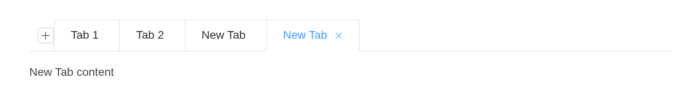

# Tabs

Divide data collections which are related yet belong to different types.

## Basic usage

Basic and concise tabs.

Tabs provide a selective card functionality. By default the first tab is
selected as active, and you can activate any tab by setting the `value`
attribute.

``` r

el_tabs("basic", selected = "first", tabs = list(
  list(name = "first", label = "User", content = "User"),
  list(name = "second", label = "Config", content = "Config"),
  list(name = "third", label = "Role", content = "Role"),
  list(name = "fourth", label = "Task", content = "Task")))
```

User

Config

Role

Task

User

Config

Role

Task

## Card Style

Tabs styled as cards.

Set `type` to `card` can get a card-styled tab.

``` r

el_tabs("card", type = "card", tabs = list(
  list(name = "first", label = "User", content = "User"),
  list(name = "second", label = "Config", content = "Config"),
  list(name = "third", label = "Role", content = "Role"),
  list(name = "fourth", label = "Task", content = "Task")))
```

User

Config

Role

Task

User

Config

Role

Task

## Border card

Border card tabs.

Set `type` to `border-card`.

``` r

el_tabs("bc", type = "border-card", tabs = list(
  list(name = "first", label = "User", content = "User"),
  list(name = "second", label = "Config", content = "Config"),
  list(name = "third", label = "Role", content = "Role"),
  list(name = "fourth", label = "Task", content = "Task")))
```

User

Config

Role

Task

User

Config

Role

Task

## Tab position

You can use `tab-position` attribute to set the tab’s position.

You can choose from four directions:
`tabPosition="left|right|top|bottom"`

``` r

el_tabs("pos", tab_position = "left", tabs = list(
  list(name = "first", label = "User", content = "User"),
  list(name = "second", label = "Config", content = "Config"),
  list(name = "third", label = "Role", content = "Role"),
  list(name = "fourth", label = "Task", content = "Task")))
```

User

Config

Role

Task

User

Config

Role

Task

## Custom Tab

You can use named slot to customize the tab label content.

A `label` may be markup.

``` r

el_tabs("cus", type = "border-card", tabs = list(
  list(name = "route", label = tagList(el_icon("Calendar"), " Route"), content = "Route"),
  list(name = "config", label = "Config", content = "Config"),
  list(name = "role", label = "Role", content = "Role"),
  list(name = "task", label = "Task", content = "Task")))
```

Route

Config

Role

Task

Route

Config

Role

Task

## Add & close tab

Only card type Tabs support addable & closeable.

`editable = TRUE` adds the close buttons and the new-tab button; the
tabs close themselves, and a new one is the server’s to make, with
[`insert_el_tab()`](https://kaipingyang.github.io/shiny.element/reference/insert_el_tab.md).

``` r

ui <- el_page(el_tabs("docs", type = "card", editable = TRUE, tabs = list(
  list(name = "1", label = "Tab 1", content = "Tab 1 content"),
  list(name = "2", label = "Tab 2", content = "Tab 2 content"))))

server <- function(input, output, session) {
  n <- 2
  observeEvent(input$docs_tab_add, {
    n <<- n + 1
    insert_el_tab(id = "docs", name = as.character(n), label = "New Tab",
                  content = "New Tab content")
  })
}

shinyApp(ui, server)
```



## Customized add button icon

``` r

el_tabs("icon", type = "card", editable = TRUE, add_icon = "CirclePlus", tabs = list(
  list(name = "1", label = "Tab 1", content = "Tab 1 content"),
  list(name = "2", label = "Tab 2", content = "Tab 2 content")))
```

Tab 1

Tab 2

Tab 1 content

Tab 2 content

## Customized trigger button of new tab

``` r

ui <- el_page(
  el_button("add", "add tab", size = "small"),
  el_tabs("docs", type = "card", closable = TRUE, tabs = list(
    list(name = "1", label = "Tab 1", content = "Tab 1 content"),
    list(name = "2", label = "Tab 2", content = "Tab 2 content"))))

server <- function(input, output, session) {
  n <- 2
  observeEvent(input$add, {
    n <<- n + 1
    insert_el_tab(id = "docs", name = as.character(n), label = "New Tab", content = "New Tab content")
  })
}

shinyApp(ui, server)
```


## Default value

`selected` opens a tab other than the first.

``` r

el_tabs("dv", selected = "third", type = "card", tabs = list(
  list(name = "first", label = "User", content = "User"),
  list(name = "second", label = "Config", content = "Config"),
  list(name = "third", label = "Role", content = "Role"),
  list(name = "fourth", label = "Task", content = "Task")))
```

User

Config

Role

Task

User

Config

Role

Task

## API

Element Plus’s tables, and beside each entry where it is in R.

### Tabs Attributes

| Element | In R | Description | Type | Accepted | Default |
|----|----|----|----|----|----|
| `model-value` | `selected`; `input$<id>` | binding value, name of the selected tab, the default value is the name of first tab | [^1] / [^2] |  | — |
| `default-value` | `selected` | The value of the tab that should be active when initially rendered. (avoid initial transition) | [^3] / [^4] |  | — |
| `type` | `type` | type of Tab | [^5]`'' \\| 'card' \\| 'border-card'` |  | ’’ |
| `closable` | `closable` | whether Tab is closable | [^6] |  | false |
| `addable` | `addable` | whether Tab is addable | [^7] |  | false |
| `editable` | `editable` | whether Tab is addable and closable | [^8] |  | false |
| `tab-position` | `tab_position` | position of tabs | [^9]`'top' \\| 'right' \\| 'bottom' \\| 'left'` |  | top |
| `stretch` | `stretch` | whether width of tab automatically fits its container | [^10] |  | false |
| `before-leave` | `before_leave` | hook function before switching tab. If `false` is returned or a `Promise` is returned and then is rejected, switching will be prevented | [^11]`(activeName: TabPaneName, oldActiveName: TabPaneName) => Awaitable<void \\| boolean>` |  | () =\> true |
| `tabindex` | `(set by the tabs)` | tabs tabindex | [^12] / [^13] |  | 0 |

### Tabs Events

| Element | In R | Description |
|----|----|----|
| `tab-click` | `input$<id>_tab_click` | triggers when a tab is clicked |
| `tab-change` | `input$<id>_tab_change` | triggers when `activeName` is changed |
| `tab-remove` | `input$<id>_tab_remove` | triggers when tab-remove button is clicked |
| `tab-add` | `input$<id>_tab_add` | triggers when tab-add button is clicked |
| `edit` | `input$<id>_edit` | triggers when tab-add button or tab-remove is clicked |

### Tabs Slots

| Element    | In R                        | Description               |
|------------|-----------------------------|---------------------------|
| `default`  | default content             | customize default content |
| `add-icon` | `slots = list(add-icon = )` | customize add button icon |
| `addIcon`  | `slots = list(addIcon = )`  | customize add button icon |

### Tab-pane Attributes

| Element | In R | Description | Type | Accepted | Default |
|----|----|----|----|----|----|
| `label` | item field `label` | title of the tab | [^14] |  | ’’ |
| `disabled` | item field `disabled` | whether Tab is disabled | [^15] |  | false |
| `closable` | `closable` | whether Tab is closable | [^16] |  | false |
| `lazy` | item field `lazy` | whether Tab is lazily rendered | [^17] |  | false |

### Tab-pane Slots

| Element   | In R                     | Description        |
|-----------|--------------------------|--------------------|
| `default` | default content          | Tab-pane’s content |
| `label`   | `slots = list(label = )` | Tab-pane’s label   |

[^1]: string

[^2]: number

[^3]: string

[^4]: number

[^5]: enum

[^6]: boolean

[^7]: boolean

[^8]: boolean

[^9]: enum

[^10]: boolean

[^11]: Function

[^12]: string

[^13]: number

[^14]: string

[^15]: boolean

[^16]: boolean

[^17]: boolean
