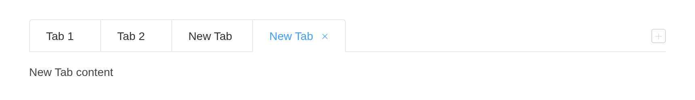
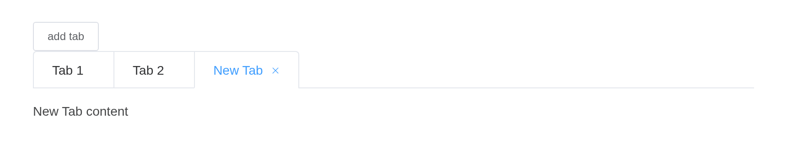

# Tabs

Divide data collections which are related yet belong to different types.
`tabs` is a list of `list(name =, label =, content =)`; the panes hold
any Shiny UI, components included. `input$<id>` is the selected tab’s
name.

## Basic usage

``` r

el_tabs("basic", selected = "first", tabs = list(
  list(name = "first", label = "User", content = "User"),
  list(name = "second", label = "Config", content = "Config"),
  list(name = "third", label = "Role", content = "Role"),
  list(name = "fourth", label = "Task", content = "Task")))
```

User

Config

Role

Task

User

Config

Role

Task

## Card style

``` r

el_tabs("card", type = "card", tabs = list(
  list(name = "first", label = "User", content = "User"),
  list(name = "second", label = "Config", content = "Config"),
  list(name = "third", label = "Role", content = "Role")))
```

User

Config

Role

User

Config

Role

## Border card

``` r

el_tabs("bc", type = "border-card", tabs = list(
  list(name = "first", label = "User", content = el_switch("on", active_text = "Live")),
  list(name = "second", label = "Config", content = "Config"),
  list(name = "third", label = "Role", content = "Role")))
```

User

Config

Role

Config

Role

## Tab position

``` r

el_tabs("pos", tab_position = "left", tabs = list(
  list(name = "first", label = "User", content = "User"),
  list(name = "second", label = "Config", content = "Config"),
  list(name = "third", label = "Role", content = "Role")))
```

User

Config

Role

User

Config

Role

## Custom tab

A `label` may be markup.

``` r

el_tabs("cus", type = "border-card", tabs = list(
  list(name = "route", label = tagList(el_icon("date"), " Route"), content = "Route"),
  list(name = "config", label = "Config", content = "Config")))
```

Route

Config

Route

Config

## Add & close tab

`editable = TRUE` adds Element’s close buttons and new-tab button; the
tabs close themselves, and a new one is the server’s to make, with
[`insert_el_tab()`](https://kaipingyang.github.io/shiny.element/reference/insert_el_tab.md).

``` r

ui <- el_page(el_tabs("docs", type = "card", editable = TRUE, tabs = list(
  list(name = "1", label = "Tab 1", content = "Tab 1 content"),
  list(name = "2", label = "Tab 2", content = "Tab 2 content"))))

server <- function(input, output, session) {
  n <- 2
  observeEvent(input$docs_tab_add, {
    n <<- n + 1
    insert_el_tab(id = "docs", name = as.character(n), label = "New Tab",
                  content = "New Tab content")
  })
}

shinyApp(ui, server)
```



## Customized trigger button of new tab

``` r

ui <- el_page(
  el_button("add", "add tab", size = "small"),
  el_tabs("docs", type = "card", closable = TRUE, tabs = list(
    list(name = "1", label = "Tab 1", content = "Tab 1 content"),
    list(name = "2", label = "Tab 2", content = "Tab 2 content"))))

server <- function(input, output, session) {
  n <- 2
  observeEvent(input$add, {
    n <<- n + 1
    insert_el_tab(id = "docs", name = as.character(n), label = "New Tab", content = "New Tab content")
  })
}

shinyApp(ui, server)
```



## API

### Tabs Attributes

| Element | In R | Description | Type | Accepted | Default |
|----|----|----|----|----|----|
| `value` | `selected` | binding value, name of the selected tab | string | — | name of first tab |
| `type` | `type` | type of Tab | string | card/border-card | — |
| `closable` | `closable` | whether Tab is closable | boolean | — | false |
| `addable` | `addable` | whether Tab is addable | boolean | — | false |
| `editable` | `editable` | whether Tab is addable and closable | boolean | — | false |
| `tab-position` | `tab_position` | position of tabs | string | top/right/bottom/left | top |
| `stretch` | `stretch` | whether width of tab automatically fits its container | boolean | \- | false |
| `before-leave` | `before_leave` | hook function before switching tab. If `false` is returned or a `Promise` is returned and then is rejected, switching will be prevented | Function(activeName, oldActiveName) | — | — |

### Tabs Events

| Element | In R | Description |
|----|----|----|
| `tab-click` | `input$<id>_tab_click` | triggers when a tab is clicked |
| `tab-remove` | `input$<id>_tab_remove` | triggers when tab-remove button is clicked |
| `tab-add` | `input$<id>_tab_add` | triggers when tab-add button is clicked |
| `edit` | `input$<id>_edit` | triggers when tab-add button or tab-remove is clicked |

### Tab-pane Attributes

| Element | In R | Description | Type | Accepted | Default |
|----|----|----|----|----|----|
| `label` | item field `label` | title of the tab | string | — | — |
| `disabled` | item field `disabled` | whether Tab is disabled | boolean | — | false |
| `name` | item field `name` | identifier corresponding to the name of Tabs, representing the alias of the tab-pane | string | — | ordinal number of the tab-pane in the sequence, e.g. the first tab-pane is ‘1’ |
| `closable` | `closable` | whether Tab is closable | boolean | — | false |
| `lazy` | item field `lazy` | whether Tab is lazily rendered | boolean | — | false |
