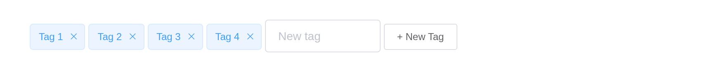

# Tag

Used for marking and selection. `input$<id>` counts clicks on the tag,
and `input$<id>_closed` fires when its close button is pressed.

## Basic usage

``` r

el_tag("t1", "Tag 1")
el_tag("t2", "Tag 2", type = "success")
el_tag("t3", "Tag 3", type = "info")
el_tag("t4", "Tag 4", type = "warning")
el_tag("t5", "Tag 5", type = "danger")
```

## Removable tag

``` r

el_tag("r1", "Closable", closable = TRUE)
el_tag("r2", "Closable", closable = TRUE, type = "success")
el_tag("r3", "Closable", closable = TRUE, type = "warning", disable_transitions = TRUE)
```

## Edit dynamically

Tags the user adds and removes: the list lives on the server and is
drawn with [`renderUI()`](https://rdrr.io/pkg/shiny/man/renderUI.html).

``` r

ui <- el_page(uiOutput("tags"), el_input("newtag", placeholder = "New tag", width = "140px"),
              el_button("add", "+ New Tag", size = "small"))

server <- function(input, output, session) {
  tags_now <- reactiveVal(character(0))
  counter <- 0
  # Each tag gets an id of its own, and one observer for its close button
  add_tag <- function(label) {
    counter <<- counter + 1
    id <- paste0("tag", counter)
    tags_now(c(isolate(tags_now()), stats::setNames(label, id)))
    observeEvent(input[[paste0(id, "_closed")]], once = TRUE,
                 tags_now(tags_now()[names(tags_now()) != id]))
  }
  for (t in c("Tag 1", "Tag 2", "Tag 3")) add_tag(t)
  output$tags <- renderUI(tagList(Map(function(id, label) el_tag(id, label, closable = TRUE),
                                      names(tags_now()), tags_now())))
  observeEvent(input$add, {
    req(nzchar(input$newtag))
    add_tag(input$newtag)
    update_el_input(id = "newtag", value = "")
  })
}

shinyApp(ui, server)
```



## Sizes

``` r

el_tag("s1", "Default", closable = TRUE)
el_tag("s2", "Medium", size = "medium", closable = TRUE)
el_tag("s3", "Small", size = "small", closable = TRUE)
el_tag("s4", "Mini", size = "mini", closable = TRUE)
```

## Theme

`effect` is `"dark"`, `"light"` (the default) or `"plain"`.

``` r

types <- c("primary", "success", "info", "warning", "danger")
tagList(lapply(c("dark", "light", "plain"), function(e) tags$div(style = "margin-bottom: 10px",
  tags$span(style = "display: inline-block; width: 50px", e),
  lapply(types, function(t) el_tag(paste0(e, t), t, type = if (t != "primary") t, effect = e)))))
```

dark

light

plain

## API

### Attributes

| Element | In R | Description | Type | Accepted | Default |
|----|----|----|----|----|----|
| `type` | `type` | component type | string | success/info/warning/danger | — |
| `closable` | `closable` | whether Tag can be removed | boolean | — | false |
| `disable-transitions` | `disable_transitions` | whether to disable animations | boolean | — | false |
| `hit` | `hit` | whether Tag has a highlighted border | boolean | — | false |
| `color` | `color` | background color of the Tag | string | — | — |
| `size` | `size` | tag size | string | medium / small / mini | — |
| `effect` | `effect` | component theme | string | dark / light / plain | light |

### Events

| Element | In R | Description |
|----|----|----|
| `click` | one of the component’s inputs – see its reference page | triggers when Tag is clicked |
| `close` | one of the component’s inputs – see its reference page | triggers when Tag is removed |
