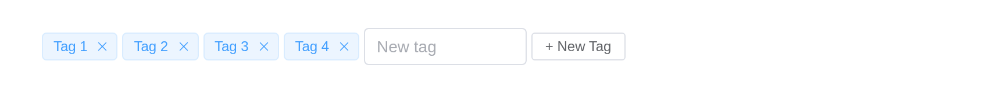

# Tag

Used for marking and selection.

## Basic usage

Use the `type` attribute to define Tag’s type. In addition, the `color`
attribute can be used to set the background color of the Tag.

``` r

types <- c("primary", "success", "info", "warning", "danger")
tagList(lapply(types, function(t) el_tag(paste0("t_", t), paste("Tag", match(t, types)), type = t)))
```

## Removable Tag

`closable` attribute can be used to define a removable tag. It accepts a
`Boolean`. By default the removal of Tag has a fading animation. If you
don’t want to use it, you can set the `disable-transitions` attribute,
which accepts a `Boolean`, to `true`. `close` event triggers when Tag is
removed.

``` r

types <- c("primary", "success", "info", "warning", "danger")
tagList(lapply(types, function(t) el_tag(paste0("r_", t), paste("Tag", match(t, types)), type = t,
                                         closable = TRUE)))
```

## Edit Dynamically

You can use the `close` event to add and remove tag dynamically.

Tags the user adds and removes: the list lives on the server and is
drawn with [`renderUI()`](https://rdrr.io/pkg/shiny/man/renderUI.html).

``` r

ui <- el_page(uiOutput("tags"), el_input("newtag", placeholder = "New tag", width = "140px"),
              el_button("add", "+ New Tag", size = "small"))

server <- function(input, output, session) {
  tags_now <- reactiveVal(character(0))
  counter <- 0
  # Each tag gets an id of its own, and one observer for its close button
  add_tag <- function(label) {
    counter <<- counter + 1
    id <- paste0("tag", counter)
    tags_now(c(isolate(tags_now()), stats::setNames(label, id)))
    observeEvent(input[[paste0(id, "_closed")]], once = TRUE,
                 tags_now(tags_now()[names(tags_now()) != id]))
  }
  for (t in c("Tag 1", "Tag 2", "Tag 3")) add_tag(t)
  output$tags <- renderUI(tagList(Map(function(id, label) el_tag(id, label, closable = TRUE),
                                      names(tags_now()), tags_now())))
  observeEvent(input$add, {
    req(nzchar(input$newtag))
    add_tag(input$newtag)
    update_el_input(id = "newtag", value = "")
  })
}

shinyApp(ui, server)
```



## Sizes

Besides default size, Tag component provides three additional sizes for
you to choose among different scenarios.

Use attribute `size` to set additional sizes with `large`, `default` or
`small`.

``` r

tagList(
  el_tag("s1", "Large", size = "large"),
  el_tag("s2", "Default"),
  el_tag("s3", "Small", size = "small"),
  tags$br(), tags$br(),
  el_tag("s4", "Large", size = "large", closable = TRUE),
  el_tag("s5", "Default", closable = TRUE),
  el_tag("s6", "Small", size = "small", closable = TRUE))
```

  
  

## Theme

Tag provide three different themes: `dark`、`light` and `plain`

Using `effect` to change, default is `light`

`effect` is `"dark"`, `"light"` (the default) or `"plain"`.

``` r

types <- c("primary", "success", "info", "warning", "danger")
tagList(lapply(c("dark", "light", "plain"), function(e) tags$div(style = "margin-bottom: 10px",
  tags$span(style = "display: inline-block; width: 50px", e),
  lapply(types, function(t) el_tag(paste0(e, t), t, type = t, effect = e)))))
```

dark

light

plain

## Rounded

Tag can also be rounded like button.

``` r

types <- c("primary", "success", "info", "warning", "danger")
tagList(lapply(c("dark", "light", "plain"), function(e) tags$div(style = "margin-bottom: 10px",
  lapply(types, function(t) el_tag(paste0("rd", e, t), t, type = t, effect = e, round = TRUE)))))
```

## Checkable Tag

Sometimes because of the business needs, we might need checkbox like
tag, but **button like checkbox** cannot meet our needs, here comes
`check-tag`. You can use `type` prop in 2.5.4.

basic check-tag usage, the API is rather simple.

A tag that toggles, like a checkbox, is
[`el_check_tag()`](https://kaipingyang.github.io/shiny.element/reference/el_check_tag.md);
it reports `input$<id>` as `TRUE` or `FALSE`.

``` r

tagList(
  el_check_tag("ct1", "Checked", value = TRUE),
  el_check_tag("ct2", "Toggle me"),
  el_check_tag("ct3", "Disabled", disabled = TRUE),
  tags$br(), tags$br(),
  lapply(c("primary", "success", "info", "warning", "danger"), function(t)
    el_check_tag(paste0("ctt", t), t, type = t, value = TRUE)))
```

  
  

## API

Element Plus’s tables, and beside each entry where it is in R.

### Tag Attributes

| Element | In R | Description | Type | Accepted | Default |
|----|----|----|----|----|----|
| `type` | `el_tag(type =)` | type of Tag | [^1]`'primary' \\| 'success' \\| 'info' \\| 'warning' \\| 'danger'` |  | primary |
| `closable` | `el_tag(closable =)` | whether Tag can be removed | [^2] |  | false |
| `disable-transitions` | `el_tag(disable_transitions =)` | whether to disable animations | [^3] |  | false |
| `hit` | `el_tag(hit =)` | whether Tag has a highlighted border | [^4] |  | false |
| `color` | `el_tag(color =)` | background color of the Tag | [^5] |  | — |
| `size` | `el_tag(size =)` | size of Tag | [^6]`'large' \\| 'default' \\| 'small'` |  | — |
| `effect` | `el_tag(effect =)` | theme of Tag | [^7]`'dark' \\| 'light' \\| 'plain'` |  | light |
| `round` | `el_tag(round =)` | whether Tag is rounded | [^8] |  | false |

### Tag Events

| Element | In R | Description |
|----|----|----|
| `click` | one of the component’s inputs – see its reference page | triggers when Tag is clicked |
| `close` | one of the component’s inputs – see its reference page | triggers when Tag is removed |

### Tag Slots

| Element   | In R            | Description               |
|-----------|-----------------|---------------------------|
| `default` | default content | customize default content |

### CheckTag Attributes

| Element | In R | Description | Type | Accepted | Default |
|----|----|----|----|----|----|
| `checked` | `value`; `input$<id>` | is checked | [^9] |  | false |
| `disabled` | `el_check_tag(disabled =)` | whether the check-tag is disabled | [^10] |  | false |
| `type` | `el_tag(type =)` | type of CheckTag | [^11]`'primary' \\| 'success' \\| 'info' \\| 'warning' \\| 'danger'` |  | primary |

### CheckTag Events

| Element  | In R                    | Description                        |
|----------|-------------------------|------------------------------------|
| `change` | `input$<id>`, the value | triggers when Check Tag is clicked |

### CheckTag Slots

| Element   | In R            | Description               |
|-----------|-----------------|---------------------------|
| `default` | default content | customize default content |

[^1]: enum

[^2]: boolean

[^3]: boolean

[^4]: boolean

[^5]: string

[^6]: enum

[^7]: enum

[^8]: boolean

[^9]: boolean

[^10]: boolean

[^11]: enum
