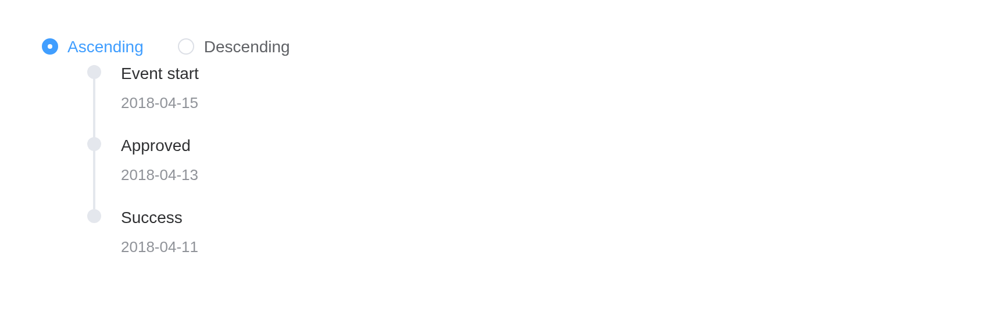

# Timeline

Visually display timeline.

## Basic usage

Timeline can be split into multiple activities. Timestamps are important
features that distinguish them from other components. Note the
difference with Steps.

``` r

el_timeline(
  "tl",
  items = list(
    el_timeline_item("Event start", timestamp = "2018-04-15"),
    el_timeline_item("Approved", timestamp = "2018-04-13"),
    el_timeline_item("Success", timestamp = "2018-04-11")
  )
)
```

## Mode

Use `mode` to control the relative position of timeline and content.

> **Tip**
>
> After 2.13.1, `el-timeline` explicitly sets padding styles. If you
> have overridden padding styles of `ul` tag in your project, please
> check to ensure the layout is correct.

`mode` puts the content after the line (`"start"`), before it (`"end"`),
or on alternate sides.

``` r

tagList(lapply(
  c("start", "alternate", "alternate-reverse", "end"),
  function(m) {
    tags$div(
      style = "margin-bottom: 20px",
      tags$b(m),
      el_timeline(
        paste0("tl_", gsub("-", "_", m)),
        mode = m,
        items = list(
          el_timeline_item("Event start", timestamp = "2018-04-15"),
          el_timeline_item("Approved", timestamp = "2018-04-13"),
          el_timeline_item("Success", timestamp = "2018-04-11")
        )
      )
    )
  }
))
```

**start**

**alternate**

**alternate-reverse**

**end**

## Custom node

Size, color, and icons can be customized in node.

``` r

el_timeline(
  "nodes",
  items = list(
    el_timeline_item(
      "Custom icon",
      timestamp = "2018-04-12 20:46",
      size = "large",
      type = "primary",
      icon = "MoreFilled"
    ),
    el_timeline_item(
      "Custom color",
      timestamp = "2018-04-03 20:46",
      color = "#0bbd87"
    ),
    el_timeline_item(
      "Custom size",
      timestamp = "2018-04-03 20:46",
      size = "large"
    ),
    el_timeline_item(
      "Custom hollow",
      timestamp = "2018-04-03 20:46",
      type = "primary",
      hollow = TRUE
    ),
    el_timeline_item("Default node", timestamp = "2018-04-03 20:46")
  )
)
```

## Custom timestamp

Timestamp can be placed on top of content when content is too high.

``` r

el_timeline(
  "stamps",
  items = list(
    el_timeline_item(
      el_card(
        tags$h4("Update Github template"),
        tags$p("Tom committed 2018/4/12 20:46")
      ),
      timestamp = "2018/4/12",
      placement = "top"
    ),
    el_timeline_item(
      el_card(
        tags$h4("Update Github template"),
        tags$p("Tom committed 2018/4/3 20:46")
      ),
      timestamp = "2018/4/3",
      placement = "top"
    ),
    el_timeline_item(
      el_card(
        tags$h4("Update Github template"),
        tags$p("Tom committed 2018/4/2 20:46")
      ),
      timestamp = "2018/4/2",
      placement = "top"
    )
  )
)
```

## Vertically centered

Timeline-Item is centered vertically.

``` r

el_timeline(
  "centred",
  items = list(
    el_timeline_item(
      el_card(
        tags$h4("Update Github template"),
        tags$p("Tom committed 2018/4/12 20:46")
      ),
      timestamp = "2018/4/12",
      placement = "top",
      center = TRUE
    ),
    el_timeline_item(
      el_card(
        tags$h4("Update Github template"),
        tags$p("Tom committed 2018/4/3 20:46")
      ),
      timestamp = "2018/4/3",
      placement = "top"
    ),
    el_timeline_item(
      "Event start",
      timestamp = "2018/4/2",
      placement = "top",
      center = TRUE
    ),
    el_timeline_item("Event end", timestamp = "2018/4/2", placement = "top")
  )
)
```

## Reverse

Use the reverse property to control the order of the nodes.

`reverse` shows the entries newest first;
[`update_el_timeline()`](https://kaipingyang.github.io/shiny.element/reference/el_timeline.md)
flips it.

``` r

ui <- el_page(
  el_radio_group(
    "order",
    choices = c(Ascending = "asc", Descending = "desc"),
    value = "asc"
  ),
  el_timeline(
    "tl",
    items = list(
      el_timeline_item("Event start", timestamp = "2018-04-15"),
      el_timeline_item("Approved", timestamp = "2018-04-13"),
      el_timeline_item("Success", timestamp = "2018-04-11")
    )
  )
)

server <- function(input, output, session) {
  observeEvent(
    input$order,
    update_el_timeline(id = "tl", reverse = input$order == "desc")
  )
}

shinyApp(ui, server)
```



## API

Element Plus’s tables, and beside each entry where it is in R.

### Timeline Attributes

| Element | In R | Description | Type | Accepted | Default |
|----|----|----|----|----|----|
| `reverse` | `reverse` | whether reverse order | [^1] |  | false |
| `mode` | `mode` | relative position of timeline and content | [^2]`'start' \\| 'alternate' \\| 'alternate-reverse' \\| 'end'` |  | start |

### Timeline Slots

| Element   | In R            | Description                            |
|-----------|-----------------|----------------------------------------|
| `default` | default content | customize default content for timeline |

### Timeline-Item Attributes

| Element | In R | Description | Type | Accepted | Default |
|----|----|----|----|----|----|
| `timestamp` | `el_timeline_item(timestamp =)` | timestamp content | [^3] |  | ’’ |
| `hide-timestamp` | `el_timeline_item(hide_timestamp =)` | whether to show timestamp | [^4] |  | false |
| `center` | `el_timeline_item(center =)` | whether vertically centered | [^5] |  | false |
| `placement` | `el_timeline_item(placement =)` | position of timestamp | [^6]`'top' \\| 'bottom'` |  | bottom |
| `type` | `el_timeline_item(type =)` | node type | [^7]`'primary' \\| 'success' \\| 'warning' \\| 'danger' \\| 'info'` |  | ’’ |
| `color` | `el_timeline_item(color =)` | background color of node | [^8] |  | ’’ |
| `size` | `el_timeline_item(size =)` | node size | [^9]`'normal' \\| 'large'` |  | normal |
| `icon` | `el_timeline_item(icon =)` | icon component | [^10] / [^11] |  | — |
| `hollow` | `el_timeline_item(hollow =)` | icon is hollow | [^12] |  | false |

### Timeline-Item Slots

| Element | In R | Description |
|----|----|----|
| `default` | default content | customize default content for timeline item |
| `dot` | `slots = list(dot = )` | customize defined node for timeline item |

[^1]: boolean

[^2]: enum

[^3]: string

[^4]: boolean

[^5]: boolean

[^6]: enum

[^7]: enum

[^8]: string

[^9]: enum

[^10]: string

[^11]: Component

[^12]: boolean
