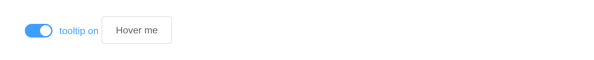

# Tooltip

Display prompt information on hover. The trigger can be plain markup or
a component – folded into the tooltip’s own Vue instance, so it keeps
reporting its inputs.

## Basic usage

`placement` takes twelve positions.

``` r

places <- c("top-start", "top", "top-end", "left-start", "left", "left-end",
            "right-start", "right", "right-end", "bottom-start", "bottom", "bottom-end")
tags$div(style = "padding: 40px 80px", lapply(places, function(p)
  el_tooltip(paste0("tip_", gsub("-", "_", p)), el$button(p), placement = p,
             content = paste(p, "prompts info"), effect = "dark")))
```

## Theme

``` r

el_tooltip("dark", el$button("Dark"), content = "Top center", placement = "top")
el_tooltip("light", el$button("Light"), content = "Bottom center", placement = "bottom", effect = "light")
```

## More content

The `content` slot takes markup.

``` r

el_tooltip("multi", el$button("Top center"), placement = "top",
           slots = list(content = tags$div("multiple lines", tags$br(), "second line")))
```

## Advanced usage

`disabled` turns it off – here from a switch, through
[`update_el_tooltip()`](https://kaipingyang.github.io/shiny.element/reference/update_el_tooltip.md);
`manual` hands showing and hiding to `update_el_tooltip(value =)`.

``` r

ui <- el_page(
  el_switch("tip_on", value = TRUE, active_text = "tooltip on"),
  el_tooltip("adv", el$button("Hover me"), content = "click the switch to turn me off",
             placement = "bottom"))

server <- function(input, output, session) {
  observeEvent(input$tip_on, update_el_tooltip(id = "adv", disabled = !input$tip_on))
}

shinyApp(ui, server)
```



## API

### Attributes

| Element | In R | Description | Type | Accepted | Default |
|----|----|----|----|----|----|
| `effect` | `effect` | Tooltip theme | string | dark/light | dark |
| `content` | `content` | display content, can be overridden by `slot#content` | String | — | — |
| `placement` | `placement` | position of Tooltip | string | top/top-start/top-end/bottom/bottom-start/bottom-end/left/left-start/left-end/right/right-start/right-end | bottom |
| `value` | `update_el_tooltip(value =)` | visibility of Tooltip | boolean | — | false |
| `disabled` | `disabled` | whether Tooltip is disabled | boolean | — | false |
| `offset` | `offset` | offset of the Tooltip | number | — | 0 |
| `transition` | `transition` | animation name | string | — | el-fade-in-linear |
| `visible-arrow` | `visible_arrow` | whether an arrow is displayed. For more information, check [Vue-popper](https://github.com/element-component/vue-popper) page | boolean | — | true |
| `popper-options` | `popper_options` | [popper.js](https://popper.js.org/docs/v2/) parameters | Object | refer to [popper.js](https://popper.js.org/docs/v2/) doc | `{ boundariesElement: 'body', gpuAcceleration: false }` |
| `open-delay` | `open_delay` | delay of appearance, in millisecond | number | — | 0 |
| `manual` | `manual` | whether to control Tooltip manually. `mouseenter` and `mouseleave` won’t have effects if set to `true` | boolean | — | false |
| `popper-class` | `popper_class` | custom class name for Tooltip’s popper | string | — | — |
| `enterable` | `enterable` | whether the mouse can enter the tooltip | Boolean | — | true |
| `hide-after` | `hide_after` | timeout in milliseconds to hide tooltip | number | — | 0 |
| `tabindex` | `tabindex` | [tabindex](https://developer.mozilla.org/en-US/docs/Web/HTML/Global_attributes/tabindex) of Tooltip | number | — | 0 |
