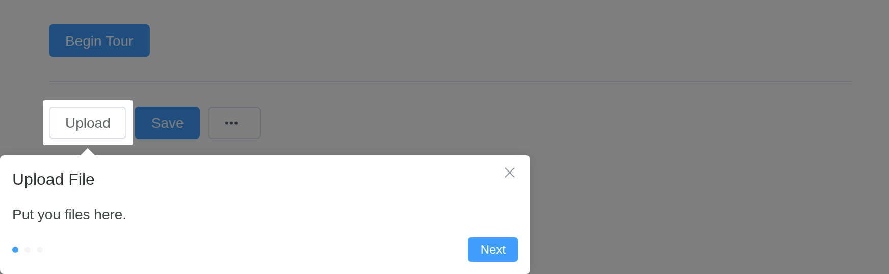
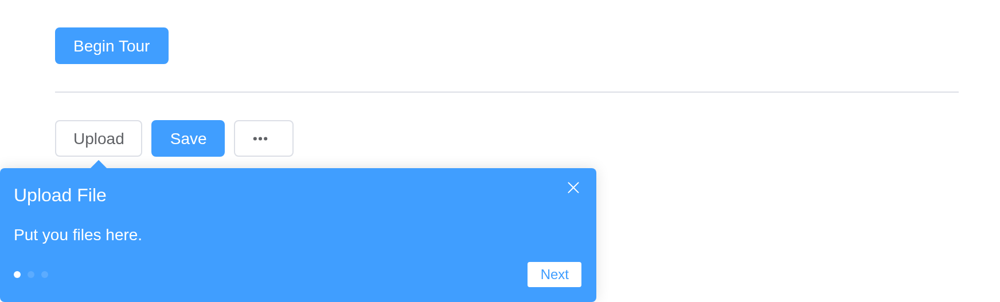
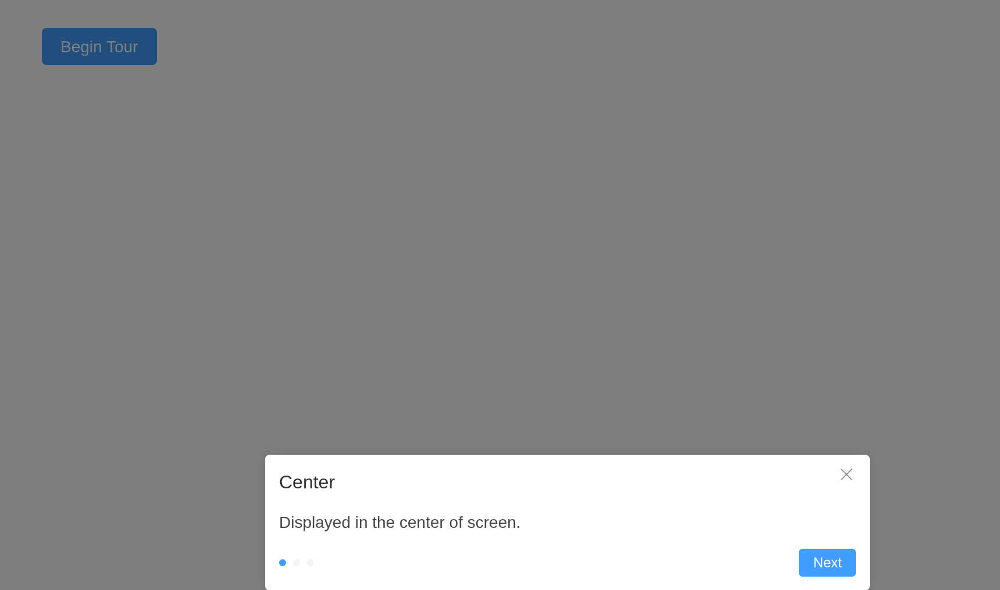
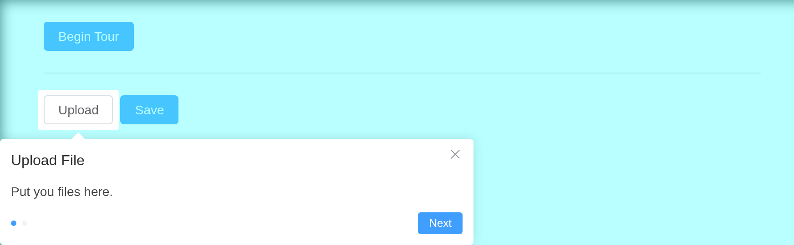
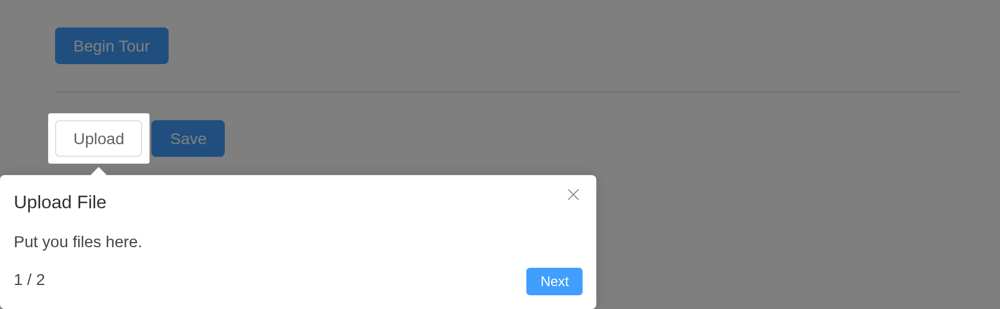
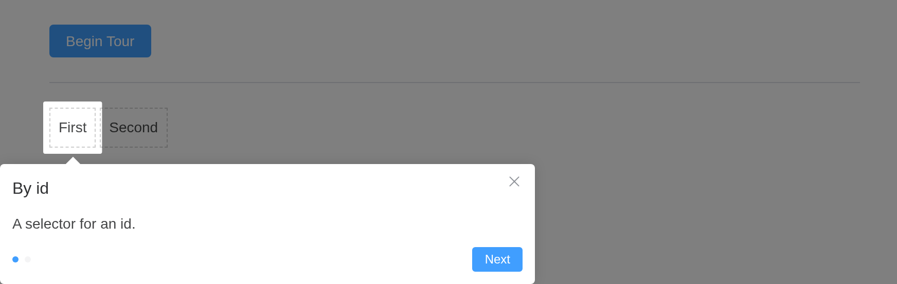

# Tour

A popup component for guiding users through a product. Use when you want
to guide users through a product.

## Basic usage

The most basic usage

A step’s `target` is a CSS selector; the server opens the tour with
[`update_el_tour()`](https://kaipingyang.github.io/shiny.element/reference/update_el_tour.md).

``` r

ui <- el_page(
  el_button("begin", "Begin Tour", type = "primary"),
  el_divider(),
  el_space(
    tags$span(id = "t_up", el_button("up", "Upload")),
    tags$span(id = "t_save", el_button("save", "Save", type = "primary")),
    tags$span(id = "t_more", el_button("more", "", icon = "MoreFilled"))
  ),
  el_tour(
    "tour",
    steps = list(
      el_tour_step("#t_up", "Upload File", "Put you files here."),
      el_tour_step("#t_save", "Save", "Save your changes"),
      el_tour_step("#t_more", "Other Actions", "Click to see other")
    )
  )
)

server <- function(input, output, session) {
  observeEvent(
    input$begin,
    update_el_tour(id = "tour", open = TRUE, current = 0)
  )
}

shinyApp(ui, server)
```



## Non modal

Use `:mask="false"` to make Tour non-modal. At the meantime it is
recommended to use with `type="primary"` to emphasize the guide itself.

`mask = FALSE` leaves the page undimmed; `type = "primary"` colours the
card.

``` r

ui <- el_page(
  el_button("begin", "Begin Tour", type = "primary"),
  el_divider(),
  el_space(
    tags$span(id = "t_up", el_button("up", "Upload")),
    tags$span(id = "t_save", el_button("save", "Save", type = "primary")),
    tags$span(id = "t_more", el_button("more", "", icon = "MoreFilled"))
  ),
  el_tour(
    "tour",
    type = "primary",
    mask = FALSE,
    steps = list(
      el_tour_step("#t_up", "Upload File", "Put you files here."),
      el_tour_step("#t_save", "Save", "Save your changes"),
      el_tour_step("#t_more", "Other Actions", "Click to see other")
    )
  )
)

server <- function(input, output, session) {
  observeEvent(
    input$begin,
    update_el_tour(id = "tour", open = TRUE, current = 0)
  )
}

shinyApp(ui, server)
```



## Placement

Change the placement of the guide relative to the target, there are 12
placements available. When `target` is empty the guide will show in the
center.

``` r

ui <- el_page(
  tags$span(id = "t_btn", el_button("begin", "Begin Tour", type = "primary")),
  el_tour(
    "tour",
    steps = list(
      el_tour_step(
        title = "Center",
        description = "Displayed in the center of screen."
      ),
      el_tour_step(
        "#t_btn",
        "Right",
        "On the right of target.",
        placement = "right"
      ),
      el_tour_step("#t_btn", "Top", "On the top of target.", placement = "top")
    )
  )
)

server <- function(input, output, session) {
  observeEvent(
    input$begin,
    update_el_tour(id = "tour", open = TRUE, current = 0)
  )
}

shinyApp(ui, server)
```



## Custom mask style

Custom mask style.

`mask` takes Element Plus’s object: its `style` and `color`.

``` r

ui <- el_page(
  el_button("begin", "Begin Tour", type = "primary"),
  el_divider(),
  el_space(
    tags$span(id = "t_up", el_button("up", "Upload")),
    tags$span(id = "t_save", el_button("save", "Save", type = "primary"))
  ),
  el_tour(
    "tour",
    mask = list(
      style = list(boxShadow = "inset 0 0 15px #333"),
      color = "rgba(80, 255, 255, .4)"
    ),
    steps = list(
      el_tour_step("#t_up", "Upload File", "Put you files here."),
      el_tour_step(
        "#t_save",
        "Save",
        "Save your changes",
        mask = list(
          style = list(boxShadow = "inset 0 0 15px #fff"),
          color = "rgba(40, 0, 255, .4)"
        )
      )
    )
  )
)

server <- function(input, output, session) {
  observeEvent(
    input$begin,
    update_el_tour(id = "tour", open = TRUE, current = 0)
  )
}

shinyApp(ui, server)
```



## Custom indicator

Custom indicator.

The `indicators` slot draws the step counter; its scope is `current` and
`total`.

``` r

ui <- el_page(
  el_button("begin", "Begin Tour", type = "primary"),
  el_divider(),
  el_space(
    tags$span(id = "t_up", el_button("up", "Upload")),
    tags$span(id = "t_save", el_button("save", "Save", type = "primary"))
  ),
  el_tour(
    "tour",
    steps = list(
      el_tour_step("#t_up", "Upload File", "Put you files here."),
      el_tour_step("#t_save", "Save", "Save your changes")
    ),
    slots = list(
      indicators = template(
        tags$span("{{ current + 1 }} / {{ total }}"),
        slot = "indicators",
        scope = "{ current, total }"
      )
    )
  )
)

server <- function(input, output, session) {
  observeEvent(
    input$begin,
    update_el_tour(id = "tour", open = TRUE, current = 0)
  )
}

shinyApp(ui, server)
```



## Target

Various parameter passing types of target. The string and Function types
are supported since 2.5.2.

A target may be any selector, and need not exist until the step is
shown.

``` r

ui <- el_page(
  el_button("begin", "Begin Tour", type = "primary"),
  el_divider(),
  tags$div(
    id = "first",
    style = "display: inline-block; padding: 8px; border: 1px dashed #ccc",
    "First"
  ),
  tags$div(
    class = "second",
    style = "display: inline-block; padding: 8px; border: 1px dashed #ccc",
    "Second"
  ),
  el_tour(
    "tour",
    steps = list(
      el_tour_step("#first", "By id", "A selector for an id."),
      el_tour_step(".second", "By class", "A selector for a class.")
    )
  )
)

server <- function(input, output, session) {
  observeEvent(
    input$begin,
    update_el_tour(id = "tour", open = TRUE, current = 0)
  )
}

shinyApp(ui, server)
```



## API

Element Plus’s tables, and beside each entry where it is in R.

### Tour Attributes

| Element | In R | Description | Type | Accepted | Default |
|----|----|----|----|----|----|
| `append-to` | `append_to` | which element the TourContent appends to | [^1] / [^2] |  | `body` |
| `show-arrow` | `show_arrow` | whether to show the arrow | `boolean` |  | true |
| `placement` | `placement` | position of the guide card relative to the target element | [^3]`'top' \\| 'top-start' \\| 'top-end' \\| 'bottom' \\| 'bottom-start' \\| 'bottom-end' \\| 'left' \\| 'left-start' \\| 'left-end' \\| 'right' \\| 'right-start' \\| 'right-end'` |  | `bottom` |
| `content-style` | `content_style` | custom style for content | `CSSProperties` |  | — |
| `mask` | `mask` | whether to enable masking, change mask style and fill color by pass custom props | `boolean` \\ | [^4]`{ style?: CSSProperties; color?: string; }` |  |
| `gap` | `gap` | transparent gap between mask and target | `TourGap` |  | [^5]`{ offset: 6, radius: 2}` |
| `type` | `type` | type, affects the background color and text color | `default` \\ | `primary` |  |
| `model-value` | `open`; `input$<id>` | open tour | `boolean` |  | `false` |
| `current` | `current` | what is the current step | `number` |  | `0` |
| `scroll-into-view-options` | `scroll_into_view_options` | support pass custom scrollIntoView options | `boolean` \\ | `ScrollIntoViewOptions` |  |
| `z-index` | `z_index` | Tour’s zIndex | `number` |  | `2001` |
| `show-close` | `show_close` | whether to show a close button | `boolean` |  | `true` |
| `close-icon` | `close_icon` | custom close icon, default is Close | `string` \\ | `Component` |  |
| `close-on-press-escape` | `close_on_press_escape` | whether the Dialog can be closed by pressing ESC | `boolean` |  | `true` |
| `target-area-clickable` | `target_area_clickable` | whether the target element can be clickable, when using mask | `boolean` |  | `true` |

### Tour slots

| Element      | In R                          | Description             |
|--------------|-------------------------------|-------------------------|
| `default`    | default content               | tourStep component list |
| `indicators` | `slots = list(indicators = )` | custom indicator        |

### Tour events

| Element | In R | Description |
|----|----|----|
| `close` | one of the component’s inputs – see its reference page | callback function on shutdown |
| `finish` | `input$<id>_finish` | callback function on finished |
| `change` | `input$<id>_change` | callback when the step changes |

### TourStep Attributes

| Element | In R | Description | Type | Accepted | Default |
|----|----|----|----|----|----|
| `target` | `el_tour_step(target =)` | get the element the guide card points to. Empty makes it show in center of screen. the string and Function types are supported since ^(2.5.2). the string type is selectors of document.querySelector. | `HTMLElement` \\ | `string` \\ | [^6]`() => HTMLElement` |
| `show-arrow` | `el_tour_step(show_arrow =)` | whether to show the arrow | `boolean` |  | — |
| `title` | `el_tour_step(title =)` | title | `string` |  | — |
| `description` | `el_tour_step(description =)` | description | `string` |  | — |
| `placement` | `el_tour_step(placement =)` | position of the guide card relative to the target element | [^7]`'top' \\| 'top-start' \\| 'top-end' \\| 'bottom' \\| 'bottom-start' \\| 'bottom-end' \\| 'left' \\| 'left-start' \\| 'left-end' \\| 'right' \\| 'right-start' \\| 'right-end'` |  | `bottom` |
| `content-style` | `el_tour_step(content_style =)` | custom style for content | `CSSProperties` |  | — |
| `mask` | `el_tour_step(mask =)` | whether to enable masking, change mask style and fill color by pass custom props | `boolean` \\ | [^8]`{ style?: CSSProperties; color?: string; }` |  |
| `type` | `el_tour_step(type =)` | type, affects the background color and text color | `default` \\ | `primary` |  |
| `next-button-props` | `el_tour_step(next_button_props =)` | properties of the Next button | [^9]`{ children: VueNode \\| string; onClick: Function }` |  | — |
| `prev-button-props` | `el_tour_step(prev_button_props =)` | properties of the previous button | [^10]`{ children: VueNode \\| string; onClick: Function }` |  | — |
| `scroll-into-view-options` | `el_tour_step(scroll_into_view_options =)` | support pass custom scrollIntoView options, the default follows the `scrollIntoViewOptions` property of Tour | `boolean` \\ | `ScrollIntoViewOptions` |  |
| `show-close` | `el_tour_step(show_close =)` | whether to show a close button | `boolean` |  | — |
| `close-icon` | `el_tour_step(close_icon =)` | custom close icon, default is Close | `string` \\ | `Component` |  |

### TourStep slots

| Element   | In R                      | Description           |
|-----------|---------------------------|-----------------------|
| `default` | default content           | custom description    |
| `header`  | `slots = list(header = )` | custom header content |

### TourStep events

| Element | In R | Description |
|----|----|----|
| `close` | one of the component’s inputs – see its reference page | callback function on shutdown |

[^1]: CSSSelector

[^2]: HTMLElement

[^3]: enum

[^4]: Object

[^5]: Object

[^6]: Function

[^7]: enum

[^8]: Object

[^9]: Object

[^10]: Object
