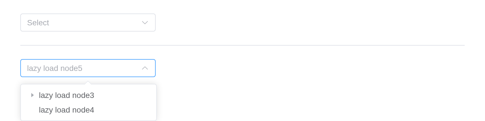

# TreeSelect

The tree selector of the dropdown menu, it combines the functions of
components `el-tree` and `el-select`.

## Basic usage

Selector for tree structures.

Nodes are `list(value =, label =, children =)`; `input$<id>` is the
value picked.

``` r

n <- function(value, label, ...) {
  list(value = value, label = label, children = list(...))
}
nodes <- list(
  n(
    "1",
    "Level one 1",
    n("1-1", "Level two 1-1", n("1-1-1", "Level three 1-1-1"))
  ),
  n(
    "2",
    "Level one 2",
    n("2-1", "Level two 2-1", n("2-1-1", "Level three 2-1-1")),
    n("2-2", "Level two 2-2", n("2-2-1", "Level three 2-2-1"))
  ),
  n(
    "3",
    "Level one 3",
    n("3-1", "Level two 3-1", n("3-1-1", "Level three 3-1-1")),
    n("3-2", "Level two 3-2", n("3-2-1", "Level three 3-2-1"))
  )
)
tagList(
  el_tree_select(
    "ts_basic",
    data = nodes,
    render_after_expand = FALSE,
    width = "240px"
  ),
  el_divider(),
  "show checkbox:",
  el_tree_select(
    "ts_basic_check",
    data = nodes,
    render_after_expand = FALSE,
    show_checkbox = TRUE,
    width = "240px"
  )
)
```

show checkbox:

## Select any level

When using the `check-strictly=true` attribute, any node can be checked,
otherwise only leaf nodes are supported.

> **Tip**
>
> When using `show-checkbox`, since `check-on-click-node` is false by
> default, it can only be selected by checking, you can set it to true,
> and then click the node to select.

`check_strictly` lets any level be picked, not only the leaves.

``` r

n <- function(value, label, ...) {
  list(value = value, label = label, children = list(...))
}
nodes <- list(
  n(
    "1",
    "Level one 1",
    n("1-1", "Level two 1-1", n("1-1-1", "Level three 1-1-1"))
  ),
  n(
    "2",
    "Level one 2",
    n("2-1", "Level two 2-1", n("2-1-1", "Level three 2-1-1")),
    n("2-2", "Level two 2-2", n("2-2-1", "Level three 2-2-1"))
  ),
  n(
    "3",
    "Level one 3",
    n("3-1", "Level two 3-1", n("3-1-1", "Level three 3-1-1")),
    n("3-2", "Level two 3-2", n("3-2-1", "Level three 3-2-1"))
  )
)
tagList(
  el_tree_select(
    "ts_strict",
    data = nodes,
    check_strictly = TRUE,
    render_after_expand = FALSE,
    width = "240px"
  ),
  el_divider(),
  "show checkbox:",
  el_tree_select(
    "ts_strict_check",
    data = nodes,
    check_strictly = TRUE,
    render_after_expand = FALSE,
    show_checkbox = TRUE,
    width = "240px"
  ),
  el_divider(),
  "show checkbox with `check-on-click-node`:",
  el_tree_select(
    "ts_strict_click",
    data = nodes,
    check_strictly = TRUE,
    render_after_expand = FALSE,
    show_checkbox = TRUE,
    check_on_click_node = TRUE,
    width = "240px"
  )
)
```

show checkbox:

show checkbox with \`check-on-click-node\`:

> **Warning**
>
> When using show-checkbox, since `check-on-click-leaf` is true by
> default, last tree children’s can be checked by clicking their nodes.

## Multiple Selection

Multiple selection using clicks or checkbox.

``` r

n <- function(value, label, ...) {
  list(value = value, label = label, children = list(...))
}
nodes <- list(
  n(
    "1",
    "Level one 1",
    n("1-1", "Level two 1-1", n("1-1-1", "Level three 1-1-1"))
  ),
  n(
    "2",
    "Level one 2",
    n("2-1", "Level two 2-1", n("2-1-1", "Level three 2-1-1")),
    n("2-2", "Level two 2-2", n("2-2-1", "Level three 2-2-1"))
  ),
  n(
    "3",
    "Level one 3",
    n("3-1", "Level two 3-1", n("3-1-1", "Level three 3-1-1")),
    n("3-2", "Level two 3-2", n("3-2-1", "Level three 3-2-1"))
  )
)
tagList(
  el_tree_select(
    "ts_multi",
    data = nodes,
    multiple = TRUE,
    render_after_expand = FALSE,
    width = "240px"
  ),
  el_divider(),
  "show checkbox:",
  el_tree_select(
    "ts_multi_check",
    data = nodes,
    multiple = TRUE,
    render_after_expand = FALSE,
    show_checkbox = TRUE,
    width = "240px"
  ),
  el_divider(),
  "show checkbox with `check-strictly`:",
  el_tree_select(
    "ts_multi_strict",
    data = nodes,
    multiple = TRUE,
    render_after_expand = FALSE,
    show_checkbox = TRUE,
    check_strictly = TRUE,
    check_on_click_node = TRUE,
    width = "240px"
  )
)
```

show checkbox:

show checkbox with \`check-strictly\`:

## Disabled Selection

Disable options using the disabled field.

A node with `disabled = TRUE` cannot be picked.

``` r

n <- function(value, label, ...) {
  list(value = value, label = label, children = list(...))
}
nodes <- list(
  n(
    "1",
    "Level one 1",
    n("1-1", "Level two 1-1", n("1-1-1", "Level three 1-1-1"))
  ),
  n(
    "2",
    "Level one 2",
    n("2-1", "Level two 2-1", n("2-1-1", "Level three 2-1-1")),
    n("2-2", "Level two 2-2", n("2-2-1", "Level three 2-2-1"))
  ),
  n(
    "3",
    "Level one 3",
    n("3-1", "Level two 3-1", n("3-1-1", "Level three 3-1-1")),
    n("3-2", "Level two 3-2", n("3-2-1", "Level three 3-2-1"))
  )
)
nodes[[1]]$disabled <- TRUE
nodes[[1]]$children[[1]]$disabled <- TRUE
nodes[[1]]$children[[1]]$children[[1]]$disabled <- TRUE
el_tree_select("ts_disabled", data = nodes, width = "240px")
```

## Filterable

Use keyword filtering or custom filtering methods. `filterMethod` can
custom filter method for data, `filterNodeMethod` can custom filter
method for data node.

The second filters on the server: its `filter_method` reports the query,
and the server sends back the nodes that match. The third decides node
by node in the browser, with `filter_node_method`.

``` r

n <- function(value, label, ...) {
  list(value = value, label = label, children = list(...))
}
nodes <- list(
  n(
    "1",
    "Level one 1",
    n("1-1", "Level two 1-1", n("1-1-1", "Level three 1-1-1"))
  ),
  n(
    "2",
    "Level one 2",
    n("2-1", "Level two 2-1", n("2-1-1", "Level three 2-1-1")),
    n("2-2", "Level two 2-2", n("2-2-1", "Level three 2-2-1"))
  ),
  n(
    "3",
    "Level one 3",
    n("3-1", "Level two 3-1", n("3-1-1", "Level three 3-1-1")),
    n("3-2", "Level two 3-2", n("3-2-1", "Level three 3-2-1"))
  )
)
ui <- el_page(
  el_tree_select("ts_filter", data = nodes, filterable = TRUE, width = "240px"),
  el_divider(),
  "filter method:",
  el_tree_select(
    "ts_filter_server",
    data = nodes,
    filterable = TRUE,
    filter_method = JS(
      "function(value) { Shiny.setInputValue('ts_filter_query', value, {priority: 'event'}); }"
    ),
    width = "240px"
  ),
  el_divider(),
  "filter node method:",
  el_tree_select(
    "ts_filter_node",
    data = nodes,
    filterable = TRUE,
    filter_node_method = JS(
      "function(value, data) { return data.label.includes(value); }"
    ),
    width = "240px"
  )
)
server <- function(input, output, session) {
  observeEvent(input$ts_filter_query, {
    q <- input$ts_filter_query
    keep <- Filter(function(x) grepl(q, x$label, fixed = TRUE), nodes)
    update_el_tree_select(session, "ts_filter_server", data = keep)
  })
}
shinyApp(ui, server)
```


## Custom content

Contents of custom tree nodes.

The default slot, scoped with `data`, draws each node; the second select
draws them with `render_content`.

``` r

n <- function(value, label, ...) {
  list(value = value, label = label, children = list(...))
}
nodes <- list(
  n(
    "1",
    "Level one 1",
    n("1-1", "Level two 1-1", n("1-1-1", "Level three 1-1-1"))
  ),
  n(
    "2",
    "Level one 2",
    n("2-1", "Level two 2-1", n("2-1-1", "Level three 2-1-1")),
    n("2-2", "Level two 2-2", n("2-2-1", "Level three 2-2-1"))
  ),
  n(
    "3",
    "Level one 3",
    n("3-1", "Level two 3-1", n("3-1-1", "Level three 3-1-1")),
    n("3-2", "Level two 3-2", n("3-2-1", "Level three 3-2-1"))
  )
)
tagList(
  el_tree_select(
    "ts_slot",
    data = nodes,
    width = "240px",
    slots = list(
      default = template(
        scope = "{ data: { label } }",
        htmltools::HTML(
          "{{ label }}<span style=\"color: gray\">(suffix)</span>"
        )
      )
    )
  ),
  el_divider(),
  "use render content:",
  el_tree_select(
    "ts_render",
    data = nodes,
    width = "240px",
    render_content = JS(
      "function(h, ctx) { return h('span', { style: { color: '#626AEF' } }, ctx.data.label); }"
    )
  )
)
```

use render content:

## LazyLoad

Lazy loading of tree nodes, suitable for large data lists.

`lazy = TRUE` loads a node’s children when it opens, from the server:
`input$<id>_load` asks and
[`el_load_children()`](https://kaipingyang.github.io/shiny.element/reference/el_load_children.md)
answers. `cache_data` gives the label of a value whose node is not
loaded yet.

``` r

ui <- el_page(
  el_tree_select(
    "lazy1",
    lazy = TRUE,
    props = list(label = "label", children = "children", isLeaf = "isLeaf"),
    width = "240px"
  ),
  el_divider(),
  el_tree_select(
    "lazy2",
    value = 5,
    lazy = TRUE,
    props = list(label = "label", children = "children", isLeaf = "isLeaf"),
    cache_data = list(list(value = 5, label = "lazy load node5")),
    width = "240px"
  )
)

server <- function(input, output, session) {
  id <- 0
  load <- function(q, tree) {
    if (isTRUE(q$data$isLeaf)) {
      return(el_load_children(id = tree, request = q))
    }
    id <<- id + 2
    el_load_children(
      id = tree,
      request = q,
      children = list(
        list(value = id - 1, label = paste0("lazy load node", id - 1)),
        list(value = id, label = paste0("lazy load node", id), isLeaf = TRUE)
      )
    )
  }
  observeEvent(input$lazy1_load, load(input$lazy1_load, "lazy1"))
  observeEvent(input$lazy2_load, load(input$lazy2_load, "lazy2"))
}

shinyApp(ui, server)
```



## Use node-key attribute

By default the `modelValue` is looking for the `value` key. For a
different data structure `node-key` must be provided to work normally.

> **Tip**
>
> 1.  `node-key` should be unique across the whole tree.
> 2.  `value-key` have the same objective as `node-key`.
> 3.  Contrary to the select component, the tree-select can’t retrieve
>     an object value.

With `node_key`, the value names a node by its key.

``` r

el_tree_select(
  "ts_key",
  data = list(
    list(
      id = 1,
      label = "Level one 1",
      children = list(
        list(id = 2, label = "Level two 1-1"),
        list(id = 3, label = "Level two 1-2")
      )
    )
  ),
  node_key = "id",
  value = 2,
  show_checkbox = TRUE,
  multiple = TRUE,
  default_expand_all = TRUE,
  width = "240px"
)
```

## API

Element Plus’s tables, and beside each entry where it is in R.

### Attributes

| Element | In R | Description | Type | Accepted | Default |
|----|----|----|----|----|----|
| `tree, select` | any argument of [`el_tree()`](https://kaipingyang.github.io/shiny.element/reference/el_tree.md) or [`el_select()`](https://kaipingyang.github.io/shiny.element/reference/el_select.md), through `...` | The props of el-tree and el-select. |  |  |  |
| `tree` |  | [tree](https://kaipingyang.github.io/shiny.element/articles/components/tree.html#exposes) | [tree](https://kaipingyang.github.io/shiny.element/articles/components/tree.html#events) |  | [tree](https://kaipingyang.github.io/shiny.element/articles/components/tree.html#slots) |
| `select` |  | [select](https://kaipingyang.github.io/shiny.element/articles/components/select.html#select-exposes) | [select](https://kaipingyang.github.io/shiny.element/articles/components/select.html#select-events) |  | [select](https://kaipingyang.github.io/shiny.element/articles/components/select.html#select-slots) |

### Own Attributes

| Element | In R | Description | Type | Accepted | Default |
|----|----|----|----|----|----|
| `cache-data` | `cache_data` | The cached data of the lazy node, the structure is the same as the data, used to get the label of the unloaded data | [^1]`CacheOption[]` |  | \[\] |

### Exposes

| Element | In R | Description |
|----|----|----|
| `focus` | `call_el(session, id, "focus")` | focus the Input component |
| `blur` | `call_el(session, id, "blur")` | blur the Input component, and hide the dropdown |

[^1]: array
