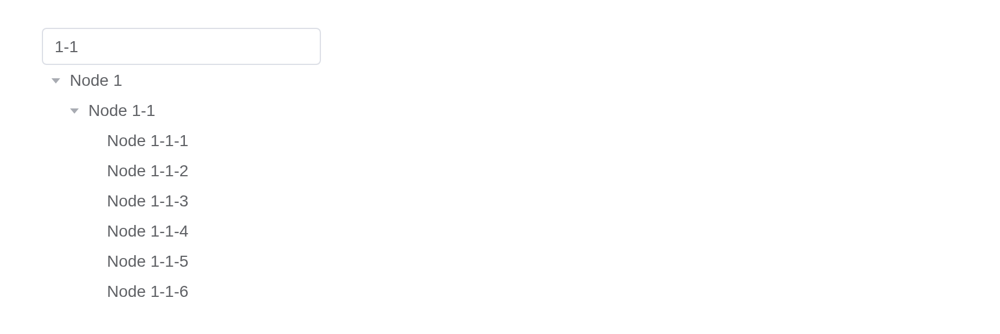

# Virtualized Tree

Tree view with blazing fast scrolling performance for any amount of data

## Basic usage

Basic tree structure.

Nodes are `list(id =, label =, children =)`; only those in view are
drawn, so ten thousand cost little.

``` r

make_nodes <- function(depth, prefix = "") {
  lapply(1:10, function(i) {
    key <- paste0(prefix, i)
    node <- list(id = key, label = paste("Node", key))
    if (depth > 1) {
      node$children <- make_nodes(depth - 1, paste0(key, "-"))
    }
    node
  })
}
el_tree_v2("tv2_basic", data = make_nodes(3), height = 208)
```

## Selectable

Used for node selection.

``` r

make_nodes <- function(depth, prefix = "") {
  lapply(1:10, function(i) {
    key <- paste0(prefix, i)
    node <- list(id = key, label = paste("Node", key))
    if (depth > 1) {
      node$children <- make_nodes(depth - 1, paste0(key, "-"))
    }
    node
  })
}
el_tree_v2("tv2_sel", data = make_nodes(3), show_checkbox = TRUE, height = 208)
```

> **Warning**
>
> When using show-checkbox, since `check-on-click-leaf` is true by
> default, last tree children’s can be checked by clicking their nodes.

## Disabled checkbox

The checkbox of a node can be set as disabled.

In the example, `disabled` property is declared in defaultProps, and
some nodes are set as `disabled: true`. The corresponding checkboxes are
disabled and can’t be clicked.

``` r

nodes <- list(
  list(
    id = "1",
    label = "Level one 1",
    children = list(
      list(id = "1-1", label = "Level two 1-1", disabled = TRUE),
      list(id = "1-2", label = "Level two 1-2")
    )
  ),
  list(id = "2", label = "Level one 2", disabled = TRUE)
)
el_tree_v2(
  "tv2_dis",
  data = nodes,
  show_checkbox = TRUE,
  default_expanded_keys = "1",
  height = 208
)
```

## Default expanded and default checked

Tree nodes can be initially expanded or checked

Use `default-expanded-keys` and `default-checked-keys` to set initially
expanded and initially checked nodes respectively.

``` r

make_nodes <- function(depth, prefix = "") {
  lapply(1:10, function(i) {
    key <- paste0(prefix, i)
    node <- list(id = key, label = paste("Node", key))
    if (depth > 1) {
      node$children <- make_nodes(depth - 1, paste0(key, "-"))
    }
    node
  })
}
el_tree_v2(
  "tv2_def",
  data = make_nodes(3),
  show_checkbox = TRUE,
  height = 208,
  default_expanded_keys = c("1", "1-1"),
  default_checked_keys = c("1-1-1", "1-1-2")
)
```

## Custom node content

The content of tree nodes can be customized, so you can add icons or
buttons as you will

The default slot, scoped with `node`, draws each node.

``` r

make_nodes <- function(depth, prefix = "") {
  lapply(1:10, function(i) {
    key <- paste0(prefix, i)
    node <- list(id = key, label = paste("Node", key))
    if (depth > 1) {
      node$children <- make_nodes(depth - 1, paste0(key, "-"))
    }
    node
  })
}
el_tree_v2(
  "tv2_cus",
  data = make_nodes(3),
  height = 208,
  slots = list(
    default = template(
      tags$span(
        class = "prefix",
        style = "color: var(--el-color-primary); margin-right: 6px",
        "[{{ node.isLeaf ? 'leaf' : 'node' }}]"
      ),
      tags$span("{{ node.label }}"),
      scope = "{ node }"
    )
  )
)
```

## Custom node class

The class of tree nodes can be customized

`props = list(class =)` gives each node a class of its own, from a
[`JS()`](https://kaipingyang.github.io/shiny.element/reference/JS.md)
function of its data.

``` r

nodes <- list(
  list(
    id = "1",
    label = "Level one 1",
    children = list(list(
      id = 4,
      label = "Level two 1-1",
      isPenultimate = TRUE,
      children = list(
        list(id = 9, label = "Level three 1-1-1"),
        list(id = 10, label = "Level three 1-1-2")
      )
    ))
  ),
  list(
    id = 2,
    label = "Level one 2",
    children = list(
      list(
        id = 5,
        label = "Level two 2-1",
        isPenultimate = TRUE,
        children = list(
          list(id = 11, label = "Level three 2-1-1"),
          list(id = 12, label = "Level three 2-1-2")
        )
      ),
      list(id = 6, label = "Level two 2-2")
    )
  )
)
tagList(
  el_tree_v2(
    "tv2_classed",
    data = nodes,
    show_checkbox = TRUE,
    expand_on_click_node = FALSE,
    height = 208,
    default_expanded_keys = c("1", "2"),
    props = list(
      value = "id",
      label = "label",
      children = "children",
      class = JS(
        "function(data) { return data.isPenultimate ? 'is-penultimate' : ''; }"
      )
    )
  ),
  tags$style(".is-penultimate .el-tree-node__label { color: #626aef; }")
)
```

## Custom node icon

You can customize icons for different node states. Tree nodes expose the
`expanded` property and `isLeaf` property, allowing you to dynamically
render different icons based on the node’s state: leaf nodes, expanded
nodes, or collapsed nodes.

``` r

make_nodes <- function(depth, prefix = "") {
  lapply(1:10, function(i) {
    key <- paste0(prefix, i)
    node <- list(id = key, label = paste("Node", key))
    if (depth > 1) {
      node$children <- make_nodes(depth - 1, paste0(key, "-"))
    }
    node
  })
}
el_tree_v2(
  "tv2_icon",
  data = make_nodes(3),
  icon = "ArrowRightBold",
  height = 208
)
```

## Tree node filtering

The `filter-method` method can only accept the third parameter after
version `2.9.1`. Tree nodes can be filtered

Invoke the `filter` method of the Tree instance to filter tree nodes.
Its parameter is the filtering keyword. Note that for it to work,
`filter-method` is required, and its value is the filtering method.

[`filter()`](https://rdrr.io/r/stats/filter.html), run with
[`call_el()`](https://kaipingyang.github.io/shiny.element/reference/call_el.md),
keeps the nodes `filter_method` passes.

``` r

make_nodes <- function(depth, prefix = "") {
  lapply(1:10, function(i) {
    key <- paste0(prefix, i)
    node <- list(id = key, label = paste("Node", key))
    if (depth > 1) {
      node$children <- make_nodes(depth - 1, paste0(key, "-"))
    }
    node
  })
}

ui <- el_page(
  el_input("q", placeholder = "Please enter keyword", width = "240px"),
  el_tree_v2(
    "tv2_filter",
    data = make_nodes(3),
    height = 208,
    filter_method = JS(
      "function(query, node) { return node.label.includes(query); }"
    )
  )
)

server <- function(input, output, session) {
  observeEvent(
    input$q,
    call_el(session, "tv2_filter", "filter", list(input$q), result = FALSE)
  )
}

shinyApp(ui, server)
```



## API

Element Plus’s tables, and beside each entry where it is in R.

### TreeV2 Attributes

| Element | In R | Description | Type | Accepted | Default |
|----|----|----|----|----|----|
| `data` | `data` | tree data | [^1]`Array<{[key: string]: any}>` |  | — |
| `empty-text` | `empty_text` | text displayed when data is void | [^2] |  | — |
| `props` | `props` | configuration options, see the following table | [^3] |  | — |
| `highlight-current` | `highlight_current` | whether current node is highlighted | [^4] |  | false |
| `expand-on-click-node` | `expand_on_click_node` | whether to expand or collapse node when clicking on the node, if false, then expand or collapse node only when clicking on the arrow icon. | [^5] |  | true |
| `check-on-click-node` | `check_on_click_node` | whether to check or uncheck node when clicking on the node, if false, the node can only be checked or unchecked by clicking on the checkbox. | [^6] |  | false |
| `check-on-click-leaf` | `check_on_click_leaf` | whether to check or uncheck node when clicking on leaf node (last children). | [^7] |  | true |
| `default-expanded-keys` | `default_expanded_keys` | array of keys of initially expanded nodes | [^8]`Array<string \\| number>` |  | — |
| `show-checkbox` | `show_checkbox` | whether node is selectable | [^9] |  | false |
| `check-strictly` | `check_strictly` | whether checked state of a node not affects its father and child nodes when `show-checkbox` is `true` | [^10] |  | false |
| `default-checked-keys` | `default_checked_keys` | array of keys of initially checked nodes | [^11]`Array<string \\| number>` |  | — |
| `current-node-key` | `current_node_key` | key of initially selected node | [^12] / [^13] |  | — |
| `filter-method` | `filter_method` | this function will be executed on each node when use filter method. if return `false`, tree node will be hidden. | [^14]`(query: string, data: TreeNodeData, node: TreeNode) => boolean` |  | — |
| `indent` | `indent` | horizontal indentation of nodes in adjacent levels in pixels | [^15] |  | 16 |
| `icon` | `icon` | custom tree node icon component | [^16] / [^17] |  | — |
| `item-size` | `item_size` | custom tree node height | [^18] |  | 26 |
| `scrollbar-always-on` | `scrollbar_always_on` | always show scrollbar | [^19] |  | false |
| `height` | `height` | height of the tree | [^20] |  | 200 |

### TreeV2 Exposes

| Element | In R | Description |
|----|----|----|
| `filter` | `el_call(session, id, "filter")` | filter all tree nodes, filtered nodes will be hidden |
| `getCheckedNodes` | `el_call(session, id, "getCheckedNodes")` | If the node can be selected (`show-checkbox` is `true`), it returns the currently selected array of nodes |
| `getCheckedKeys` | `el_call(session, id, "getCheckedKeys")` | If the node can be selected (`show-checkbox` is `true`), it returns the currently selected array of node’s keys |
| `setCheckedKeys` | `el_call(session, id, "setCheckedKeys")` | set certain nodes to be checked |
| `setChecked` | `el_call(session, id, "setChecked")` | set node to be checked or not, `deep` (added in ^(2.14.0)) indicates whether child nodes should be recursively checked/unchecked. |
| `setExpandedKeys` | `el_call(session, id, "setExpandedKeys")` | set certain nodes to be expanded |
| `getHalfCheckedNodes` | `el_call(session, id, "getHalfCheckedNodes")` | If the node can be selected (`show-checkbox` is `true`), it returns the currently half selected array of nodes |
| `getHalfCheckedKeys` | `el_call(session, id, "getHalfCheckedKeys")` | If the node can be selected (`show-checkbox` is `true`), it returns the currently half selected array of node’s keys |
| `getCurrentKey` | `el_call(session, id, "getCurrentKey")` | return the highlight node’s key (undefined if no node is highlighted) |
| `getCurrentNode` | `el_call(session, id, "getCurrentNode")` | return the highlight node’s data (undefined if no node is highlighted) |
| `setCurrentKey` | `el_call(session, id, "setCurrentKey")` | set highlighted node by key |
| `getNode` | `el_call(session, id, "getNode")` | get node by key or data |
| `expandNode` | `el_call(session, id, "expandNode")` | expand specified node |
| `collapseNode` | `el_call(session, id, "collapseNode")` | collapse specified node |
| `setData` | `el_call(session, id, "setData")` | When the data is very large, using reactive data will cause the poor performance, so we provide a way to avoid this situation |
| `scrollTo` | `el_call(session, id, "scrollTo")` | scroll to a given position |
| `scrollToNode` | `el_call(session, id, "scrollToNode")` | scroll to a given tree key with specified scroll strategy |

### TreeV2 Events

| Element | In R | Description |
|----|----|----|
| `node-click` | `input$<id>_node_click` | triggers when a node is clicked |
| `node-drop` | `input$<id>_node_drop` | triggers when drag something and drop on a node |
| `node-contextmenu` | `input$<id>_node_contextmenu` | triggers when a node is clicked by right button |
| `check-change` | `input$<id>_check_change` | triggers when the selected state of the node changes |
| `check` | `input$<id>_check` | triggers after clicking the checkbox of a node |
| `current-change` | `input$<id>_current_change` | triggers when current node changes |
| `node-expand` | `input$<id>_node_expand` | triggers when current node open |
| `node-collapse` | `input$<id>_node_collapse` | triggers when current node close |

### TreeV2 Slots

| Element   | In R                     | Description                       |
|-----------|--------------------------|-----------------------------------|
| `default` | default content          | custom content for tree nodes     |
| `empty`   | `slots = list(empty = )` | custom content when data is empty |

[^1]: array

[^2]: string

[^3]: object

[^4]: boolean

[^5]: boolean

[^6]: boolean

[^7]: boolean

[^8]: array

[^9]: boolean

[^10]: boolean

[^11]: array

[^12]: string

[^13]: number

[^14]: Function

[^15]: number

[^16]: string

[^17]: Component

[^18]: number

[^19]: boolean

[^20]: number
